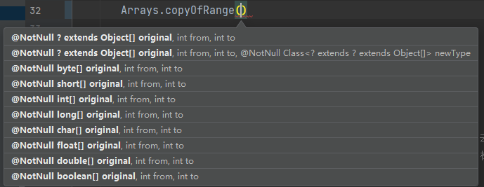
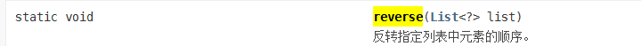
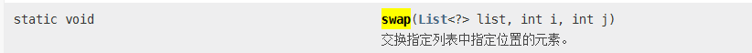
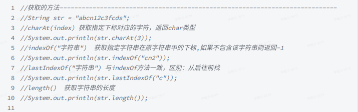
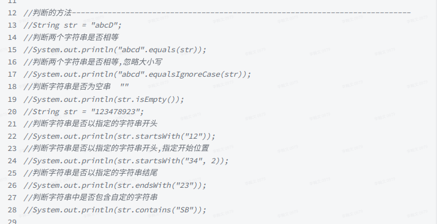
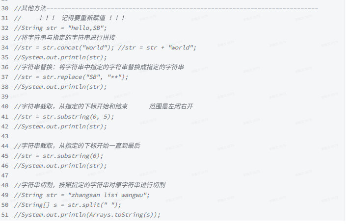
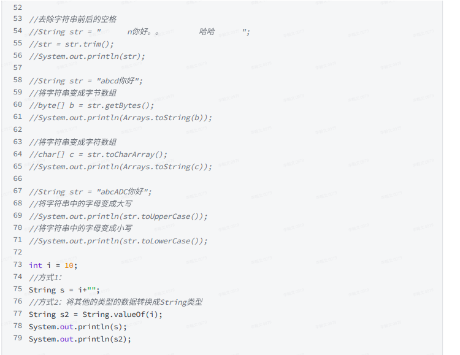

# method

# 一、遇到的方法

## 🔻split()-String数组的分割

Split(expression[, delimiter[, count[, compare]]])

Split函数语法有如下几部分：

| **部分**     | **必要性** | **描述**                                                     |
| ------------ | ---------- | ------------------------------------------------------------ |
| *expression* | 必需的。   | 包含子字符串和分隔符的字符串表达式。如果*expression*是一个长度为零的字符串("")，**Split**则返回一个空数组，即没有元素和数据的数组。 |
| *delimiter*  | 可选的。   | 用于标识子字符串边界的字符串字符。如果忽略，则使用空格字符(" ")作为分隔符。如果*delimiter*是一个长度为零的字符串，则返回的数组仅包含一个元素，即完整的*expression*字符串。 |
| *count*      | 可选的。   | 要返回的子字符串数，–1表示返回所有的子字符串。               |
| *compare*    | 可选的。   | 数字值，表示判别子字符串时使用的比较方式。关于其值，请参阅“设置值”部分。 |

使用：

~~~java
String str=“123￥45￥67￥8”;
strs[]=Stringstr.split("￥");
strs[0]=123;
strs[1]=45;
strs[2]=67;
strs[3]=8;
~~~


## 🔻peek-观察stack栈顶元素

~~~java
Stacck<String> s=new Stack<String>();
s.add("1");
s.add("2");
s.add("3");
s.add("4");
sout(s.peek);
结果：4
~~~


## 🔻Arrays类(用A代替Arrays,int[]代替数组)

### A.toString(int[])方法

方法作用：快速输出数组内容，可以偷偷懒🌚

```java
int[] a = {1,2,3,4,5};

System.out.println(Arrays.toString(a));

// 输出格式：[1,2,3,4,5]
```


### A.sort(int[])-数组排序

想用sort函数做排序，有俩种表现方法：
（设定好一个数组为num）new int[]
第一种：Arrays.sort(num);

第二种：Arrays.sort(num,起始的下标，想要排序的数的数量)；

样例：
我想要输出全部数组，那么为：Arrays.sort(count,0,n);

我想要排序3个数字，那么为Arrays.sort(count,0,3);（排序的对应下标为：0，1，2）


### A.equals(int[],int[])方法

方法作用：比较两个数组内容是否相等

~~~java
int[] a = {1,2,3};
int[] b = {1,2,3};
boolean isSame = Arrays.equals(a,b);
//true
~~~

注意：Arrays.equals()是比较数组内容，而a.equals(b) 这样的方法是比较地址值


### A.asList(int[])-把数组转换为List

```java
int[] a={1,2,3,4}; 
List<Integer> list=Arrays.asList(a);

```


### A.binarySearch(int[],int)-获得指定对象在数组中的索引

 使用二分搜索法，以获得指定对象在数组中的索引

!!!!!!前提是数组已排序

~~~java
  int[] arr = {3, 0, -9, 8, 4, 3};
		//4、 直接在原先的数组上进行排序的，破坏性方法
        Arrays.sort(arr); 	//排序好后[-9, 0, 3, 3, 4, 8]
        //5、查找值在arr的位置，如果找到了，返回索引
		// 如果没有找到，那么把返回(-(point) - 1)
		//point：这个新元素安排进去的位置 
        int index = Arrays.binarySearch(arr, 9); // 返回的是目标在排好序的数组中的索引，目标可以插入6号索引，所以这里返回（-6）-1  ，即-7
        System.out.println(Arrays.toString(arr));
        System.out.println(index);
~~~


### A.stream(int[]).sum() -用流求int数组的sum值

```java
输入:
int[] intArray = {1, 2, 3, 4, 5};
System.out.println(  Arrays.stream(intArray).sum()  );
输出:
15
```


### A.stream(int[]).average().getAsDouble() )-用流求int数组的average值

```java
输入:
int[] intArray = {1, 2, 3, 4, 5};
System.out.println(  Arrays.stream(intArray).average().getAsDouble()  );
输出:
3.0
```


### A.asList/toArray-数组与list相互转换

```java
String[] a={"1","2","3"};
ArrayList<String> lsit = new ArrayList<>(Arrays.asList(a));
 System.out.println(lsit.get(0));
 System.out.println(lsit.get(1));
 lsit.toArray(a);
        for (int i = 0; i < a.length; i++) {
            System.out.println(a[i]);
        }

输出：
1
2
1
2
3
```


### A.equals(int[],int[])-判断数组是否相等

~~~java
import java.util.Arrays;
public class Main {
    public static void main(String[] args) throws Exception {
        int[] ary = {1,2,3,4,5,6};
        int[] ary1 = {1,2,3,4,5,6};
        int[] ary2 = {1,2,3,4};
        System.out.println("数组 ary 是否与数组 ary1相等? ："
        +Arrays.equals(ary, ary1));
        System.out.println("数组 ary 是否与数组 ary2相等? ："
        +Arrays.equals(ary, ary2));
    }
}
以上代码运行输出结果为：
数组 ary 是否与数组 ary1相等? ：true
数组 ary 是否与数组 ary2相等? ：false
~~~


### A.copyOf(int[])/copyOfRange(int[],int,int)-拷贝数组

1、copyof方法作用：拷贝数组

源码如下：第一个参数是原数组，第二个参数是拷贝长度，返回值是将原数组拷贝一份返回

（它的底层其实是调用了System.arrayCopy()方法）我更喜欢用System.arrayCopy()方法

~~~java
public static <T> T[] copyOf(T[] original, int newLength) {
      return (T[]) copyOf(original, newLength, original.getClass());
}

//需要注意的是返回值是一个新数组，会改变接收这个新数组的引用的一些属性 

public static void main(String[] args) {
        int[] arr1 = new int[]{1, 2, 3, 4, 5, 6, 7, 8, 9, 10};
        int[] arr2 = new int[5];
        arr2 = Arrays.copyOf(arr1, 10);
    //arr2长度会变成10
~~~

2、copyOfRange方法作用：对目标数组做一个范围拷贝

~~~java
	Arrays.copyOfRange()	
        //下面几个参数都看得懂吧，不多解释
~~~




### A.sort()-数组降序排序

跟Collections.sort()思想一样哦

!注意注意！不能应用于基本类型，要用包装类Integer、Double、Float......

~~~java
//第一种方法用现成的
Integer[] a = {1,2,3,4,5}
Arrays.sort(a,Collections.reverseOrder())
// 输出数组的内容即为：5 4 3 2 1
    
//第二种方法，实现Comparator接口
public class Test {
    public static void main(String[] args) {
        Integer[] a = {1,2,3,4,5,4,3,2,1};
 		//使用内部类
        Arrays.sort(a, new Comparator<Integer>() {
            @Override
            public int compare(Integer o1, Integer o2) {
                return o2 - o1;
            }
        }	);
 
        System.out.println(Arrays.toString(a));
	// a数组降序排列应为： 5 4 4 3 3 2 2 1 1
    }
}
~~~


## 🔻Collections类（用C代替Collections,List代替集合）

### C.resver(List)-反转元素




### C.shuffle(List)-随机排序

~~~java
 List<String> list = Arrays.asList("a", "b", "c", "d", "e");
 System.out.println("原始顺序：\t\t" + list);
 
Collections.shuffle(list);
System.out.println("shuffle后顺序：\t" + list)

//shuffle后顺序：	[b, e, a, c, d]

~~~


### C.swap(List,int,int)-交换元素




### C.sort(List)-对List里的元素根据自然升序排序

Collections.sort(list);	//自然排序


### C.sort(List,Comparator)-自定义比较器进行排序

- 第一种方法,让需要比较的类实现comparable（不推荐）

~~~java
public class Student implements Comparable<Student>{
    .....省略属性
        ......省略方法
  // 决定比较什么属性
 // 在做A需求的时候，要求根据age比较
// 在做B需求的时候，要求根据name比较
// 因为业务的发展，具体的业务逻辑(比较逻辑)侵入到了JavaBean中，这样的代码是不太好维护的
        
        //按年龄大小来进行比较
         @Override
    public int compareTo(Student o) {
        return Integer.compare(getAge(), o.getAge());
    }
}
 
Main.class
        List<Student> stuList = new ArrayList<>();
        stuList.add(new Student(randomString(),randomNumber(100)));
        stuList.add(new Student(randomString(),randomNumber(100)));
        stuList.add(new Student(randomString(),randomNumber(100)));
        stuList.add(new Student(randomString(),randomNumber(100)));

       Collections.sort(stuList);
~~~

- 第二种方法，写实现类

~~~java
//按年龄从小到大
public class AgeComparator implements Comparator<Student> {
    @Override
    public int compare(Student o1, Student o2) {
        return Integer.compare(o1.getAge(), o2.getAge());
    }
}
//按姓名的ACSII从小到大 
public class NameComparator implements Comparator<Student> {
    @Override
    public int compare(Student o1, Student o2) {
        return o1.getName().compareTo(o2.getName());
    }
Main.class
         List<Student> stuList = new ArrayList<>();
        stuList.add(new Student(randomString(),randomNumber(100)));
        stuList.add(new Student(randomString(),randomNumber(100)));
        stuList.add(new Student(randomString(),randomNumber(100)));
        stuList.add(new Student(randomString(),randomNumber(100)));

       Collections.sort(stuList,new AgeComparator());
~~~

- 比较反转

~~~java
 // 得到一个作用相反的比较器，顺序反转了
       Comparator<Student> nameComparator = Collections.reverseOrder(new NameComparator());
       Collections.sort(stuList,nameComparator);
~~~


### C.binarySearch(List,Object)-获得指定对象在List中的索引

 使用二分搜索法，以获得指定对象在List中的索引

!!!!!!前提是集合已排序

类似于Arrays.binarySearch


### C.max(List)/min(List)-可以加比较器最大最小

1、max(Collection coll, Comparator comp)

2、min(Collection coll, Comparator comp)

~~~java
  List<String> list = Arrays.asList("a", "b", "c", "d", "e");
  System.out.println("原始list：" + list);
  System.out.println("max：" + Collections.max(list));
  System.out.println("min：" + Collections.min(list));

//结果
//原始list：[a, b, c, d, e]
//max：e
//min：a
~~~


## 🔻Math类

### Math.pow(a,b)--a的b次方

```java
Math.pow(a,b); 
```


### Math.abs()-绝对值

Math.abs(param) 返回参数的绝对值。参数可以是 int, float, long, double, short, byte类型。 


## 🔻remove() 方法-删除单个元素或索引位的元素

~~~java
// 删除指定元素
arraylist.remove(Object obj)

// 删除指定索引位置的元素
arraylist.remove(int index)
~~~


## 🔻HashMap getOrDefault(Object key, V defaultValue)-获取指定 value找不到放回default

```java
		HashMap<Integer, String> sites = new HashMap<>();

        // 往 HashMap 添加一些元素
        sites.put(1, "Google");
        sites.put(2, "Runoob");
        sites.put(3, "Taobao");
        System.out.println("sites HashMap: " + sites);

        // key 的映射存在于 HashMap 中
        // Not Found - 如果 HashMap 中没有该 key，则返回默认值
        String value1 = sites.getOrDefault(1, "Not Found");
        System.out.println("Value for key 1:  " + value1);

        // key 的映射不存在于 HashMap 中
        // Not Found - 如果 HashMap 中没有该 key，则返回默认值
        String value2 = sites.getOrDefault(4, "Not Found");
        System.out.println("Value for key 4: " + value2);
```


## 🔻instanceof-测试它左边的对象是否是它右边的类的实例

~~~java
public class Main {
 
public static void main(String[] args) {
   Object testObject = new ArrayList();
      displayObjectClass(testObject);
   }
   public static void displayObjectClass(Object o) {
      if (o instanceof Vector)
      System.out.println("对象是 java.util.Vector 类的实例");
      else if (o instanceof ArrayList)
      System.out.println("对象是 java.util.ArrayList 类的实例");
      else
      System.out.println("对象是 " + o.getClass() + " 类的实例");
   }
}
输出
    对象是 java.util.ArrayList 类的实例
~~~


## 🔻String 常用方法(用str代替String str)

​	




### str.matches()---String字符串的匹配字符串 

matches() 方法用于检测字符串是否匹配给定的正则表达式。

语法

```java
public boolean matches(String regex)
```

参数

- regex -- 匹配字符串的正则表达式。

返回值

在字符串匹配给定的正则表达式时，返回 true。

实例

```java
public class Test {
    public static void main(String args[]) {
        String Str = new String("www.runoob.com");

        System.out.print("返回值 :" );
        System.out.println(Str.matches("(.*)runoob(.*)"));
        
        System.out.print("返回值 :" );
        System.out.println(Str.matches("(.*)google(.*)"));

        System.out.print("返回值 :" );
        System.out.println(Str.matches("www(.*)"));
    }
}
返回值 :true
返回值 :false
返回值 :true

String a="12-12+34-5/2";
        String[] b=a.split("- | / | \\+ ");
        for(int i=0;i<b.length;i++){
            System.out.println(b[i]);
        }
        boolean matches = b[0].matches("\\d");
        System.out.println(matches);
```


