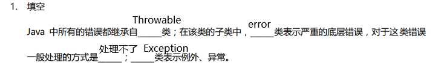
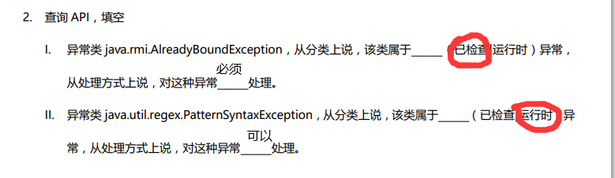
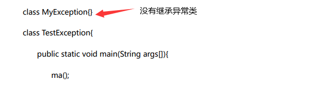
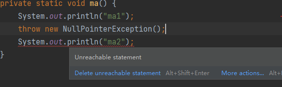

# work

# chapter11异常

1

2

3

~~~java
package exception.question3;

public class TestThrow {
    public static void main(String[] args) {
        throwException(10);
    }

    private static void throwException(int n) {
        if (n==0){
            throw new NullPointerException();
        }else {
            throw new ClassCastException("类型转换错误");
        }
    }
}

~~~

4

~~~java
n==1
    main1
    ma1
    mb1
    Catch EOFException
    in finally
    main2
n==2
    main1
    ma1
    mb1
    Catch IOException
    in finally
    main2
n==3
    main1
    ma1
    mb1
    Catch SQLException
    in finally
    main2
n==4
    main1
    ma1
    mb1
    Catch Exception
    in finally    
    main2
n==5
    main1
    ma1
    mb1
    mb2
    ma2 
    in finally
    main2
~~~

5

~~~java
package exception.question5;

public class TestException {
    public static void main(String[] args) {

    }
}

class MyException1 extends Exception {
    public MyException1() {
    }

    public MyException1(String message) {
        super(message);
    }
}

class MyException2 extends RuntimeException {
    public MyException2() {
    }

    public MyException2(String message) {
        super(message);
    }
}
~~~

6

~~~java
package exception.question6;

import java.util.Scanner;

public class TestException {
    public static void main(String[] args) throws Exception {
        int n;
        n=new Scanner(System.in).nextInt();
        try {
            m(n);
        }
        catch (MyException1 e1) {
            e1.printStackTrace();
            System.out.println(e1.getMessage());
        }catch (MyException2 e2) {
            System.out.println(e2.getMessage());
            throw new MyException2();
        }
    }

    private static void m(int n) throws Exception{
        if (n==1){
            throw new MyException1("n==1");
        }else {
            throw new MyException2("n==2");
        }
    }
}

class MyException1 extends Exception {
    public MyException1() {
    }

    public MyException1(String message) {
        super(message);
    }
}

class MyException2 extends RuntimeException {
    public MyException2() {
    }

    public MyException2(String message) {
        super(message);
    }
}
~~~

7

8

AB		D 原因可见课堂笔记异常里2.1异常分类

9

A	n因为10/0报错不会初始化

改错

~~~java
package exception.question9;

public class TestTryCatch {
    public static void main(String[] args) {
        System.out.println(ma());
    }

    private static int ma() {
        int n;
        try {
            n=10/0;
        }catch (Exception e){
           n=1 ;
        }
        return n;
    }

}
~~~

10

100	100

11

ma1

ma21

In Finally

ma1

In Finally

12

不能

~~~java
class MySuper{
    public void m1() throws IOException{}
}
class MySub extends MySuper {
    public void m1() throws EOFException {}
}
//这里该
class MySub2 extends /*MySub*/MySuper{
    public void m1() throws  FileNotFoundException {}
}
~~~

13

A	因为抛出异常，所以到达不了ma2语句，编译报错

14 看异常分类图，笔记里有

AB 

A 因为ma throws IOExpection

B见笔记检查异常和未检查异常，这里可以catch未检查异常RuntimeException及其子类
