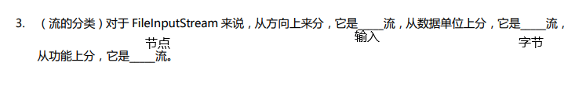
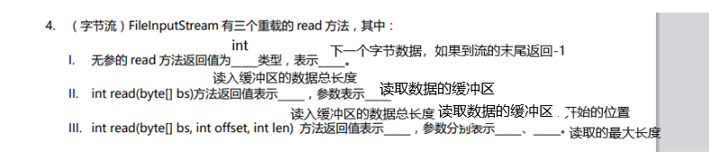
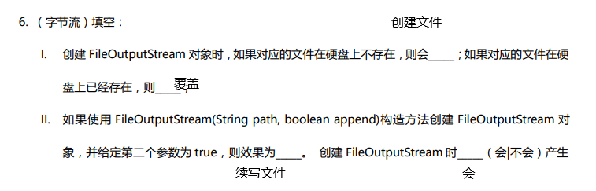
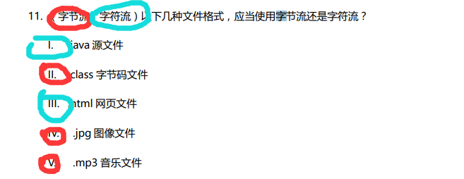

# work

# chapter13IO

1

ABC

2

~~~java
package io.question2;

import java.io.File;

public class TestMyFile {

    public static void main(String[] args) {
        File file;
        file=new File("hello.txt");
        System.out.println(file.exists());
        if (file.exists()) System.out.println(file.getAbsolutePath());
    }
}

~~~

笔记有路径解释

3

笔记里有流分类解释

4

5

AB

6

7

两种方法

- 继续抛出，消极的方法，一直可以抛到java虚拟机来处理

~~~java
package io.question7;

import java.io.FileInputStream;
import java.io.IOException;

public class TestFileInputStream {
    public static void main(String[] args) throws IOException {

        FileInputStream in = new FileInputStream("hello.txt");
        try {
            in.read();
            in.close();
        }catch (Exception e){

        }

    }
}

~~~

- 用try…catch捕获

~~~java
package io.question7;

import java.io.FileInputStream;

public class TestFileInputStream {
    public static void main(String[] args) {

        try {
            FileInputStream in = new FileInputStream("hello.txt");
            in.read();
            in.close();
        }catch (Exception e){

        }

    }
}
~~~

8

~~~java
package io.question8;

import java.io.FileInputStream;
import java.io.FileOutputStream;
import java.io.IOException;

public class TestFileInputStream {
    public static void main(String[] args) {
        FileOutputStream out = null;
        FileInputStream in = null;
        try {

            out = new FileOutputStream("test.txt", true);
            in =new FileInputStream("test.txt");

            byte[] bytes = "Hello World".getBytes();
            out.write(bytes);

            byte[] buffer = new byte[1024];
            int len;
            if ( (len= in.read(buffer))!=-1){
                System.out.print(new String(buffer));
            }

        } catch (Exception e) {

        } finally {
            if (out != null) try {
                out.close();
            } catch (Exception e) {

            } finally {
                if (in != null)
                    try {
                        in.close();
                    } catch (IOException e) {
                        throw new RuntimeException(e);
                    }
            }
        }

    }
}

~~~

9

利用data

~~~java
package io.question9;

import java.io.*;

public class TestData {
    public static void main(String[] args) throws IOException {
        File file = new File("test.dat");
        long data = 0 ;
        if(file.exists()){
            //读出来+1
            DataInputStream in = new DataInputStream(new FileInputStream("test.dat"));
            data = in.readLong();
            data++;
            in.close();
        }else{
            data = 10000L;
        }
        //写
        DataOutputStream out = new DataOutputStream(new FileOutputStream("test.dat"));
        out.writeLong(data);
        out.close();
        System.out.println(data);
    }
}

~~~

利用BufferedOutputStream

~~~java
package io.question9;

import java.io.*;

public class TestExist {
    public static void main(String[] args) {

        //exists
        File file = new File("test.txt");
        if (!file.exists()) {
            try (
                    BufferedOutputStream out = new BufferedOutputStream(new FileOutputStream(file));
            ) {
                wirte(out);
            } catch (IOException e) {
                throw new RuntimeException(e);
            }
        } else {
            try (
                    BufferedInputStream in = new BufferedInputStream(new FileInputStream(file));
            ) {
                show(file, in);
            } catch (Exception e) {
                e.printStackTrace();
            }
        }
    }

    private static void show(File file, BufferedInputStream in) {
        BufferedOutputStream out=null;
        try {
           byte[] bytes=new byte[1024];
            int index=0,size=0;
            while ( (bytes[index++]=(byte) in.read())!= -1) {
            }

            for (int i = 0; i < bytes.length; i++) {
                if(bytes[i]!=-1)size++;
                else break;
            }

            byte[] newBytes=new byte[size];
           System.arraycopy(bytes,0,newBytes,0,size);
            newBytes[size-1]+=1;

           out = new BufferedOutputStream(new FileOutputStream(file));
            out.write(newBytes);
            System.out.println(1);
        } catch (IOException e) {
            throw new RuntimeException(e);
        }finally {
            if (out!=null)try {
                out.close();
            }catch (Exception e){}
        }
    }

    private static void wirte(BufferedOutputStream out) throws IOException {
        long a = 10000L;
        byte[] bytes = String.valueOf(a).getBytes();
        out.write(bytes);
        System.out.println("2");

    }

}
~~~

10

略

11

12

懵逼了，不想写了
