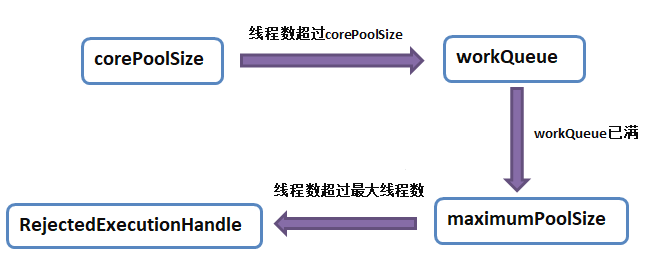
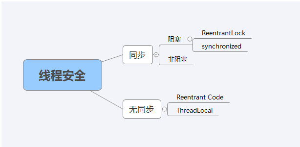

# 🎈🎈多线程

# 1 线程、进程

## 1.1 概念

说到多线程，我们首先要了解下线程和进程

- **Process 进程**：一个在内存中运行的应用程序。每个进程都有自己独立的一块内存空间，一个进程可以有多个线程
- **Thread 线程**：就是进程中的一个独立控制单元，线程在控制着进程的执行。因为系统产生一个线程或是在各个线程之间作切换工作时，负担要比进程小得多，也正因为如此，我们也叫它“轻量级线程”。

> 说完概念，我就想到两者的区别（学校考试考过几次这种概念）进程是系统资源分配的基本单位，线程是cpu调度和分配的基本单位


- **问题**：分析完区别，就有一个疑问了，多线程为了什么，是为了充分利用cpu执行任务吗？

对啊，重点来了，**线程是cpu调度和分配的基本单位**，追根到底，为了更好的利用cpu的资源，我们就要使用多线程来加快完成任务，如果只有一个线程，则第二个任务必须等到第一个任务结束后才能进行，如果使用多线程则在主线程执行任务的同时可以执行其他任务，而不需要等待。

## 1.2 生命周期

接着上面说，执行任务，什么时候算任务开始执行，啥时候算任务执行完毕，释放资源给下一个任务，就牵扯到了线程的生命周期问题

- 线程的生命周期

  - 创建 ：从新建一个线程对象到程序start() 这个线程之间的状态，都是新建状态

  - 就绪 ：线程对象调用start()方法后，就处于就绪状态，等到JVM里的线程调度器的调度
  - 运行 ：就绪状态下的线程在获取CPU资源后就可以执行run(),此时的线程便处于运行状态
  - 阻塞：在一个线程执行了sleep（睡眠）、suspend（挂起）等方法后会失去所占有的资源，从而进入阻塞状态，在睡眠结束后可重新进入就绪状态
  - 终止（死亡） ：run（）方法完成后或发生其他终止条件时就会切换到终止状态。


# 2 创建线程

线程的知识了解后，忍不住开始使用他了，这也是重点，

question：面试时多线程第一个问题就是这个，你说一说线程的创建方式

- 常见方式：**继承Thread类，实现Runnable接口，通过Callable和Future创建线程**

- 扩充：**匿名内部类，CompletableFuture，线程池**

- 先上**总结**

| 创建方式                     | 区别                                                         |
| ---------------------------- | ------------------------------------------------------------ |
| 继承Thread类                 | 重写run方法，通过start启动线程(因为Java是单根继承结构，所以一个类是线程类，就不能是其它类型的子类型了，有局限性) |
| 实现Runnable接口             | 实现run方法，通过start启动线程（因为Task类只需要实现接口，所以它可以是其它类的子类型，更灵活） |
| 通过Callable和Future创建线程 | 跟Runable相比，有返回值，而且Callable有异常处理，并且获取异常 |
| 匿名内部类                   | 更加灵活，可以不用再刻意的新建一个类，它的唯一的确定，就是别人无法重用（它没有名称） |
| 线程池                       | 原始的线程创建方式会频繁的创建销毁线程，耗费资源，线程池给你创建出来统一管理，提高响应速度，任务不需要等待，即到即用 |
| CompletableFuture（JDK8）    | xxxxAsync()方法表示异步（Async：异步），在线程池中执行，实现了Future接口（可以获得返回值），并在此基础上进行了扩展，实现了对任务编排的能力 |


下面简单介绍下（好像全是代码🤬，懂创建就没必要看代码（删掉都行），看区别，面试的时候就可以说说上面的区别）

## 2.1 编写Thread的子类

~~~java
// 编写一个线程类的子类
  class MyThread extends Thread {  
      @Override
      public void run() {
          RandomUtils.longSleep(3000, 5000);
          // 获取到当前的线程对象
          Thread thread = Thread.currentThread();
          String name = thread.getName();
          long id = thread.getId();
          int priority = thread.getPriority(); // 线程的优先级
          System.out.println(name + ":" + id + ":" + priority);
          System.out.println(thread.getId() + "执行完毕");
      }
  }
~~~

## 2.2 编写类实现Runnable接口

~~~java
class Task implements Runnable {
    @Override
    public void run() {
        RandomUtils.longSleep(3000, 5000);
        // 获取到当前的线程对象
        Thread thread = Thread.currentThread();
        String name = thread.getName();
        long id = thread.getId();
        int priority = thread.getPriority(); // 线程的优先级
        System.out.println(name + ":" + id + ":" + priority);
        System.out.println(thread.getId() + "执行完毕");
    }
}
~~~

## 2.3 通过Callable和Future创建线程

~~~java
public class CallableFutrueTest {
    public static void main(String[] args) {
        CallableTest ct = new CallableTest();                        
        FutureTask<Integer> ft = new FutureTask<Integer>(ct);//使用FutureTask包装CallableTest对象
        for(int i = 0; i < 100; i++){
            System.out.println(Thread.currentThread().getName() + "主线程的i为：" + i);
            //当主线程执行第30次之后开启子线程
            if(i == 30){
                Thread td = new Thread(ft,"子线程");
                td.start();
            }
        }     
        try { //获取并输出子线程call()方法的返回值
            System.out.println("子线程的返回值为" + ft.get());
        } catch (InterruptedException e) {
            e.printStackTrace();
        } catch (ExecutionException e) {
            e.printStackTrace();
        }
    }
}
class CallableTest implements Callable<Integer>{
    //复写call() 方法，call()方法具有返回值
    public Integer call() throws Exception {
        int i = 0;
        for( ; i<100; i++){
            System.out.println(Thread.currentThread().getName() + "的变量值为：" + i);
        }
        return i;
    }
}
~~~

## 2.4 匿名内部类

~~~java
private static void multiThreadDemo() {
        // 打印当前主线程的信息
        Thread main = Thread.currentThread (); // 可以理解为主线程
        System.out.println(main.getId() + ":" + main.getName());
        // 实例化一个线程对象
        for (int i = 0; i < 3; i++) { // 创建3个子线程
            Thread t = new Thread(() -> { // 匿名内部类 - 简化为lambda表达式
                RandomUtils.longSleep(3000, 5000);
                // 获取到当前的线程对象
                Thread thread = Thread.currentThread();
                String name = thread.getName();
                long id = thread.getId();
                int priority = thread.getPriority(); // 线程的优先级
                System.out.println(name + ":" + id + ":" + priority);
                System.out.println(thread.getId() + "执行完毕");
            });
            t.start();
        }
        System.out.println("-----------------------------");
    }
~~~

# 3 线程池

这个听起来就高大尚，拿出来单独讲吧

- **线程池创建方式**
  - 使用 Executors 执行器自动创建线程池
  - 手动使用 ThreadPoolExecutor 创建线程池（这个被面试官问到了参数）

## 3.1 Executors 执行器自动创建线程池

有六种🤣介绍几个你常用的就行

老规矩先上**总结**，省略Executors.

- **总结**

| 线程池                           | 特点                                                         |
| -------------------------------- | ------------------------------------------------------------ |
| newFixedThreadPool               | 创建⼀个固定⼤⼩的线程池，可控制并发的线程数，超出的线程会在队列中等待 |
| newCachedThreadPool              | 创建⼀个可缓存的线程池，若线程数超过处理所需，缓存⼀段时间后会回收，若线程数不够，则新建线程 |
| newSingleThreadExecutor          | 创建单个线程数的线程池，它可以保证先进先出的执⾏顺序         |
| newScheduledThreadPool           | 创建⼀个可以执⾏延迟任务的线程池                             |
| newSingleThreadScheduledExecutor | 创建⼀个单线程的可以执⾏延迟任务的线程池                     |
| newWorkStealingPool（JDK8）      | 创建⼀个抢占式执⾏的线程池（任务执⾏顺序不确定）             |

有兴趣可以看看下面介绍下上课用过的几种

### 3.1.1 固定数量线程池FixedThreadPool

创建一个有固定线程数量的线程池 N-1 模式 个别组件会用N + 1,非常适合保守的来限定对于服务器CPU资源的使用

~~~java
 public static void main(String[] args) {
        ExecutorService pool = Executors.newFixedThreadPool(Runtime.getRuntime().availableProcessors() - 1);
        // 请考虑如下这种情况：前面3个任务的执行时间非常长，而后面提交的2个任务会有一个等待期
        for (int i = 0; i < 100; i++) {
            pool.submit(() -> { // 开发人员不需要自己来创建线程对象，而是把关注点放在run，也就是具体的业务逻辑
                RandomUtils.longSleep(1000, 5000);
                System.out.println(Thread.currentThread().getName());
            });
        }
        pool.shutdown(); // 类似于各种join，即是会等到所有提交的任务执行完毕以后，再关闭pool
    }
~~~

### 3.1.2 懒汉模式线程池CachedThreadPool

- 懒汉
  一开始，pool的size为0，随着提交任务的增多，它会不断创建新的线程实例，随着时间的推进，有的任务很快就执行完了，线程对象会有部分闲置，因此它们会被pool销毁(回收)，实现pool的size出现弹性增长和收缩
- 适用于提交请求的频率不是特别快，也不是特别多的场景

```java
public class Main {
    public static void main(String[] args) {
        ExecutorService pool = Executors.newCachedThreadPool();      
        for (int i = 0; i < 100; i++) {
            pool.submit(() -> { 
                RandomUtils.longSleep(1000, 5000);
                System.out.println(Thread.currentThread().getName());
            });
        }
        pool.shutdown(); // 会等到所有提交的任务提交以后，再关闭pool
        // pool.shutdownNow();
        // shutdown以后，不可以再提交新的任务了
    }
}
```

### 3.1.3 定时任务ScheduledThreadPool

- **scheduleAtFixedRate**：保障2个任务的开始时间间隔为1s，但是如果有一个任务的执行时间超出1s，那么下一个任务的开始时间将会延迟到上一个任务结束

```java
public class ScheduleMain {
    public static void main(String[] args) {
        int poolSize = Runtime.getRuntime().availableProcessors() - 1;
        ScheduledExecutorService pool = Executors.newScheduledThreadPool(poolSize);
        
        //参数1表示Runable，重写方法，参数2表示第一个开始等待时间，参数3表示2个任务的开始时间间隔，参数4表示时间单位
        
        pool.scheduleAtFixedRate(
                () -> {
                    System.out.println(">>>" + Thread.currentThread().getName());
                    RandomUtils.longSleep(3000, 5000);
                    System.out.println("<<<" + Thread.currentThread().getName());
                }, // 任务并非是马上提交
                3,
                6,
                TimeUnit.SECONDS
        );      
```

- **scheduleWithFixedDelay**: 严格保障上一个任务结束和下一个任务开始之间的间隔一定是1s

~~~java
public static void main(String[] args) {
    
    //参数1表示第一个参数表示Runable，重写方法，参数2表示第一个开始等待时间，参数3表示上一个任务结束和下一个任务开始之间的间隔，参数4表示时间单位
    
				pool.scheduleWithFixedDelay(() -> {
                    System.out.println(">>>" + Thread.currentThread().getName());
                    RandomUtils.longSleep(3000, 5000);
                    System.out.println("<<<" + Thread.currentThread().getName());
                }, // 任务并非是马上提交
                3,
                1,
                TimeUnit.SECONDS);
        RandomUtils.longSleep(60000);
        pool.shutdown();
    }
}
~~~

## 3.2  ThreadPoolExecutor 手动创建线程池

面试官一听我说完线程池，就问我你用过线程池的哪些参数，估计是想摸底下我平常学习的深度

- **线程池参数**

| 参数                     | 介绍                                               |
| ------------------------ | -------------------------------------------------- |
| corePoolSize             | 核心线程池大小                                     |
| maximumPoolSize          | 最大线程池大小                                     |
| keepAliveTime            | 线程池中超过corePoolSize数目的空闲线程最大存活时间 |
| workQueue                | 阻塞任务队列                                       |
| threadFactory            | 新建线程工厂                                       |
| RejectedExecutionHandler | 拒绝策略                                           |

- corePoolSize，maximumPoolSize，workQueue之间关系

上图上图

（**corePoolSize，maximumPoolSize，workQueue之间关系**)

这三个参数可以拿出来对着图讲一讲，如果线程池线程数小于核心线程池大小，那么提交新任务时会创建一个新线程去执行，即使有空闲线程；当线程数达到核心线程池大小时，新任务会被放入阻塞队列，等待调度，如果阻塞队列满了，而且最大线程池大小比核心线程池大小大，新提交任务就会创建新线程执行任务，再增加任务提交数量，超过最大线程数，新提交的任务被拒绝策略处理


# 4 API

当你细心看完线程的创建后，说明你是一个有耐心的人，这么多也能看下去，相信你在面试也能很好地讲出来

回顾线程初衷，是为了充分利用cpu执行任务，但线程是有限的，因此我们要合理使用，防止OOM，因此可以用API来对线程的生命周期进行管理 

下面就简单介绍三个

老规矩总结，可以自己补充哈

- **总结**

| Api         | 介绍                                                         |
| ----------- | ------------------------------------------------------------ |
| join()      | 等待当前这个t线程死亡：如果t没有执行完毕，程序的执行流就会一直阻塞在这一行 |
| sleep()     | 暂停当前线程的执行,进入超时等待状态，时间到后自动唤醒线程    |
| interrupt() | interrupt()并不会强制中断线程，它只是发出一个中断请求，由被中断线程来决定是否应该中断。 被中断线程需要持续检查是否收到中断请求，编写相应逻辑进行中断。 |

## 4.1 join()-等待当前线程死亡

~~~java
        Thread t = new Thread(new Task());
        t.start(); // 非阻塞性方法
        System.out.println("主线程执行完毕");
        t.join(); //等待当前这个t线程死亡：如果t没有执行完毕，程序的执行流就会一直阻塞在这一行
        System.out.println("子线程执行完毕");
~~~

## 4.2 sleep()-暂停当前线程的执行

~~~java
public static void main(String[] args) throws InterruptedException {
        for (int i = 0; i < 10; i++) {
            System.out.println(i);
            //每隔一秒钟进行一次循环输出
            Thread.sleep(1000);//单位：毫秒
        }
    }
~~~

## 4.3 interrupt()-中断

~~~java
public class InterruptMain {
    public static void main(String[] args) {
        Thread t = new Thread(new Task());
        t.start();
        System.out.println("主线程等待ing...");
        RandomUtils.longSleep(2_000, 3_000);
        // 发出中断的指令
        System.out.println("发出中断指令");
        t.interrupt(); // 不是强制性的，只是向子线程发出了一个中断信号
    }
private static class Task implements Runnable {
        @Override
        public void run() {
           for(int i=0;i<10_000;i++){
                if (isInterrupted()) return;
                System.out.println("子线程执行ing...");
            }
        }
        private boolean isInterrupted() {
            return Thread.currentThread().isInterrupted(); // 当前线程是否被打了中断的标记
        }
    }
~~~


# 5 线程安全

我们使用多线程，难免就要解决并发、同步等问题，因此我们就要使用手段来解决这个难点

- 线程安全：当多个线程访问一个对象，如果不需要额外的控制，调用的找个对象行为都是正确的，通常可以认为是线程安全的

（线程安全实现方法)

同样先**总结**，有兴趣看使用

- **总结**

**死锁：**进程A中包含资源A,进程B中包含资源B，A的下一步需要资源B，B的下一步需要资源A，所以它们就互相等待对方占有的资源释放，所以也就产生了一个循环等待死锁。

- 必要条件
  - 互斥条件：资源不能被共享，只能被同一个进程使用
  - 请求与保持条件：已经得到资源的进程可以申请新的资源
  - 非剥夺条件：已经分配的资源不能从相应的进程中强制剥夺
  - 循环等待条件：系统中若干进程形成环路，该环路中每个进程都在等待相邻进程占用的资源

**synchronized：同步阻塞**

- 介绍：是一个关键字，属于非公平锁，可以修饰代码块、方法(修饰静态方法等于给类上锁，会作⽤于类的所有对象实例；修饰实例方法等于给对象上锁)
- 效果：会让该方法变成原子性的一个操作(不能再切割的)，也就是说，当一个线程在里面执行，还没有执行完毕的时候，其它要调用这个方法的线程会一直被阻塞在外面 
- 工作原理，当一个方法或代码块被synchronize修饰，jvm就会创建出一个类似于lock的对象，称为monitor（监视器），只有线程获取到了监视器，才能执行synchronize修饰的方法或代码块，执行完后再把监视器返回给调度器

**ReentranLock：同步阻塞**

- 概念：可重入锁是指某个线程在未释放当前锁的情况下，再次获取该锁而不会产生死锁；
- 表现形式：可重入锁又称为递归锁，意思是如果线程携带外层方法的锁，进入到内层方法中不会因为没有释放外层锁而阻塞，自动获取内层方法的锁；
- 实现方式：公平锁和非公平锁（默认为非公平锁，给参数fair设置true或FALSE）

  - 公平锁：公平锁是指多个线程是根据线程申请锁的顺序来获取锁的，类似于排队打饭，先来后到；

  - 非公平锁：非公平锁是指多个线程获取锁的顺序不是按照申请锁的顺序，可能出现后申请的线程比先申请的线程优先获得锁的情况，在高并发的情况下，可能会出现优先级反转或饥饿现象。
- 作用：
  - 可重入锁的主要作用就是避免死锁：前提条件是没有new新的lock对象；用的都是同一把锁；
  - 精确唤醒线程：通过设定条件变量，调用await（）和signal（）方法对线程执行的方法进行唤醒和通知操作，从而达到设置方法执行顺序的目的；

**CAS：同步不阻塞**

- 介绍：CAS有三个操作数，内存地址、 旧的预期值、 新值，只有内存地址的值等于旧的预期值，才能吧内存地址的值改为新值
- 缺点：用上面这种方式，会有ABA问题
- 解决：用版本号作为更新的依据ABA问题就会变成A(1)—B(2)—C(3)

**Volatile：**

- 关键字，修饰变量，告诉jvm这是一个易变、不稳定的变量， 不需要jit优化

- 保证了不同线程对某个变量进行操作时的可见性，即一个线程修改了某个变量的值，这个值对于其他线程来说是立即可见的；
- 禁止指令重排序：（口诀）写防下 读防上。
- 不能保证原子性

**ThreadLocal：**

- 介绍：线程本地变量，（JDK8以后）每个Thread维护一个ThreadLocalMap对象，这个Map的key是ThreadLocal实例本身，value是存储的值要隔离的变量，是泛型
- ThreadLocal的生命周期依赖于Thread，所以用完要及时调用remove（），不然会造成数据读取混乱（上课数据库连接时遇到的问题）、内存泄漏
- 父线程的ThreadLocal传递给子线程（面试问到了）
  - InheritableThreadLocal(线程池不行，会缓存使用过的线程)

## 5.1 synchronized

~~~java
 public static void main(String[] args) throws InterruptedException {
        // 1、创建一个计数器对象
        Counter counter = new Counter(); // 被争抢的资源对象
        // 2、创建2个以上的线程任务，对计数器进行累加
        List<Thread> tasks = new ArrayList<>();
        for (int i = 0; i < 2; i++) {
            Thread t = new Thread(new User(counter));
            tasks.add(t);
            t.start();
        }
        // 等待他们执行完毕
        for (Thread t : tasks)
            t.join();
        // 3、最终统计total
        System.out.println(counter.getTotal());

    }
private static class User implements Runnable {
        private Counter counter;
    
        public User(Counter counter) {
            this.counter = counter;
        }
        private void pushButton() {
            counter.increment();
        }
       @Override
        public void run() {
            for (int i = 0; i < 100_000; i++)
                pushButton();
        }
    }
~~~

- synchronized部分

~~~java
private static class Counter {
        // O
        private int total; // 主存区 CPU寄存器
        // private int total; // 主存区 CPU寄存器

    //用法一，synchronized关键字修饰方法
        public synchronized void increment() { // 会有多个线程轮番争抢到时间片进来执行累加逻辑
            // 1、把寄存器上的total现在的值拷贝一份进来，声明一个变量存起来
            // int temp = total;
            // 2、temp = temp + 1
            // 3、把累加后的temp写回寄存器上的total变量
            // int num = 0; // 存储在工作内存区
            total++;
        }
    //用法二，synchronized代码块
     public void increment() {
        synchronized ( this) {	//需要提供一个不可修改的引用类型的变量，一般不会使用基本类型
            totalBytes++;
        }
    } 
        public int getTotal() {
            return total;
        }
    }
~~~

### 5.1.1  wait()、notify()、notifyAll()

- 大致用法

```java
  // 要使用线程之间通讯的方法：线程1告诉另外一个线程2，我的工作做完了
           Object lock = new Object();
           System.out.println(0);
           synchronized (lock) {
          //     // 做完第一阶段的工作
               lock.wait();  // 当前的线程暂时交出了CPU的时间片使用权力，此时，正常情况应该有另一个线程来得到锁 等到另一个线程使用完以后，再通知“你又可以用了” lock.notifyAll()
          //     // 做第三阶段的工作
           }
           System.out.println(1);
  
           obj.notify(); // 通知1个XXX
          // obj.notifyAll(); // 通知所有的XXX
```

  - 实例

```java
  public class Main {
      // 你拍一，我拍一
      public static void main(String[] args) throws InterruptedException {
  
          // 创建一个用来争抢的资源
          List<String> list = new ArrayList<>();
          // 开辟两个线程，往list中填充数据
          // 填充的规则如下：线程1首先填充A,A,A，然后线程2填充B,B,B，然后线程1再填充A,A,A
          // 问题分析：
          // 对于线程1来说，它需要先填充一些字符串，然后等待一段时间，再继续完成后续的填充工作
          // 对于线程2来说，它需要等到线程1完成第一阶段的工作，再填充自己的信息，然后再交出执行权
  
  
          Thread t1 = new Thread(new WorkerA(list));
          Thread t2 = new Thread(new WorkerB(list));
  
          t1.start();
          RandomUtils.longSleep(100, 200);
  		t2.start();
          
          t1.join();
          t2.join(); // 等2个线程都结束以后再来查看list中的顺序是否正确
  
          System.out.println(list);
  
      }
  
      private static class WorkerA implements Runnable {
          final List<String> list;
  
          public WorkerA(List<String> list) {
              this.list = list;
          }
  
          public void fill() {
              for (int i = 0; i < 3; i++)
                  list.add("A");
          }
  
          @Override
          public void run() {
              // 一定要记住，在wait之前首先必须先获取到monitor
              try {
                  synchronized (list) {
                      fill();
                      System.out.println("fill A 1");
                      list.wait();
                      fill();
                      System.out.println("fill A 2");
                  }
              } catch (InterruptedException e) {
                  throw new RuntimeException(e);
              }
          }
      }
  
      private static class WorkerB implements Runnable {
          final List<String> list;
  
          public void fill() {
              for (int i = 0; i < 3; i++)
                  list.add("B");
          }
  
          public WorkerB(List<String> list) {
              this.list = list;
          }
  
          @Override
          public void run() {
              synchronized (list) {
                  fill();
                  System.out.println("fill B");
                  list.notifyAll(); // 唤醒别人我做完了，你们可以接着去抢了(monitor)
              }
          }
      }
  }
  
```

## 5.2 ReentrantLock()

~~~java
 Lock lock = new ReentrantLock(); // 可重入锁

public void increment() throws InterruptedException {
            //前面的逻辑代码
    		//...............
            lock.lock(); // 加锁：一旦无法获取到lock，则会阻塞在此
            // boolean flag = lock.tryLock(3, TimeUnit.SECONDS); // 随缘锁：；立即返回的，true - 抢到了；false - false
            // if (flag) {
            try {
                total++;
            } finally {
                lock.unlock(); // 释放锁
            }
            // } else {
            //     // 编写没有抢到补偿逻辑
            // }
            //后面的逻辑代码
    		//..............
 }
~~~

### 5.2.1 await()、signal()、signalAll()

~~~java
class ShareRes{
    private int num = 1; //A:1,B:2,C:3
    private ReentrantLock lock = new ReentrantLock();
    private Condition conditionA  = lock.newCondition();
    private Condition conditionB  = lock.newCondition();
    private Condition conditionC  = lock.newCondition();
    void print1(){
        lock.lock();
        try {
            while (num != 1){
                conditionA.await();
            }
            for (int i = 1; i <= 1; i++) {
                System.out.println(Thread.currentThread().getName()+"  "+i);
            }
            num = 2;
            conditionB.signal();
        }catch (Exception e){
            e.printStackTrace();
        }finally {
            lock.unlock();
        }
    }
    void print2(){
        lock.lock();
        try {
            while (num != 2){
                conditionB.await();
            }
            for (int i = 1; i <= 2; i++) {
                System.out.println(Thread.currentThread().getName()+"  "+i);
            }
            num = 3;
            conditionC.signal();
        }catch (Exception e){
            e.printStackTrace();
        }finally {
            lock.unlock();
        }
    }
    void print3(){
        lock.lock();
        try {
            while (num != 3){
                conditionC.await();
            }
            for (int i = 1; i <= 3; i++) {
                System.out.println(Thread.currentThread().getName()+"  "+i);
            }
            num = 1;
            conditionA.signal();
        }catch (Exception e){
            e.printStackTrace();
        }finally {
            lock.unlock();
        }
    } 
}
public class LockTraditionDemo {
    public static void main(String[] args) {
        final ShareRes res = new ShareRes();
        new Thread(new Runnable() {
            @Override
            public void run() {
                for (int i = 0; i < 3; i++) {
                    res.print1();
                }
            }
        },"线程A").start();
        new Thread(new Runnable() {
            @Override
            public void run() {
                for (int i = 0; i < 3; i++) {
                    res.print2();
                }
            }
        },"线程B").start();
        new Thread(new Runnable() {
            @Override
            public void run() {
                for (int i = 0; i < 3; i++) {
                    res.print3();
                }
            }
        },"线程C").start();
    }
}
 
----------------------------------
线程A  1
线程B  1
线程B  2
线程C  1
线程C  2
线程C  3
线程A  1
线程B  1
线程B  2
线程C  1
线程C  2
线程C  3
线程A  1
线程B  1
线程B  2
线程C  1
线程C  2
线程C  3
~~~

## 5.3 Volatile

- 问题案例

```java
public class DownloadStatus {
    private int totalBytes;
    private boolean isDone;

    public synchronized void incrementTotalBytes() {
            totalBytes++;
    }

    public int getTotalBytes() {
        return totalBytes;
    }

    public boolean isDone() {
        return isDone;
    }

    public void setDone(boolean done) {
        isDone = done;
    }
}

public class DownloadFileTask implements Runnable {
    private DownloadStatus status;

    public DownloadFileTask(DownloadStatus status) {
        this.status = status;
    }

    @Override
    public void run() {
        System.out.println("Download:" + Thread.currentThread().getName());
        for (int i = 0; i < 1_000_000; i++) {
            if (Thread.currentThread().isInterrupted()) return;
            status.incrementTotalBytes();
        }
        status.setDone(true);
        System.out.println("Download complete:" + Thread.currentThread().getName());
    }
}

public class ThreadDemo {
    public static void main(String[] args) {
        var status = new DownloadStatus();
        var t1 = new Thread(new DownloadFileTask(status));
        t1.start();

        var t2 = new Thread(() -> {
            while (!status.isDone()) {
            }
            System.out.println(status.getTotalBytes());
        });
        t2.start();

    }
}
```

在这个案例中，我们会发现程序一直运行不能停止，且`t2`线程无法输出最终结果，主要原因在于：

- 在计算机的`CPU`运行过程中，存在一套缓存机制：为了优化程序执行速度，会首先把主存储器（`main memory`）中的数据拷贝到自己的缓存（`cache`）中，然后再继续运算。由于直接从自己的`cache`中读取数据的速度更快，因此减少了不断传值带来的时间损耗。
- `t1`线程和`t2`线程首先都把这个值拷贝到自己的缓存中，然后`t1`线程对这个值做出了修改，由于缓存中的数据只有自己可以访问，因此`t2`线程并看不到这个修改，甚至当`t1`线程将这个修改写回到主存储器，这种修改对于`t2`仍然是不可见的。

这种场景，就称为多线程并发的可见性问题：


- 解决方法：volatile

当`isDone`被`volatile`修饰时，意味着告诉`JVM`这个变量是不稳定的，不要在计算的时候依赖存储在缓存中的值，而总是从主存储器中读取它，同时，当一个线程修改`isDone`时，会立刻更新存储在主存储器中的值。

```java
public class DownloadStatus {
    private int totalBytes;
    private volatile boolean isDone;

    public synchronized void incrementTotalBytes() {
            totalBytes++;
    }

    public int getTotalBytes() {
        return totalBytes;
    }

    public boolean isDone() {
        return isDone;
    }

    public void setDone(boolean done) {
        isDone = done;
    }
}
```

## 5.4 ThreadLocal


# 6 线程安全实例：面包店问题(wait、notify)

- 题目

~~~
1、请定义一个面包店对象(只有一个实例)
-- 使用某种固定的频率持续的生产面包

2、请定义一个消费者类(实例有多个)
-- 去面包店消费(抢)面包，每次消费一个，消费的速度自己定义

3、不断的在控制台输出：
面包店生产了1个面包，现有XXX个(已经消费了XXX个)
消费者每消费1个面包，也输出Jack买到了1个面包
~~~

- 自己写的，不知道合不合理

~~~java
package bakeryquestion;

public class Test {
    public static void main(String[] args) {
        Bakery bakery = new Bakery();
        Thread t = new Thread(bakery);
        Thread t2 = new Thread(new Consumer(bakery,"Jack"));
        Thread t3 = new Thread(new Consumer(bakery,"Mike"));
        Thread t4 = new Thread(new Consumer(bakery,"Mary"));
        t.start();
        t2.start();
        t3.start();
        t4.start();
    }

    private static class Bakery implements Runnable {
        int count;

        @Override
        public void run() {
            System.out.println("Bakery线程启动");
            while (true) {
                //面包店100毫秒抢一次线程，生产面包
                try {
                    Thread.sleep(100);
                } catch (InterruptedException e) {
                    throw new RuntimeException(e);
                }

                synchronized (this) {

                    if (count <100) {
                        // 面包足够

                        count++;
                        System.out.println("1生产了一个面包，总共有" + count);
                        notifyAll();// 生产了面包，告诉消费者可以购买了

                    } else {
                        // 面包不够
                        count++;
                        System.out.println("2生产了一个面包，总共有" + count);
                        try {
                            wait();// 生产了面包，告诉消费者可以购买了
                        } catch (InterruptedException e) {
                            throw new RuntimeException(e);
                        }

                    }
                }

            }

        }
    }


    private static class Consumer implements Runnable {
        private Bakery bakery;
        String name;

        @Override
        public void run() {
            System.out.println("Consumer线程启动");
            while (true) {
                //顾客500毫秒抢一次线程，消费面包
                try {
                    Thread.sleep(500);

                } catch (InterruptedException e) {
                    throw new RuntimeException(e);
                }

                synchronized (bakery) {
                    if (bakery.count > 0) {
                        System.out.println("顾客"+name+"买了一个面包，还剩");
                        bakery.count--;
                        bakery.notifyAll();// 消费完了一个面包，相当于减少一个信号量，告诉生产者要生产了
                    } else {
                        System.out.println("顾客"+name+"想买面包，面包不够");
                        try {
                            bakery.wait();  // 面包不够，告诉生产者要生产面包了
                        } catch (InterruptedException e) {
                            throw new RuntimeException(e);
                        }

                    }

                }

            }

        }

        public Consumer(Bakery bakery, String name) {
            this.bakery = bakery;
            this.name = name;
        }
    }


}

~~~


