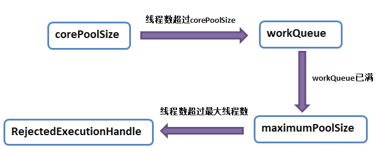
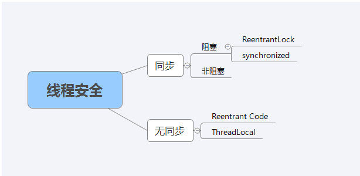

# 🎈🎈多线程

# 1 线程、进程

## 1.1 概念

说到多线程，我们首先要了解下线程和进程

- **Process 进程**：一个在内存中运行的应用程序。每个进程都有自己独立的一块内存空间，一个进程可以有多个线程
- **Thread 线程**：就是进程中的一个独立控制单元，线程在控制着进程的执行。因为系统产生一个线程或是在各个线程之间作切换工作时，负担要比进程小得多，也正因为如此，我们也叫它“轻量级线程”。

> 说完概念，我就想到两者的区别（学校考试考过几次这种概念）进程是系统资源分配的基本单位，线程是cpu调度和分配的基本单位

- **问题**：分析完区别，就有一个疑问了，多线程为了什么，是为了充分利用cpu执行任务吗？

对啊，重点来了，**线程是cpu调度和分配的基本单位**，追根到底，为了更好的利用cpu的资源，我们就要使用多线程来加快完成任务，如果只有一个线程，则第二个任务必须等到第一个任务结束后才能进行，如果使用多线程则在主线程执行任务的同时可以执行其他任务，而不需要等待。

## 1.2 生命周期

接着上面说，执行任务，什么时候算任务开始执行，啥时候算任务执行完毕，释放资源给下一个任务，就牵扯到了线程的生命周期问题

- 线程的生命周期

  - 创建 ：从新建一个线程对象到程序start() 这个线程之间的状态，都是新建状态

  - 就绪 ：线程对象调用start()方法后，就处于就绪状态，等到JVM里的线程调度器的调度
  - 运行 ：就绪状态下的线程在获取CPU资源后就可以执行run(),此时的线程便处于运行状态
  - 阻塞：在一个线程执行了sleep（睡眠）、suspend（挂起）等方法后会失去所占有的资源，从而进入阻塞状态，在睡眠结束后可重新进入就绪状态
  - 终止（死亡） ：run（）方法完成后或发生其他终止条件时就会切换到终止状态。

# 2 创建线程

线程的知识了解后，忍不住开始使用他了，这也是重点，

question：面试时多线程第一个问题就是这个，你说一说线程的创建方式

- 常见方式：**继承Thread类，实现Runnable接口，通过Callable和Future创建线程**

- 扩充：**匿名内部类，CompletableFuture，线程池**

- 先上**总结**

| 创建方式                     | 区别                                                         |
| ---------------------------- | ------------------------------------------------------------ |
| 继承Thread类                 | 重写run方法，通过start启动线程(因为Java是单根继承结构，所以一个类是线程类，就不能是其它类型的子类型了，有局限性) |
| 实现Runnable接口             | 实现run方法，通过start启动线程（因为Task类只需要实现接口，所以它可以是其它类的子类型，更灵活） |
| 通过Callable和Future创建线程 | 跟Runable相比，有返回值，而且Callable有异常处理，并且获取异常 |
| 匿名内部类                   | 更加灵活，可以不用再刻意的新建一个类，它的唯一的确定，就是别人无法重用（它没有名称） |
| 线程池                       | 原始的线程创建方式会频繁的创建销毁线程，耗费资源，线程池给你创建出来统一管理，提高响应速度，任务不需要等待，即到即用 |
| CompletableFuture（JDK8）    | xxxxAsync()方法表示异步（Async：异步），在线程池中执行，实现了Future接口（可以获得返回值），并在此基础上进行了扩展，实现了对任务编排的能力 |

# 3 线程池

这个听起来就高大尚，拿出来单独讲吧

- **线程池创建方式**
  - 使用 Executors 执行器自动创建线程池
  - 手动使用 ThreadPoolExecutor 创建线程池（这个被面试官问到了参数）

## 3.1 Executors 执行器自动创建线程池

有六种🤣介绍几个你常用的就行

老规矩先上**总结**，省略Executors.

- **总结**

| 线程池                           | 特点                                                         |
| -------------------------------- | ------------------------------------------------------------ |
| newFixedThreadPool               | 创建⼀个固定⼤⼩的线程池，可控制并发的线程数，超出的线程会在队列中等待 |
| newCachedThreadPool              | 创建⼀个可缓存的线程池，若线程数超过处理所需，缓存⼀段时间后会回收，若线程数不够，则新建线程 |
| newSingleThreadExecutor          | 创建单个线程数的线程池，它可以保证先进先出的执⾏顺序         |
| newScheduledThreadPool           | 创建⼀个可以执⾏延迟任务的线程池                             |
| newSingleThreadScheduledExecutor | 创建⼀个单线程的可以执⾏延迟任务的线程池                     |
| newWorkStealingPool（JDK8）      | 创建⼀个抢占式执⾏的线程池（任务执⾏顺序不确定）             |

## 3.2  ThreadPoolExecutor 手动创建线程池

面试官一听我说完线程池，就问我你用过线程池的哪些参数，估计是想摸底下我平常学习的深度

- **线程池参数**

| 参数                     | 介绍                                               |
| ------------------------ | -------------------------------------------------- |
| corePoolSize             | 核心线程池大小                                     |
| maximumPoolSize          | 最大线程池大小                                     |
| keepAliveTime            | 线程池中超过corePoolSize数目的空闲线程最大存活时间 |
| workQueue                | 阻塞任务队列                                       |
| threadFactory            | 新建线程工厂                                       |
| RejectedExecutionHandler | 拒绝策略                                           |

- corePoolSize，maximumPoolSize，workQueue之间关系

上图上图

（**corePoolSize，maximumPoolSize，workQueue之间关系**)

这三个参数可以拿出来对着图讲一讲，如果线程池线程数小于核心线程池大小，那么提交新任务时会创建一个新线程去执行，即使有空闲线程；当线程数达到核心线程池大小时，新任务会被放入阻塞队列，等待调度，如果阻塞队列满了，而且最大线程池大小比核心线程池大小大，新提交任务就会创建新线程执行任务，再增加任务提交数量，超过最大线程数，新提交的任务被拒绝策略处理

# 4 API

当你细心看完线程的创建后，说明你是一个有耐心的人，这么多也能看下去，相信你在面试也能很好地讲出来

回顾线程初衷，是为了充分利用cpu执行任务，但线程是有限的，因此我们要合理使用，防止OOM，因此可以用API来对线程的生命周期进行管理 

下面就简单介绍三个

老规矩总结，可以自己补充哈

- **总结**

| Api         | 介绍                                                         |
| ----------- | ------------------------------------------------------------ |
| join()      | 等待当前这个t线程死亡：如果t没有执行完毕，程序的执行流就会一直阻塞在这一行 |
| sleep()     | 暂停当前线程的执行,进入超时等待状态，时间到后自动唤醒线程    |
| interrupt() | interrupt()并不会强制中断线程，它只是发出一个中断请求，由被中断线程来决定是否应该中断。 被中断线程需要持续检查是否收到中断请求，编写相应逻辑进行中断。 |

# 5 线程安全

我们使用多线程，难免就要解决并发、同步等问题，因此我们就要使用手段来解决这个难点

- 线程安全：当多个线程访问一个对象，如果不需要额外的控制，调用的找个对象行为都是正确的，通常可以认为是线程安全的

（线程安全实现方法)

同样先**总结**，有兴趣看使用

- **总结**

**死锁：**进程A中包含资源A,进程B中包含资源B，A的下一步需要资源B，B的下一步需要资源A，所以它们就互相等待对方占有的资源释放，所以也就产生了一个循环等待死锁。

- 必要条件
  - 互斥条件：资源不能被共享，只能被同一个进程使用
  - 请求与保持条件：已经得到资源的进程可以申请新的资源
  - 非剥夺条件：已经分配的资源不能从相应的进程中强制剥夺
  - 循环等待条件：系统中若干进程形成环路，该环路中每个进程都在等待相邻进程占用的资源

**synchronized：同步阻塞**

- 介绍：是一个关键字，属于非公平锁，可以修饰代码块、方法(修饰静态方法等于给类上锁，会作⽤于类的所有对象实例；修饰实例方法等于给对象上锁)
- 效果：会让该方法变成原子性的一个操作(不能再切割的)，也就是说，当一个线程在里面执行，还没有执行完毕的时候，其它要调用这个方法的线程会一直被阻塞在外面 
- 工作原理，当一个方法或代码块被synchronize修饰，jvm就会创建出一个类似于lock的对象，称为monitor（监视器），只有线程获取到了监视器，才能执行synchronize修饰的方法或代码块，执行完后再把监视器返回给调度器

**ReentranLock：同步阻塞**

- 概念：可重入锁是指某个线程在未释放当前锁的情况下，再次获取该锁而不会产生死锁；
- 表现形式：可重入锁又称为递归锁，意思是如果线程携带外层方法的锁，进入到内层方法中不会因为没有释放外层锁而阻塞，自动获取内层方法的锁；
- 实现方式：公平锁和非公平锁（默认为非公平锁，给参数fair设置true或FALSE）

  - 公平锁：公平锁是指多个线程是根据线程申请锁的顺序来获取锁的，类似于排队打饭，先来后到；

  - 非公平锁：非公平锁是指多个线程获取锁的顺序不是按照申请锁的顺序，可能出现后申请的线程比先申请的线程优先获得锁的情况，在高并发的情况下，可能会出现优先级反转或饥饿现象。
- 作用：
  - 可重入锁的主要作用就是避免死锁：前提条件是没有new新的lock对象；用的都是同一把锁；
  - 精确唤醒线程：通过设定条件变量，调用await（）和signal（）方法对线程执行的方法进行唤醒和通知操作，从而达到设置方法执行顺序的目的；

**CAS：同步不阻塞**

- 介绍：CAS有三个操作数，内存地址、 旧的预期值、 新值，只有内存地址的值等于旧的预期值，才能吧内存地址的值改为新值
- 缺点：用上面这种方式，会有ABA问题
- 解决：用版本号作为更新的依据ABA问题就会变成A(1)—B(2)—C(3)

**Volatile：**

- 关键字，修饰变量，告诉jvm这是一个易变、不稳定的变量， 不需要jit优化

- 保证了不同线程对某个变量进行操作时的可见性，即一个线程修改了某个变量的值，这个值对于其他线程来说是立即可见的；
- 禁止指令重排序：（口诀）写防下 读防上。
- 不能保证原子性

**ThreadLocal：**

- 介绍：线程本地变量，（JDK8以后）每个Thread维护一个ThreadLocalMap对象，这个Map的key是ThreadLocal实例本身，value是存储的值要隔离的变量，是泛型
- ThreadLocal的生命周期依赖于Thread，所以用完要及时调用remove（），不然会造成数据读取混乱（上课数据库连接时遇到的问题）、内存泄漏
- 父线程的ThreadLocal传递给子线程（面试问到了）
  - InheritableThreadLocal(线程池不行，会缓存使用过的线程)
