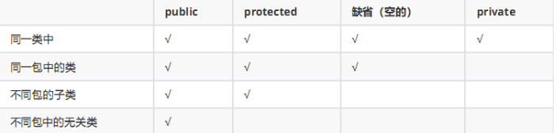
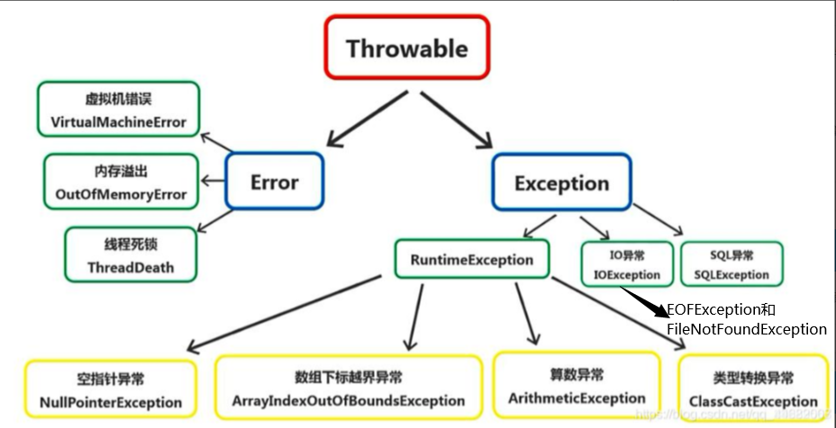
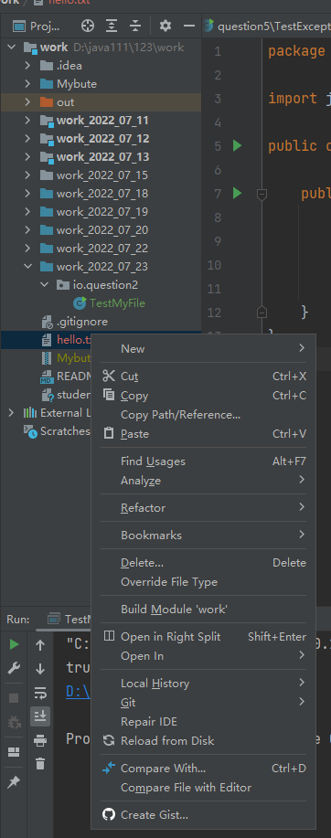
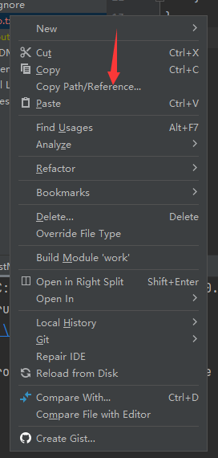
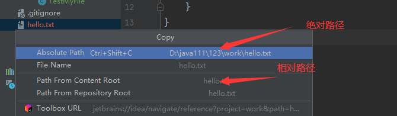
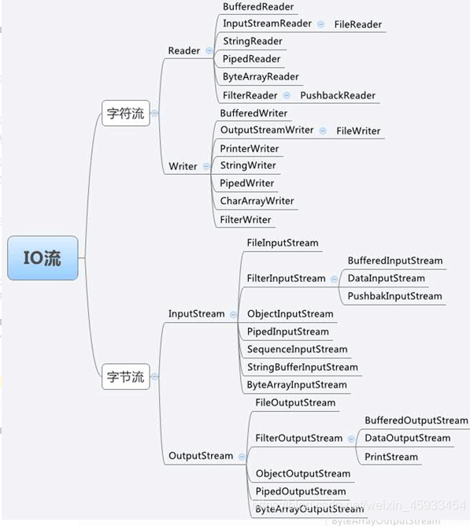
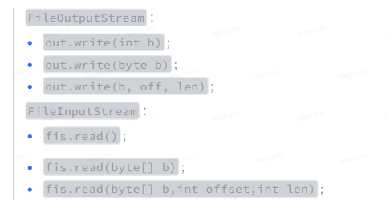
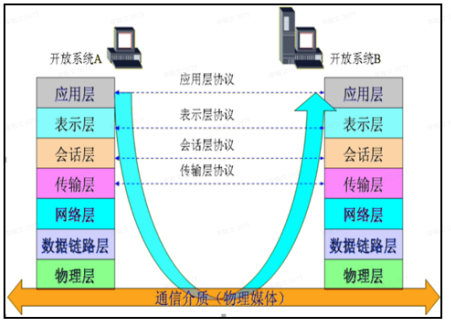
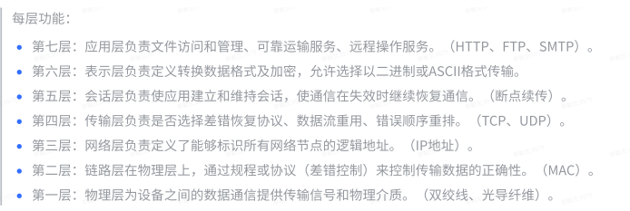
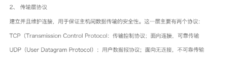

# experience

# 🎈🎈经验总结🎈🎈

## 1、子类和父类之间构造方法

1.

| 情况 | 父类 | 子类 | 输出情况       |
| ---- | ---- | ---- | -------------- |
| 无参 | ✔    | ✔    | 先输出父类无参 |
| 有参 |      |      | 再输出子类无参 |

2.

| 情况 | 父类 | 子类 | 输出情况       |
| ---- | ---- | ---- | -------------- |
| 无参 | ✔    |      | 先输出父类无参 |
| 有参 |      | ✔    | 再输出子类有参 |

3.

| 情况 | 父类 | 子类 | 输出情况                  |
| ---- | ---- | ---- | ------------------------- |
| 无参 |      | ✔    | 报错                      |
| 有参 | ✔    |      | 改错方式：1、创建父类无参 |

~~~java
改错方式2、在子类无参构造里面使用父类有参
    class Super{
        public Super(int i){}
    }
    class Sub extends Super{
        public Sub(){
            super(10);
        }
    }
~~~


4.

| 情况 | 父类 | 子类 | 输出情况       |
| ---- | ---- | ---- | -------------- |
| 无参 |      |      | 先输出父类有参 |
| 有参 | ✔    | ✔    | 再输出子类有参 |

5.

| 情况 | 父类 | 子类 | 输出情况       |
| ---- | ---- | ---- | -------------- |
| 无参 | ✔    | ✔    | 先输出父类无参 |
| 有参 | ✔    |      | 再输出子类无参 |

6.

| 情况 | 父类 | 子类                        | 输出情况       |
| ---- | ---- | --------------------------- | -------------- |
| 无参 | ✔    |                             | 先输出父类无参 |
| 有参 | ✔    | ✔（无super或者有super（）） | 再输出子类有参 |

6.

| 情况 | 父类       | 子类              | 输出情况       |
| ---- | ---------- | ----------------- | -------------- |
| 无参 | ✔          |                   | 先输出父类有参 |
| 有参 | ✔（int i） | ✔（有super（i）） | 再输出子类有参 |

7.

| 情况 | 父类 | 子类 | 输出情况         |
| ---- | ---- | ---- | ---------------- |
| 无参 | ✔    | ✔    | 综合上述         |
| 有参 | ✔    | ✔    | 视使用情况而输出 |


## 2、父子类中各个资源的初始化顺序 

 静态优先，然后是父类型优先

```java
// 1、父亲的静态属性 (1)
// 2、子类的静态属性 (1)
// 3、初始化父亲中的属性
// 4、构造父亲实例
// 5、初始化子类中的属性
// 6、构造子类实例
```


## 3、子类和父类中调用方法的顺序

```java
Super s=new Super();	//父类
Sub b=new Sub();		//子类
```

- 采用**就近原则**
- 注意：父类的静态方法不能被子类重写，只可以继承，即使子类中的静态方法与父类中的静态方法完全一样，也是两个完全不同的方法
- 创建的对象是子类时，父类和子类都有这个方法时，就用子类的方法
- 创建的对象是子类时，父类有该方法，子类没有，调用父类的方法
- 创建的对象是父类时，只能使用父类的方法


## 4、多态

- 多态

  > 简单地说就是：父类的引用指向了子类对象，接口的引用指向了其接口的实现类对象
  >
  > - 一个行为，在不同条件下，有不同的执行效果
  > - 在定义方法的时候，我们可以把参数类型定义的更为抽象一些，这样它就能接受所有的自类型实例，以此来提高程序的兼容性
  > - 表现：重写是父类与子类之间多态性的一种表现，重载是一类中多态性的表现

- **多态的三大必要条件（实现）**

  1.需要有继承（继承类，继承抽象类，实现接口）
  2.需要有重写
  3.父类型的引用执行子类型


- **能做什么看左边，具体做什么看右边**
  - 父类中有而子类没有的方法，使用父类
  - 父类和子类都有该方法时，使用子类重写的方法


- **使用场景**

1、通过方法的参数传递形成多态

~~~java
public static void draw(Super s){    
    s.show(); 
} 
draw(new Sub); 
~~~

2、在方法体中直接使用多态的语法格式

~~~java
Super s=new Sub();
~~~

3、通过方法的返回值类型形成多态

~~~java
public static Super draw(){    
    retrun new Sub; 
} 
Super s=Super.draw();
~~~


- 同一个类中进行方法重载

  > 方法的重载：需参数不同、参数个数不同、返回值不同

~~~java
public void init(String name,int i){
        
}
    
public void init(int i,String name){
        
}
    
public void init(){
        
}
    
public int init(){
        
}
~~~


## 5、学生系统结构分析

Main	--主函数入口

StudentManager	--管家婆：定为属于高层管理，主要负责安排和协调工作的

StudentContainer、Console	--控制台、数据容器：中层管理，提供特定的服务、数据，这两者都直接与管家婆对接

自我感觉：精益求精，先列出StudentManager列出大概步骤，再通过下层实现具体方法


## 6、类型准换

- 主要分为向上（自动）和向下转型（需要在变量前面加以类型修饰）

  ~~~java
  //子类转父类(向上转型)
  Sub a=new Sub();
  Super s=a;
  //父类转子类(向下转型)
  Super a=new Super();
  Sub b=(Sub)a;
  ~~~

  

- 对于基本类型而言，比如数字，可以把长度小的类型自动转换成长度大的，相反，长度大的也可以强制类型转化为长度小的

  ~~~java
  byte(1字节)->short(2字节)->int(4字节)->long(8字节)->float(4字节)->double(8字节)
      	^
      	|
         char(2字节)
  ~~~

  

- 当把子类型转换为父类型的时候，这个实例的行为会变成它只能调用父类型声明的那些方法（能做什么看左边的类型，具体怎么做，看右边是什么样的实例）

  - 用法类似如多态

  

- 变量名 instanceof 类型：前者是后者这个类型的一个实例吗？

~~~java
Super n=new Sub();
 n instanceof Sub	结果：true
~~~


## 7、如何比较对象

- 如何比较对象
  - ==用来比较两者的地址(引用)，基本类型直接比较值
  - 我们如果要实现"当这个对象中某些个属性值相等，我们就认为这是两个相同的对象"，可以使用equals
  - 重写Object的equals方法（默认比较的是地址）
  - 比如用户在注册论坛的时候，我们可以在后台的User中，增加手机号码 + 性别 + 用户名


## 8、static修饰符的使用	

- 修饰变量：static修饰的变量不依赖类的实例而存在，一般直接通过类名进行调用，它是这个类的实例所有共有的（它只有一份）

  ~~~java
  如：public static int a=5；
  
  会在内存中只开辟一个空间，表名这是一个全局变量，不会再创建新的空间，static修饰的int等类型的值是可以改变的。
  ~~~

- 修饰方法：静态方法只能引用静态变量和静态方法

- **static一般都"只执行一次"或者"只有一份"**

- 静态代码块：只执行一次，并且时间点在构造器之前，在静态属性初始化之后


## 9、final修饰符的使用

- 被final修饰的变量，具有"不可改变"的特性，可以在构造器中进行第一次**赋值初始化**,**必须对每个构造器(无参和有参)里面进行同样的赋值操作**

- 修饰基本类型：其值不可以再进行修改

- 修饰引用类型：可以改 - 地址没有变（但凡是new了，地址一定改变了，如果通过setter进行修改，地址没有改变）

  ~~~java
  MyClass m=new MyClass();
  m=new Myclass;
  结果：报错
  ~~~

- 修饰类：这是这个类的最终版，不能被扩展和继承

- 修饰方法：这是这个方法的最终版，不能被重写


## 10、abstract修饰符的使用

- 修饰类：对于abstract方法，只允许声明，不允许实现（没有方法体）

  - 类里面可以有抽象的方法，也可以没有抽象方法（情况较少）

  - 类里面有抽象方法，它就一定是抽象类

  - 从用法上，主要是用来被继承的，它的子类必须要实现父类中的抽象方法，否则它自己也必须声明为abstract class

- 修饰方法： 会使这个方法变成抽象方法，也就是只有声明（定义）而没有实现，实现部分以”；”代替。需要子类继承实现（覆盖）
- 抽象类是可以继承普通类


## 11、final、static、abstract的共存

- final、abstract 不能共存（无论在类、方法、属性、局部变量上都不能共存）
  - 原因1:修饰类：final类表示完美不需要继承重写，abstract类表示要子类继承。
  - 原因2:修饰方法时：final表示完美不需要重写，只能子类继承使用，而abstract中的方法没有东西，所以并不完美。以上两点都是冲突的。故不成立。
- static、abstract 不能共存（无论在类、方法、属性、局部变量上都不能共存）
- final static field：定义的对象既要它是静态的，也要求它的值不能再被修改。
- final static method：该类成员方法不能被 override（重写）


## 12、接口

> 定义

- 接口：主要是用来封装一揽子抽象方法的，它侧重在于对行为的一种抽象（动词）

- 接口可以看作一个特殊的抽象类，但是两个是不同的概念，类描述对象的属性和方法，接口则包含类要实现的方法。\

- 接口中不能有具体的方法实现，它只是一种行为的规约（规范和约定）

> 语法特点

- 接口的实现类必须实现接口中的所有方法，只要有一个没有实现，这个类本身必须声明为abstract class

- 接口定义属性，默认是public final static，并且要对其初始化

- 接口定义方法，默认是public abstract

- JDK8 新特性：接口中其实可以定义具体方法（默认方法，可以定义多个），前面必须加default修饰

- 接口和其他类型之间的关系：
  - 接口和实现类之间的是implements，可以实现多个接口
  - 接口和接口之间是extends

> 作用

- 主要是为了解耦

~~~java
new User("Jack").eat();
new Animal("Pony").eat();
~~~

- 形成多态

~~~java
void run(IEat eat)
~~~

- 接口最终形成了一种跨界类型


## 13、接口内默认修饰符

```java
public interface Wifi {
// public abstract class Wifi {
    // 不是某某实例的成员变量，而是大家共有
    // 默认修饰符为public final static
    public final static int frequency = 100;

    // 默认修饰符为public abstract
    public abstract void connect();

}
```

- 子类重写父类方法时，方法的访问权限不能小于原访问权限，**在接口中，方法的默认权限就是public，所以子类重写后只能是public**


## 14、接口和抽象类的区别

1、接口和抽象类的概念是不一样的。**接口是对动作的抽象，表示的是这个对象能做什么**，比如人可以吃东西、狗也可以吃东西，只要有相同的行为；**抽象类是对根源的抽象，表示的是这个对象是什么**，比如男人是人、女人也是人

2、**可以实现多个接口，只能继承一个抽象类**

3、接口中只能定义抽象方法（除default方法），抽象类中可以有普通方法（第10个总结最后一点可以继承普通类的原因）

4、接口中只能有静态的不能被改变的数据成员，抽象类可以有普通的数据成员


## 15、抽象类实现接口，子类继承抽象类的关系

- 一个类实现一个接口，则该类必须实现该接口中的所有方法
- 一个抽象类实现一个接口，然后该**抽象类可以实现该接口中任意数量的方法**

- （作业4第二题）一个类继承一个抽象类，这个抽象类实现一个接口，然后在这个子类中，**必须实现抽象类中未实现的接口方法和抽象的修改后的抽象方法**. 至于已经实现的接口方法或非抽象方法，可以重新实现或不实现


## 16、重写equals和hashCode的原因

- 没有重写hashCode方法，重写了equals，那么对象调用hashCode方法是根据对象的地址值来生成的哈希值,两个对象内容一定相同,哈希值不一定不同

- 重写了hashCode方法，没有重写equals，那么对象调用hashCode方法是根据对象的内容来生成的哈希值，两个对象哈希值相同,内容不一定相同

- 重写了equals和hashCode,两个对象内容相同,则哈希值一定相同,

- **重写hashcode是为了保证两个对象内容相等（equals）时哈希表key唯一的原则**

- **实际上重写了hashcode的两个对象的内存地址还是不相同的**

  


## 17、ArrayList与LinkedList

- ArrayList
  - 基于数组实现的，具备了数组所有的优点
  - 动态扩容
  - 随机查找（给定一个下标查找）快，插入删除慢

- LinkedList
  - 基于Node（节点）来实现的虚拟容器（没有具体的边界），每一个节点都会从"前"和"后"两个方向记住临近节点的信息
  - 理解双链表的操作
  - 随机访问慢，插入、删除快

- 个人实现LinkedList代码（单向和双向）

  - 单向实现（只有next，没有pre）

~~~java
    package com.zouzhao.linklist;
    
    import java.util.Stack;
    
    public class SingleLinkedListDemo {
        public static void main(String[] args) {
            HeroNode node1 = new HeroNode(1,"宋江","及时雨");
            HeroNode node2=new HeroNode(2,"林冲","豹子头");
            HeroNode node3 = new HeroNode(3, "李逵", "黑旋风");
            HeroNode node4=new HeroNode(4,"123","456");
    
            SingleLinkedList singleLinkedList = new SingleLinkedList();
            /*singleLinkedList.addHeroNode(node1);
            singleLinkedList.addHeroNode(node2);
            singleLinkedList.addHeroNode(node3);
            singleLinkedList.addHeroNode(node4);
    */
    
            //有序添加
            singleLinkedList.add2(node2);
            singleLinkedList.add2(node4);
            singleLinkedList.add2(node1);
            singleLinkedList.add2(node3);
    
            singleLinkedList.list();
    
            //替换，更新
            System.out.println("替换，更新");
            HeroNode newNode1=new HeroNode(4,"吴用","智多星");
            HeroNode newNode2 = new HeroNode(5, "123", "123");
    
            singleLinkedList.update(newNode1);
            singleLinkedList.list();
    
            singleLinkedList.update(newNode2);
            singleLinkedList.list();
    
    
            //删除
            System.out.println("删除");
            singleLinkedList.del(2);
            singleLinkedList.list();
            System.out.println();
            singleLinkedList.del(4);
            singleLinkedList.list();
            System.out.println();
            singleLinkedList.del(4);
            singleLinkedList.list();
            System.out.println();
    
            //得出有效节点
            System.out.println("有效节点");
            System.out.println(getLength(singleLinkedList.head));
    
            System.out.println("返回链表倒数第k个结点");
            System.out.println(findLastIndexNode(singleLinkedList.head, -2));
            System.out.println(findLastIndexNode(singleLinkedList.head, 2));
    
            System.out.println("原本的链表");
            singleLinkedList.list();
            System.out.println("反转列表");
            reversetList(singleLinkedList.head);
            singleLinkedList.list();
            System.out.println("2次反转列表利用stack");
           reversetListByStack(singleLinkedList.head);
            singleLinkedList.list();
    
            System.out.println("从尾到头打印");
            reversePrint(singleLinkedList.head);
    
            //复原
            System.out.println("");
            System.out.println("复原");
            /*HeroNode node1 = new HeroNode(1,"宋江","及时雨");
            HeroNode node2=new HeroNode(2,"林冲","豹子头");
            HeroNode node3 = new HeroNode(3, "李逵", "黑旋风");
            HeroNode node4=new HeroNode(4,"123","456");*/
            HeroNode node5= new HeroNode(5,"宋江","及时雨");
            HeroNode node6=new HeroNode(6,"林冲","豹子头");
            HeroNode node7 = new HeroNode(7, "李逵", "黑旋风");
            HeroNode node8=new HeroNode(8,"123","456");
            singleLinkedList.add2(node5);
            singleLinkedList.add2(node6);
            singleLinkedList.add2(node1);
            singleLinkedList.add2(node3);
    
            SingleLinkedList singleLinkedList2 = new SingleLinkedList();
            singleLinkedList2.add2(node2);
            singleLinkedList2.add2(node7);
            singleLinkedList2.add2(node4);
            singleLinkedList2.add2(node8);
    
            System.out.println("单链表1");
            singleLinkedList.list();
            System.out.println("单链表2");
            singleLinkedList2.list();
    
            System.out.println("合并两个有序的单链表，合并之后的链表依然有序【课后练习.】");
            lindedList1AndLinkedList2(singleLinkedList.head,singleLinkedList2.head);
            singleLinkedList.list();
        }
    
        /**
         *
         * @param head
         * @return 链表有效节点个数
         */
        public static int getLength(HeroNode head){
            if(head.next==null)return 0;//链表为空
            HeroNode temp=head.next;
            int count=0;
            while(true){
                if(temp==null)break;
                else count++;
                temp=temp.next;
            }
            return  count;
        }
    
        /**
         *
         * @param head
         * @param index
         * @return 返回链表倒数第k个结点
         */
        public static HeroNode findLastIndexNode(HeroNode head,int index){
            //链表为空
            if(head.next==null) return null;
    
            int length=getLength(head);
            //index必须在取值范围内
            if(index<=0||index>length)return null;
    
            HeroNode temp=head.next;
            for(int i=0;i<length-index;i++){
                temp=temp.next;
            }
            return temp;
        }
    
        /**
         *
         * @param head
         * 反转链表
         */
        public static void reversetList(HeroNode head){
            //判断链表为空或者只有一个结点，不需要反转
            if(head.next==null||head.next.next==null) return;
            //反转
            HeroNode temp,next,reverseHead;
            reverseHead=new HeroNode(0,"","");
            temp=head.next;
            while(true){
                if(temp==null)break;
                next=temp.next;
                //先连后面再连前面
                temp.next=reverseHead.next;
                reverseHead.next=temp;
    
                temp=next;
            }
            //将结果转移给原链表
            head.next=reverseHead.next;
        }
    
        /**
         *
         * @param head
         * 反转链表 利用栈
         */
        public static void reversetListByStack(HeroNode head){
            //判断是否为空或者一个结点
            if(head.next==null||head.next.next==null)return;
            //反转链表
            HeroNode reversetListHead=new HeroNode(0,"","");
            //压栈
            Stack<HeroNode> nodeStack = new Stack<>();
            HeroNode temp=head.next;
    
            while (true){
                if(temp==null)break;
                nodeStack.push(temp);
                temp=temp.next;
            }
            HeroNode uaa=reversetListHead;
            while(nodeStack.size()>0){
               HeroNode cur=nodeStack.pop();
                uaa.next=cur;
                cur.next=null;
                uaa=cur;
            }
            //转移
            head.next=reversetListHead.next;
    
        }
    
        /**
         *
         * @param head
         * 从尾到头打印单链表 利用栈stack
         */
        public static void reversePrint(HeroNode head){
            //判断是否为空或者一个结点
            if(head.next==null||head.next.next==null)return;
            //反转链表
            HeroNode reversetListHead=new HeroNode(0,"","");
            //压栈
            Stack<HeroNode> nodeStack = new Stack<>();
            HeroNode temp=head.next;
    
            while (true){
                if(temp==null)break;
                nodeStack.push(temp);
                temp=temp.next;
            }
    
            while(nodeStack.size()>0){
                HeroNode cur=nodeStack.pop();
                System.out.println(cur);
            }
        }
    
        /**
         * @param head1
         * @param head2
         * 合并两个有序的单链表，合并之后的链表依然有序【课后练习.】
         * 类似如按no大小插入,,t2插入t1
         */
        public static void lindedList1AndLinkedList2(HeroNode head1,HeroNode head2 ){
            if(head1.next==null&&head2==null)return;
    
            HeroNode temp2=head2.next;
            HeroNode temp1=head1;
            while(true) {
    
                if(temp2==null)break;//全部插入完
    
                //找到对应的no位置
                while (true) {
                    if (temp1.next == null) break;//遍历结束
                    if (temp2.no < temp1.next.no) break;//
                    temp1 = temp1.next;
                }
    
                HeroNode next = temp2.next;
                temp2.next = temp1.next;
                temp1.next = temp2;
                temp2=next;
            }
    
        }
    
        //定义单个实体,HeroNode
        static class HeroNode {
            int no;
            String name;
            String nickname;
            HeroNode next;
    
            //构造器
            public HeroNode(int no,String name,String nickname){
                this.no=no;
                this.name=name;
                this.nickname=nickname;
            }
    
            @Override
            public String toString() {
                return "HeroNode{" +
                        "no=" + no +
                        ", name='" + name + '\'' +
                        ", nickname='" + nickname + '\'' +
                        '}';
            }
        }
    
        //定义单链表和方法
        static class SingleLinkedList{
            private HeroNode head=new HeroNode(0,"","");
    
    
            //添加无顺序排名
            public void addHeroNode(HeroNode heroNode){
                HeroNode temp= head;
                while (true){
                    if(temp.next==null){
                        break;
                    }
                    temp=temp.next;
                }
    
                temp.next=heroNode;
            }
    
            //添加时按顺序进行添加
            public void add2(HeroNode heroNode){
                HeroNode temp=head;
                boolean flag=false;
                while(true){
                    if(temp.next==null)break;//遍历结束
                    if(heroNode.no<temp.next.no)break;//找到编号位置  1 2 3  *  5
                    else if(temp.next.no==heroNode.no)  //等于说明编号已存在
                    {
                        flag=true;
                        break;}
    
                    temp=temp.next; //后移
                }
                if(flag) {
                    System.out.println("编号已存在，无法进行添加");
                }
                else {
                    heroNode.next=temp.next;
                    temp.next=heroNode;
                }
            }
    
            //显示链表
            public void list(){
                HeroNode temp=head;
    
               while (true){
                   if(temp.next==null)break; //检查链表后面还有没有数据 //判断链表是否为空
                   System.out.println(temp.next);
                   temp=temp.next;
    
               }
            }
    
            //根据no修改链表
            public void update(HeroNode newHeroNode){
                HeroNode temp=head.next;
                boolean flag=false;
                while (true){
                    //遍历结束
                    if(temp==null)break;
                    if(newHeroNode.no== temp.no){
                        flag=true;
                       break;
                    }
                    temp=temp.next;
                }
    
                if(flag){
                    temp.name=newHeroNode.name;
                    temp.nickname=newHeroNode.nickname;
                    System.out.println("修改成功");
                }else {
                    System.out.println("没有找到该编号"+newHeroNode.no);
                }
            }
    
            //根据no删除
            public void del(int no){
                HeroNode temp=head;
                boolean flag=false;
                while(true){
                  if(temp.next==null)break;//遍历结束
                  if(temp.next.no==no){
                      flag=true;
                      break;
                  }
                  temp=temp.next;
                }
    
                if(flag){
                    temp.next=temp.next.next;
                }else System.out.println("没有该no");
    
            }
    
    
    
        }
    }
    
~~~
  双向实现（有pre和next）

~~~java
package com.zouzhao.linklist;

public class DoubleLinkedListDemo {
    public static void main(String[] args) {

    }


    //定义单个实体,HeroNode2
    static class HeroNode2 {
        int no;
        String name;
        String nickname;
        HeroNode2 next;
        HeroNode2 pre;

        //构造器
        public HeroNode2(int no,String name,String nickname){
            this.no=no;
            this.name=name;
            this.nickname=nickname;
        }

        @Override
        public String toString() {
            return "HeroNode2{" +
                    "no=" + no +
                    ", name='" + name + '\'' +
                    ", nickname='" + nickname + '\'' +
                    '}';
        }
    }


    class DoubleLinkedList{
        private HeroNode2 head=new HeroNode2(0,"","");


        //显示遍历链表
        public void list(){
            HeroNode2 temp=head;

            while (true){
                if(temp.next==null)break; //检查链表后面还有没有数据 //判断链表是否为空
                System.out.println(temp.next);
                temp=temp.next;

            }
        }
        
        //添加结点到链表末尾
        public void addHeroNode(HeroNode2 heroNode){
            HeroNode2 temp= head;
            while (true){
                if(temp.next==null){
                    break;
                }
                temp=temp.next;
            }
            //双向链表
            temp.next=heroNode;
            heroNode.pre=temp;
        }

        //根据no修改链表
        public void update(HeroNode2 newHeroNode){
            HeroNode2 temp=head.next;
            boolean flag=false;
            while (true){
                //遍历结束
                if(temp==null)break;
                if(newHeroNode.no== temp.no){
                    flag=true;
                    break;
                }
                temp=temp.next;
            }

            if(flag){
                temp.name=newHeroNode.name;
                temp.nickname=newHeroNode.nickname;
                System.out.println("修改成功");
            }else {
                System.out.println("没有找到该编号"+newHeroNode.no);
            }
        }

        //根据no删除
        public void del(int no){

            if(head.next==null){
                System.out.println("链表为空，无法删除");
            }
            HeroNode2 temp=head.next;
            boolean flag=false;
            while(true){
                if(temp==null)break;//遍历结束
                if(temp.no==no){
                    flag=true;
                    break;
                }
                temp=temp.next;
            }

            if(flag){
                temp.pre.next=temp.next;
                //如果为最后一个结点，就会出现空指针,要加一个判断是否为最后一个结点
                if(temp.next!=null){
                temp.next.pre=temp.pre;}

            }else System.out.println("没有该no");

        }
        
        
    }

}
~~~


## 18、HashMap和HaspSet

- Map
  - 基于键值对(key-value)的数据结构
  - key不能重复的，value可以重复
  - 元素的排列顺序无法得到保障的
  - **HaspMap及常用方法**
  
~~~java
  		Map<String, Student> map = new HashMap<>();
		//第一个old
         Object old = map.put("1b", new Student("Mike", 20));
         System.out.println(old);	//sout:null

		//1、put，放入key-value
         map.put("a2", new Student("Jack", 20));
         map.put("3_", new Student("Cool", 40));
         map.put("z4", new Student("Mary", 30));
		
		//两个old输出的区别,新放入的key没有覆盖返回null，覆盖了返回被覆盖的对象
         old = map.put("3_", new Student("Tom", 6));		
         System.out.println(old);	//sout:Student{name='Cool', age=40}
		
         System.out.println("---------------");

         //2、keySet，得到所有的key
         Set<String> keys = map.keySet();
         for (String key: keys) {
             Student value = map.get(key);
             System.out.println(key + "-" + value);
         }

         //3、values，仅仅只想获取到value
         Collection<Student> values = map.values();
         for (Student stu : values) {
             System.out.println(stu);
         }

         //4、entrySet，把key和value包装成的这样一个对象叫Entry
         Set<Map.Entry<String, Student>> entries = map.entrySet();
         for (Map.Entry entry : entries) {
             System.out.println(entry.getKey() + ":" + entry.getValue());
         }

         System.out.println(map.size());
~~~

  

​    

- Set
  - 没有顺序
  
  - 没有下标
  
  - 元素不可以重复
  
  - 类似于一个大麻袋，里面只能装不重复的元素
  
  - **HashSet及常用方法**
  

~~~java
	//一、元素去重
	static String[] duplicatedPlus (String[] arr) {     
       // 首先把数组转换成Collection
        List<String> list = Arrays.asList(arr);
      Set<String> set = new HashSet<>(list);
    //1、强转   
    return (String[]) set.toArray();
    
        //2、new String[0]其中参数的作用并不是让你给一个空的数组容器，而是告诉它具体数组的类型，让它自己给造一个出来，就是给类型
       return set.toArray(new String[0]);

        // 编译器会自动的根据后面返回的类型进行推断
        // 3、整合版
    return new HashSet<String>(Arrays.asList(arr)).toArray(new String[0]);
    	
    //4、Tree的结构会让元素按大小插入，二叉树的结构，返回结果有序
    return new TreeSet<>(Arrays.asList(arr)).toArray(new String[0]);
    }

	//二、API、常用
  static void testAPI() {
        Set<String> set = new HashSet<>();
      //1、add，添加
        set.add("asdf");
        set.add("123");
        set.add("qwer");
        set.add(RandomUtils.randomString());
        //重复无法插入
      set.add("123");
		//2、remove ，移出
        set.remove("qwer");

        for (String item : set) {
            System.out.println(item);
        }
	//3、contains，set里是否包含XXX
        System.out.println(set.contains("asdf"));
    }

~~~


## 19、Java权限修饰符有哪些？有何区别？




## 20、重载与重写的区别

1、定义不同：重载是定义相同的方法名、参数不同，重写是子类重写父类的方法
2、范围不同：重载是在一个类中，重写是子类与父类之间的
3、多态不同：重载是编译时的多态性，重写是运行时的多态性
4、参数不同：重载的参数个数、参数类型、参数的顺序可以不同，重写父类子方法参数必须相同
5、修饰不同：重载对修饰范围没有要求，重写要求重写方法的修饰范围大于被重写方法的修饰范围


## 21、开闭原则

软件中的对象（类、函数、模块等）应该扩展开放，对修改关闭


## 22、垃圾回收机制

 回收不可达的对象，程序员不能强制执行，只能System.gc 方法来“建议”执行


## 


# 🎈🎈课堂笔记🎈🎈

# v2.1.0高级\_集合框架_07_21

## 1.1 map和set

~~~java
见上面经验总结第18点
~~~


## 1.2 工具类Arrays、 Collections

两种类常用方法详细可见[👀收藏的方法与函数](/Project/java方法/java方法.md)

为什么放收藏的方法与函数里呢，难道你用方法还去笔记里找吗，肯定是有一个方法收藏集更快吧

- Arrays

~~~java
 	    // 1、拷贝数组
        Arrays.copyOf()
        // 2、对目标数组做一个范围拷贝
       Arrays.copyOfRange()
        // 3、把数组转换成List集合
         Arrays.asList(1,2,3);

        int[] arr = {3, 0, -9, 8, 4, 3};
		//4、 直接在原先的数组上进行排序的，破坏性方法
        Arrays.sort(arr); 	//排序好后[-9, 0, 3, 3, 4, 8]
        //5、查找值在arr的位置，如果找到了，返回索引
		// 如果没有找到，那么把返回(-(point) - 1)
		//point：这个新元素安排进去的位置 
        int index = Arrays.binarySearch(arr, 9); // 返回的是目标在排好序的数组中的索引，目标可以插入6号索引，所以这里返回（-6）-1  ，即-7
        System.out.println(Arrays.toString(arr));
        System.out.println(index);
~~~

- Collections

~~~java
  // Collections.sort(list); // 排序

        // Collections.binarySearch() // 二分查找

        // Collections.reverse(list)// 倒序

        // Collections.shuffle(); // 乱序
~~~

## 1.3 sort()， Comparable让对象可以进行比较

- 第一种方法,让需要比较的类实现comparable（不推荐）

~~~java
public class Student implements Comparable<Student>{
    .....省略属性
        ......省略方法
  // 决定比较什么属性
 // 在做A需求的时候，要求根据age比较
// 在做B需求的时候，要求根据name比较
// 因为业务的发展，具体的业务逻辑(比较逻辑)侵入到了JavaBean中，这样的代码是不太好维护的
        
        //按年龄大小来进行比较
         @Override
    public int compareTo(Student o) {
        return Integer.compare(getAge(), o.getAge());
    }
}
 
Main.class
        List<Student> stuList = new ArrayList<>();
        stuList.add(new Student(randomString(),randomNumber(100)));
        stuList.add(new Student(randomString(),randomNumber(100)));
        stuList.add(new Student(randomString(),randomNumber(100)));
        stuList.add(new Student(randomString(),randomNumber(100)));

       Collections.sort(stuList);
~~~


- 第二种方法，写实现类
~~~java
//按年龄从小到大
public class AgeComparator implements Comparator<Student> {
    @Override
    public int compare(Student o1, Student o2) {
        return Integer.compare(o1.getAge(), o2.getAge());
    }
}
//按姓名的ACSII从小到大 
public class NameComparator implements Comparator<Student> {
    @Override
    public int compare(Student o1, Student o2) {
        return o1.getName().compareTo(o2.getName());
    }
Main.class
         List<Student> stuList = new ArrayList<>();
        stuList.add(new Student(randomString(),randomNumber(100)));
        stuList.add(new Student(randomString(),randomNumber(100)));
        stuList.add(new Student(randomString(),randomNumber(100)));
        stuList.add(new Student(randomString(),randomNumber(100)));

       Collections.sort(stuList,new AgeComparator());
~~~

- 比较反转

~~~java
 // 得到一个作用相反的比较器，顺序反转了
       Comparator<Student> nameComparator = Collections.reverseOrder(new NameComparator());
       Collections.sort(stuList,nameComparator);
~~~


## 1.4 排序算法

下面几个排序是我自己做题的排序算法，大致与老师相同，因为自己的算法从网上学的，所以实现与老师有些差异，不过中心思想都是一样的,有兴趣可以了解下这些排序，有步骤疑问可以qq私聊我

### 1.4.1 归并排序（今天上课讲的）

~~~java
package com.zouzhao.sort;

import java.util.Arrays;

public class MergeSort {

    public static void main(String[] args) {
        int[] n=new int[1000];
        for (int i = 0; i < n.length; i++) {
            n[i]=(int)(Math.random()*80000);
        }
       System.out.println(Arrays.toString(n));
		//上面是显示没排序前的数组
        int[] temp=new int[n.length];
		//算法入口
        mergeSort(n,0,n.length-1,temp);
		//打印排序后的数组
        System.out.println(Arrays.toString(n));
    }

    private static void mergeSort(int[] n,int start,int end,int[] temp) {
        if (start<end) {
            int mid=(end-start)/2+start;
            mergeSort(n,start,mid,temp);
            mergeSort(n,mid+1,end,temp);
            //合并
            merge(n, start, end, mid,temp);
        }
    }

    private static void merge(int[] n, int start, int end, int mid,int[] temp) {
        //合并
        int i= start,j= mid +1;
        int k=start;
       while (i<=mid&&j<=end){
           if (n[i]< n[j]){
                    temp[k]= n[i];
                    i++;k++;
           }else {
               temp[k] = n[j];
               j++;k++;
           }
        }
      while (i<=mid){
          temp[k]= n[i];
          i++;k++;
      }
      while (j<=end){
          temp[k] = n[j];
          j++;k++;
      }
        System.arraycopy(temp,start,n,start,end-start+1);

    }


}
~~~


### 1.4.2 冒泡排序

有兴趣可以参考这个排序的flag对其他排序进行改良，

flag在这里意义：如果在一次排序中如果没有发生一次位置的交换，flag就会等于true，说明无需进行后面的循环排序

~~~java
package com.zouzhao.sort;

import java.util.Arrays;

public class BubbleSort {
    public static void main(String[] args) {
        int[] n=new int[5];
        for (int i = 0; i < ; i++) {
            n[i]=(int)(Math.random()*80000);
        }
        int[] bubble = bubble(n);
        System.out.println(Arrays.toString(n));
        System.out.println(Arrays.toString(bubble));
    }

    private static  int[] bubble(int[] n) {
        int temp=0;
        boolean flag=true;
        for (int i = 0; i < n.length-1; i++) {
            for (int j = 0; j < n.length-1-i; j++) {
                if(n[j]> n[j+1]){
                    flag=false;
                    temp= n[j];
                    n[j]= n[j+1];
                    n[j+1]=temp;
                }
            }
            if(flag){
                break;
            }else {
                flag=true;
            }
        }
        return  n;
    }
}
~~~


### 1.4.3 选择排序

~~~java
package com.zouzhao.sort;

import java.util.Arrays;

public class ChoiceSort {
    public static void main(String[] args) {
        int[] n=new int[50];
        for (int i = 0; i < n.length; i++) {
            n[i]=(int)(Math.random()*80000);
        }
        choiceSort(n);
        System.out.println(Arrays.toString(n));

    }
    private static void choiceSort(int[] n){
        for (int i = 0; i < n.length-1; i++) {
            for (int j = i+1; j < n.length; j++) {
                if(n[j]<n[i]){
                    int temp= n[j];
                    n[j]= n[i];
                    n[i]=temp;
                }
            }
        }


    }
}
~~~


### 1.4.4 插入排序

~~~java
package com.zouzhao.sort;

import java.util.Arrays;

public class InsertSort {
    public static void main(String[] args) {
        int[] n=new int[50];
        for (int i = 0; i < n.length; i++) {
            n[i]=(int)(Math.random()*80000);
        }
        insertSort(n);
        System.out.println(Arrays.toString(n));
    }
    private static void insertSort(int[] n){
        for (int i = 0; i < n.length; i++) {
            for (int j = i; j >0; j--) {
                if (n[j]<n[j-1]){
                    int temp= n[j];
                    n[j]= n[j-1];
                    n[j-1]=temp;
                }
            }
        }
    }
}

~~~


### 1.4.5 快速排序（速度如其名）

~~~java
package com.zouzhao.sort;

import java.util.Arrays;

public class QuickSort {
    public static void main(String[] args) {
        int[] arr=new int[1000];
        for (int i = 0; i < arr.length; i++) {
            arr[i]=(int)(Math.random()*80000);
        }
        System.out.println(Arrays.toString(arr));
        int[] ints = quickSort(arr, 0, arr.length - 1);
        System.out.println(Arrays.toString(ints));
    }

    public static int[] quickSort(int[] arr,int left,int right){
       if(left<right){
           int partition = partition(arr, left, right);
            quickSort(arr,left,partition-1);
            quickSort(arr,partition+1,right);
       }
        return arr;
    }

    public static int partition(int[] arr,int left,int right){
        int pivot=left;
        int index=left+1;
        for (int i = index; i <=right ; i++) {
            if (arr[i]<arr[pivot]){
                swap(arr,i,index);
                index++;
            }
        }
        swap(arr,pivot,index-1);
        return index-1;
    }
    public static void swap(int[] arr,int i,int j){
        int temp=arr[i];
        arr[i]=arr[j];
        arr[j]=temp;
    }
}
~~~


# v2.2.0高级\_异常_07_22

## 1、集合的foreach问题

~~~java
for (String s : list) { // 在执行的时候，会默认调用
            System.out.println(s);
        }
~~~

会默认调用Iterator，所以自己写的MyArrayList<T> implements List<T>中要重写一个Itr<T> implements Iterator<T>，来实现hasNext和next，再利用下面代码来调用

~~~java
public Iterator<T> iterator() {
        return new Itr<>();
    }
~~~


## 2、异常

### 2.1分类

#### 2.1.1 父类与子类                 




- **Error类**：JVM内部的严重问题。无法恢复。程序人员不用处理。

- **Exception类**：普通的问题。通过合理的处理，程序还可以回到正常执行流程。要求编程人员要进行处理。

#### 2.1.2 检查和未检查异常

~~~java
Java中Exception又分为2种异常类型
- `RuntimeException `不受检测异常（不太严重的问题），就算是有这种发生问题的可能性，既不要try-catch，也不需要throws
- `非RuntimeException的子类` 受检测异常（较为严重的问题），编译器强制要求开发人员面对这个问题：
  	//1、自己来处理，编写try-catch
   		// 2、自己不处理，在方法上添加throws XxxException，它的用意是告诉调用这个方法的人，这个方法会有发生错误的风险，你需要注意
~~~

不太直观，我直接综合下

**对未检查的异常(RuntimeException)的几种处理方式：**

- 捕获
- 继续抛出
- 不处理

**对检查的异常，除了RuntimeException，其他的异常都是检查异常的几种处理方式：**

- 继续抛出，消极的方法，一直可以抛到java虚拟机来处理
- 用try…catch捕获


#### 2.1.3 方法覆盖

> 子类的覆盖方法不能比父类的被覆盖方法抛出更多异常

例子

~~~java
//不报错
class MySub2 extends Super {
    public void ma() throws EOFException, FileNotFoundException {

    }
}
class Super{
   public void ma()throws IOException{

    }
}
//报错
class MySuper{
    public void m1() throws IOException{}
}
class MySub extends MySuper {
    public void m1() throws EOFException {}
}
//这里报错，根据异常分类，笔记2.1的图，EOFException不包括FileNotFoundException，属于同水平
class MySub2 extends MySub{
    public void m1() throws  FileNotFoundException {}
}
~~~


### 2.2使用方法

#### 2.2.1 exception+try-catch

**try表示定义一个受到监控、受到保护的程序代码块**；

catch与try遥相呼应，定义当try block（受监控的程序块）出现异常时，错误处理的程序模块，并且每个catch block都带一个参数（类似于函数定义时的数那样），这个参数的数据类型用于异常对象的数据类型进行匹配；

~~~java
public class TestException {
    public static void main(String[] args) {
        try {
            int num=10/0;

        }catch (Exception e){
            e.printStackTrace();
        }
        System.out.println("123");
    }
~~~


#### 2.2.2 finally语句块

finally语句块无论是否发生异常，都会执行。

~~~java
  public static void main(String[] args) {
         System.out.println(test(false)); 
    }     
static int test(boolean flag) {
         try {
             System.out.println(0);
             if (flag) {
                 throw new Exception("手工异常");
             }
             System.out.println(1);
             return 1;
         } catch (Exception e) {
             System.out.println(2);
         } finally {
             System.out.println(33); // 无论发生异常与否，都一定会执行
             return 2;
         }        
     }
//结果	flag为false
//0
//1
//2
//33
//2
~~~


#### 2.2.3 thorw抛出异常

手动抛出运行时异常：**throw** new XXXXXX

RuntimeException

~~~java
 if (!("admin".equals(name) && "admin".equals(pwd))) {
             // 手工制造一个异常，达到中断程序运行的效果
             throw new RuntimeException("用户名或密码错误");
}
~~~

#### 2.2.4 throws方法声明异常

将当前方法中的异常交给调用者处理**：throws** Exception

抛皮球，不处理给上层

~~~java
public class Account {
    public void deposit(float value) throws FileNotFoundException {    
        var reader = new FileReader("xxx.md");
   }
}
~~~

#### 2.2.5 自定义异常

~~~java
class ValidateRuntimeException extends RuntimeException{
    ValidateRuntimeException(String msg) {
        super(msg);
    }
}
class NetworkRuntimeException extends RuntimeException{
    NetworkRuntimeException(String msg) {
        super(msg);
    }
}
~~~


### 2.3 场景应用

需求：假如用户的需求：即使有一个文件存在问题，也不要中断整批校验

~~~java
package com.think.lv2.exception;
import java.util.ArrayList;
import java.util.List;
public class Main {
    public static void main(String[] args) throws Exception {
        
        String[] arr = {"a", "bxx", "c"};
  		//程序主体
        //返回错误的集合
        List<String> errors = batchValidate(arr);
      
        System.out.println("批量处理完毕");
        System.out.println(errors);

        // 批量处理总结
        // 1 OK
        // 2 ERROR:
        // 3 ...
    }

    // 假如用户的需求：即使有一个文件存在问题，也不要中断整批校验
    private static List<String> batchValidate (String[] arr) {
        List<String> errors = new ArrayList<>();
        for (String s : arr) {
            try {
                //长度大于1抛出异常
                validateItem(s); // bxx抛出了一个错误
               //count==1抛出异常
                saveItem(s);
            } catch (Exception e) { 
                // 如果try里面发生的错误，是参数声明的类型，就会执行catch中的逻辑
                // 判断错误参数声明的类型
                if(e instanceof NetworkRuntimeException){
                    errors.add(e.getMessage());
                }
                if(e instanceof ValidateRuntimeException){
                    errors.add(e.getMessage());
                }
                e.printStackTrace();
            }
        }
        System.out.println("批量校验完毕！");
        return errors;
    }

    static int count;
    
    static void saveItem(String s) {
        if (count++ == 1) throw new NetworkRuntimeException("网络链接错误");
        System.out.println("把视频保存起来");
        // 网络连接的问题
    }

    private static void validateItem(String s) { // 踢皮球
        if (s.length() > 1) {
            throw new ValidateRuntimeException("字符串长度不符合要求");
            // System.out.println("不符合要求");
        } else {
            System.out.println(s + "是合乎要求的");
        }
    }
    // 有的时候，我们需要根据需求的业务逻辑来进行判断，决定是否中断程序运行

}
//两个自定义异常
class ValidateRuntimeException extends RuntimeException{
    ValidateRuntimeException(String msg) {
        super(msg);
    }
}
class NetworkRuntimeException extends RuntimeException{
    NetworkRuntimeException(String msg) {
        super(msg);
    }
}

//结果
a是合乎要求的
把视频保存起来
com.think.lv2.exception.ValidateRuntimeException: 字符串长度不符合要求
	at com.think.lv2.exception.Main.validateItem(Main.java:82)
	at com.think.lv2.exception.Main.batchValidate(Main.java:55)
	at com.think.lv2.exception.Main.main(Main.java:34)
c是合乎要求的
com.think.lv2.exception.NetworkRuntimeException: 网络链接错误
	at com.think.lv2.exception.Main.saveItem(Main.java:75)
	at com.think.lv2.exception.Main.batchValidate(Main.java:56)
	at com.think.lv2.exception.Main.main(Main.java:34)
批量校验完毕！
批量处理完毕
[字符串长度不符合要求, 网络链接错误]

//细节，为什么c没有输出“把视频保存起来”
//因为if (count++ == 1) 为false时不会执行++
~~~


# v2.3.0高级\_IO_07_22

## 1 测试File

~~~java
public static void main(String[] args) {
        String path="D:\\java111\\123\\work";
        testFile(path);
        }
static void testFile(String path) {
        File file = new File(path);
        System.out.println(file.isFile());	//是否为文件
        System.out.println(file.isDirectory());//是否为目录
    }
//结果
false
true
~~~


## 2 绝对路径与相对路径

- 绝对路径：绝对路径就是你的主页上的文件或目录在硬盘上真正的路径，(URL和物理路径)例如：C:/xyz/test.txt 代表了test.txt文件的绝对路径。http://www.sun.com/index.htm也代表了一个URL绝对路径。

- 相对路径：相对与某个基准目录的路径。包含Web的相对路径（HTML中的相对目录），例如：在Servlet中，"/"代表Web应用的跟目录。和物理路径的相对表示。例如："./" 代表当前目录,"../"代表上级目录。这种类似的表示，也是属于相对路径。

​	

## 3 怎么快速地在idea中找绝对路径和相对路径

上图

第一步，右键文件



第二步，选择copy path



第三步，得出答案




## 4 流的分类

1.按照输入输出分为 输入流 和 输出流
2.按照传输单位分为 字节流 和 字符流
3.按照功能分为 节点流（低级流） 和 处理流（高级流）

- 常用的节点流
  文 件 **FileInputStream FileOutputStrean** FileReader FileWriter 文件进行处理的节点流。
  字符串 StringReader StringWriter 对字符串进行处理的节点流。
  数 组 ByteArrayInputStream ByteArrayOutputStreamCharArrayReader CharArrayWriter 对数组进行处理的节点流（对应的不再是文件，而是内存中的一个数组）。
  管 道 PipedInputStream PipedOutputStream PipedReaderPipedWriter对管道进行处理的节点流。

- 常用处理流（关闭处理流使用关闭里面的节点流）
  缓冲流：**BufferedInputStrean BufferedOutputStream BufferedReader BufferedWriter** 增加缓冲功能，避免频繁读写硬盘。
  转换流：InputStreamReader OutputStreamReader 实现字节流和字符流之间的转换。
  数据流 DataInputStream DataOutputStream 等-提供将基础数据类型写入到文件中，或者读取出来.

  



## 5 File常用API

- file.mkdir() 创建文件夹
- file.delete() 删除
- file.getTotalSpace() 获取文件大小
- file.getParentFile() 获取父节点
- file.exists() 是否存在


## 6 显示目录下所有文件

~~~java
public static void main(String[] args) {
        treeWalk(path);
        copy();
    }
  private static void treeWalk(String path) {
        File file = new File(path);
      //如果为文件就打印出来
        if (file.isFile()) System.out.println(file.getName());
        else {
        //否则递归遍历子目录
            File[] files = file.listFiles();
            for (File children : files) {
                treeWalk(children.getAbsolutePath());//绝对路径
            }
        }

    }
//结果
COMMIT_EDITMSG
config
description
FETCH_HEAD
HEAD
applypatch-msg.sample
commit-msg.sample
fsmonitor-watchman.sample
post-update.sample
............略
~~~


## 7 匿名内部类+过滤器FilenameFilter

接口名就是类型，而{}中的逻辑，就是一个动态代码块，里面是接口中所有抽象方法的具体实现

```java
//将后缀为.java的文件输出  
static FilenameFilter filter = new FilenameFilter() {
         @Override
         public boolean accept(File dir, String name) {
             if (name.endsWith(".java"))
                 System.out.println(">>>>" + name);
             return false;
         }
     };
```

- Lambda 表达式实现

~~~java
  static FilenameFilter filter = (dir, name) -> {
        if (name.endsWith(".java"))
            System.out.println(">>>>" + name);
        return true;
    };
~~~

## 8 字节流实现copy

### 8.1 FileInputStream+FileOutputStream



~~~java
 static void copy() {
        String src = "/Users/cuesky/Desktop/adv.mp4";
        String dest = "/Users/cuesky/Desktop/advCopy.mp4";
        try (
        // 只要括号中的组件实现了Closeable接口，JVM会自动帮程序来关闭
        // in.close() out.close()
        // 它们并非是为了释放JVM中相应的内存，因为JVM中有GC可以自动管理
        // 主要是为了，Java程序申请的硬件资源，通知它们可以释放了
        // 如果没有释放的话，会发生系统崩溃，因为比如OS一般都有同时可以打开多少个文件的限制（65536）
       InputStream in = Files.newInputStream(Paths.get(src));
       OutputStream out = new FileOutputStream(dest);
       MyResource r = new MyResource()
        ) {
      // int b = in.read();// 以字节为单位读取文件
      // out.write(b); // 以字节为单位输出数据到文件中
      byte[] buffer = new byte[1024]; // 以1kb为缓冲来读取
      int len; // 用来记录in实际读取的文件长度
     while (  (len = in.read(buffer)) != -1) {
                // 参数2：从buffer的第几个位置开始读取
                // 参数3：一共读取多少到新文件中去
                out.write(buffer, 0, len);
            }
        } catch (IOException e) {
            throw new RuntimeException(e);
        }
    }
~~~

### 8.2 BufferedInputStream+BufferedOutputStream(有缓存区更快)


~~~java
 static void bufferd() {
        String src = "/Users/cuesky/Desktop/adv.mp4";
        String dest = "/Users/cuesky/Desktop/advCopy.mp4";
        try (
                InputStream in = new FileInputStream(src);
                BufferedInputStream bis = new BufferedInputStream(in); // 带内部缓冲的输入流
                OutputStream out = new FileOutputStream(dest);
                BufferedOutputStream bos = new BufferedOutputStream(out);
        ) {
            byte[] buffer = new byte[1024];
            int len;
            while ((len = bis.read(buffer)) != -1) {
                bos.write(buffer, 0, len);
            }
        } catch (IOException e) {
            e.printStackTrace();
        }
    }
~~~


## 9 字符流实现写文件

BufferedWriter+BufferedWriter

- 其中 BufferedWriter writer = new BufferedWriter(new FileWriter(src, true));的true可以实现续写

~~~java
append – boolean if true, then data will be written to the end of the file rather than the beginning.
~~~

代码

~~~java
  static void charWrite() {
        String src = "/Users/cuesky/Desktop/a1.txt";
        Scanner scanner = new Scanner(System.in); // 直到用户输入q，就退出，同时把前面输入给控制台的所有信息，都记录到文件中去
        try (
                BufferedWriter writer = new BufferedWriter(new FileWriter(src, true));
               // Reader reader = new FileReader("");
                //BufferedReader br = new BufferedReader(reader)
        ) {
            // writer.newLine(); // 写一个空行
            String content;
            while (!(content = scanner.next()).equals("q")) {
                writer.write(content + "\r\n");
            }
        } catch (IOException e) {
            e.printStackTrace();
        }
    }
~~~


## 10 序列化

### 10.1 定义

定义： 序列化，就是把一个引用类型，拆分成最小的单位(byte)，以便今后数据字节流的形式存储在磁盘中或者是通过网络协议发送另一方，它是数据存储和发送的一种重要技术


### 10.2 操作步骤

1、创建对象，引用类型

注意：

- 需要被序列化的类一定要实现java.io.Serializable接口：因为ObjectOutputStream在序列化的时候，会有一个类型检测

- serialVersionUID相当于一个防伪编码，作用是为了在序列化与反序列化的过程中，预防有人篡改字节码中的信息

~~~java
class Person implements Serializable {

    private static final long serialVersionUID = 2263583963027808782L; // 声明这个类的实例是可以被序列化的

    // JVM在反序列化的时候，会去识别这个“防伪编码”，作用有点类似于MD5校验
//    private static final long serialVersionUID = 1L;

    String name;

    @Override
    public String toString() {
        return "Person{" +
                "name='" + name + '\'' +
                '}';
    }

    public Person(String name) {
        this.name = name;
    }
}
~~~


2、写入文件

~~~java
 public static void main(String[] args) {

        Person p1 = new Person("Jack");
        System.out.println(p1.hashCode());
        serializable(p1);

        unSerializable();
    }

    // 建一个对象的数据拆分成字节，有序的写入到文件中去
    private static void serializable(Person p1) {
        Path path = Paths.get("c:/Users/ThinkAboutAI/Desktop/person.data");
        try ( // 只要实现了Closeable接口的实例都会自动关闭
              OutputStream out = Files.newOutputStream(path);
              ObjectOutputStream oos = new ObjectOutputStream(out)
        ) {
            oos.writeObject(p1);
        } catch (IOException e) {
            e.printStackTrace();
        }
    }

    private static void unSerializable() {
        try (
                ObjectInputStream ois = new ObjectInputStream(Files.newInputStream(Paths.get("c:/Users/ThinkAboutAI/Desktop/person.data")))
        ) {
            Object obj = ois.readObject();
            if (obj instanceof Person) {
                Person person = (Person) obj;
                System.out.println(person.hashCode());
                System.out.println(person);
            }
        } catch (IOException e) {
            e.printStackTrace();
        } catch (ClassNotFoundException e) {
            throw new RuntimeException(e);
        }
    }
~~~


# v2.3.0网络编程_07_25

## 1、IP、Port、双工等定义

- Internet P(IP)：每一台硬件（能接入网络的）在网络上的一个唯一地址标识，其它设备能直接通过IP来对该设备发起连接请求

- Port：端口，这个是为了区分不同的应用程序如何来接受网络数据包
- 全双工：客户端在给服务器端发送信息的同时，服务器端也可以给客户端发送信息；
- 半双工：客户端可以给服务端发送信息，服务端也可以给客户端发送信息，但是客户端和服务端不能同时发；

- Transform verb. 传输

- Control 控制

- Protocol 协议


## 2、网络模型

### 2.1 OSI

- 模型：



- 功能：




### 2.2 TCP/IP

- 模型


- 功能


## 3、TCP

- 传输层协议




### 2.1 Server

~~~java
public class Server {

    public static void main(String[] args) {
        

        try ( // 如果开发人员要手工关闭资源，一定要按照FILO规则来关闭和释放资源
            // 创建一个服务器端的socket对象
              ServerSocket ss = new ServerSocket(8080);
              // 启动监听服务：等待客户端发出请求
              // 如果没有接收到任何请求，程序将会一直阻塞在这里
              Socket socket = ss.accept(); // 打通了一个数据流的双向管道
              // 接收数据
              InputStream in = socket.getInputStream();
//              OutputStream out = socket.getOutputStream()
        ) {
            // 创建一个缓冲对象
            byte[] buffer = new byte[1024];
            int len;

            while ((len = in.read(buffer)) != -1) { // 读取到数据流的末尾

                String msg = new String(buffer, 0, len);
                if ("q".equalsIgnoreCase(msg)) break; // 当客户端发送了Q或q，就关闭和退出程序

                System.out.println("Server:" + msg);

//                out.write();
            }

        } catch (IOException e) {
            e.printStackTrace();
        }
    }

}
~~~


### 2.2 Client

注意Client的out没close服务器端就不会停止，可以利用这一点，多次发送信息

~~~java
public class Client {
    public static void main(String[] args) {
        try (
                // 在连接服务器的时候，必须要知道对方的IP和PORT信息
                // 在new的时候，不光已经创建了实例，而且已经发送了connect这个动作
                Socket socket = new Socket(InetAddress.getByName("127.0.0.1"), 8080);
                OutputStream out = socket.getOutputStream()
        ) {
            Console console = new Console();
            String msg;
            while (!"q".equalsIgnoreCase(msg = console.readString("请输入要发送的消息："))) {
                out.write(msg.getBytes());
            }
        } catch (Exception e) {
            e.printStackTrace();
        }
    }
}
~~~


### 2.3 HttpServer

~~~java
public static void main(String[] args) {
        // 创建一个服务器端的socket对象

        try ( // 如果开发人员要手工关闭资源，一定要按照FILO规则来关闭和释放资源
              ServerSocket ss = new ServerSocket(8080);
              // 启动监听服务：等待客户端发出请求
              // 如果没有接收到任何请求，程序将会一直阻塞在这里
              Socket socket = ss.accept(); // 打通了一个数据流的双向管道
              // 接收数据
//              InputStream in = socket.getInputStream();
              OutputStream out = socket.getOutputStream();
        ) {
            System.out.println("接收到请求");
            String msg = "<html><body><h1>Hello Http!</h1></body></html>";
            out.write("HTTP/1.1 200 OK\r\n".getBytes()); // 告诉客户端的请求接收成功
            out.write("Content-Type: text/html;charset=utf-8\r\n".getBytes()); // 我向你发送的数据的MIME
            out.write("Connection: keep-alive\r\n".getBytes());
//            writer.write("Content-Length: " + msg.length() + "\r\n"); // 我向你发送的数据的MIME
            out.write("\r\n".getBytes()); // 在响应头和具体的内容之间，必须要有一个空行
            out.write(msg.getBytes());
            out.flush();
//            out.write("\r\n".getBytes());
            Thread.sleep(10000); // 模拟服务器等待一段时间（客户端需要把发送的数据下载完）
        } catch (IOException e) {
            e.printStackTrace();
        } catch (InterruptedException e) {
            throw new RuntimeException(e);
        }
    }
}
~~~


## 4、UDP

### 4.1 Receiver

~~~java
public class Receiver {
    public static void main(String[] args) {
        // 创建数据报文的socket
        try (
                DatagramSocket ds = new DatagramSocket(8080);
        ) {
            byte[] buffer = new byte[1024]; // 1kb
            // 真正用来盛放数据的数据包裹
            DatagramPacket dp = new DatagramPacket(buffer, buffer.length);
            // 当buffer被接收的数据填充满的时候，就会return
            ds.receive(dp); // 当没有接收到消息的时候，会一直阻塞

            // 服务器端是可以获取到客户端的地址信息
//            dp.getAddress(); // 获取对方IP
//            dp.getPort(); // 获取端口

            int len = dp.getLength(); // 真正的接收到数据的长度
            byte[] data = dp.getData(); // 它的长度与buffer的长度是一样
            String msg = new String(data, 0, len);
            System.out.println(msg);
        } catch (Exception e) {
            e.printStackTrace();
        }
    }
}
~~~


### 4.2 Sender

~~~java
public class Sender {
    public static void main(String[] args) {
        try (
                DatagramSocket socket = new DatagramSocket()
        ) {
            byte[] msg = "hello world".getBytes();
            // 在发送的数据报文中，封装目标的地址信息
            DatagramPacket dp = new DatagramPacket(msg, msg.length, InetAddress.getByName("127.0.0.1"), 8080);
            // while
            socket.send(dp);

            // 发送的数据传输完毕的时候，发送一个类似于Q的表示
        } catch (Exception e) {
            e.printStackTrace();
        }
    }
}
~~~


# v2.4.0多线程_07_25

## 1、线程、进程概念

- **Process 进程**：就是一个应用程序在运行期间，它所申请的资源（硬件、软件）的总和，它即是内存中划定的一块区域，而且是当前应用程序所“独占”的,是系统进行资源分配和调度的基本单位

  - 当一个应用程序功能足够复杂的时候，它可能会由多个进程组成，每一个进程都会承担或者提供相应的某一项功能

  

- **Thread 线程**：“是一个轻量级的进程”，一个进程是由多个线程组成的，同时，线程又是CPU的最基本的调度单位


- CPU相关概念：
  - 某一个线程如果想要计算，必须首先要争抢到CPU的时间片（是一个非常小的，几乎不可以再切割的时间单位），才有机会让CPU来计算程序中指定的逻辑
  -  我们的操作系统可以同时运行多个应用程序，这些程序是由多个进程组成的，同时每一个进程又包含了多个线程，因此，有一个权力非常大的对象“调度器”，
  - 由调度器来决定什么时间，哪个线程来执行CPU的运算


## 2、创建线程

创建线程有多种方式：

### 2.1 编写Thread的子类

重写run方法，通过start启动线程(因为Java是单根继承结构，所以一个类是线程类，就不能是其它类型的子类型了，有局限性)

~~~java
  // 编写一个线程类的子类
  class MyThread extends Thread {
  
  
      @Override
      public void run() { // 状态3：运行状态
          RandomUtils.longSleep(3000, 5000);
          // 获取到当前的线程对象
          Thread thread = Thread.currentThread();
          String name = thread.getName();
          long id = thread.getId();
          int priority = thread.getPriority(); // 线程的优先级
          System.out.println(name + ":" + id + ":" + priority);
          System.out.println(thread.getId() + "执行完毕");
  
      }  // 状态4：终止状态
  }
~~~

  

### 2.2 编写一个类实现Runnable接口

实现run方法，通过start启动线程（因为Task类只需要实现接口，所以它可以是其它类的子类型，更灵活）

~~~java
class Task implements Runnable {

    @Override
    public void run() {
        RandomUtils.longSleep(3000, 5000);
        // 获取到当前的线程对象
        Thread thread = Thread.currentThread();
        String name = thread.getName();
        long id = thread.getId();
        int priority = thread.getPriority(); // 线程的优先级
        System.out.println(name + ":" + id + ":" + priority);
        System.out.println(thread.getId() + "执行完毕");
    }
}

~~~


### 2.3 内部类

更加灵活，可以不用再刻意的新建一个类，它的唯一的确定，就是别人无法重用（它没有名称）

~~~java
    private static void multiThreadDemo() {

        // 打印当前主线程的信息
        Thread main = Thread.currentThread (); // 可以理解为主线程
        System.out.println(main.getId() + ":" + main.getName());

        // 实例化一个线程对象
        for (int i = 0; i < 3; i++) { // 创建3个子线程
            // Thread t = new MyThread(); // 状态1：进入new初始化状态 马上会进入状态2：就绪状态（阻塞状态）
            // 启动这个线程
            // t.start();

            // Thread t = new Thread(new Task());
            // t.start();

            Thread t = new Thread(() -> { // 匿名内部类 - 简化为lambda表达式
                RandomUtils.longSleep(3000, 5000);
                // 获取到当前的线程对象
                Thread thread = Thread.currentThread();
                String name = thread.getName();
                long id = thread.getId();
                int priority = thread.getPriority(); // 线程的优先级
                System.out.println(name + ":" + id + ":" + priority);
                System.out.println(thread.getId() + "执行完毕");
            });
            t.start();
        }

        System.out.println("-----------------------------");
    }
~~~


## 3 线程分配资源

- 定义一个类，代表容器，也表示线程抢占的资源

~~~java
public class Container {

    private final List<String> list = new ArrayList<>();

    public void increment(String item) {
        list.add(item);
    }

    public void showAll() {
        System.out.println(list);
    }

}
~~~

- 创建线程，通过实现接口

~~~java
public class Dude implements Runnable {// 家伙 brother guy

    private final String name;
    private final Container container;

    public Dude(String name, Container container){
        this.name = name;
        this.container = container;
    }


    @Override
    public void run() {
        for (int i = 0; i < 100; i++) {
            container.increment(name);
        }
    }

}
~~~

- 程序入口

~~~java
public class Main {
    public static void main(String[] args) {
        // 容器只有一个
        Container container = new Container();
        // 但是它要同时被两个任务类使用
        Thread t1 = new Thread(new Dude("Jack", container));
        Thread t2 = new Thread(new Dude("Mike", container));

        t1.start();
        t2.start();

        while (t1.isAlive() || t2.isAlive()) {
        }

        // 程序执行到这里，证明t1和t2都不是活跃的
        container.showAll();
    }
}
~~~


# 🧨🧨🧨🧨

# 分割线

# 🧨🧨🧨🧨

# 🎈🎈问题收纳

## 1、如何理解类和对象

- 定义：类是关于一系列相似对象的概括描述，描述它们共有的状态、行为，通过这种共性的定义，我们可以重构出许许多多类似的对象。

​		而对象，即是根据上述类的定义，“克隆”产生的相关实例，这些实例往往在某些属性或行为上是类似但有细节不同的，比如都有姓名，但具体的名字不同。

- 组成类大体包含两种要素，我们统称为成员：
  - 成员变量：体现为属性、状态、数据
  - 成员方法：体现为函数或方法，或者做某件事情的能力

- 关系：类与对象之间的关系：当我们依照类A创建了a1实例的时候，我们可以说 a1 is a member of A


## 2、如何理解封装和抽象

- 封装（动词），既可以用于封装类型，也可以用于封装方法。

- 在封装类型的时候，即是把这个类型的2要素（成员变量和方法）包装到一个单元（class 文件）里面

- 在封装方法的时候，即是把专注做“某件事情”（执行某一个特定算法）的代码段用方法体包含起来

- 在封装的时候，要用“抽象”这种思维能力，做到关注主要的（所有实例共有的），忽略次要的（特别的，只有某些特殊实例才具备的）。

- 抽象还体现在，当我们使用一个类型的实例的时候，在调用其方法时，只需要关注有哪些入参，可以得到什么返回，而无需关注内部的具体实现方式或细节


