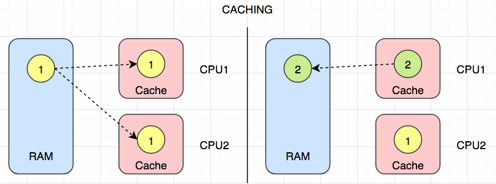
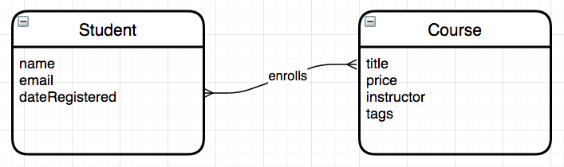
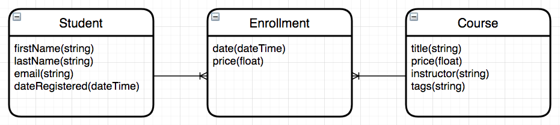
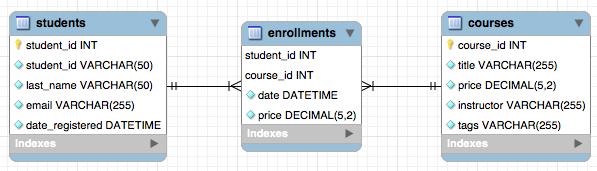
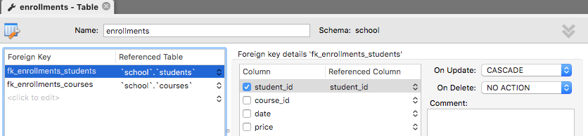
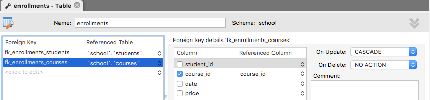
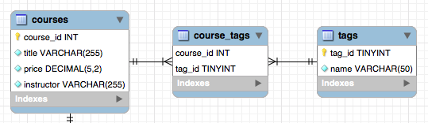
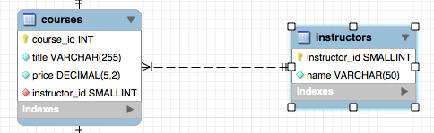

# 一、experience

# 🧨🧨JavaEE🧨🧨

# 🎈🎈经验总结🎈🎈

## 1、类与对象

- 类是对事务普遍状态和行为的抽象
- 对象是对抽象结果的具体表现的一个实例
- 类可以当成一个模版，创建出很多属性和行为上有差别的实例


## 2、封装

封装就是把近似的内容集成在一起，对外提供服务和数据


## 3、继承

继承用来做类型扩展的，扩展类不仅可以获得原来类的特性，还能扩展自己的特性


## 4、子类和父类之间构造方法

1.

| 情况 | 父类 | 子类 | 输出情况       |
| ---- | ---- | ---- | -------------- |
| 无参 | ✔    | ✔    | 先输出父类无参 |
| 有参 |      |      | 再输出子类无参 |

2.

| 情况 | 父类 | 子类 | 输出情况       |
| ---- | ---- | ---- | -------------- |
| 无参 | ✔    |      | 先输出父类无参 |
| 有参 |      | ✔    | 再输出子类有参 |

3.

| 情况 | 父类 | 子类 | 输出情况                  |
| ---- | ---- | ---- | ------------------------- |
| 无参 |      | ✔    | 报错                      |
| 有参 | ✔    |      | 改错方式：1、创建父类无参 |

~~~java
改错方式2、在子类无参构造里面使用父类有参
    class Super{
        public Super(int i){}
    }
    class Sub extends Super{
        public Sub(){
            super(10);
        }
    }
~~~


4.

| 情况 | 父类 | 子类 | 输出情况       |
| ---- | ---- | ---- | -------------- |
| 无参 |      |      | 先输出父类有参 |
| 有参 | ✔    | ✔    | 再输出子类有参 |

5.

| 情况 | 父类 | 子类 | 输出情况       |
| ---- | ---- | ---- | -------------- |
| 无参 | ✔    | ✔    | 先输出父类无参 |
| 有参 | ✔    |      | 再输出子类无参 |

6.

| 情况 | 父类 | 子类                        | 输出情况       |
| ---- | ---- | --------------------------- | -------------- |
| 无参 | ✔    |                             | 先输出父类无参 |
| 有参 | ✔    | ✔（无super或者有super（）） | 再输出子类有参 |

6.

| 情况 | 父类       | 子类              | 输出情况       |
| ---- | ---------- | ----------------- | -------------- |
| 无参 | ✔          |                   | 先输出父类有参 |
| 有参 | ✔（int i） | ✔（有super（i）） | 再输出子类有参 |

7.

| 情况 | 父类 | 子类 | 输出情况         |
| ---- | ---- | ---- | ---------------- |
| 无参 | ✔    | ✔    | 综合上述         |
| 有参 | ✔    | ✔    | 视使用情况而输出 |


## 5、父子类中各个资源的初始化顺序 

 静态优先，然后是父类型优先

```java
// 1、父亲的静态属性 (1)
// 2、子类的静态属性 (1)
// 3、初始化父亲中的属性
// 4、构造父亲实例
// 5、初始化子类中的属性
// 6、构造子类实例
```


## 6、子类和父类中调用方法的顺序

```java
Super s=new Super();	//父类
Sub b=new Sub();		//子类
```

- 采用**就近原则**
- 注意：父类的静态方法不能被子类重写，只可以继承，即使子类中的静态方法与父类中的静态方法完全一样，也是两个完全不同的方法
- 创建的对象是子类时，父类和子类都有这个方法时，就用子类的方法
- 创建的对象是子类时，父类有该方法，子类没有，调用父类的方法
- 创建的对象是父类时，只能使用父类的方法


## 7、多态

- 多态

  > 简单地说就是：父类的引用指向了子类对象，接口的引用指向了其接口的实现类对象
  >
  > - **一个行为，在不同条件下，有不同的执行效果**
  > - 在定义方法的时候，我们可以把参数类型定义的更为抽象一些，这样它就能接受所有的自类型实例，以此来提高程序的兼容性
  > - 表现：重写是父类与子类之间多态性的一种表现，重载是一类中多态性的表现

- **多态的三大必要条件（实现）**

  1.需要有继承（继承类，继承抽象类，实现接口）
  2.需要有重写
  3.父类型的引用执行子类型


- **能做什么看左边，具体做什么看右边**
  - 父类中有而子类没有的方法，使用父类
  - 父类和子类都有该方法时，使用子类重写的方法


- **使用场景**

1、通过方法的参数传递形成多态

~~~java
public static void draw(Super s){    
    s.show(); 
} 
draw(new Sub); 
~~~

2、父类型引用执行子类型

~~~java
Super s=new Sub();
~~~

3、通过方法的返回值类型形成多态

~~~java
public static Super draw(){    
    retrun new Sub; 
} 
Super s=Super.draw();
~~~


- 同一个类中进行方法重载

  > 方法的重载：需参数不同、参数个数不同

~~~java
public void init(String name,int i){
        
}
    
public void init(int i,String name){
        
}
    
public void init(){
        
}
    
public int init(){
        
}
~~~


## 8、学生系统结构分析

Main	--主函数入口

StudentManager	--管家婆：定为属于高层管理，主要负责安排和协调工作的

StudentContainer、Console	--控制台、数据容器：中层管理，提供特定的服务、数据，这两者都直接与管家婆对接

自我感觉：精益求精，先列出StudentManager列出大概步骤，再通过下层实现具体方法


## 9、类型准换

- 主要分为向上（自动）和向下转型（需要在变量前面加以类型修饰）

  ~~~java
  //子类转父类(向上转型)
  Sub a=new Sub();
  Super s=a;
  //父类转子类(向下转型)
  Super a=new Super();
  Sub b=(Sub)a;
  ~~~

  

- 对于基本类型而言，比如数字，可以把长度小的类型自动转换成长度大的，相反，长度大的也可以强制类型转化为长度小的

  ~~~java
  byte(1字节)->short(2字节)->int(4字节)->long(8字节)->float(4字节)->double(8字节)
      	^
      	|
         char(2字节)
  ~~~

  

- 当把子类型转换为父类型的时候，这个实例的行为会变成它只能调用父类型声明的那些方法（能做什么看左边的类型，具体怎么做，看右边是什么样的实例）

  - 用法类似如多态

  

- 变量名 instanceof 类型：前者是后者这个类型的一个实例吗？

~~~java
Super n=new Sub();
 n instanceof Sub	结果：true
~~~


## 10、如何比较对象

- 如何比较对象
  - ==用来比较两者的地址(引用)，基本类型直接比较值
  - 我们如果要实现"当这个对象中某些个属性值相等，我们就认为这是两个相同的对象"，可以使用equals
  - 重写Object的equals方法（默认比较的是地址）
  - 比如用户在注册论坛的时候，我们可以在后台的User中，增加手机号码 + 性别 + 用户名


## 11、static修饰符的使用	

- 修饰变量：static修饰的变量不依赖类的实例而存在，一般直接通过类名进行调用，它是这个类的实例所有共有的（它只有一份）

  ~~~java
  如：public static int a=5；
  
  会在内存中只开辟一个空间，表名这是一个全局变量，不会再创建新的空间，static修饰的int等类型的值是可以改变的。
  ~~~

- 修饰方法：静态方法只能引用静态变量和静态方法

- **static一般都"只执行一次"或者"只有一份"**

- 静态代码块：只执行一次，并且时间点在构造器之前，在静态属性初始化之后


## 12、final修饰符的使用

- 被final修饰的变量，具有"不可改变"的特性，可以在构造器中进行第一次**赋值初始化**,**必须对每个构造器(无参和有参)里面进行同样的赋值操作**

- 修饰基本类型：其值不可以再进行修改

- 修饰引用类型：可以改 - 地址没有变（但凡是new了，地址一定改变了，如果通过setter进行修改，地址没有改变）

  ~~~java
  MyClass m=new MyClass();
  m=new Myclass;
  结果：报错
  ~~~

- 修饰类：这是这个类的最终版，不能被扩展和继承

- 修饰方法：这是这个方法的最终版，不能被重写


## 13、abstract修饰符的使用

- 修饰类：对于abstract方法，只允许声明，不允许实现（没有方法体）

  - 类里面可以有抽象的方法，也可以没有抽象方法（情况较少）

  - 类里面有抽象方法，它就一定是抽象类

  - 从用法上，主要是用来被继承的，它的子类必须要实现父类中的抽象方法，否则它自己也必须声明为abstract class

- 修饰方法： 会使这个方法变成抽象方法，也就是只有声明（定义）而没有实现，实现部分以”；”代替。需要子类继承实现（覆盖）
- 抽象类是可以继承普通类


## 14、final、static、abstract的共存

- final、abstract 不能共存（无论在类、方法、属性、局部变量上都不能共存）
  - 原因1:修饰类：final类表示完美不需要继承重写，abstract类表示要子类继承。
  - 原因2:修饰方法时：final表示完美不需要重写，只能子类继承使用，而abstract中的方法没有东西，所以并不完美。以上两点都是冲突的。故不成立。
- static、abstract 不能共存（无论在类、方法、属性、局部变量上都不能共存）
- final static field：定义的对象既要它是静态的，也要求它的值不能再被修改。
- final static method：该类成员方法不能被 override（重写）


## 15、接口

> 定义

- 接口：主要是用来封装一揽子抽象方法的，它侧重在于对行为的一种抽象（动词）

- 接口可以看作一个特殊的抽象类，但是两个是不同的概念，类描述对象的属性和方法，接口则包含类要实现的方法。\

- 接口中不能有具体的方法实现，它只是一种行为的规约（规范和约定）

> 语法特点

- 接口的实现类必须实现接口中的所有方法，只要有一个没有实现，这个类本身必须声明为abstract class

- 接口定义属性，默认是public final static，并且要对其初始化

- 接口定义方法，默认是public abstract

- JDK8 新特性：接口中其实可以定义具体方法（默认方法，可以定义多个），前面必须加default修饰

- 接口和其他类型之间的关系：
  - 接口和实现类之间的是implements，可以实现多个接口
  - 接口和接口之间是extends

> 作用

- **主要是为了解耦**

即具体某一个类型和相应行为之间的关系

~~~java
new User("Jack").eat();
new Animal("Pony").eat();
~~~

- 形成多态

~~~java
void run(IEat eat)
~~~

- 接口最终形成了一种跨界类型


## 16、接口内默认修饰符

```java
public interface Wifi {
// public abstract class Wifi {
    // 不是某某实例的成员变量，而是大家共有
    // 默认修饰符为public final static
    public final static int frequency = 100;

    // 默认修饰符为public abstract
    public abstract void connect();

}
```

- **子类重写父类方法时，方法的访问权限不能小于原访问权限，在接口中，方法的默认权限就是public，所以子类重写后只能是public**


## 17、接口和抽象类的区别

1、接口和抽象类的概念是不一样的。**接口是对动作的抽象，表示的是这个对象能做什么**，比如人可以吃东西、狗也可以吃东西，只要有相同的行为；**抽象类是对根源的抽象，表示的是这个对象是什么**，比如男人是人、女人也是人

2、**可以实现多个接口，只能继承一个抽象类**

3、接口中只能定义抽象方法（除default方法），抽象类中可以有普通方法（第10个总结最后一点可以继承普通类的原因）

4、接口中只能有静态的不能被改变的数据成员，抽象类可以有普通的数据成员


## 18、抽象类实现接口，子类继承抽象类的关系

- 一个类实现一个接口，则该类必须实现该接口中的所有方法
- 一个抽象类实现一个接口，然后该**抽象类可以实现该接口中任意数量的方法**

- （作业4第二题）一个类继承一个抽象类，这个抽象类实现一个接口，然后在这个子类中，**必须实现抽象类中未实现的接口方法和抽象的修改后的抽象方法**. 至于已经实现的接口方法或非抽象方法，可以重新实现或不实现


## 19、重写equals和hashCode的原因

- 没有重写hashCode方法，重写了equals，那么对象调用hashCode方法是根据对象的地址值来生成的哈希值,两个对象内容一定相同,哈希值不一定不同

- 重写了hashCode方法，没有重写equals，那么对象调用hashCode方法是根据对象的内容来生成的哈希值，两个对象哈希值相同,内容不一定相同

- 重写了equals和hashCode,两个对象内容相同,则哈希值一定相同,

- **重写hashcode是为了保证两个对象内容相等（equals）时哈希表key唯一的原则**

- **实际上重写了hashcode的两个对象的内存地址还是不相同的**

  


## 20、ArrayList与LinkedList

- ArrayList
  - 基于数组实现的，具备了数组所有的优点
  - 动态扩容
  - 随机查找（给定一个下标查找）快，插入删除慢

- LinkedList
  - 基于Node（节点）来实现的虚拟容器（没有具体的边界），每一个节点都会从"前"和"后"两个方向记住临近节点的信息
  - 理解双链表的操作
  - 随机访问慢，插入、删除快

- 个人实现LinkedList代码（单向和双向）

  - 单向实现（只有next，没有pre）

~~~java
    package com.zouzhao.linklist;
    
    import java.util.Stack;
    
    public class SingleLinkedListDemo {
        public static void main(String[] args) {
            HeroNode node1 = new HeroNode(1,"宋江","及时雨");
            HeroNode node2=new HeroNode(2,"林冲","豹子头");
            HeroNode node3 = new HeroNode(3, "李逵", "黑旋风");
            HeroNode node4=new HeroNode(4,"123","456");
    
            SingleLinkedList singleLinkedList = new SingleLinkedList();
            /*singleLinkedList.addHeroNode(node1);
            singleLinkedList.addHeroNode(node2);
            singleLinkedList.addHeroNode(node3);
            singleLinkedList.addHeroNode(node4);
    */
    
            //有序添加
            singleLinkedList.add2(node2);
            singleLinkedList.add2(node4);
            singleLinkedList.add2(node1);
            singleLinkedList.add2(node3);
    
            singleLinkedList.list();
    
            //替换，更新
            System.out.println("替换，更新");
            HeroNode newNode1=new HeroNode(4,"吴用","智多星");
            HeroNode newNode2 = new HeroNode(5, "123", "123");
    
            singleLinkedList.update(newNode1);
            singleLinkedList.list();
    
            singleLinkedList.update(newNode2);
            singleLinkedList.list();
    
    
            //删除
            System.out.println("删除");
            singleLinkedList.del(2);
            singleLinkedList.list();
            System.out.println();
            singleLinkedList.del(4);
            singleLinkedList.list();
            System.out.println();
            singleLinkedList.del(4);
            singleLinkedList.list();
            System.out.println();
    
            //得出有效节点
            System.out.println("有效节点");
            System.out.println(getLength(singleLinkedList.head));
    
            System.out.println("返回链表倒数第k个结点");
            System.out.println(findLastIndexNode(singleLinkedList.head, -2));
            System.out.println(findLastIndexNode(singleLinkedList.head, 2));
    
            System.out.println("原本的链表");
            singleLinkedList.list();
            System.out.println("反转列表");
            reversetList(singleLinkedList.head);
            singleLinkedList.list();
            System.out.println("2次反转列表利用stack");
           reversetListByStack(singleLinkedList.head);
            singleLinkedList.list();
    
            System.out.println("从尾到头打印");
            reversePrint(singleLinkedList.head);
    
            //复原
            System.out.println("");
            System.out.println("复原");
            /*HeroNode node1 = new HeroNode(1,"宋江","及时雨");
            HeroNode node2=new HeroNode(2,"林冲","豹子头");
            HeroNode node3 = new HeroNode(3, "李逵", "黑旋风");
            HeroNode node4=new HeroNode(4,"123","456");*/
            HeroNode node5= new HeroNode(5,"宋江","及时雨");
            HeroNode node6=new HeroNode(6,"林冲","豹子头");
            HeroNode node7 = new HeroNode(7, "李逵", "黑旋风");
            HeroNode node8=new HeroNode(8,"123","456");
            singleLinkedList.add2(node5);
            singleLinkedList.add2(node6);
            singleLinkedList.add2(node1);
            singleLinkedList.add2(node3);
    
            SingleLinkedList singleLinkedList2 = new SingleLinkedList();
            singleLinkedList2.add2(node2);
            singleLinkedList2.add2(node7);
            singleLinkedList2.add2(node4);
            singleLinkedList2.add2(node8);
    
            System.out.println("单链表1");
            singleLinkedList.list();
            System.out.println("单链表2");
            singleLinkedList2.list();
    
            System.out.println("合并两个有序的单链表，合并之后的链表依然有序【课后练习.】");
            lindedList1AndLinkedList2(singleLinkedList.head,singleLinkedList2.head);
            singleLinkedList.list();
        }
    
        /**
         *
         * @param head
         * @return 链表有效节点个数
         */
        public static int getLength(HeroNode head){
            if(head.next==null)return 0;//链表为空
            HeroNode temp=head.next;
            int count=0;
            while(true){
                if(temp==null)break;
                else count++;
                temp=temp.next;
            }
            return  count;
        }
    
        /**
         *
         * @param head
         * @param index
         * @return 返回链表倒数第k个结点
         */
        public static HeroNode findLastIndexNode(HeroNode head,int index){
            //链表为空
            if(head.next==null) return null;
    
            int length=getLength(head);
            //index必须在取值范围内
            if(index<=0||index>length)return null;
    
            HeroNode temp=head.next;
            for(int i=0;i<length-index;i++){
                temp=temp.next;
            }
            return temp;
        }
    
        /**
         *
         * @param head
         * 反转链表
         */
        public static void reversetList(HeroNode head){
            //判断链表为空或者只有一个结点，不需要反转
            if(head.next==null||head.next.next==null) return;
            //反转
            HeroNode temp,next,reverseHead;
            reverseHead=new HeroNode(0,"","");
            temp=head.next;
            while(true){
                if(temp==null)break;
                next=temp.next;
                //先连后面再连前面
                temp.next=reverseHead.next;
                reverseHead.next=temp;
    
                temp=next;
            }
            //将结果转移给原链表
            head.next=reverseHead.next;
        }
    
        /**
         *
         * @param head
         * 反转链表 利用栈
         */
        public static void reversetListByStack(HeroNode head){
            //判断是否为空或者一个结点
            if(head.next==null||head.next.next==null)return;
            //反转链表
            HeroNode reversetListHead=new HeroNode(0,"","");
            //压栈
            Stack<HeroNode> nodeStack = new Stack<>();
            HeroNode temp=head.next;
    
            while (true){
                if(temp==null)break;
                nodeStack.push(temp);
                temp=temp.next;
            }
            HeroNode uaa=reversetListHead;
            while(nodeStack.size()>0){
               HeroNode cur=nodeStack.pop();
                uaa.next=cur;
                cur.next=null;
                uaa=cur;
            }
            //转移
            head.next=reversetListHead.next;
    
        }
    
        /**
         *
         * @param head
         * 从尾到头打印单链表 利用栈stack
         */
        public static void reversePrint(HeroNode head){
            //判断是否为空或者一个结点
            if(head.next==null||head.next.next==null)return;
            //反转链表
            HeroNode reversetListHead=new HeroNode(0,"","");
            //压栈
            Stack<HeroNode> nodeStack = new Stack<>();
            HeroNode temp=head.next;
    
            while (true){
                if(temp==null)break;
                nodeStack.push(temp);
                temp=temp.next;
            }
    
            while(nodeStack.size()>0){
                HeroNode cur=nodeStack.pop();
                System.out.println(cur);
            }
        }
    
        /**
         * @param head1
         * @param head2
         * 合并两个有序的单链表，合并之后的链表依然有序【课后练习.】
         * 类似如按no大小插入,,t2插入t1
         */
        public static void lindedList1AndLinkedList2(HeroNode head1,HeroNode head2 ){
            if(head1.next==null&&head2==null)return;
    
            HeroNode temp2=head2.next;
            HeroNode temp1=head1;
            while(true) {
    
                if(temp2==null)break;//全部插入完
    
                //找到对应的no位置
                while (true) {
                    if (temp1.next == null) break;//遍历结束
                    if (temp2.no < temp1.next.no) break;//
                    temp1 = temp1.next;
                }
    
                HeroNode next = temp2.next;
                temp2.next = temp1.next;
                temp1.next = temp2;
                temp2=next;
            }
    
        }
    
        //定义单个实体,HeroNode
        static class HeroNode {
            int no;
            String name;
            String nickname;
            HeroNode next;
    
            //构造器
            public HeroNode(int no,String name,String nickname){
                this.no=no;
                this.name=name;
                this.nickname=nickname;
            }
    
            @Override
            public String toString() {
                return "HeroNode{" +
                        "no=" + no +
                        ", name='" + name + '\'' +
                        ", nickname='" + nickname + '\'' +
                        '}';
            }
        }
    
        //定义单链表和方法
        static class SingleLinkedList{
            private HeroNode head=new HeroNode(0,"","");
    
    
            //添加无顺序排名
            public void addHeroNode(HeroNode heroNode){
                HeroNode temp= head;
                while (true){
                    if(temp.next==null){
                        break;
                    }
                    temp=temp.next;
                }
    
                temp.next=heroNode;
            }
    
            //添加时按顺序进行添加
            public void add2(HeroNode heroNode){
                HeroNode temp=head;
                boolean flag=false;
                while(true){
                    if(temp.next==null)break;//遍历结束
                    if(heroNode.no<temp.next.no)break;//找到编号位置  1 2 3  *  5
                    else if(temp.next.no==heroNode.no)  //等于说明编号已存在
                    {
                        flag=true;
                        break;}
    
                    temp=temp.next; //后移
                }
                if(flag) {
                    System.out.println("编号已存在，无法进行添加");
                }
                else {
                    heroNode.next=temp.next;
                    temp.next=heroNode;
                }
            }
    
            //显示链表
            public void list(){
                HeroNode temp=head;
    
               while (true){
                   if(temp.next==null)break; //检查链表后面还有没有数据 //判断链表是否为空
                   System.out.println(temp.next);
                   temp=temp.next;
    
               }
            }
    
            //根据no修改链表
            public void update(HeroNode newHeroNode){
                HeroNode temp=head.next;
                boolean flag=false;
                while (true){
                    //遍历结束
                    if(temp==null)break;
                    if(newHeroNode.no== temp.no){
                        flag=true;
                       break;
                    }
                    temp=temp.next;
                }
    
                if(flag){
                    temp.name=newHeroNode.name;
                    temp.nickname=newHeroNode.nickname;
                    System.out.println("修改成功");
                }else {
                    System.out.println("没有找到该编号"+newHeroNode.no);
                }
            }
    
            //根据no删除
            public void del(int no){
                HeroNode temp=head;
                boolean flag=false;
                while(true){
                  if(temp.next==null)break;//遍历结束
                  if(temp.next.no==no){
                      flag=true;
                      break;
                  }
                  temp=temp.next;
                }
    
                if(flag){
                    temp.next=temp.next.next;
                }else System.out.println("没有该no");
    
            }
    
    
    
        }
    }
    
~~~
  双向实现（有pre和next）

~~~java
package com.zouzhao.linklist;

public class DoubleLinkedListDemo {
    public static void main(String[] args) {

    }


    //定义单个实体,HeroNode2
    static class HeroNode2 {
        int no;
        String name;
        String nickname;
        HeroNode2 next;
        HeroNode2 pre;

        //构造器
        public HeroNode2(int no,String name,String nickname){
            this.no=no;
            this.name=name;
            this.nickname=nickname;
        }

        @Override
        public String toString() {
            return "HeroNode2{" +
                    "no=" + no +
                    ", name='" + name + '\'' +
                    ", nickname='" + nickname + '\'' +
                    '}';
        }
    }


    class DoubleLinkedList{
        private HeroNode2 head=new HeroNode2(0,"","");


        //显示遍历链表
        public void list(){
            HeroNode2 temp=head;

            while (true){
                if(temp.next==null)break; //检查链表后面还有没有数据 //判断链表是否为空
                System.out.println(temp.next);
                temp=temp.next;

            }
        }
        
        //添加结点到链表末尾
        public void addHeroNode(HeroNode2 heroNode){
            HeroNode2 temp= head;
            while (true){
                if(temp.next==null){
                    break;
                }
                temp=temp.next;
            }
            //双向链表
            temp.next=heroNode;
            heroNode.pre=temp;
        }

        //根据no修改链表
        public void update(HeroNode2 newHeroNode){
            HeroNode2 temp=head.next;
            boolean flag=false;
            while (true){
                //遍历结束
                if(temp==null)break;
                if(newHeroNode.no== temp.no){
                    flag=true;
                    break;
                }
                temp=temp.next;
            }

            if(flag){
                temp.name=newHeroNode.name;
                temp.nickname=newHeroNode.nickname;
                System.out.println("修改成功");
            }else {
                System.out.println("没有找到该编号"+newHeroNode.no);
            }
        }

        //根据no删除
        public void del(int no){

            if(head.next==null){
                System.out.println("链表为空，无法删除");
            }
            HeroNode2 temp=head.next;
            boolean flag=false;
            while(true){
                if(temp==null)break;//遍历结束
                if(temp.no==no){
                    flag=true;
                    break;
                }
                temp=temp.next;
            }

            if(flag){
                temp.pre.next=temp.next;
                //如果为最后一个结点，就会出现空指针,要加一个判断是否为最后一个结点
                if(temp.next!=null){
                temp.next.pre=temp.pre;}

            }else System.out.println("没有该no");

        }
        
        
    }

}
~~~


## 21、HashMap和HaspSet

- Map
  - 基于键值对(key-value)的数据结构
  - key不能重复的，value可以重复
  - 元素的排列顺序无法得到保障的
  - **HaspMap及常用方法**
  
~~~java
  		Map<String, Student> map = new HashMap<>();
		//第一个old
         Object old = map.put("1b", new Student("Mike", 20));
         System.out.println(old);	//sout:null

		//1、put，放入key-value
         map.put("a2", new Student("Jack", 20));
         map.put("3_", new Student("Cool", 40));
         map.put("z4", new Student("Mary", 30));
		
		//两个old输出的区别,新放入的key没有覆盖返回null，覆盖了返回被覆盖的对象
         old = map.put("3_", new Student("Tom", 6));		
         System.out.println(old);	//sout:Student{name='Cool', age=40}
		
         System.out.println("---------------");

         //2、keySet，得到所有的key
         Set<String> keys = map.keySet();
         for (String key: keys) {
             Student value = map.get(key);
             System.out.println(key + "-" + value);
         }

         //3、values，仅仅只想获取到value
         Collection<Student> values = map.values();
         for (Student stu : values) {
             System.out.println(stu);
         }

         //4、entrySet，把key和value包装成的这样一个对象叫Entry
         Set<Map.Entry<String, Student>> entries = map.entrySet();
         for (Map.Entry entry : entries) {
             System.out.println(entry.getKey() + ":" + entry.getValue());
         }

         System.out.println(map.size());
~~~

  

​    

- Set
  - 没有顺序
  
  - 没有下标
  
  - 元素不可以重复
  
  - 类似于一个大麻袋，里面只能装不重复的元素
  
  - **HashSet及常用方法**
  

~~~java
	//一、元素去重
	static String[] duplicatedPlus (String[] arr) {     
       // 首先把数组转换成Collection
        List<String> list = Arrays.asList(arr);
      Set<String> set = new HashSet<>(list);
    //1、强转   
    return (String[]) set.toArray();
    
        //2、new String[0]其中参数的作用并不是让你给一个空的数组容器，而是告诉它具体数组的类型，让它自己给造一个出来，就是给类型
       return set.toArray(new String[0]);

        // 编译器会自动的根据后面返回的类型进行推断
        // 3、整合版
    return new HashSet<String>(Arrays.asList(arr)).toArray(new String[0]);
    	
    //4、Tree的结构会让元素按大小插入，二叉树的结构，返回结果有序
    return new TreeSet<>(Arrays.asList(arr)).toArray(new String[0]);
    }

	//二、API、常用
  static void testAPI() {
        Set<String> set = new HashSet<>();
      //1、add，添加
        set.add("asdf");
        set.add("123");
        set.add("qwer");
        set.add(RandomUtils.randomString());
        //重复无法插入
      set.add("123");
		//2、remove ，移出
        set.remove("qwer");

        for (String item : set) {
            System.out.println(item);
        }
	//3、contains，set里是否包含XXX
        System.out.println(set.contains("asdf"));
    }

~~~


## 22、Java权限修饰符有哪些？有何区别？


## 23、重载与重写的区别

1、定义不同：重载是定义相同的方法名、参数不同，重写是子类重写父类的方法

2、范围不同：重载是在一个类中，重写是子类与父类之间的

3、多态不同：重载是编译时的多态性，重写是运行时的多态性

4、参数不同：重载的参数个数、参数类型、参数的顺序可以不同，重写父类子方法参数必须相同

5、修饰不同：重载对修饰范围没有要求，重写要求重写方法的修饰范围不小于被重写方法的修饰范围

6、重写的子类返回值类型、参数类型、异常范围要小于等于父类的


## 24、开闭原则

软件中的对象（类、函数、模块等）应该扩展开放，对修改关闭


## 25、垃圾回收机制

 回收不可达的对象，程序员不能强制执行，只能System.gc 方法来“建议”执行


# 🎈🎈高级\_集合框架

## 1.1 map和set

~~~java
见上面经验总结第18点
~~~


## 1.2 工具类Arrays、 Collections

两种类常用方法详细可见[👀收藏的方法与函数](/Project/java方法/java方法.md)

为什么放收藏的方法与函数里呢，难道你用方法还去笔记里找吗，肯定是有一个方法收藏集更快吧

- Arrays

~~~java
 	    // 1、拷贝数组
        Arrays.copyOf()
        // 2、对目标数组做一个范围拷贝
       Arrays.copyOfRange()
        // 3、把数组转换成List集合
         Arrays.asList(1,2,3);

        int[] arr = {3, 0, -9, 8, 4, 3};
		//4、 直接在原先的数组上进行排序的，破坏性方法
        Arrays.sort(arr); 	//排序好后[-9, 0, 3, 3, 4, 8]
        //5、查找值在arr的位置，如果找到了，返回索引
		// 如果没有找到，那么把返回(-(point) - 1)
		//point：这个新元素安排进去的位置 
        int index = Arrays.binarySearch(arr, 9); // 返回的是目标在排好序的数组中的索引，目标可以插入6号索引，所以这里返回（-6）-1  ，即-7
        System.out.println(Arrays.toString(arr));
        System.out.println(index);
~~~

- Collections

~~~java
  // Collections.sort(list); // 排序

        // Collections.binarySearch() // 二分查找

        // Collections.reverse(list)// 倒序

        // Collections.shuffle(); // 乱序
~~~

## 1.3 sort()， Comparable让对象可以进行比较

- 第一种方法,让需要比较的类实现comparable（不推荐）

~~~java
public class Student implements Comparable<Student>{
    .....省略属性
        ......省略方法
  // 决定比较什么属性
 // 在做A需求的时候，要求根据age比较
// 在做B需求的时候，要求根据name比较
// 因为业务的发展，具体的业务逻辑(比较逻辑)侵入到了JavaBean中，这样的代码是不太好维护的
        
        //按年龄大小来进行比较
         @Override
    public int compareTo(Student o) {
        return Integer.compare(getAge(), o.getAge());
    }
}
 
Main.class
        List<Student> stuList = new ArrayList<>();
        stuList.add(new Student(randomString(),randomNumber(100)));
        stuList.add(new Student(randomString(),randomNumber(100)));
        stuList.add(new Student(randomString(),randomNumber(100)));
        stuList.add(new Student(randomString(),randomNumber(100)));

       Collections.sort(stuList);
~~~


- 第二种方法，写实现类
~~~java
//按年龄从小到大
public class AgeComparator implements Comparator<Student> {
    @Override
    public int compare(Student o1, Student o2) {
        return Integer.compare(o1.getAge(), o2.getAge());
    }
}
//按姓名的ACSII从小到大 
public class NameComparator implements Comparator<Student> {
    @Override
    public int compare(Student o1, Student o2) {
        return o1.getName().compareTo(o2.getName());
    }
Main.class
         List<Student> stuList = new ArrayList<>();
        stuList.add(new Student(randomString(),randomNumber(100)));
        stuList.add(new Student(randomString(),randomNumber(100)));
        stuList.add(new Student(randomString(),randomNumber(100)));
        stuList.add(new Student(randomString(),randomNumber(100)));

       Collections.sort(stuList,new AgeComparator());
~~~

- 比较反转

~~~java
 // 得到一个作用相反的比较器，顺序反转了
       Comparator<Student> nameComparator = Collections.reverseOrder(new NameComparator());
       Collections.sort(stuList,nameComparator);
~~~


## 1.4 排序算法

下面几个排序是我自己做题的排序算法，大致与老师相同，因为自己的算法从网上学的，所以实现与老师有些差异，不过中心思想都是一样的,有兴趣可以了解下这些排序，有步骤疑问可以qq私聊我

### 1.4.1 归并排序（今天上课讲的）

~~~java
package com.zouzhao.sort;

import java.util.Arrays;

public class MergeSort {

    public static void main(String[] args) {
        int[] n=new int[1000];
        for (int i = 0; i < n.length; i++) {
            n[i]=(int)(Math.random()*80000);
        }
       System.out.println(Arrays.toString(n));
		//上面是显示没排序前的数组
        int[] temp=new int[n.length];
		//算法入口
        mergeSort(n,0,n.length-1,temp);
		//打印排序后的数组
        System.out.println(Arrays.toString(n));
    }

    private static void mergeSort(int[] n,int start,int end,int[] temp) {
        if (start<end) {
            int mid=(end-start)/2+start;
            mergeSort(n,start,mid,temp);
            mergeSort(n,mid+1,end,temp);
            //合并
            merge(n, start, end, mid,temp);
        }
    }

    private static void merge(int[] n, int start, int end, int mid,int[] temp) {
        //合并
        int i= start,j= mid +1;
        int k=start;
       while (i<=mid&&j<=end){
           if (n[i]< n[j]){
                    temp[k]= n[i];
                    i++;k++;
           }else {
               temp[k] = n[j];
               j++;k++;
           }
        }
      while (i<=mid){
          temp[k]= n[i];
          i++;k++;
      }
      while (j<=end){
          temp[k] = n[j];
          j++;k++;
      }
        System.arraycopy(temp,start,n,start,end-start+1);

    }


}
~~~


### 1.4.2 冒泡排序

有兴趣可以参考这个排序的flag对其他排序进行改良，

flag在这里意义：如果在一次排序中如果没有发生一次位置的交换，flag就会等于true，说明无需进行后面的循环排序

~~~java
package com.zouzhao.sort;

import java.util.Arrays;

public class BubbleSort {
    public static void main(String[] args) {
        int[] n=new int[5];
        for (int i = 0; i < ; i++) {
            n[i]=(int)(Math.random()*80000);
        }
        int[] bubble = bubble(n);
        System.out.println(Arrays.toString(n));
        System.out.println(Arrays.toString(bubble));
    }

    private static  int[] bubble(int[] n) {
        int temp=0;
        boolean flag=true;
        for (int i = 0; i < n.length-1; i++) {
            for (int j = 0; j < n.length-1-i; j++) {
                if(n[j]> n[j+1]){
                    flag=false;
                    temp= n[j];
                    n[j]= n[j+1];
                    n[j+1]=temp;
                }
            }
            if(flag){
                break;
            }else {
                flag=true;
            }
        }
        return  n;
    }
}
~~~


### 1.4.3 选择排序

~~~java
package com.zouzhao.sort;

import java.util.Arrays;

public class ChoiceSort {
    public static void main(String[] args) {
        int[] n=new int[50];
        for (int i = 0; i < n.length; i++) {
            n[i]=(int)(Math.random()*80000);
        }
        choiceSort(n);
        System.out.println(Arrays.toString(n));

    }
    private static void choiceSort(int[] n){
        for (int i = 0; i < n.length-1; i++) {
            for (int j = i+1; j < n.length; j++) {
                if(n[j]<n[i]){
                    int temp= n[j];
                    n[j]= n[i];
                    n[i]=temp;
                }
            }
        }


    }
}
~~~


### 1.4.4 插入排序

~~~java
package com.zouzhao.sort;

import java.util.Arrays;

public class InsertSort {
    public static void main(String[] args) {
        int[] n=new int[50];
        for (int i = 0; i < n.length; i++) {
            n[i]=(int)(Math.random()*80000);
        }
        insertSort(n);
        System.out.println(Arrays.toString(n));
    }
    private static void insertSort(int[] n){
        for (int i = 0; i < n.length; i++) {
            for (int j = i; j >0; j--) {
                if (n[j]<n[j-1]){
                    int temp= n[j];
                    n[j]= n[j-1];
                    n[j-1]=temp;
                }
            }
        }
    }
}

~~~


### 1.4.5 快速排序（速度如其名）

~~~java
package com.zouzhao.sort;

import java.util.Arrays;

public class QuickSort {
    public static void main(String[] args) {
        int[] arr=new int[1000];
        for (int i = 0; i < arr.length; i++) {
            arr[i]=(int)(Math.random()*80000);
        }
        System.out.println(Arrays.toString(arr));
        int[] ints = quickSort(arr, 0, arr.length - 1);
        System.out.println(Arrays.toString(ints));
    }

    public static int[] quickSort(int[] arr,int left,int right){
       if(left<right){
           int partition = partition(arr, left, right);
            quickSort(arr,left,partition-1);
            quickSort(arr,partition+1,right);
       }
        return arr;
    }

    public static int partition(int[] arr,int left,int right){
        int pivot=left;
        int index=left+1;
        for (int i = index; i <=right ; i++) {
            if (arr[i]<arr[pivot]){
                swap(arr,i,index);
                index++;
            }
        }
        swap(arr,pivot,index-1);
        return index-1;
    }
    public static void swap(int[] arr,int i,int j){
        int temp=arr[i];
        arr[i]=arr[j];
        arr[j]=temp;
    }
}
~~~


# 🎈🎈高级\_异常

## 1、集合的foreach问题

~~~java
for (String s : list) { // 在执行的时候，会默认调用
            System.out.println(s);
        }
~~~

会默认调用Iterator，所以自己写的MyArrayList<T> implements List<T>中要重写一个Itr<T> implements Iterator<T>，来实现hasNext和next，再利用下面代码来调用

~~~java
public Iterator<T> iterator() {
        return new Itr<>();
    }
~~~


## 2、异常

### 2.1分类

#### 2.1.1 父类与子类                 


- **Error类**：JVM内部的严重问题。无法恢复。程序人员不用处理。

- **Exception类**：普通的问题。通过合理的处理，程序还可以回到正常执行流程。要求编程人员要进行处理。

#### 2.1.2 检查和未检查异常

~~~java
Java中Exception又分为2种异常类型
- `RuntimeException `不受检测异常（不太严重的问题），就算是有这种发生问题的可能性，既不要try-catch，也不需要throws
- `非RuntimeException的子类` 受检测异常（较为严重的问题），编译器强制要求开发人员面对这个问题：
  	//1、自己来处理，编写try-catch
   		// 2、自己不处理，在方法上添加throws XxxException，它的用意是告诉调用这个方法的人，这个方法会有发生错误的风险，你需要注意
~~~

不太直观，我直接综合下

**对未检查的异常(RuntimeException)的几种处理方式：**

- 捕获
- 继续抛出
- 不处理

**对检查的异常，除了RuntimeException，其他的异常都是检查异常的几种处理方式：**

- 继续抛出，消极的方法，一直可以抛到java虚拟机来处理
- 用try…catch捕获


#### 2.1.3 方法覆盖

> 子类的覆盖方法不能比父类的被覆盖方法抛出更多异常

例子

~~~java
//不报错
class MySub2 extends Super {
    public void ma() throws EOFException, FileNotFoundException {

    }
}
class Super{
   public void ma()throws IOException{

    }
}
//报错
class MySuper{
    public void m1() throws IOException{}
}
class MySub extends MySuper {
    public void m1() throws EOFException {}
}
//这里报错，根据异常分类，笔记2.1的图，EOFException不包括FileNotFoundException，属于同水平
class MySub2 extends MySub{
    public void m1() throws  FileNotFoundException {}
}
~~~


### 2.2使用方法

#### 2.2.1 exception+try-catch

**try表示定义一个受到监控、受到保护的程序代码块**；

catch与try遥相呼应，定义当try block（受监控的程序块）出现异常时，错误处理的程序模块，并且每个catch block都带一个参数（类似于函数定义时的数那样），这个参数的数据类型用于异常对象的数据类型进行匹配；

~~~java
public class TestException {
    public static void main(String[] args) {
        try {
            int num=10/0;

        }catch (Exception e){
            e.printStackTrace();
        }
        System.out.println("123");
    }
~~~


#### 2.2.2 finally语句块

finally语句块无论是否发生异常，都会执行。

~~~java
  public static void main(String[] args) {
         System.out.println(test(false)); 
    }     
static int test(boolean flag) {
         try {
             System.out.println(0);
             if (flag) {
                 throw new Exception("手工异常");
             }
             System.out.println(1);
             return 1;
         } catch (Exception e) {
             System.out.println(2);
         } finally {
             System.out.println(33); // 无论发生异常与否，都一定会执行
             return 2;
         }        
     }
//结果	flag为false
//0
//1
//2
//33
//2
~~~


#### 2.2.3 thorw抛出异常

手动抛出运行时异常：**throw** new XXXXXX

RuntimeException

~~~java
 if (!("admin".equals(name) && "admin".equals(pwd))) {
             // 手工制造一个异常，达到中断程序运行的效果
             throw new RuntimeException("用户名或密码错误");
}
~~~

#### 2.2.4 throws方法声明异常

声明该方法有可能会抛出某种类型的异常

将当前方法中的异常交给调用者处理**：throws** Exception

抛皮球，不处理给上层

~~~java
public class Account {
    public void deposit(float value) throws FileNotFoundException {    
        var reader = new FileReader("xxx.md");
   }
}
~~~

#### 2.2.5 自定义异常

~~~java
class ValidateRuntimeException extends RuntimeException{
    ValidateRuntimeException(String msg) {
        super(msg);
    }
}
class NetworkRuntimeException extends RuntimeException{
    NetworkRuntimeException(String msg) {
        super(msg);
    }
}
~~~


### 2.3 场景应用

需求：假如用户的需求：即使有一个文件存在问题，也不要中断整批校验

~~~java
package com.think.lv2.exception;
import java.util.ArrayList;
import java.util.List;
public class Main {
    public static void main(String[] args) throws Exception {
        
        String[] arr = {"a", "bxx", "c"};
  		//程序主体
        //返回错误的集合
        List<String> errors = batchValidate(arr);
      
        System.out.println("批量处理完毕");
        System.out.println(errors);

        // 批量处理总结
        // 1 OK
        // 2 ERROR:
        // 3 ...
    }

    // 假如用户的需求：即使有一个文件存在问题，也不要中断整批校验
    private static List<String> batchValidate (String[] arr) {
        List<String> errors = new ArrayList<>();
        for (String s : arr) {
            try {
                //长度大于1抛出异常
                validateItem(s); // bxx抛出了一个错误
               //count==1抛出异常
                saveItem(s);
            } catch (Exception e) { 
                // 如果try里面发生的错误，是参数声明的类型，就会执行catch中的逻辑
                // 判断错误参数声明的类型
                if(e instanceof NetworkRuntimeException){
                    errors.add(e.getMessage());
                }
                if(e instanceof ValidateRuntimeException){
                    errors.add(e.getMessage());
                }
                e.printStackTrace();
            }
        }
        System.out.println("批量校验完毕！");
        return errors;
    }

    static int count;
    
    static void saveItem(String s) {
        if (count++ == 1) throw new NetworkRuntimeException("网络链接错误");
        System.out.println("把视频保存起来");
        // 网络连接的问题
    }

    private static void validateItem(String s) { // 踢皮球
        if (s.length() > 1) {
            throw new ValidateRuntimeException("字符串长度不符合要求");
            // System.out.println("不符合要求");
        } else {
            System.out.println(s + "是合乎要求的");
        }
    }
    // 有的时候，我们需要根据需求的业务逻辑来进行判断，决定是否中断程序运行

}
//两个自定义异常
class ValidateRuntimeException extends RuntimeException{
    ValidateRuntimeException(String msg) {
        super(msg);
    }
}
class NetworkRuntimeException extends RuntimeException{
    NetworkRuntimeException(String msg) {
        super(msg);
    }
}

//结果
a是合乎要求的
把视频保存起来
com.think.lv2.exception.ValidateRuntimeException: 字符串长度不符合要求
	at com.think.lv2.exception.Main.validateItem(Main.java:82)
	at com.think.lv2.exception.Main.batchValidate(Main.java:55)
	at com.think.lv2.exception.Main.main(Main.java:34)
c是合乎要求的
com.think.lv2.exception.NetworkRuntimeException: 网络链接错误
	at com.think.lv2.exception.Main.saveItem(Main.java:75)
	at com.think.lv2.exception.Main.batchValidate(Main.java:56)
	at com.think.lv2.exception.Main.main(Main.java:34)
批量校验完毕！
批量处理完毕
[字符串长度不符合要求, 网络链接错误]

//细节，为什么c没有输出“把视频保存起来”
//因为if (count++ == 1) 为false时不会执行++
~~~


# 🎈🎈高级\_IO

## 1 测试File

~~~java
public static void main(String[] args) {
        String path="D:\\java111\\123\\work";
        testFile(path);
        }
static void testFile(String path) {
        File file = new File(path);
        System.out.println(file.isFile());	//是否为文件
        System.out.println(file.isDirectory());//是否为目录
    }
//结果
false
true
~~~


## 2 绝对路径与相对路径

- 绝对路径：绝对路径就是你的主页上的文件或目录在硬盘上真正的路径，(URL和物理路径)例如：C:/xyz/test.txt 代表了test.txt文件的绝对路径。http://www.sun.com/index.htm也代表了一个URL绝对路径。

- 相对路径：相对与某个基准目录的路径。包含Web的相对路径（HTML中的相对目录），例如：在Servlet中，"/"代表Web应用的跟目录。和物理路径的相对表示。例如："./" 代表当前目录,"../"代表上级目录。这种类似的表示，也是属于相对路径。

	​	

## 3 怎么快速地在idea中找绝对路径和相对路径

上图

第一步，右键文件


第二步，选择copy path


第三步，得出答案


## 4 流的分类

1.按照输入输出分为 输入流 和 输出流
2.按照传输单位分为 字节流 和 字符流
3.按照功能分为 节点流（低级流） 和 处理流（高级流）

- 常用的节点流
  文 件 **FileInputStream FileOutputStrean** FileReader FileWriter 文件进行处理的节点流。
  字符串 StringReader StringWriter 对字符串进行处理的节点流。
  数 组 ByteArrayInputStream ByteArrayOutputStreamCharArrayReader CharArrayWriter 对数组进行处理的节点流（对应的不再是文件，而是内存中的一个数组）。
  管 道 PipedInputStream PipedOutputStream PipedReaderPipedWriter对管道进行处理的节点流。

- 常用处理流（关闭处理流使用关闭里面的节点流）
  缓冲流：**BufferedInputStrean BufferedOutputStream BufferedReader BufferedWriter** 增加缓冲功能，避免频繁读写硬盘。
  转换流：InputStreamReader OutputStreamReader 实现字节流和字符流之间的转换。
  数据流 DataInputStream DataOutputStream 等-提供将基础数据类型写入到文件中，或者读取出来.

  


## 5 File常用API

- file.mkdir() 创建文件夹
- file.delete() 删除
- file.getTotalSpace() 获取文件大小
- file.getParentFile() 获取父节点
- file.exists() 是否存在


## 6 显示目录下所有文件

~~~java
public static void main(String[] args) {
        treeWalk(path);
        copy();
    }
  private static void treeWalk(String path) {
        File file = new File(path);
      //如果为文件就打印出来
        if (file.isFile()) System.out.println(file.getName());
        else {
        //否则递归遍历子目录
            File[] files = file.listFiles();
            for (File children : files) {
                treeWalk(children.getAbsolutePath());//绝对路径
            }
        }

    }
//结果
COMMIT_EDITMSG
config
description
FETCH_HEAD
HEAD
applypatch-msg.sample
commit-msg.sample
fsmonitor-watchman.sample
post-update.sample
............略
~~~


## 7 匿名内部类+过滤器FilenameFilter

接口名就是类型，而{}中的逻辑，就是一个动态代码块，里面是接口中所有抽象方法的具体实现

```java
//将后缀为.java的文件输出  
static FilenameFilter filter = new FilenameFilter() {
         @Override
         public boolean accept(File dir, String name) {
             if (name.endsWith(".java"))
                 System.out.println(">>>>" + name);
             return false;
         }
     };
```

- Lambda 表达式实现

~~~java
  static FilenameFilter filter = (dir, name) -> {
        if (name.endsWith(".java"))
            System.out.println(">>>>" + name);
        return true;
    };
~~~

## 8 字节流实现copy

### 8.1 FileInputStream+FileOutputStream


~~~java
 static void copy() {
        String src = "/Users/cuesky/Desktop/adv.mp4";
        String dest = "/Users/cuesky/Desktop/advCopy.mp4";
        try (
        // 只要括号中的组件实现了Closeable接口，JVM会自动帮程序来关闭
        // in.close() out.close()
        // 它们并非是为了释放JVM中相应的内存，因为JVM中有GC可以自动管理
        // 主要是为了，Java程序申请的硬件资源，通知它们可以释放了
        // 如果没有释放的话，会发生系统崩溃，因为比如OS一般都有同时可以打开多少个文件的限制（65536）
       InputStream in = Files.newInputStream(Paths.get(src));
       OutputStream out = new FileOutputStream(dest);
       MyResource r = new MyResource()
        ) {
      // int b = in.read();// 以字节为单位读取文件
      // out.write(b); // 以字节为单位输出数据到文件中
      byte[] buffer = new byte[1024]; // 以1kb为缓冲来读取
      int len; // 用来记录in实际读取的文件长度
     while (  (len = in.read(buffer)) != -1) {
                // 参数2：从buffer的第几个位置开始读取
                // 参数3：一共读取多少到新文件中去
                out.write(buffer, 0, len);
            }
        } catch (IOException e) {
            throw new RuntimeException(e);
        }
    }
~~~

### 8.2 BufferedInputStream+BufferedOutputStream(有缓存区更快)


~~~java
 static void bufferd() {
        String src = "/Users/cuesky/Desktop/adv.mp4";
        String dest = "/Users/cuesky/Desktop/advCopy.mp4";
        try (
                InputStream in = new FileInputStream(src);
                BufferedInputStream bis = new BufferedInputStream(in); // 带内部缓冲的输入流
                OutputStream out = new FileOutputStream(dest);
                BufferedOutputStream bos = new BufferedOutputStream(out);
        ) {
            byte[] buffer = new byte[1024];
            int len;
            while ((len = bis.read(buffer)) != -1) {
                bos.write(buffer, 0, len);
            }
        } catch (IOException e) {
            e.printStackTrace();
        }
    }
~~~


## 9 字符流实现写文件

BufferedWriter+BufferedWriter

- 其中 BufferedWriter writer = new BufferedWriter(new FileWriter(src, true));的true可以实现续写

~~~java
append – boolean if true, then data will be written to the end of the file rather than the beginning.
~~~

代码

~~~java
  static void charWrite() {
        String src = "/Users/cuesky/Desktop/a1.txt";
        Scanner scanner = new Scanner(System.in); // 直到用户输入q，就退出，同时把前面输入给控制台的所有信息，都记录到文件中去
        try (
                BufferedWriter writer = new BufferedWriter(new FileWriter(src, true));
               // Reader reader = new FileReader("");
                //BufferedReader br = new BufferedReader(reader)
        ) {
            // writer.newLine(); // 写一个空行
            String content;
            while (!(content = scanner.next()).equals("q")) {
                writer.write(content + "\r\n");
            }
        } catch (IOException e) {
            e.printStackTrace();
        }
    }
~~~


## 10 序列化Serializable

### 10.1 定义

定义： 序列化，就是把一个引用类型，拆分成最小的单位(byte)，以便今后数据字节流的形式存储在磁盘中或者是通过网络协议发送另一方，它是数据存储和发送的一种重要技术


### 10.2 操作步骤

1、创建对象，引用类型

注意：

- 需要被序列化的类一定要实现java.io.Serializable接口：因为ObjectOutputStream在序列化的时候，会有一个类型检测

- serialVersionUID相当于一个防伪编码，作用是为了在序列化与反序列化的过程中，预防有人篡改字节码中的信息

~~~java
class Person implements Serializable {

    private static final long serialVersionUID = 2263583963027808782L; // 声明这个类的实例是可以被序列化的

    // JVM在反序列化的时候，会去识别这个“防伪编码”，作用有点类似于MD5校验
//    private static final long serialVersionUID = 1L;

    String name;

    @Override
    public String toString() {
        return "Person{" +
                "name='" + name + '\'' +
                '}';
    }

    public Person(String name) {
        this.name = name;
    }
}
~~~


2、写入文件

~~~java
 public static void main(String[] args) {

        Person p1 = new Person("Jack");
        System.out.println(p1.hashCode());
        serializable(p1);

        unSerializable();
    }

    // 建一个对象的数据拆分成字节，有序的写入到文件中去
    private static void serializable(Person p1) {
        Path path = Paths.get("c:/Users/ThinkAboutAI/Desktop/person.data");
        try ( // 只要实现了Closeable接口的实例都会自动关闭
              OutputStream out = Files.newOutputStream(path);
              ObjectOutputStream oos = new ObjectOutputStream(out)
        ) {
            oos.writeObject(p1);
        } catch (IOException e) {
            e.printStackTrace();
        }
    }

    private static void unSerializable() {
        try (
                ObjectInputStream ois = new ObjectInputStream(Files.newInputStream(Paths.get("c:/Users/ThinkAboutAI/Desktop/person.data")))
        ) {
            Object obj = ois.readObject();
            if (obj instanceof Person) {
                Person person = (Person) obj;
                System.out.println(person.hashCode());
                System.out.println(person);
            }
        } catch (IOException e) {
            e.printStackTrace();
        } catch (ClassNotFoundException e) {
            throw new RuntimeException(e);
        }
    }
~~~


# 🎈🎈网络编程

## 1、IP、Port、双工等定义

- Internet P(IP)：每一台硬件（能接入网络的）在网络上的一个唯一地址标识，其它设备能直接通过IP来对该设备发起连接请求

- Port：端口，这个是为了区分不同的应用程序如何来接受网络数据包
- 全双工：客户端在给服务器端发送信息的同时，服务器端也可以给客户端发送信息；
- 半双工：客户端可以给服务端发送信息，服务端也可以给客户端发送信息，但是客户端和服务端不能同时发；

- Transform verb. 传输

- Control 控制

- Protocol 协议


## 2、网络模型

### 2.1 OSI

- 模型：


- 功能：


### 2.2 TCP/IP

- 模型


- 功能


## 3、TCP

- 传输层协议


### 2.1 Server

~~~java
public class Server {

    public static void main(String[] args) {
        

        try ( // 如果开发人员要手工关闭资源，一定要按照FILO规则来关闭和释放资源
            // 创建一个服务器端的socket对象
              ServerSocket ss = new ServerSocket(8080);
              // 启动监听服务：等待客户端发出请求
              // 如果没有接收到任何请求，程序将会一直阻塞在这里
              Socket socket = ss.accept(); // 打通了一个数据流的双向管道
              // 接收数据
              InputStream in = socket.getInputStream();
//              OutputStream out = socket.getOutputStream()
        ) {
            // 创建一个缓冲对象
            byte[] buffer = new byte[1024];
            int len;

            while ((len = in.read(buffer)) != -1) { // 读取到数据流的末尾

                String msg = new String(buffer, 0, len);
                if ("q".equalsIgnoreCase(msg)) break; // 当客户端发送了Q或q，就关闭和退出程序

                System.out.println("Server:" + msg);

//                out.write();
            }

        } catch (IOException e) {
            e.printStackTrace();
        }
    }

}
~~~


### 2.2 Client

注意Client的out没close服务器端就不会停止，可以利用这一点，多次发送信息

~~~java
public class Client {
    public static void main(String[] args) {
        try (
                // 在连接服务器的时候，必须要知道对方的IP和PORT信息
                // 在new的时候，不光已经创建了实例，而且已经发送了connect这个动作
                Socket socket = new Socket(InetAddress.getByName("127.0.0.1"), 8080);
                OutputStream out = socket.getOutputStream()
        ) {
            Console console = new Console();
            String msg;
            while (!"q".equalsIgnoreCase(msg = console.readString("请输入要发送的消息："))) {
                out.write(msg.getBytes());
            }
        } catch (Exception e) {
            e.printStackTrace();
        }
    }
}
~~~


### 2.3 HttpServer

~~~java
public static void main(String[] args) {
        // 创建一个服务器端的socket对象

        try ( // 如果开发人员要手工关闭资源，一定要按照FILO规则来关闭和释放资源
              ServerSocket ss = new ServerSocket(8080);
              // 启动监听服务：等待客户端发出请求
              // 如果没有接收到任何请求，程序将会一直阻塞在这里
              Socket socket = ss.accept(); // 打通了一个数据流的双向管道
              // 接收数据
//              InputStream in = socket.getInputStream();
              OutputStream out = socket.getOutputStream();
        ) {
            System.out.println("接收到请求");
            String msg = "<html><body><h1>Hello Http!</h1></body></html>";
            out.write("HTTP/1.1 200 OK\r\n".getBytes()); // 告诉客户端的请求接收成功
            out.write("Content-Type: text/html;charset=utf-8\r\n".getBytes()); // 我向你发送的数据的MIME
            out.write("Connection: keep-alive\r\n".getBytes());
//            writer.write("Content-Length: " + msg.length() + "\r\n"); // 我向你发送的数据的MIME
            out.write("\r\n".getBytes()); // 在响应头和具体的内容之间，必须要有一个空行
            out.write(msg.getBytes());
            out.flush();
//            out.write("\r\n".getBytes());
            Thread.sleep(10000); // 模拟服务器等待一段时间（客户端需要把发送的数据下载完）
        } catch (IOException e) {
            e.printStackTrace();
        } catch (InterruptedException e) {
            throw new RuntimeException(e);
        }
    }
}
~~~


## 4、UDP

### 4.1 Receiver

~~~java
public class Receiver {
    public static void main(String[] args) {
        // 创建数据报文的socket
        try (
                DatagramSocket ds = new DatagramSocket(8080);
        ) {
            byte[] buffer = new byte[1024]; // 1kb
            // 真正用来盛放数据的数据包裹
            DatagramPacket dp = new DatagramPacket(buffer, buffer.length);
            // 当buffer被接收的数据填充满的时候，就会return
            ds.receive(dp); // 当没有接收到消息的时候，会一直阻塞

            // 服务器端是可以获取到客户端的地址信息
//            dp.getAddress(); // 获取对方IP
//            dp.getPort(); // 获取端口

            int len = dp.getLength(); // 真正的接收到数据的长度
            byte[] data = dp.getData(); // 它的长度与buffer的长度是一样
            String msg = new String(data, 0, len);
            System.out.println(msg);
        } catch (Exception e) {
            e.printStackTrace();
        }
    }
}
~~~


### 4.2 Sender

~~~java
public class Sender {
    public static void main(String[] args) {
        try (
                DatagramSocket socket = new DatagramSocket()
        ) {
            byte[] msg = "hello world".getBytes();
            // 在发送的数据报文中，封装目标的地址信息
            DatagramPacket dp = new DatagramPacket(msg, msg.length, InetAddress.getByName("127.0.0.1"), 8080);
            // while
            socket.send(dp);

            // 发送的数据传输完毕的时候，发送一个类似于Q的表示
        } catch (Exception e) {
            e.printStackTrace();
        }
    }
}
~~~


# 🎈🎈多线程

## 1、线程、进程概念

- **Process 进程**：就是一个应用程序在运行期间，它所申请的资源（硬件、软件）的总和，它即是内存中划定的一块区域，而且是当前应用程序所“独占”的,是系统进行资源分配和调度的基本单位

  - 当一个应用程序功能足够复杂的时候，它可能会由多个进程组成，每一个进程都会承担或者提供相应的某一项功能

  

- **Thread 线程**：“是一个轻量级的进程”，一个进程是由多个线程组成的，同时，线程又是CPU的最基本的调度单位


- CPU相关概念：
  - 某一个线程如果想要计算，必须首先要争抢到CPU的时间片（是一个非常小的，几乎不可以再切割的时间单位），才有机会让CPU来计算程序中指定的逻辑
  -  我们的操作系统可以同时运行多个应用程序，这些程序是由多个进程组成的，同时每一个进程又包含了多个线程，因此，有一个权力非常大的对象“调度器”，
  - 由调度器来决定什么时间，哪个线程来执行CPU的运算


## 2、创建线程

创建线程有多种方式：

### 2.1 编写Thread的子类

重写run方法，通过start启动线程(因为Java是单根继承结构，所以一个类是线程类，就不能是其它类型的子类型了，有局限性)

~~~java
  // 编写一个线程类的子类
  class MyThread extends Thread {
  
  
      @Override
      public void run() { // 状态3：运行状态
          RandomUtils.longSleep(3000, 5000);
          // 获取到当前的线程对象
          Thread thread = Thread.currentThread();
          String name = thread.getName();
          long id = thread.getId();
          int priority = thread.getPriority(); // 线程的优先级
          System.out.println(name + ":" + id + ":" + priority);
          System.out.println(thread.getId() + "执行完毕");
  
      }  // 状态4：终止状态
  }
~~~

  

### 2.2 编写一个类实现Runnable接口

实现run方法，通过start启动线程（因为Task类只需要实现接口，所以它可以是其它类的子类型，更灵活）

~~~java
class Task implements Runnable {

    @Override
    public void run() {
        RandomUtils.longSleep(3000, 5000);
        // 获取到当前的线程对象
        Thread thread = Thread.currentThread();
        String name = thread.getName();
        long id = thread.getId();
        int priority = thread.getPriority(); // 线程的优先级
        System.out.println(name + ":" + id + ":" + priority);
        System.out.println(thread.getId() + "执行完毕");
    }
}

~~~


### 2.3 内部类

更加灵活，可以不用再刻意的新建一个类，它的唯一的确定，就是别人无法重用（它没有名称）

~~~java
    private static void multiThreadDemo() {

        // 打印当前主线程的信息
        Thread main = Thread.currentThread (); // 可以理解为主线程
        System.out.println(main.getId() + ":" + main.getName());

        // 实例化一个线程对象
        for (int i = 0; i < 3; i++) { // 创建3个子线程
            // Thread t = new MyThread(); // 状态1：进入new初始化状态 马上会进入状态2：就绪状态（阻塞状态）
            // 启动这个线程
            // t.start();

            // Thread t = new Thread(new Task());
            // t.start();

            Thread t = new Thread(() -> { // 匿名内部类 - 简化为lambda表达式
                RandomUtils.longSleep(3000, 5000);
                // 获取到当前的线程对象
                Thread thread = Thread.currentThread();
                String name = thread.getName();
                long id = thread.getId();
                int priority = thread.getPriority(); // 线程的优先级
                System.out.println(name + ":" + id + ":" + priority);
                System.out.println(thread.getId() + "执行完毕");
            });
            t.start();
        }

        System.out.println("-----------------------------");
    }
~~~


## 3、线程竞争资源

- 定义一个类，代表容器，也表示线程抢占的资源

~~~java
public class Container {

    private final List<String> list = new ArrayList<>();

    public void increment(String item) {
        list.add(item);
    }

    public void showAll() {
        System.out.println(list);
    }

}
~~~

- 创建线程，通过实现接口

~~~java
public class Dude implements Runnable {// 家伙 brother guy

    private final String name;
    private final Container container;

    public Dude(String name, Container container){
        this.name = name;
        this.container = container;
    }


    @Override
    public void run() {
        for (int i = 0; i < 100; i++) {
            container.increment(name);
        }
    }

}
~~~

- 程序入口

  因为t1.start()为非阻塞性方法，所以不会等t1执行完后再执行t2.start()

~~~java
public class Main {
    public static void main(String[] args) {
        // 容器只有一个
        Container container = new Container();
        // 但是它要同时被两个任务类使用
        Thread t1 = new Thread(new Dude("Jack", container));
        Thread t2 = new Thread(new Dude("Mike", container));

        t1.start();
        t2.start();

        while (t1.isAlive() || t2.isAlive()) {
        }

        // 程序执行到这里，证明t1和t2都不是活跃的
        container.showAll();
    }
}
~~~


## 4、API

### 4.1 while{}

~~~java
        Thread t = new Thread(new Task());
        t.start(); // 非阻塞性方法
        System.out.println("主线程执行完毕");
       while (t.isAlive()) {
             ;
         }
        System.out.println("子线程执行完毕");
~~~


### 4.2 join()-等待当前线程死亡

等待当前这个t线程死亡：如果t没有执行完毕，程序的执行流就会一直阻塞在这一行

~~~java
        Thread t = new Thread(new Task());
        t.start(); // 非阻塞性方法
        System.out.println("主线程执行完毕");

        t.join(); //等待当前这个t线程死亡：如果t没有执行完毕，程序的执行流就会一直阻塞在这一行

        System.out.println("子线程执行完毕");
~~~


### 4.3 interrupt()-中断

- `interrupt()`并不会强制中断线程，它只是发出一个中断请求，由被中断线程来决定是否应该中断。
- 被中断线程需要持续检查是否收到中断请求，编写相应逻辑进行中断。

~~~java
public class InterruptMain {

    public static void main(String[] args) {
        Thread t = new Thread(new Task());
        t.start();

        System.out.println("主线程等待ing...");
        RandomUtils.longSleep(2_000, 3_000);

        // 发出中断的指令
        System.out.println("发出中断指令");
        t.interrupt(); // 不是强制性的，只是向子线程发出了一个中断信号
    }


private static class Task implements Runnable {
        @Override
        public void run() {
           for(int i=0;i<10_000;i++){
                if (isInterrupted()) return;
                System.out.println("子线程执行ing...");
            }
        }

        private boolean isInterrupted() {
            return Thread.currentThread().isInterrupted(); // 当前线程是否被打了中断的标记
        }
    }

~~~

 

### 4.4 synchronized

- 在修改被争抢的资源方法上新增一个synchronized(同步)
- 效果：会让该方法变成原子性的一个操作(不能再切割的)，也就是说，当一个线程在里面执行，还没有执行完毕的时候，其它要调用这个方法的线程会一直被阻塞在外面
-  工作原理：
  - 1、当一个类的方法，只要有一个被加了sync修饰，那么JVM就会创建出一个类似于lock的对象，我们称之为monitor(监视器)
  - 2、当有任何一个线程想要访问带有sync的方法时，JVM的调度器就会询问自己一个问题：monitor是否可以获取到
         -- Y 当前线程就会拿到该monitor，然后进去执行该方法
         -- N 当前线程就会被阻塞在方法外
  -  3、当某一个线程执行完逻辑以后，它会把monitor归还给调度器

- 程序

~~~java
 public static void main(String[] args) throws InterruptedException {
        // 1、创建一个计数器对象
        Counter counter = new Counter(); // 被争抢的资源对象
        // 2、创建2个以上的线程任务，对计数器进行累加
        List<Thread> tasks = new ArrayList<>();
        for (int i = 0; i < 2; i++) {
            Thread t = new Thread(new User(counter));
            tasks.add(t);
            t.start();
        }

        // 等待他们执行完毕
        for (Thread t : tasks)
            t.join();

        // 3、最终统计total
        System.out.println(counter.getTotal());

    }

private static class User implements Runnable {

        private Counter counter;

        public User(Counter counter) {
            this.counter = counter;
        }

        private void pushButton() {
            counter.increment();
        }

        @Override
        public void run() {
            for (int i = 0; i < 100_000; i++)
                pushButton();
        }
    }
~~~

- synchronized部分

~~~java

private static class Counter {
        // O
        private int total; // 主存区 CPU寄存器
        // private int total; // 主存区 CPU寄存器

    //用法一，synchronized关键字修饰方法
        public synchronized void increment() { // 会有多个线程轮番争抢到时间片进来执行累加逻辑
            // 1、把寄存器上的total现在的值拷贝一份进来，声明一个变量存起来
            // int temp = total;
            // 2、temp = temp + 1
            // 3、把累加后的temp写回寄存器上的total变量
            // int num = 0; // 存储在工作内存区
            total++;
        }
    //用法二，synchronized代码块
     public void increment() {
        synchronized ( this) {	//需要提供一个不可修改的引用类型的变量，一般不会使用基本类型
            totalBytes++;
        }
    }

    
        public int getTotal() {
            return total;
        }
    }

~~~


### 4.5 ReentrantLock()

~~~java
 Lock lock = new ReentrantLock(); // 可重入锁

public void increment() throws InterruptedException {
            //前面的逻辑代码
    		//...............
            lock.lock(); // 加锁：一旦无法获取到lock，则会阻塞在此
            // boolean flag = lock.tryLock(3, TimeUnit.SECONDS); // 随缘锁：；立即返回的，true - 抢到了；false - false
            // if (flag) {
            try {
                total++;
            } finally {
                lock.unlock(); // 释放锁
            }
            // } else {
            //     // 编写没有抢到补偿逻辑
            // }
            //后面的逻辑代码
    		//..............
    
 }
~~~


### 4.6 wait()、notify()、notifyAll()

- 大致用法

~~~java
// 要使用线程之间通讯的方法：线程1告诉另外一个线程2，我的工作做完了
         Object lock = new Object();
         System.out.println(0);
         synchronized (lock) {
        //     // 做完第一阶段的工作
             lock.wait();  // 当前的线程暂时交出了CPU的时间片使用权力，此时，正常情况应该有另一个线程来得到锁 等到另一个线程使用完以后，再通知“你又可以用了” lock.notifyAll()
        //     // 做第三阶段的工作
         }
         System.out.println(1);

         obj.notify(); // 通知1个XXX
        // obj.notifyAll(); // 通知所有的XXX
~~~

- 实例

~~~java
public class Main {
    // 你拍一，我拍一
    public static void main(String[] args) throws InterruptedException {

        // 创建一个用来争抢的资源
        List<String> list = new ArrayList<>();
        // 开辟两个线程，往list中填充数据
        // 填充的规则如下：线程1首先填充A,A,A，然后线程2填充B,B,B，然后线程1再填充A,A,A
        // 问题分析：
        // 对于线程1来说，它需要先填充一些字符串，然后等待一段时间，再继续完成后续的填充工作
        // 对于线程2来说，它需要等到线程1完成第一阶段的工作，再填充自己的信息，然后再交出执行权


        Thread t1 = new Thread(new WorkerA(list));
        Thread t2 = new Thread(new WorkerB(list));

        t1.start();
        RandomUtils.longSleep(100, 200);
		t2.start();
        
        t1.join();
        t2.join(); // 等2个线程都结束以后再来查看list中的顺序是否正确

        System.out.println(list);

    }

    private static class WorkerA implements Runnable {
        final List<String> list;

        public WorkerA(List<String> list) {
            this.list = list;
        }

        public void fill() {
            for (int i = 0; i < 3; i++)
                list.add("A");
        }

        @Override
        public void run() {
            // 一定要记住，在wait之前首先必须先获取到monitor
            try {
                synchronized (list) {
                    fill();
                    System.out.println("fill A 1");
                    list.wait();
                    fill();
                    System.out.println("fill A 2");
                }
            } catch (InterruptedException e) {
                throw new RuntimeException(e);
            }
        }
    }

    private static class WorkerB implements Runnable {
        final List<String> list;

        public void fill() {
            for (int i = 0; i < 3; i++)
                list.add("B");
        }

        public WorkerB(List<String> list) {
            this.list = list;
        }

        @Override
        public void run() {
            synchronized (list) {
                fill();
                System.out.println("fill B");
                list.notifyAll(); // 唤醒别人我做完了，你们可以接着去抢了(monitor)
            }
        }
    }
}

~~~


### 4.7 Volatile

- 问题案例

```java
public class DownloadStatus {
    private int totalBytes;
    private boolean isDone;

    public synchronized void incrementTotalBytes() {
            totalBytes++;
    }

    public int getTotalBytes() {
        return totalBytes;
    }

    public boolean isDone() {
        return isDone;
    }

    public void setDone(boolean done) {
        isDone = done;
    }
}

public class DownloadFileTask implements Runnable {
    private DownloadStatus status;

    public DownloadFileTask(DownloadStatus status) {
        this.status = status;
    }

    @Override
    public void run() {
        System.out.println("Download:" + Thread.currentThread().getName());
        for (int i = 0; i < 1_000_000; i++) {
            if (Thread.currentThread().isInterrupted()) return;
            status.incrementTotalBytes();
        }
        status.setDone(true);
        System.out.println("Download complete:" + Thread.currentThread().getName());
    }
}

public class ThreadDemo {
    public static void main(String[] args) {
        var status = new DownloadStatus();
        var t1 = new Thread(new DownloadFileTask(status));
        t1.start();

        var t2 = new Thread(() -> {
            while (!status.isDone()) {
            }
            System.out.println(status.getTotalBytes());
        });
        t2.start();

    }
}
```

在这个案例中，我们会发现程序一直运行不能停止，且`t2`线程无法输出最终结果，主要原因在于：

- 在计算机的`CPU`运行过程中，存在一套缓存机制：为了优化程序执行速度，会首先把主存储器（`main memory`）中的数据拷贝到自己的缓存（`cache`）中，然后再继续运算。由于直接从自己的`cache`中读取数据的速度更快，因此减少了不断传值带来的时间损耗。
- `t1`线程和`t2`线程首先都把这个值拷贝到自己的缓存中，然后`t1`线程对这个值做出了修改，由于缓存中的数据只有自己可以访问，因此`t2`线程并看不到这个修改，甚至当`t1`线程将这个修改写回到主存储器，这种修改对于`t2`仍然是不可见的。

这种场景，就称为多线程并发的可见性问题：




- 解决方法：volatile

当`isDone`被`volatile`修饰时，意味着告诉`JVM`这个变量是不稳定的，不要在计算的时候依赖存储在缓存中的值，而总是从主存储器中读取它，同时，当一个线程修改`isDone`时，会立刻更新存储在主存储器中的值。

```java
public class DownloadStatus {
    private int totalBytes;
    private volatile boolean isDone;

    public synchronized void incrementTotalBytes() {
            totalBytes++;
    }

    public int getTotalBytes() {
        return totalBytes;
    }

    public boolean isDone() {
        return isDone;
    }

    public void setDone(boolean done) {
        isDone = done;
    }
}
```


### 4.8 CopyOnWriteArrayList

ArrayList由于本身没有进行同步化（synchronize），因此我们可以说它是一个线程不安全的类

Vector线程安全，但是太老了

因此有了CopyOnWriteArrayList,用的显示锁， ReentrantLock

~~~java
public class Demo {

    public static void main(String[] args) throws InterruptedException {

        // 如果需要统计正确的数量，我们需要编码来实现对被争抢资源的同步化
        // ArrayList由于本身没有进行同步化，因此我们可以说它是一个线程不安全的类
        final List<String> list = new CopyOnWriteArrayList<>(); // 这个是一个only one的资源
   
        List<Thread> tasks = new ArrayList<>();

        for (int i = 0; i < 2; i++) { // 创建2个独立线程

            Thread t = new Thread(() -> {
                for (int j = 0; j < 100_000; j++) { // 循环往list中添加元素
                    list.add("A");
                }
            });

            tasks.add(t);
            t.start();
        }

        // 等待所有线程都执行完毕
        for (Thread r : tasks)
            r.join();

        System.out.println(list.size());


    }

}
~~~


## 5、面包店问题

- 题目

~~~
1、请定义一个面包店对象(只有一个实例)
-- 使用某种固定的频率持续的生产面包

2、请定义一个消费者类(实例有多个)
-- 去面包店消费(抢)面包，每次消费一个，消费的速度自己定义

3、不断的在控制台输出：
面包店生产了1个面包，现有XXX个(已经消费了XXX个)
消费者每消费1个面包，也输出Jack买到了1个面包
~~~

- 自己写的，不知道合不合理

~~~java
package bakeryquestion;

public class Test {
    public static void main(String[] args) {
        Bakery bakery = new Bakery();
        Thread t = new Thread(bakery);
        Thread t2 = new Thread(new Consumer(bakery,"Jack"));
        Thread t3 = new Thread(new Consumer(bakery,"Mike"));
        Thread t4 = new Thread(new Consumer(bakery,"Mary"));
        t.start();
        t2.start();
        t3.start();
        t4.start();


    }

    private static class Bakery implements Runnable {
        int count;

        @Override
        public void run() {
            System.out.println("Bakery线程启动");
            while (true) {
                //面包店100毫秒抢一次线程，生产面包
                try {
                    Thread.sleep(100);
                } catch (InterruptedException e) {
                    throw new RuntimeException(e);
                }

                synchronized (this) {

                    if (count <100) {
                        // 面包足够

                        count++;
                        System.out.println("1生产了一个面包，总共有" + count);
                        notifyAll();// 生产了面包，告诉消费者可以购买了

                    } else {
                        // 面包不够
                        count++;
                        System.out.println("2生产了一个面包，总共有" + count);
                        try {
                            wait();// 生产了面包，告诉消费者可以购买了
                        } catch (InterruptedException e) {
                            throw new RuntimeException(e);
                        }

                    }
                }

            }

        }
    }


    private static class Consumer implements Runnable {
        private Bakery bakery;
        String name;

        @Override
        public void run() {
            System.out.println("Consumer线程启动");
            while (true) {
                //顾客500毫秒抢一次线程，消费面包
                try {
                    Thread.sleep(500);

                } catch (InterruptedException e) {
                    throw new RuntimeException(e);
                }

                synchronized (bakery) {
                    if (bakery.count > 0) {
                        System.out.println("顾客"+name+"买了一个面包，还剩");
                        bakery.count--;
                        bakery.notifyAll();// 消费完了一个面包，相当于减少一个信号量，告诉生产者要生产了
                    } else {
                        System.out.println("顾客"+name+"想买面包，面包不够");
                        try {
                            bakery.wait();  // 面包不够，告诉生产者要生产面包了
                        } catch (InterruptedException e) {
                            throw new RuntimeException(e);
                        }

                    }

                }

            }

        }

        public Consumer(Bakery bakery, String name) {
            this.bakery = bakery;
            this.name = name;
        }
    }


}

~~~

## 6、TimeUtil类

- ```java
  TimeUnit.MILLISECONDS.sleep(time); // 代码易读，语义更清晰
  ```

## 7、多线程案例一:wait和notifyAll的使用

- 问题：现在有A1、A2、A3三个线程（分别打0-10、11-20、21-30），怎样保证A2在A1执行完后执行，A3在A2执行完后执行？

```java
public class Demo {
    // 应用程序是由1个或多个进程组成的（它的内存空间是独占的），而一个进程是由1个或多个线程组成的（它的内存有一部分是共享的，还有一部分是独占的）
    // JVM通过Runnable创建的线程，其实更加像是一个任务（逻辑上的概念，而非物理上的）
    // 如果程序中的总任务数大于处理器的个数，那么CPU的调度器将会让他们轮番来使用处理器执行逻辑

    public static void main(String[] args) throws InterruptedException {
        Resource res = new Resource(new ArrayList<>(), 1);
        Thread t1 = new Thread(new Task(res, 1));
        Thread t2 = new Thread(new Task(res, 2));
        Thread t3 = new Thread(new Task(res, 3));
        t3.start();
        t2.start();
        RandomUtils.longSleep(1000, 2000);
        t1.start();

        t1.join();
        t2.join();
        t3.join();

        System.out.println(res.getList());
    }
    private static class Resource {
        List<Integer> list;
        /**
         * 现在到了第几个
         */
        int current;

        public Resource(List<Integer> list, int current) {
            this.list = list;
            this.current = current;
        }

        public List<Integer> getList() {
            return list;
        }

        public void setList(List<Integer> list) {
            this.list = list;
        }

        public int getCurrent() {
            return current;
        }
        public void setCurrent(int current) {
            this.current = current;
        }
    }
    private static class Task implements Runnable {
        final Resource res;
        /**
         * 当前线程排在第几个
         */
        int order;

        public Task(Resource res, int order) {
            this.res = res;
            this.order = order;
        }

        @Override
        public void run() {
            // 判断是否轮到当前线程来进行填充
            while (true) {
                try {
                    synchronized (res) {
                        if (myTurn()) { // min = ? max =? (10x - 9) 10x
                            fill(generateNumbers(10 * order - 9, 10 * order));
                            res.setCurrent(order + 1);
                            // 都有让权一说，根据语境来判断wait or  notifyAll
                            res.notifyAll();
                        } else {
                            // N not fill() 放弃
                            res.wait();
                        }
                    }
                    if (res.getCurrent() >= 4) break;
                } catch (InterruptedException e) {
                    e.printStackTrace();
                }
            }

        }
        private boolean myTurn() {
            return (order == res.getCurrent());
        }
        /**
         * 把arr中的元素依次添加到list容器的末尾
         *
         * @param arr 需要被填充的数组
         */
        public void fill(int[] arr) {
            for (int j : arr)
                res.getList().add(j);
        }
        /**
         * 生成一个从min~max之间的整数数组
         *
         * @param min 最小值（包含）
         * @param max 最大值（包含）
         * @return 区间数组
         */
        public int[] generateNumbers(int min, int max) {
            int[] arr = new int[max - min + 1];
            for (int i = min; i < max + 1; i++)
                arr[i - min] = i;

            return arr;
        }

    }
}
```

## 8、线程池的创建

### 8.1 固定数量线程池FixedThreadPool

~~~java
 public static void main(String[] args) {
        // 创建一个有固定线程数量的线程池 N-1 模式 个别组件会用N + 1
        // 非常适合保守的来限定对于服务器CPU资源的使用
        ExecutorService pool = Executors.newFixedThreadPool(Runtime.getRuntime().availableProcessors() - 1);
        // 请考虑如下这种情况：前面3个任务的执行时间非常长，而后面提交的2个任务会有一个等待期
        for (int i = 0; i < 100; i++) {
            pool.submit(() -> { // 开发人员不需要自己来创建线程对象，而是把关注点放在run，也就是具体的业务逻辑
                RandomUtils.longSleep(1000, 5000);
                System.out.println(Thread.currentThread().getName());
            });
        }
        pool.shutdown(); // 类似于各种join，即是会等到所有提交的任务执行完毕以后，再关闭pool
        // pool.shutdownNow();
        // shutdown以后，不可以再提交新的任务了
    }
~~~


### 8.2 懒汉模式线程池CachedThreadPool

- 懒汉
  一开始，pool的size为0，随着提交任务的增多，它会不断创建新的线程实例，随着时间的推进，有的任务很快就执行完了，线程对象会有部分闲置，因此它们会被pool销毁(回收)，实现pool的size出现弹性增长和收缩
- 适用于提交请求的频率不是特别快，也不是特别多的场景

```java
public class Main {
    public static void main(String[] args) {
        ExecutorService pool = Executors.newCachedThreadPool();      
        for (int i = 0; i < 100; i++) {
            pool.submit(() -> { 
                RandomUtils.longSleep(1000, 5000);
                System.out.println(Thread.currentThread().getName());
            });
        }
        pool.shutdown(); // 类似于各种join，即是会等到所有提交的任务执行完毕以后，再关闭pool
        // pool.shutdownNow();

        // shutdown以后，不可以再提交新的任务了
    }
}
```

## 9、schedule定时任务

### 9.1 scheduleAtFixedRate

- scheduleAtFixedRate:保障2个任务的开始时间间隔为1s，但是如果有一个任务的执行时间超出1s，那么下一个任务的开始时间将会延迟到上一个任务结束。
- 参数
  - 参数1表示Runable，重写方法
  - 参数2表示第一个开始等待时间
  - 参数3表示2个任务的开始时间间隔
  - 参数4表示时间单位

```java
public class ScheduleMain {
    // 定时任务
    public static void main(String[] args) {
        int poolSize = Runtime.getRuntime().availableProcessors() - 1;
        ScheduledExecutorService pool = Executors.newScheduledThreadPool(poolSize);

        // pool.schedule(
        //         () -> System.out.println(Thread.currentThread().getName()),
        //         3, // 表示提交任务以后，隔多久才执行
        //         TimeUnit.SECONDS
        // );
        // 在delay时间过后，按照period的频率执行已经提交的任务
        // 保障上一个任务的开始与下一个任务的开始之间的间隔为1s
        pool.scheduleAtFixedRate(
                () -> {
                    System.out.println(">>>" + Thread.currentThread().getName());
                    RandomUtils.longSleep(3000, 5000);
                    System.out.println("<<<" + Thread.currentThread().getName());
                }, // 任务并非是马上提交
                3,
                6,
                TimeUnit.SECONDS
        );

       
```

### 9.2 scheduleWithFixedDelay

- scheduleWithFixedDelay: 严格保障上一个任务结束和下一个任务开始之间的间隔一定是1s
- 参数
  - 参数1表示第一个参数表示Runable，重写方法
  - 参数2表示第一个开始等待时间
  - 参数3表示上一个任务结束和下一个任务开始之间的间隔
  - 参数4表示时间单位

~~~java
public static void main(String[] args) {
				pool.scheduleWithFixedDelay(() -> {
                    System.out.println(">>>" + Thread.currentThread().getName());
                    RandomUtils.longSleep(3000, 5000);
                    System.out.println("<<<" + Thread.currentThread().getName());
                }, // 任务并非是马上提交
                3,
                1,
                TimeUnit.SECONDS);

        RandomUtils.longSleep(60000);
        pool.shutdown();

    }

}
~~~


## 10、集合用法

- int[] 长度固定，类型限定的

- List

  ArrayList 线程不安全，因为它的修改方法并没有“同步化”，同步化就是使用锁的机制保障对应的逻辑“原子化”，这些被原子化的逻辑是连贯执行的
  也就是说一个线程在执行这些代码片段的时候，其它线程都阻塞在外面，等待它们全部完成，才能进来执行

  CopyOnWriteArrayList

- Map

​       HashMap 不重复，需要根据某一个别名、标识找到某一个

​       ConcurrentHashMap

- Set

​       HashSet : 不重复，只需要盛放，不需要找某一个
​       ConcurrentSkipListSet

## 11、Future、Callable

### 11.1 Future和Callable

- `Callable`接口来提交有返回值的任务，得到`Feature`作为结果

- pool.submit用的是Callable而不是Runable，因为Runable没有返回值
- **future.get()等方法是阻塞性方法**

~~~java
 public static void main(String[] args) throws ExecutionException, InterruptedException {
        ExecutorService pool = null;
        try {
            pool = Executors.newFixedThreadPool(3);
            // submit方法：提交一个有返回值的任务，它会立即返回一个包装了一个在未来某一个时间点会得到结果的对象
            // future相当于我们以后获取结果的一个句柄
            Future<String> future = pool.submit(
                    () -> {
                        RandomUtils.longSleep(3000, 5000);
                        return RandomUtils.randomString(); // x
                    }
            );
            System.out.println(0);

            String msg = future.get();// 会得到x处所return的值，这个get方法是阻塞性，阻塞的时间取决于任务实际执行的时间

            System.out.println(msg);
        } finally {
            if (pool != null)
                pool.shutdown();
        }

        // pool.submit(new MyCall());
    }
~~~


### 11.2 案例

- 问题

  开辟多个线程，在线程中随机休眠一段时间，然后产生一个随机数，最后等所有线程都生成好结果
  1、进行比较，看谁生成的数字最大
  2、把所有的数字进行从小打到的顺序，排序输出（附加输出每一个随机数生成的时间）


```java
 public static void main(String[] args) throws ExecutionException, InterruptedException {
        ExecutorService pool = Executors.newFixedThreadPool(3);
     
        // 创建一个集合，把所有的任务提交结果都搜集起来
        List<Future<Info>> list = new ArrayList<>();
        for (int i = 0; i < 10; i++) {
            Future<Info> future = pool.submit(() -> {
                long t1 = System.currentTimeMillis();
                RandomUtils.longSleep(3000, 7000);
                int num = RandomUtils.randomNumber(1000);
                long t2 = System.currentTimeMillis();

                return new Info(num, (t2 - t1));
            });
            list.add(future);	//这里会阻塞
        }
        // 1、如何得到所有的运行结果
        List<Info> infos = new ArrayList<>();
        for (Future<Info> f : list) {
            Info info = f.get(); // 于此同时，任务不管你是否get，它都会按照既定的节奏运行
            infos.add(info);
        }
        // 2、根据num排序
        // if(o1.getRandomNumber()> o2.getRandomNumber()) return 1;
        // if(o1.getRandomNumber()< o2.getRandomNumber()) return -1;
        // return 0;
        Collections.sort(infos, (o1, o2) -> Integer.compare(o1.getRandomNumber(), o2.getRandomNumber()));
        System.out.println(infos);
        pool.shutdown();//等待运行完
    }


    private static class Info {
        int randomNumber; // 表示生成的随机数
        long duration; // 耗费的时间
        @Override
        public String toString() {
            return "Info{" +
                    "randomNumber=" + randomNumber +
                    ", duration=" + duration +
                    '}';
        }
        public int getRandomNumber() {
            return randomNumber;
        }

        public void setRandomNumber(int randomNumber) {
            this.randomNumber = randomNumber;
        }

        public long getDuration() {
            return duration;
        }

        public void setDuration(long duration) {
            this.duration = duration;
        }

        public Info(int randomNumber, long duration) {
            this.randomNumber = randomNumber;
            this.duration = duration;
        }
    }
}
```


## 12、异步线程

### 12.1 CompletableFuture.runAsync

#### 12.1.1 以异步的方式提交一个没有返回值的任务

```java
CompletableFuture.runAsync(() -> {
    RandomUtils.longSleep(3000, 5000);
    System.out.println(RandomUtils.randomString());
});
System.out.println("提交任务以后主线程后续的逻辑");
```

#### 12.1.2 按照线程执行顺序实现

```java
List<String> list = new ArrayList<>();
CompletableFuture<Void> future1 = CompletableFuture.runAsync(() -> {
    System.out.println("start1");
    list.add("A");
    System.out.println("end1");
});
System.out.println("任务1提交完毕");
CompletableFuture<Void> future2 = future1.thenRunAsync(() -> {
    System.out.println("start2");
    list.add("B");
    System.out.println("end2");
});
System.out.println("任务2提交完毕");
future2.thenRunAsync(() -> {
    System.out.println("start3");
    list.add("C");
    System.out.println("end3");
});
System.out.println("任务3提交完毕");
```

#### 12.1.3 严格保障任务一结束后才能开始任务二

```java
CompletableFuture.runAsync(() -> list.add("a"))
        .thenRunAsync(() -> list.add("b"))
        .thenRunAsync(() -> list.add("c"));

RandomUtils.longSleep(200);
System.out.println(list);
```

#### 12.1.4 无返回值的多任务并行


```
public static void test2() { // 无返回值的多任务并行
    // 并行的提交多个有可能耗费时间的任务
    // 最终在所有的任务完成之后，再执行后续的指定逻辑

    CompletableFuture<Void> f1 = CompletableFuture.runAsync(() -> {
        RandomUtils.longSleep(3000, 5000);
        System.out.println(RandomUtils.randomString());
    });
    CompletableFuture<Void> f2 = CompletableFuture.runAsync(() -> {
        RandomUtils.longSleep(3000, 5000);
        System.out.println(RandomUtils.randomString());
    });
    CompletableFuture<Void> f3 = CompletableFuture.runAsync(() -> {
        RandomUtils.longSleep(3000, 5000);
        System.out.println(RandomUtils.randomString());
    });

    CompletableFuture<Void> all = CompletableFuture.allOf(f1, f2, f3);
    all.thenRun(() -> {
        System.out.println("最后运行的");
    });


    RandomUtils.longSleep(5000);
}
```


### 12.2 CompletableFuture.supplyAsync

#### 12.2.1 以异步的方式提交一个有返回值的任务

```java
CompletableFuture<String> future = CompletableFuture.supplyAsync(() -> {
    RandomUtils.longSleep(3000, 5000);
    return RandomUtils.randomString();
});
System.out.println("提交任务以后主线程后续的逻辑");
String msg = future.get();
System.out.println(msg);
```

#### 12.2.2 有返回值的多任务并行

~~~java
  private static final Supplier<Integer> supplier = () -> {
        RandomUtils.longSleep(3000, 5000);
        int num = RandomUtils.randomNumber(100);
        System.out.println(num);
        return num;
    };
public static void test3() { // 有返回值的多任务并行
        CompletableFuture<Integer> f1 = CompletableFuture.supplyAsync(supplier);
        CompletableFuture<Integer> f2 = CompletableFuture.supplyAsync(supplier);
        CompletableFuture<Integer> f3 = CompletableFuture.supplyAsync(supplier);

        CompletableFuture<Void> all = CompletableFuture.allOf(f1, f2, f3);
        all.thenRun(() -> {
            try {
                System.out.println(f1.get() + f2.get() + f3.get());
            } catch (InterruptedException | ExecutionException e) {
                throw new RuntimeException(e);
            }
            // System.out.println("最后运行的");
        });

        RandomUtils.longSleep(5000);
    }
~~~

#### 12.2.3 超时不阻塞

~~~java
 private static void test4() {
        CompletableFuture<Integer> future = CompletableFuture.supplyAsync(() -> {
            RandomUtils.longSleep(5000);
            return RandomUtils.randomNumber(100);
        });
        System.out.println("任务提交完毕");
        Integer num = null;
        try {
            num = future.get(3, TimeUnit.SECONDS);
        } catch (Exception e) {
            // 编写补偿逻辑
            // 如果超时了，用户没必要继续等待，因为有可能确实没票了，应当立即告诉用户结果
        }
        System.out.println(num);
    }
~~~


# 🎈🎈JDK新特性

## 1、jdk中函数式接口家族

### 1.1 Function、Consumer、Supplier等

```java
Function 入参-1 返回值-1   
BiFunction 入参-2 返回值-1

Consumer 消费者 入参-1
BiConsumer 入参-2

Supplier 提供者 返回值-1

Predicate 断言 入参-1 返回值-布尔类型
```

### 1.2 使用Supplier和Consumer接口对集合排序

- Supplier接口用于返回生成User类的集合

```java
private static final Supplier<List<User>> s0 = () -> {
    List<User> list = new ArrayList<>();
    for (int i = 0; i < 7; i++)
        list.add(new User(RandomUtils.randomString(), RandomUtils.randomNumber(100)));
    return list;
};
```

- Consumer接口用于接受集合进行排序


```java
private static final Consumer<List<User>> c0 = (users) -> {
      Collections.sort(users, Comparator.comparing(User::getName));
      System.out.println(users);
  };
```

- testSupplierAndConsumer方法用于接收Supplier传回的集合，并将其传给Consumer，在main函数里调用此方法后得到排好序后的集合列表；

```java
public static void testSupplierAndConsumer(Consumer<List<User>> c, Supplier<List<User>> s) {
      List<User> users = s.get();
      c.accept(users);
  }
```


## 2、方法引用( :: )

  ```java
  private static List<User> createUsers() {
      List<User> list = new ArrayList<>();
      for (int i = 0; i < 7; i++)
          list.add(new User(RandomUtils.randomString(), RandomUtils.randomNumber(100)));
      return list;
  }
  private static void printUsers(List<User> users) {
      Collections.sort(users, Comparator.comparing(User::getName));
      System.out.println(users);
  }
   public static void testSupplierAndConsumer(Consumer<List<User>> c, Supplier<List<User>> s) {
          List<User> users = s.get();
          c.accept(users);
  }
    public static void main(String[] args) {
          testSupplierAndConsumer(FunctionDemo::printUsers, FunctionDemo::createUsers);
  }
  
  ```


## 3、数组转换成流

- 使用整数流遍历数组

```java
public static void main(String[] args) {
    // Function
    Function<Integer, int[]> fn = (size) -> {
        int[] arr = new int[size];
        for (int i = 0; i < size; i++) {
            arr[i] = RandomUtils.randomNumber(100);
        }
        return arr;
    };
    int[] arr = fn.apply(20);

    // 整数流的创建
    IntStream stream = Arrays.stream(arr);
    stream.forEach(System.out::println);

    System.out.println("------------------------------------------");
    // 经过上述的逻辑，指针已经指向了数据流的末尾了
    stream = Arrays.stream(arr);
    // 像是把整个数组，变成了一股由各个元素组成的水流
    stream
            .filter((item) -> item % 2 == 0) // 使用断言进行过滤
            // .limit(5) // 限定最后结果为5个
            .forEach(System.out::println);
}
```


## 4、集合转换成流

- 写一个方法用来生成20个长度的User类集合

```java
Function<Integer, List<User>> fn = (size) -> {
      List<User> users = new ArrayList<>();
      for (int i = 0; i < size; i++) {
          users.add(new User(RandomUtils.randomString(), RandomUtils.randomNumber(100)));
      }
      return users;
  };
  
  List<User> users = fn.apply(20);
```

### 4.1 peek+filter+foreach


- stream流方法使用：对集合的操作

```java
  （1）users.stream()
          // 在此处开了一个小窗口，让你可以在不修改数据的情况下去窥探里面的每一个元素的内容
          // 一般用于开发人员调试逻辑
          .peek(u -> System.out.println(u.getAge()))
          .filter(u -> u.getAge() > 18)
          .forEach(System.out::println);
  
  （2）users.stream()
                  // .map( user -> user.getName() )
                  // .map(User::getName)
                  // 一旦使用map进行了类型转换，那么在这个流的后面，就只剩下被转换的内容了
                  // .mapToInt(User::getAge)
                  .sorted(Comparator.comparing(User::getName))
                  .forEach(System.out::println);
  
```


### 4.2 filter+sorted/map + collect

- 收集集合操作：

```java
  // 重新收集符合条件的一个新集合
  /**
         收集用户类链表
  */
  List<User> userList = users.stream()
          .filter(user -> user.getAge() >= 18)
          .sorted(Comparator.comparing(User::getName))
          .collect(Collectors.toList());
  /**
         收集姓名链表
  */
  List<String> nameList = users.stream()
          .map(User::getName)
          .collect(Collectors.toList());
```


### 4.3 anyMatch、max

- 断言匹配

```java
  // 该流中只要有一个匹配断言，就为true
boolean flag = users.stream().anyMatch(user -> user.getAge() >= 18);//noneMatch、AllMatch
  
  users.stream().findFirst();// 找到第一个
  users.stream().findAny(); // 找到任何一个
  
  Optional<User> opt = users.stream().max(Comparator.comparing(User::getAge));
  
  if(opt.isPresent()) { // 找到了符合条件的
      User user = opt.get(); // 去获取它
      System.out.println(user);
  }
```

### 4.4 分组案例(groupingBy)

```java
private static void testGroup() {
      Function<Integer, List<User>> fn = (size) -> {
          List<User> users = new ArrayList<>();
          for (int i = 0; i < size; i++) {
              users.add(new User(RandomUtils.randomString(), RandomUtils.randomNumber(100), RandomUtils.randomNumber(4)));
          }
          return users;
      };
  
      List<User> users = fn.apply(30);
  
      // 根据班级来分组，要求得到3个独立的集合或者数组
      // Map<Boolean, List<User>> collect = users.stream().collect(Collectors.partitioningBy(user -> user.getAge() >= 18));
      // Set<Map.Entry<Boolean, List<User>>> entries = collect.entrySet();
      // for (Map.Entry<Boolean, List<User>> entry : entries) {
      //     System.out.println(entry.getKey() + ":" + entry.getValue());
      // }
      Map<Integer, List<User>> collect = users.stream()
              .collect(Collectors.groupingBy(User::getClassNo));
      // 根据2个甚至更多个字段来分组（这些字段的值都一样，认为是一组的）
      // users.stream().collect(Collectors.groupingBy( user -> user.getA() + user.getB()));
  
      Set<Map.Entry<Integer, List<User>>> entries = collect.entrySet();
  
      for (Map.Entry<Integer, List<User>> entry : entries) {
          System.out.println(entry.getKey() + ":" + entry.getValue());
      }
  }
```


# 🧨🧨MySQL🧨🧨

# 🎈🎈查询

## 数据库文件

~~~sql
DROP DATABASE IF EXISTS `sql_invoicing`;
CREATE DATABASE `sql_invoicing`; 
USE `sql_invoicing`;

SET NAMES utf8 ;
SET character_set_client = utf8mb4 ;

CREATE TABLE `payment_methods` (
  `payment_method_id` tinyint(4) NOT NULL AUTO_INCREMENT,
  `name` varchar(50) NOT NULL,
  PRIMARY KEY (`payment_method_id`)
) ENGINE=InnoDB AUTO_INCREMENT=5 DEFAULT CHARSET=utf8mb4 COLLATE=utf8mb4_general_ci;
INSERT INTO `payment_methods` VALUES (1,'Credit Card');
INSERT INTO `payment_methods` VALUES (2,'Cash');
INSERT INTO `payment_methods` VALUES (3,'PayPal');
INSERT INTO `payment_methods` VALUES (4,'Wire Transfer');

CREATE TABLE `clients` (
  `client_id` int(11) NOT NULL,
  `name` varchar(50) NOT NULL,
  `address` varchar(50) NOT NULL,
  `city` varchar(50) NOT NULL,
  `state` char(2) NOT NULL,
  `phone` varchar(50) DEFAULT NULL,
  PRIMARY KEY (`client_id`)
) ENGINE=InnoDB DEFAULT CHARSET=utf8mb4 COLLATE=utf8mb4_general_ci;
INSERT INTO `clients` VALUES (1,'Vinte','3 Nevada Parkway','Syracuse','NY','315-252-7305');
INSERT INTO `clients` VALUES (2,'Myworks','34267 Glendale Parkway','Huntington','WV','304-659-1170');
INSERT INTO `clients` VALUES (3,'Yadel','096 Pawling Parkway','San Francisco','CA','415-144-6037');
INSERT INTO `clients` VALUES (4,'Kwideo','81674 Westerfield Circle','Waco','TX','254-750-0784');
INSERT INTO `clients` VALUES (5,'Topiclounge','0863 Farmco Road','Portland','OR','971-888-9129');

CREATE TABLE `invoices` (
  `invoice_id` int(11) NOT NULL,
  `number` varchar(50) NOT NULL,
  `client_id` int(11) NOT NULL,
  `invoice_total` decimal(9,2) NOT NULL,
  `payment_total` decimal(9,2) NOT NULL DEFAULT '0.00',
  `invoice_date` date NOT NULL,
  `due_date` date NOT NULL,
  `payment_date` date DEFAULT NULL,
  PRIMARY KEY (`invoice_id`),
  KEY `FK_client_id` (`client_id`),
  CONSTRAINT `FK_client_id` FOREIGN KEY (`client_id`) REFERENCES `clients` (`client_id`) ON DELETE RESTRICT ON UPDATE CASCADE
) ENGINE=InnoDB DEFAULT CHARSET=utf8mb4 COLLATE=utf8mb4_general_ci;
INSERT INTO `invoices` VALUES (1,'91-953-3396',2,101.79,0.00,'2019-03-09','2019-03-29',NULL);
INSERT INTO `invoices` VALUES (2,'03-898-6735',5,175.32,8.18,'2019-06-11','2019-07-01','2019-02-12');
INSERT INTO `invoices` VALUES (3,'20-228-0335',5,147.99,0.00,'2019-07-31','2019-08-20',NULL);
INSERT INTO `invoices` VALUES (4,'56-934-0748',3,152.21,0.00,'2019-03-08','2019-03-28',NULL);
INSERT INTO `invoices` VALUES (5,'87-052-3121',5,169.36,0.00,'2019-07-18','2019-08-07',NULL);
INSERT INTO `invoices` VALUES (6,'75-587-6626',1,157.78,74.55,'2019-01-29','2019-02-18','2019-01-03');
INSERT INTO `invoices` VALUES (7,'68-093-9863',3,133.87,0.00,'2019-09-04','2019-09-24',NULL);
INSERT INTO `invoices` VALUES (8,'78-145-1093',1,189.12,0.00,'2019-05-20','2019-06-09',NULL);
INSERT INTO `invoices` VALUES (9,'77-593-0081',5,172.17,0.00,'2019-07-09','2019-07-29',NULL);
INSERT INTO `invoices` VALUES (10,'48-266-1517',1,159.50,0.00,'2019-06-30','2019-07-20',NULL);
INSERT INTO `invoices` VALUES (11,'20-848-0181',3,126.15,0.03,'2019-01-07','2019-01-27','2019-01-11');
INSERT INTO `invoices` VALUES (13,'41-666-1035',5,135.01,87.44,'2019-06-25','2019-07-15','2019-01-26');
INSERT INTO `invoices` VALUES (15,'55-105-9605',3,167.29,80.31,'2019-11-25','2019-12-15','2019-01-15');
INSERT INTO `invoices` VALUES (16,'10-451-8824',1,162.02,0.00,'2019-03-30','2019-04-19',NULL);
INSERT INTO `invoices` VALUES (17,'33-615-4694',3,126.38,68.10,'2019-07-30','2019-08-19','2019-01-15');
INSERT INTO `invoices` VALUES (18,'52-269-9803',5,180.17,42.77,'2019-05-23','2019-06-12','2019-01-08');
INSERT INTO `invoices` VALUES (19,'83-559-4105',1,134.47,0.00,'2019-11-23','2019-12-13',NULL);

CREATE TABLE `payments` (
  `payment_id` int(11) NOT NULL AUTO_INCREMENT,
  `client_id` int(11) NOT NULL,
  `invoice_id` int(11) NOT NULL,
  `date` date NOT NULL,
  `amount` decimal(9,2) NOT NULL,
  `payment_method` tinyint(4) NOT NULL,
  PRIMARY KEY (`payment_id`),
  KEY `fk_client_id_idx` (`client_id`),
  KEY `fk_invoice_id_idx` (`invoice_id`),
  KEY `fk_payment_payment_method_idx` (`payment_method`),
  CONSTRAINT `fk_payment_client` FOREIGN KEY (`client_id`) REFERENCES `clients` (`client_id`) ON UPDATE CASCADE,
  CONSTRAINT `fk_payment_invoice` FOREIGN KEY (`invoice_id`) REFERENCES `invoices` (`invoice_id`) ON UPDATE CASCADE,
  CONSTRAINT `fk_payment_payment_method` FOREIGN KEY (`payment_method`) REFERENCES `payment_methods` (`payment_method_id`)
) ENGINE=InnoDB AUTO_INCREMENT=9 DEFAULT CHARSET=utf8mb4 COLLATE=utf8mb4_general_ci;
INSERT INTO `payments` VALUES (1,5,2,'2019-02-12',8.18,1);
INSERT INTO `payments` VALUES (2,1,6,'2019-01-03',74.55,1);
INSERT INTO `payments` VALUES (3,3,11,'2019-01-11',0.03,1);
INSERT INTO `payments` VALUES (4,5,13,'2019-01-26',87.44,1);
INSERT INTO `payments` VALUES (5,3,15,'2019-01-15',80.31,1);
INSERT INTO `payments` VALUES (6,3,17,'2019-01-15',68.10,1);
INSERT INTO `payments` VALUES (7,5,18,'2019-01-08',32.77,1);
INSERT INTO `payments` VALUES (8,5,18,'2019-01-08',10.00,2);


DROP DATABASE IF EXISTS `sql_store`;
CREATE DATABASE `sql_store`;
USE `sql_store`;

CREATE TABLE `products` (
  `product_id` int(11) NOT NULL AUTO_INCREMENT,
  `name` varchar(50) NOT NULL,
  `quantity_in_stock` int(11) NOT NULL,
  `unit_price` decimal(4,2) NOT NULL,
  PRIMARY KEY (`product_id`)
) ENGINE=InnoDB AUTO_INCREMENT=11 DEFAULT CHARSET=utf8mb4 COLLATE=utf8mb4_general_ci;
INSERT INTO `products` VALUES (1,'Foam Dinner Plate',70,1.21);
INSERT INTO `products` VALUES (2,'Pork - Bacon,back Peameal',49,4.65);
INSERT INTO `products` VALUES (3,'Lettuce - Romaine, Heart',38,3.35);
INSERT INTO `products` VALUES (4,'Brocolinni - Gaylan, Chinese',90,4.53);
INSERT INTO `products` VALUES (5,'Sauce - Ranch Dressing',94,1.63);
INSERT INTO `products` VALUES (6,'Petit Baguette',14,2.39);
INSERT INTO `products` VALUES (7,'Sweet Pea Sprouts',98,3.29);
INSERT INTO `products` VALUES (8,'Island Oasis - Raspberry',26,0.74);
INSERT INTO `products` VALUES (9,'Longan',67,2.26);
INSERT INTO `products` VALUES (10,'Broom - Push',6,1.09);


CREATE TABLE `shippers` (
  `shipper_id` smallint(6) NOT NULL AUTO_INCREMENT,
  `name` varchar(50) NOT NULL,
  PRIMARY KEY (`shipper_id`)
) ENGINE=InnoDB AUTO_INCREMENT=6 DEFAULT CHARSET=utf8mb4 COLLATE=utf8mb4_general_ci;
INSERT INTO `shippers` VALUES (1,'Hettinger LLC');
INSERT INTO `shippers` VALUES (2,'Schinner-Predovic');
INSERT INTO `shippers` VALUES (3,'Satterfield LLC');
INSERT INTO `shippers` VALUES (4,'Mraz, Renner and Nolan');
INSERT INTO `shippers` VALUES (5,'Waters, Mayert and Prohaska');


CREATE TABLE `customers` (
  `customer_id` int(11) NOT NULL AUTO_INCREMENT,
  `first_name` varchar(50) NOT NULL,
  `last_name` varchar(50) NOT NULL,
  `birth_date` date DEFAULT NULL,
  `phone` varchar(50) DEFAULT NULL,
  `address` varchar(50) NOT NULL,
  `city` varchar(50) NOT NULL,
  `state` char(2) NOT NULL,
  `points` int(11) NOT NULL DEFAULT '0',
  PRIMARY KEY (`customer_id`)
) ENGINE=InnoDB AUTO_INCREMENT=11 DEFAULT CHARSET=utf8mb4 COLLATE=utf8mb4_general_ci;
INSERT INTO `customers` VALUES (1,'Babara','MacCaffrey','1986-03-28','781-932-9754','0 Sage Terrace','Waltham','MA',2273);
INSERT INTO `customers` VALUES (2,'Ines','Brushfield','1986-04-13','804-427-9456','14187 Commercial Trail','Hampton','VA',947);
INSERT INTO `customers` VALUES (3,'Freddi','Boagey','1985-02-07','719-724-7869','251 Springs Junction','Colorado Springs','CO',2967);
INSERT INTO `customers` VALUES (4,'Ambur','Roseburgh','1974-04-14','407-231-8017','30 Arapahoe Terrace','Orlando','FL',457);
INSERT INTO `customers` VALUES (5,'Clemmie','Betchley','1973-11-07',NULL,'5 Spohn Circle','Arlington','TX',3675);
INSERT INTO `customers` VALUES (6,'Elka','Twiddell','1991-09-04','312-480-8498','7 Manley Drive','Chicago','IL',3073);
INSERT INTO `customers` VALUES (7,'Ilene','Dowson','1964-08-30','615-641-4759','50 Lillian Crossing','Nashville','TN',1672);
INSERT INTO `customers` VALUES (8,'Thacher','Naseby','1993-07-17','941-527-3977','538 Mosinee Center','Sarasota','FL',205);
INSERT INTO `customers` VALUES (9,'Romola','Rumgay','1992-05-23','559-181-3744','3520 Ohio Trail','Visalia','CA',1486);
INSERT INTO `customers` VALUES (10,'Levy','Mynett','1969-10-13','404-246-3370','68 Lawn Avenue','Atlanta','GA',796);


CREATE TABLE `order_statuses` (
  `order_status_id` tinyint(4) NOT NULL,
  `name` varchar(50) NOT NULL,
  PRIMARY KEY (`order_status_id`)
) ENGINE=InnoDB DEFAULT CHARSET=utf8mb4 COLLATE=utf8mb4_general_ci;
INSERT INTO `order_statuses` VALUES (1,'Processed');
INSERT INTO `order_statuses` VALUES (2,'Shipped');
INSERT INTO `order_statuses` VALUES (3,'Delivered');


CREATE TABLE `orders` (
  `order_id` int(11) NOT NULL AUTO_INCREMENT,
  `customer_id` int(11) NOT NULL,
  `order_date` date NOT NULL,
  `status` tinyint(4) NOT NULL DEFAULT '1',
  `comments` varchar(2000) DEFAULT NULL,
  `shipped_date` date DEFAULT NULL,
  `shipper_id` smallint(6) DEFAULT NULL,
  PRIMARY KEY (`order_id`),
  KEY `fk_orders_customers_idx` (`customer_id`),
  KEY `fk_orders_shippers_idx` (`shipper_id`),
  KEY `fk_orders_order_statuses_idx` (`status`),
  CONSTRAINT `fk_orders_customers` FOREIGN KEY (`customer_id`) REFERENCES `customers` (`customer_id`) ON UPDATE CASCADE,
  CONSTRAINT `fk_orders_order_statuses` FOREIGN KEY (`status`) REFERENCES `order_statuses` (`order_status_id`) ON UPDATE CASCADE,
  CONSTRAINT `fk_orders_shippers` FOREIGN KEY (`shipper_id`) REFERENCES `shippers` (`shipper_id`) ON UPDATE CASCADE
) ENGINE=InnoDB AUTO_INCREMENT=11 DEFAULT CHARSET=utf8mb4 COLLATE=utf8mb4_general_ci;
INSERT INTO `orders` VALUES (1,6,'2019-01-30',1,NULL,NULL,NULL);
INSERT INTO `orders` VALUES (2,7,'2018-08-02',2,NULL,'2018-08-03',4);
INSERT INTO `orders` VALUES (3,8,'2017-12-01',1,NULL,NULL,NULL);
INSERT INTO `orders` VALUES (4,2,'2017-01-22',1,NULL,NULL,NULL);
INSERT INTO `orders` VALUES (5,5,'2017-08-25',2,'','2017-08-26',3);
INSERT INTO `orders` VALUES (6,10,'2018-11-18',1,'Aliquam erat volutpat. In congue.',NULL,NULL);
INSERT INTO `orders` VALUES (7,2,'2018-09-22',2,NULL,'2018-09-23',4);
INSERT INTO `orders` VALUES (8,5,'2018-06-08',1,'Mauris enim leo, rhoncus sed, vestibulum sit amet, cursus id, turpis.',NULL,NULL);
INSERT INTO `orders` VALUES (9,10,'2017-07-05',2,'Nulla mollis molestie lorem. Quisque ut erat.','2017-07-06',1);
INSERT INTO `orders` VALUES (10,6,'2018-04-22',2,NULL,'2018-04-23',2);


CREATE TABLE `order_items` (
  `order_id` int(11) NOT NULL AUTO_INCREMENT,
  `product_id` int(11) NOT NULL,
  `quantity` int(11) NOT NULL,
  `unit_price` decimal(4,2) NOT NULL,
  PRIMARY KEY (`order_id`,`product_id`),
  KEY `fk_order_items_products_idx` (`product_id`),
  CONSTRAINT `fk_order_items_orders` FOREIGN KEY (`order_id`) REFERENCES `orders` (`order_id`) ON UPDATE CASCADE,
  CONSTRAINT `fk_order_items_products` FOREIGN KEY (`product_id`) REFERENCES `products` (`product_id`) ON UPDATE CASCADE
) ENGINE=InnoDB AUTO_INCREMENT=11 DEFAULT CHARSET=utf8mb4 COLLATE=utf8mb4_general_ci;
INSERT INTO `order_items` VALUES (1,4,4,3.74);
INSERT INTO `order_items` VALUES (2,1,2,9.10);
INSERT INTO `order_items` VALUES (2,4,4,1.66);
INSERT INTO `order_items` VALUES (2,6,2,2.94);
INSERT INTO `order_items` VALUES (3,3,10,9.12);
INSERT INTO `order_items` VALUES (4,3,7,6.99);
INSERT INTO `order_items` VALUES (4,10,7,6.40);
INSERT INTO `order_items` VALUES (5,2,3,9.89);
INSERT INTO `order_items` VALUES (6,1,4,8.65);
INSERT INTO `order_items` VALUES (6,2,4,3.28);
INSERT INTO `order_items` VALUES (6,3,4,7.46);
INSERT INTO `order_items` VALUES (6,5,1,3.45);
INSERT INTO `order_items` VALUES (7,3,7,9.17);
INSERT INTO `order_items` VALUES (8,5,2,6.94);
INSERT INTO `order_items` VALUES (8,8,2,8.59);
INSERT INTO `order_items` VALUES (9,6,5,7.28);
INSERT INTO `order_items` VALUES (10,1,10,6.01);
INSERT INTO `order_items` VALUES (10,9,9,4.28);

CREATE TABLE `sql_store`.`order_item_notes` (
  `note_id` INT NOT NULL,
  `order_Id` INT NOT NULL,
  `product_id` INT NOT NULL,
  `note` VARCHAR(255) NOT NULL,
  PRIMARY KEY (`note_id`));

INSERT INTO `order_item_notes` (`note_id`, `order_Id`, `product_id`, `note`) VALUES ('1', '1', '2', 'first note');
INSERT INTO `order_item_notes` (`note_id`, `order_Id`, `product_id`, `note`) VALUES ('2', '1', '2', 'second note');


DROP DATABASE IF EXISTS `sql_hr`;
CREATE DATABASE `sql_hr`;
USE `sql_hr`;


CREATE TABLE `offices` (
  `office_id` int(11) NOT NULL,
  `address` varchar(50) NOT NULL,
  `city` varchar(50) NOT NULL,
  `state` varchar(50) NOT NULL,
  PRIMARY KEY (`office_id`)
) ENGINE=InnoDB DEFAULT CHARSET=utf8mb4 COLLATE=utf8mb4_general_ci;
INSERT INTO `offices` VALUES (1,'03 Reinke Trail','Cincinnati','OH');
INSERT INTO `offices` VALUES (2,'5507 Becker Terrace','New York City','NY');
INSERT INTO `offices` VALUES (3,'54 Northland Court','Richmond','VA');
INSERT INTO `offices` VALUES (4,'08 South Crossing','Cincinnati','OH');
INSERT INTO `offices` VALUES (5,'553 Maple Drive','Minneapolis','MN');
INSERT INTO `offices` VALUES (6,'23 North Plaza','Aurora','CO');
INSERT INTO `offices` VALUES (7,'9658 Wayridge Court','Boise','ID');
INSERT INTO `offices` VALUES (8,'9 Grayhawk Trail','New York City','NY');
INSERT INTO `offices` VALUES (9,'16862 Westend Hill','Knoxville','TN');
INSERT INTO `offices` VALUES (10,'4 Bluestem Parkway','Savannah','GA');


CREATE TABLE `employees` (
  `employee_id` int(11) NOT NULL,
  `first_name` varchar(50) NOT NULL,
  `last_name` varchar(50) NOT NULL,
  `job_title` varchar(50) NOT NULL,
  `salary` int(11) NOT NULL,
  `reports_to` int(11) DEFAULT NULL,
  `office_id` int(11) NOT NULL,
  PRIMARY KEY (`employee_id`),
  KEY `fk_employees_offices_idx` (`office_id`),
  KEY `fk_employees_employees_idx` (`reports_to`),
  CONSTRAINT `fk_employees_managers` FOREIGN KEY (`reports_to`) REFERENCES `employees` (`employee_id`),
  CONSTRAINT `fk_employees_offices` FOREIGN KEY (`office_id`) REFERENCES `offices` (`office_id`) ON UPDATE CASCADE
) ENGINE=InnoDB DEFAULT CHARSET=utf8mb4 COLLATE=utf8mb4_general_ci;
INSERT INTO `employees` VALUES (37270,'Yovonnda','Magrannell','Executive Secretary',63996,NULL,10);
INSERT INTO `employees` VALUES (33391,'D\'arcy','Nortunen','Account Executive',62871,37270,1);
INSERT INTO `employees` VALUES (37851,'Sayer','Matterson','Statistician III',98926,37270,1);
INSERT INTO `employees` VALUES (40448,'Mindy','Crissil','Staff Scientist',94860,37270,1);
INSERT INTO `employees` VALUES (56274,'Keriann','Alloisi','VP Marketing',110150,37270,1);
INSERT INTO `employees` VALUES (63196,'Alaster','Scutchin','Assistant Professor',32179,37270,2);
INSERT INTO `employees` VALUES (67009,'North','de Clerc','VP Product Management',114257,37270,2);
INSERT INTO `employees` VALUES (67370,'Elladine','Rising','Social Worker',96767,37270,2);
INSERT INTO `employees` VALUES (68249,'Nisse','Voysey','Financial Advisor',52832,37270,2);
INSERT INTO `employees` VALUES (72540,'Guthrey','Iacopetti','Office Assistant I',117690,37270,3);
INSERT INTO `employees` VALUES (72913,'Kass','Hefferan','Computer Systems Analyst IV',96401,37270,3);
INSERT INTO `employees` VALUES (75900,'Virge','Goodrum','Information Systems Manager',54578,37270,3);
INSERT INTO `employees` VALUES (76196,'Mirilla','Janowski','Cost Accountant',119241,37270,3);
INSERT INTO `employees` VALUES (80529,'Lynde','Aronson','Junior Executive',77182,37270,4);
INSERT INTO `employees` VALUES (80679,'Mildrid','Sokale','Geologist II',67987,37270,4);
INSERT INTO `employees` VALUES (84791,'Hazel','Tarbert','General Manager',93760,37270,4);
INSERT INTO `employees` VALUES (95213,'Cole','Kesterton','Pharmacist',86119,37270,4);
INSERT INTO `employees` VALUES (96513,'Theresa','Binney','Food Chemist',47354,37270,5);
INSERT INTO `employees` VALUES (98374,'Estrellita','Daleman','Staff Accountant IV',70187,37270,5);
INSERT INTO `employees` VALUES (115357,'Ivy','Fearey','Structural Engineer',92710,37270,5);


DROP DATABASE IF EXISTS `sql_inventory`;
CREATE DATABASE `sql_inventory`;
USE `sql_inventory`;


CREATE TABLE `products` (
  `product_id` int(11) NOT NULL AUTO_INCREMENT,
  `name` varchar(50) NOT NULL,
  `quantity_in_stock` int(11) NOT NULL,
  `unit_price` decimal(4,2) NOT NULL,
  PRIMARY KEY (`product_id`)
) ENGINE=InnoDB AUTO_INCREMENT=11 DEFAULT CHARSET=utf8mb4 COLLATE=utf8mb4_general_ci;
INSERT INTO `products` VALUES (1,'Foam Dinner Plate',70,1.21);
INSERT INTO `products` VALUES (2,'Pork - Bacon,back Peameal',49,4.65);
INSERT INTO `products` VALUES (3,'Lettuce - Romaine, Heart',38,3.35);
INSERT INTO `products` VALUES (4,'Brocolinni - Gaylan, Chinese',90,4.53);
INSERT INTO `products` VALUES (5,'Sauce - Ranch Dressing',94,1.63);
INSERT INTO `products` VALUES (6,'Petit Baguette',14,2.39);
INSERT INTO `products` VALUES (7,'Sweet Pea Sprouts',98,3.29);
INSERT INTO `products` VALUES (8,'Island Oasis - Raspberry',26,0.74);
INSERT INTO `products` VALUES (9,'Longan',67,2.26);
INSERT INTO `products` VALUES (10,'Broom - Push',6,1.09);


~~~


## 1、单表查询

### 1.1 select查询

```sql
select * from customers;
select * from customers where customer_id=1;
select * from customers order by 
```

- Select：用来挑选要查询的列
- from：查询哪一张表
- where：声明查询条件
- order：根据哪些字段进行排序

一条完整的SQL是由多个子句组成的，各个子句都是需要按照指定的顺序排列的，否则会出现语法错误而无法执行。

### 1.2 select子句

```sql
-- 挑选指定的列进行查询
select first_name,last_name from customers;

-- 列与列可以调换顺序，结果展示的时候也会出现相应的变化
select last_name,first_name from customers;

-- 特定的列可以结合数学表达式一起使用
select first_name,last_name,points,points*0.9 from customers;

-- 为了在查看数据的时候方便对某列进行理解，可以对列使用as取别名
select first_name,last_name,points,points*0.9 as discount from customers;

-- 如果别名中含有空格，需要使用单引号包含起来
select first_name,last_name,points,points*0.9 as '折 扣' from customers;

-- 使用distinct修饰列名进行去重查询
select distinct state from customers;

-- 练习：查询商品表（名称、单价、1.1倍单价-别名‘新单价’）
```

### 1.3 where子句

`where`子句用来对查询结果根据条件进行筛选：

- 首先遍历所有结果
- 然后对每一条结果，应用条件进行检测
- 如果条件满足（`true`），就会返回这条记录到最终结果集

```sql
-- >、>=、<、<=、=、!=、<>
select * from customers where points>3000;
select * from customers where state='VA';
select * from customers where birth_date>'1990-01-01';

-- 练习：查询2019年发生的所有订单

-- 使用and、or、not组合多个条件
select * from customers where birth_date>'1990-01-01' and points>1000;
select * from customers where birth_date>'1990-01-01' or points>1000;

-- and优先级大于or
select * from customers where birth_date>'1990-01-01' or points>1000 and state='va';

-- 使用括号让语义更清晰
select * from customers where birth_date>'1990-01-01' or (points>1000 and state='va');
-- not取反
select * from customers where not(birth_date>'1990-01-01' or points>1000);
select * from customers where (birth_date<='1990-01-01' and points<=1000);

-- 练习：查询订单明细表，提取订单编号为6，且总价大于30的记录

-- in表示一定范围
select * from customers where state in('va','ga','fl');
select * from customers where state not in('va','ga','fl');

-- 练习：查询商品表，提取库存为49、38或72的记录

-- between，包含左右边界值
select * from customers where points between 1000 and 3000;

-- 练习：查询客户中生日在1990/1/1到2000/1/1之间的所有记录

-- like进行模糊查询，%任意多个任意字符 _任意一个字符
select * from customers where last_name like 'b%'; -- 以b开头
select * from customers where last_name like '%b%'; -- 含有b字母
select * from customers where last_name like '%b'; -- 以b结尾

-- 练习：查询客户信息，地址中包含trail或avenue

-- 练习：查询客户信息，电话号码以9结尾的

-- 正则表达式查询
-- ^ 字符串开始
-- $ 字符串结束
-- | 逻辑或
select * from customers where last_name regexp '^field|mac';
select * from customers where last_name regexp 'field$|mac';
select * from customers where last_name regexp '[gim]e';
select * from customers where last_name regexp '[a-h]e';

-- 练习
-- first_name 中有 elka 或 ambur
-- last_name 中有 ey 或 on
-- last_name 以 my 开头 或 包含 se
-- last_name 包含 br 或 bu

-- null查询
select * from customers where phone is null;
select * from customers where phone is not null;

-- 练习 找出没有发货的订单

```

### 1.4 order by子句

```sql
select * from customers order by first_name;
select * from customers order by first_name desc;
select * from customers order by state,first_name;

-- 练习 查询订单编号为2的订单详情，按照订单总价降序排列
```

### 1.5 limit子句（分页查询）

```sql
-- limit size;
-- limit offset, size
select * from customers limit 0,3;

-- 练习 找出积分前三的用户

```

## 2、多表查询

### 2.1 内连接

```sql
-- 查询订单和相应的客户信息
select order_id,o.customer_id,first_name,last_name
	from orders o join customers c
	on o.customer_id = c.customer_id;
	
-- 练习 查询订单详情表，显示商品名称信息
```

### 2.2 自连接

```sql
-- 查询每个员工和他们的管理者
select e.employee_id,e.first_name,m.employee_id,m.first_name
	from employee e join employee m
	on e.reports_to = m.employee_id;
```

### 2.3 合并多个表

```sql
-- 查询订单表，同时显示相应的客户信息和订单状态信息
select o.order_id,o.order_date,c.first_name,c.last_name,os.name
	from orders o
	join customers c on o.customer_id = c.customer_id
	join order_statuses os on o.status = os.order_status_id;
	
-- 练习 查询支付表，同时显示支付方式和客户信息

```

### 2.4 组合关联查询

在`order_items`中，`order_id`和`product_id`是不足以单独标示唯一性的，必须组合起来才能。也即是表中的数据，不存在两个完全一样的组合。

```sql
select *
	from order_items oi
	join order_item_notes oin
	on oi.order_id = oin.order_id and oi.product_id = oin.product_id;
```

### 2.5 隐式关联查询

```sql
select * from orders o,customers c where o.customer_id = c.customer_id;
```

### 2.6 外连接

```sql
select c.customer_id,c.first_name,o.order_id
	from customer c
	left join orders o
	on c.customer_id = o.customer_id
	order by c.customer_id;
```

在`SQL`中分为左连接和右连接两种，当为左连接查询时，左表的记录无论连接条件是否成立，都会作为结果返回，右连接同理。

```sql
-- 练习 查询商品及其订购的次数和数量
```

### 2.7 多表外连接

```sql
-- 查询 商品的订购数量与相应的物流信息
select c.customer_id,c.first_name,o.order_id,s.name
	from customer c
	left join orders o
	on c.customer_id = o.customer_id
	left join shippers s
	on o.shipper_id = s.shipper_id
	order by c.customer_id;
	
-- 练习 查询订单及其相应的客户和物流状态信息
```

### 2.8 自外连接

```sql
-- 查询所有的雇员及其管理者
select e.employee_id,e.first_name,m.first_name
	from employees e
	left join employees m
	on e.employee_id = m.employee_id;
```

### 2.9 using从句

```sql
select o.order_id,c.first_name
	from orders o
	join customers c
	-- on o.customer_id = c.customer_id
	using (customer_id);
	
-- 同样适用于组合关联查询
select * from order_items io join order_item_notes oin using (order_id,product_id);

-- 练习 查询支付表，显示对应的客户和支付方式信息
```

### 2.10 自然连接

```sql
select * from customers natural join orders;
```

在自然连接中，数据库会自动匹配相同的列作为连接条件

### 2.11 交叉连接

```sql
select c.first_name,p.name from customers c cross join products p;
select c.first_name,p.name from customers c , products p;
```

在交叉连接中，左表的每条记录都会与右表的每条记录进行连接。

### 2.12 联合查询

联合查询用来连接两个查询结果集

```sql
select order_id,order_date, 'active' from orders where order_date>='2019-01-01'
union
select order_id,order_date, 'archived' from orders where order_date<'2019-01-01'

-- 也可以用来联合不同的表
select first_name from customers
union
select name from shippers;
```

> 需要注意的是每个查询返回的列数要一致

```sql
-- 练习 根据用户的积分进行金银铜的分级
```

### 2.13 in

~~~sql
-- 查询从来没有订单的商品信息
select * from products
	where product_id not in (select distinct product_id from order_items);
	
-- 练习 查询没有发票记录的客户
~~~


## 3、增删改

### 3.1 列属性

- Column：列名称，一般用蛇形命名法
- Datatype：数据类型
- PK：主键，每一张表都有主键
- NN：非空属性
- AI：自动增长列
- Default：默认值

### 3.2 insert

```sql
-- 插入一行数据
insert into customers 
	values(default,'John','Smith','2020-01-01',null,'address','city','CA',200);
	
insert into customers (first_name,last_name,birth_date,address,city,state)
	values('John','Smith','2020-01-01','address','city','CA');
	
-- 在插入数据的时候，对应的列名可以打乱顺序，相应的values部分，也应该相应调整顺序

-- 插入多行数据
insert into shippers(name) values('shipper1'),('shipper2');

-- 练习 向products表中插入3条记录

-- 向多张表插入数据
insert into orders(customer_id,order_date,status)
	values(1,'2021-06-01',1);

insert into order_items 
	values(last_insert_id(),1,1,2.95),(last_insert_id(),2,1,3.95);
	
-- copy一张表的数据
create table orders_archived as
	select * from orders;
	
insert into orders_archived 
	select * from orders where order_date<'1990-01-01';
	
-- 练习 copy invoices表，client_id替换为名字，payment_date不为null

```

### 3.3 update

```sql
-- 更新一条记录
update invoices 
	set payment_total=10,payment_date='2020-03-01' where invoice_id=1;

update invoices 
	set payment_total=invoice_total*0.5,payment_date=due_date where invoice_id=3;
	
-- 更新多条记录语法与上一致，只是条件不一样，在开发中比较少见，谨慎使用

-- 练习 更新customers表，给1990年之前生的客户+50分

-- 使用子查询进行更新
update invoices 
	set payment_total=10,payment_date='2020-03-01' 
	where invoice_id=(select client_id from clients where name='Myworks');
	
update invoices 
	set payment_total=10,payment_date='2020-03-01' 
	where invoice_id in(select client_id from clients where state in('CA','NY'));
	
-- 练习 更新orders表coments为金牌客户，条件为客户积分超过3000分
```

### 3.4 delete

```sql
delete from invoices where invoice_id=1;

delete from invoices 
	where client_id=(select client_id from clients where name='Myworks');
```

## 4、统计查询

### 4.1 聚合函数

聚合函数属于内置函数的一种，它需要接收一些参数，然后再合并为一个结果。

```sql
select
		max(invoice_total),min(invoice_total),avg(invoice_total),
		sum(invoice_total),count(invoice_total) 
		from invoices;
		
-- 注意，以上函数只能作用于非空的列，并且重复值也会计算在内
select count(*) from invoices; 
select count(distinct client_id) from invoices;

-- 练习 查询2019年上半年、下半年及整年的总销售额invoice_total、总收款额payment_total、总应收额
```

### 4.2 分组查询

```sql
-- 按照客户对销售总额进行分组查询
select client_id,sum(invoice_total) as total_sales from invoices
	where invoice_date>='2019-07-01'
	group by client_id
	order by total_sales desc;
	
-- 按照州和城市对销售总额进行分组查询
select state,c
ity,sum(invoice_total) as total_sales 
	from invoices i
	join clients using(client_id)
	group by state,city

-- 练习 根据日期、付款方式对付款总额进行分组查询

-- having子句
-- 根据客户id对销售总额进行分组查询，筛选出付款总额大于500的数据
select client_id,sum(invoice_total) as total_sales
	from invoices
	group by client_id
	having total_sales>500;
	
-- 根据客户id对销售总额进行分组查询，筛选出付款总额大于500的数据，且发票总数大于5的数据
select client_id,sum(invoice_total) as total_sales,count(*) as numbers
	from invoices
	group by client_id
	having total_sales>500 and numbers>5;
	
-- 查询客户在VA，且开销大于100元的客户信息

-- with rollup
select client_id,sum(invoice_total) as total_sales from invoices
	group by client_id
	with rollup;
-- rollup 操作符只作用于聚合函数列

select state,city,sum(invoice_total) as total_sales 
	from invoices i
	join clients using(client_id)
	group by state,city with rollup;
	
-- 查询各种支付方式的累计值（使用rollup操作符的时候，group by不能用别名）
```


## 5、高级查询

### 5.1 子查询


子查询就是包含在另一个查询语句里面的查询

```sql
-- 查询价格比Lettuce(id=3)贵的商品
select * from products 
	where unit_price > (select unit_price from products where product_id=3);
	
-- 练习 查询工资高于平均水平的员工信息
```

### 5.2 in

```sql
-- 查询从来没有订单的商品信息
select * from products
	where product_id not in (select distinct product_id from order_items);
	
-- 练习 查询没有发票记录的客户
```

### 5.3 子查询 vs 连接查询

```sql
-- 查询没有发票记录的客户
select * from clients left join invoices using(client_id) where invoice_id is null;
```

几乎所有的子查询都可以使用连接查询来实现，在具体使用哪一种查询时，我们主要从以下两个方面来考虑：

- 查询性能
- 查询语句的可读性

```sql
-- 练习 找出订购了生菜的客户信息（使用两种查询方式来实现）
```

### 5.4 all & any(some)

```sql
-- 查询所有大于id=3的客户发票金额（取最大）的发票记录
select * from invoices where invoice_total >
	(select max(invocie_total) from invoices where client_id=3);

select * from invoices where invoice_total >
	all (select invocie_total from invoices where client_id=3);
	
-- 查询所有大于id=3的客户发票金额（只要大于其中某一条）的发票记录
select * from invoices where invoice_total >
	any (select invoice_total from invoices where client_id=3);

-- 查询至少有2条发票记录的客户
select * from clients where client_id in
	(select client_id from invocies group by client_id having count(*)>=2);
	
select * from clients where client_id = any
	(select client_id from invocies group by client_id having count(*)>=2);
```

### 5.5 关联子查询

子查询的条件关联到主查询，子查询不能独立执行。

```sql
-- 查询薪资水平高于部门平均水平的员工信息
select * from employees e where salary > 
	(select avg(salary) from employees where office_id = e.office_id);
```

- 非关联子查询：子查询条件独立，先进行子查询，然后进行主查询，子查询只进行一次。
- 关联子查询：子查询条件关联外部记录，因此先进行主查询，然后进行子查询。由于子查询会执行多次，如果数据量大的话，查询性能会较慢。

```sql
-- 练习 查询客户发票记录中高于这个当前客户平均发票金额水平的所有发票记录
```

### 5.6 exists

```sql
-- 找出有发票记录的客户信息
select * from clients where client_id in (select distinct client_id from invoices);

select * from clients c where
	exists (select client_id from invoices where client_id = c.client_id);
```

如果在`in`后面的子查询返回的是一个较大的结果集，那么使用`exists`会相对性能较好。因为针对后者，子查询是不会将结果集返回给外部查询，而只是检测结果的真假。

```sql
-- 练习 查询从未被订购过的商品信息
```

### 5.7 select从句中的子查询

```sql
-- 查询每条发票记录的金额、平均发票金额以及两者的差额
select invoice_id,invoice_total,
	(select avg(invoice_total) from invoices) as invoice_avg,
	invoice_total - (select invoice_avg) as diff
	from invoices
	
-- 练习 查询客户的id、名称、总销售额、平均销售额及两者差额
```

### 5.8 from从句中的子查询

```sql
-- 从上述练习所述的查询中，提炼出有发票记录的数据
select * from (
	select client_id,name,
		(select sum(invoice_total) from invoices where client_id = c.client_id) total,
    (select avg(invoice_total) from invoices) avg,
    (select total-avg) diff
    from clients c
) summary where total is not null;
```

> 我们可以把子查询所查到的记录当作一个虚拟表，基于它，可以继续查询、连接查询等。


## 6、事务与并发

### 6.1 简介

事务就是一组负责某一部分工作的SQL代码，所有的语句必须成功执行，否则事务就会失败。

例如：银行转帐，包含从一个账户转出金额，从一个账户转入金额，这两个槽走都必须成功执行，否则就会出现账户不平衡，如果只有某一个操作成功，那么就需要进行回滚或者撤销所有操作。

事务使用的场景：我们希望所有的修改都要完成，并将它们视为一个整体操作。

例如：我们需要在订单发生的时候，既要向订单表中新增一条记录，还需要向订单明细表中添加记录。如果其中一个操作成功，而另一个操作失败，那么就会得到一个不完整的订单信息。

事务的特性`ACID`：

- `Atomicity`原子性，事务就像原子一样，各个操作合为一体，不可拆分
- `Consistency`一致性，我们的数据永远保持一致，例如我们不会保存没有商品的订单信息。
- `Isolation`隔离性，事务之间是相互隔离的，特别是它们要修改同一个数据的时候，它们之间互相不受影响。如果多个事务要修改同一份数据，这个数据就会被锁定，每次只能有一个事务有权修改。
- `Durability`持久性，一旦一个事务被提交，它的修改就是永久性的，任何特殊情况比如停电，都不会影响这种数据修改。

### 6.2 创建

```sql
-- 创建订单信息
start transaction;

insert into orders(customer_id,order_date,status)
	values(1,'2019-01-01',1);
	
insert into order_items values(last_insert_id(),1,1,1);

commit;

-- 如果在向order_items表插入数据的时候断开数据库连接，那么前面的操作都将回滚

-- MySQL默认将所有单独的CRUD语句包装成一个事务，并且执行自动提交
show variables like 'autocommit%';
```

### 6.3 并发与锁定

在现实中，一个数据有可能被多个用户同时进行访问或者修改，这就是我们所说的并发。

```sql
-- 窗口1
start transaction;
update customers set points = points + 10 where customer_id = 1;
commit;

-- 窗口2
start transaction;
update customers set points = points + 10 where customer_id = 1;
commit;

-- 当窗口1执行完update但是并未提交时，执行窗口2的代码至update，会发现一只处于等待状态
-- 当我们执行第一次更新的时候，MySQL将数据锁定了，如果其它的事务想要更新同一条数据，它就需要等待，直到第一个事务提交或者回滚来释放锁。
```

并发带来的问题：

- `Lost Updates`丢失修改：当2个事务修改同一份数据而不使用锁时，会发生这种情况，后一个事务的修改会把前一次事务的修改覆盖掉。
- `Dirty Reads`脏读：事务读取还没有提交的数据时，事务A对数据发生了修改，而事务B在A提交之前读取了A修改的数据，但是最后A回滚了，那么B读取的数据就是无效的。
- `Non-repeating Reads`不可重复读：在一次事务A中2次读取同一份数据，但是事务B在A的2次读取之间对这份数据进行了修改和提交，那么事务A的2次读取结果将会不一样。简言之，一个事务读取同一条记录，会出现两个不同的状态值，又称为ABA事件。
- `Phanton Reads`幻读：事务B对数据进行了修改，在B提交之前，事务A根据条件查询出若干条记录，但是在B提交之后，使得某些数据之前不符合A的要求，但是B修改提交后符合要求了。


### 6.4 事务隔离级别

|                  | Lost Updates | Dirty Reads | Non-repeating Reads | Phanton Reads |
| :--------------: | :----------: | :---------: | :-----------------: | :-----------: |
| Read Uncommitted |              |             |                     |               |
|  Read Committed  |              |      Y      |                     |               |
| Repeatable Read* |      Y       |      Y      |          Y          |               |
|   Serializable   |      Y       |      Y      |          Y          |       Y       |

事务隔离级别越高，使用的锁也会越多，越需要牺牲性能和体验

```sql
-- 查看事务隔离级别
show variables like 'transaction_isolation';

-- 修改
-- 下一次（且只有下一次）事务生效，直到当前事务完毕
set transaction isolation level serializable; 
set session transaction isolation level serializable; -- 只在当前会话生效
set global transaction isolation level serializable; -- 全局生效
```

#### 6.4.1 Read uncommitted

脏读演示

```sql
-- session 1
set transaction isolation level read uncommitted;
select points from customers where customer_id = 1;

-- session 2
start transaction;
update customers set points = points + 10 where customer_id = 1;
commit;
```

#### 6.4.2 Read Committed

不可重复读演示：

```sql
-- session 1
set transaction isolation level read committed;
start transaction;
select points from customers where customer_id = 1;
select points from customers where customer_id = 1;
commit;

-- session 2
start transaction;
update customers set points = points + 10 where customer_id = 1;
commit;
```

#### 6.4.3  Repeatable Reads

幻读演示（MySQL 8.0的RR解决了幻读）：

```sql
-- session 1
set transaction isolation level repeatable read;
start transaction;
select * from customers where state = 'VA';
commit;

-- session 2
start transaction;
update customers set state = 'VA' where customer_id = 1;
commit;
```

#### 6.4.4 Serializable

```sql
-- session 1
set transaction isolation level serializable;
start transaction;
select * from customers where state = 'VA';
commit;

-- session 2
start transaction;
update customers set state = 'VA' where customer_id = 1;
commit;
```

### 6.5 死锁

`Dead Lock`，死锁发生在所有事务都无法完成的情况下，因为每一个事务都持有另一个事务所需要的锁。所有事务都让对方等待，不会释放自己的锁。

```sql
-- session 1
start transaction;
update customers set state = 'VA' where customer_id = 1;
update orders set status = 1 where order_id = 1;
commit;

-- session 2
start transaction;
update orders set status = 1 where order_id = 1;
update customers set state = 'VA' where customer_id = 1;
commit;

-- MySQL在遇到deadlock的时候，会自动回滚2个事务
```


## 7、数据库设计

### 71 数据建模

设计一个数据保存到数据库的过程，包含以下4个步骤：

1. 理解并分析需求（充分与产品经理、行业专家、终端客户进行交流）
2. 概念性建模：将业务中的事物和事情具体化，并将它们的关系确定下来。概念性建模是业务的一个可视化表现，它可以帮助你和各种业务需求保持一致。
3. 逻辑化建模：不受数据库语言约束的抽象模型，它只展示表和列
4. 实体建模：某个特定数据库系统中用来实现逻辑建模的实践，它需要用到具体的数据类型

### 7.2 概念性建模

创建一个网站用来销售在线课程：一个用户可以创建账户，并且订购若干课程；每门课有各种标签，比如前段或者后端。

首先用概念性模型来表示实体、或者事物、需求中的概念以及他们彼此的关系。

这样的概念，比如有：学生 / 课程等，我们需要一个方式来将这些实体可视化，可以使用`ER图`或者`UML`

Entity：实体

Relation：关系



我们用它来理解需求，并和产品经理沟通

> 建模是一个迭代的过程，我们不可能第一次就设计出完美的结构，需要在需求和设计之间往复并不断调整

### 7.3 逻辑化建模

逻辑化建模，是独立于特定的数据库系统的，它是一种抽象的描述，来表示实体和数据结构的关系，因此比概念性建模细节更多



### 7.5 实体建模

实体建模，就是某个特定的数据库系统对逻辑建模的实现



`Primary Key`主键，就是一个字段，唯一标识了表中的每一条记录

`Foreign Key`外键，就是在一个表中，引用了父表的某一列（一般是主键）数据

`Foreign Key Constraints`外键约束





- cascade：级联，表示当父表被引用的列发生了更新，子表是否跟着一起进行相应的更新
- no action：父表变化，子表不做任何反应
- set null：父表变化，子表对应的字段值设置为null


### 7.6 数据库规范化

数据库规范化/归一化，是检查我们设计数据库设计的一个过程，能确保我们遵守了杜绝重复数据所需的某些原则。通常有7条规则，或者说7个范式，每个规则都假设已经实现了前一规则，我们只需要做到前3个范式就行了。

1. 第一范式：每个单元格都应该是单一值（标量），并且列的值尽量不重复

   `courses`的tags列不太符合这个范式

   

   > 查询课程编号为1的课程基本信息以及它对应的tags

   ```sql
   select * from courses
   	join course_tags using(course_id)
   	join tags using(tag_id)
   	where course_id = 1;
   ```

   

2. 第二范式：没有依赖任何关系的其它子集的非主键字段。通俗来说，即是，每个表都应该是单一功能的，它能且仅能表示一个实体，这个表的所有字段都是用来描述这个特定实体的。

   

3. 第三范式：所有表中的字段都只依赖主键，与任何其它的字段值无关。即，一个表中的字段不应该由表中的其它字段推导而来。

### 7.7 创建数据库相关工具集

创建数据库：Database -> Forward Engineer

同步模型：Database -> Synchronize Model

反转引擎：Database -> Reverse Engineer

### 7.8 Project


航班Flight / 乘客Passenger / 航空公司Airline / 机场Airport / 机票Ticket

### 7.9 DDL

#### 7.9.1 创建数据库

```sql
create database if not exists sql_store2;

drop database if exists sql_test1;
```

#### 7.9.2 创建与修改表

```sql
drop table if exists customers;
create table if not exists customers
(
  customer_id int primary key auto_increment,
  first_name varchar(50) not null,
  points int not null default 0,
  email varchar(255) not null unique
);

-- 修改表
alter table customers
	add last_name varchar(50) not null after first_name,
	add city varchar(50) not null,
	modify column first_name varchar(50) default 'xxx',
	drop points;
	
-- 创建关系
create table orders
(
	order_id int primary key,
  customer_id int not null,
  foreign key fk_orders_customers (customer_id) 
  	references customers (customer_id)
  	on update cascade
  	on delete no action
)
```


#### 7.9.3 主外键约束

```sql
alter table orders
	add primary key (order_id),
	drop primary key,
	drop foreign key fk_orders_customers,
	add foreign key fk_orders_customers (customer_id)
		references customers (customer_id)
		on update cascade
		on delete no action;
```

#### 7.9.4 字符集

```sql
show charset;
-- utf8支持绝大多数语言
-- collation约定字符集中的字符是如何排序的

create database db_name character set utf8mb4;
alter database db_name character set utf8;

create table tb_name() character set utf8;
alter table tb_name character set utf8;

create table tb_name
(
  name varchar(50) character set utf8 not null
)
```

### 7.10 存储引擎

不同的引擎取决于我们要保存什么数据，或者我们需要使用什么功能

```sql
show engines;
```

常见的2个存储引擎

- MyISAM：较老，5.5以前用的比较主流

- InnoDB：现今主流，支持事务

```sql
alter table customers engine = innodb;
```


### 7.11 DML、DDL以及DCL

- DML（data manipulation language）是数据操纵语言：它们是SELECT、UPDATE、INSERT、DELETE，就象它的名字一样，这4条命令是用来对数据库里的数据进行操作的语言。

- DDL（data definition language）是数据定义语言：DDL比DML要多，主要的命令有CREATE、ALTER、DROP等，DDL主要是用在定义或改变表（TABLE）的结构，数据类型，表之间的链接和约束等初始化工作上，他们大多在建立表时使用。

- DCL（DataControlLanguage）是数据库控制语言：是用来设置或更改数据库用户或角色权限的语句，包括（grant,deny,revoke等）语句。


# 🧨🧨🧨🧨

# 🎈🎈问题收纳

## 1、如何理解类和对象

- 定义：类是关于一系列相似对象的概括描述，描述它们共有的状态、行为，通过这种共性的定义，我们可以重构出许许多多类似的对象。

			而对象，即是根据上述类的定义，“克隆”产生的相关实例，这些实例往往在某些属性或行为上是类似但有细节不同的，比如都有姓名，但具体的名字不同。

- 组成类大体包含两种要素，我们统称为成员：
  - 成员变量：体现为属性、状态、数据
  - 成员方法：体现为函数或方法，或者做某件事情的能力

- 关系：类与对象之间的关系：当我们依照类A创建了a1实例的时候，我们可以说 a1 is a member of A


## 2、如何理解封装和抽象

- 封装（动词），既可以用于封装类型，也可以用于封装方法。

- 在封装类型的时候，即是把这个类型的2要素（成员变量和方法）包装到一个单元（class 文件）里面

- 在封装方法的时候，即是把专注做“某件事情”（执行某一个特定算法）的代码段用方法体包含起来

- 在封装的时候，要用“抽象”这种思维能力，做到关注主要的（所有实例共有的），忽略次要的（特别的，只有某些特殊实例才具备的）。

- 抽象还体现在，当我们使用一个类型的实例的时候，在调用其方法时，只需要关注有哪些入参，可以得到什么返回，而无需关注内部的具体实现方式或细节


 
