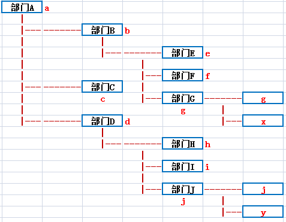

# 产品知识点总结

## 项目相关路径

http://localhost:8080/all.version

km/review

ui：http://localhost:8080/sys/ui/

修改配置文件：http://localhost:8080/ekp/admin.do

## eclipse启动步骤

- 启动：kmssconfig.properties、sys\common\hebernate、tomcat\server.xml、bulidpath、搜索fac

- tomcat参数：-Xms256m -Xmx2048m -XX:MetaspaceSize=128M -XX:MaxMetaspaceSize=512M -Xmn128M -Djava.awt.headless=true -Djava.net.preferIPv4Stack=true

## 配置文件

spring.xml：bean注册

springmvc.xml：dispatcher分发路径映射

hibernate.xml：hibernate-mapping路径

design-xml/portlet.xml：门户

design.xml：权限，定时任务

plugin.xml：流程监听事件,机器人扩展事件

## doc文件缓存位置

C:\Users\zouzhao\AppData\Roaming\WebOffice2015

## webservice

- 编写webservice接口，实现ISysWebservice接口，并用@WebService标识
- 编写实现类注册到spring容器中
- 在plugin.xml中配置

~~~html
<soapenv:Envelope xmlns:soapenv="http://schemas.xmlsoap.org/soap/envelope/" xmlns:web="http://webservice.review.km.kmss.landray.com/">
   <soapenv:Header>
        <ns1:RequestSOAPHeader soapenv:actor="http://schemas.xmlsoap.org/soap/actor/next" soapenv:mustUnderstand="0"
                               xmlns:ns1="http://webservice.review.km.kmss.landray.com/">
            <tns:user xmlns:tns="http://webservice.review.km.kmss.landray.com/">root</tns:user>
            <tns:password xmlns:tns="http://webservice.review.km.kmss.landray.com/">63a9f0ea7bb98050796b649e85481845</tns:password>
        </ns1:RequestSOAPHeader>
   </soapenv:Header>
   <soapenv:Body>
      <web:testDao/>
   </soapenv:Body>
</soapenv:Envelope>
~~~

## 定时任务

- 编写定时任务service
- 注册到spring容器
- 在design.xml中配置

## 校验框架

- 前端`<input>` 在validate里面定义，`<xform>`在validators里面定义
- xform的isLoadDataDict默认是开启的，data-dict目录下配置相关数字字典

## 匿名访问

- 整个模块的匿名访问
  - 在sys/authencation/spring.xml中filterInvocationDefinitionSource的anonymousPaths下放路径
  - 在design.xml里面模块的defaultValidator为true，`<request>`以及`<filters>`去掉，一定要把filters删掉，因为首页查询信息会默认校验可阅读者权限
  
- 某个模块表的匿名访问
  - anonymousPaths添加路径，例如/example/news/example_news_main/exampleNewsMain*
  - design.xml对应匿名访问表的`<request>`的校验都设为true
  
- 某个模块表中某个方法的匿名访问
  - design.xml中将对应模块的模块权限校验设置为true，然后再将对应表的模块表权限校验设置为true，然后找到对应的方法，将方法的权限校验设置为true

- 移动端是过修改third/pda/util/PdaFlagUtil.java中的CONST_PDASORUCE常量数组参数来实现匿名访问

  

## 权限校验器与过滤器

### 权限校验器

校验器表达式：校验器名(参数1=值1,参数2=值2,...)或true或false
通用的参数可以在request中的validatorParameter中指定，在调用校验器的时候不需要重复指定
运算符：|或运算；&与运算；[]调整运算优先级
样例：
roleValidator(role=ROLE_YWGTESTMAIN_ADD)&amp;authSimpleCategoryReaderValidator(cateId=docCategoryId)

**角色校验器**：校验当前用户是否有拥有某个角色
roleValidator(role)

**状态值校验器**：校验状态域是否与指定的值匹配
fieldValueValidator(field,value)
说明：采用request.getParameter(field)的方式来获取到状态值，再跟value进行校验，value可设置多种取值情况，用;进行分隔
fieldValueValidator(recid,model,fieldproperty,value)
说明：采用request.getParameter(recid)的方式来获取业务域模型，然后根据fieldproperty获取到状态值，再跟value进行校验，value可设置多种取值情况，用;进行分隔

**过滤器校验器**：校验当前用户对某条记录是否有权限
authFieldValidator(type,recid,model)
说明：type参数指filter的type值，见下面数据过滤filter

**validator的查找顺序**：query.validator → request.defaultValidator → module.defaultValidator。即若在query找不到校验器，则到request中找，若在request也找不到，则到module中找，若连module中也找不到，默认为所有登录用户都可以访问。
    

### 数据过滤filter

过滤器表达式：过滤器名(参数1=值1,参数2=值2,...)
跟校验器不一样，过滤器不可使用逻辑运算，多个过滤器之间是使用或运算

**角色过滤器**：若当前用户拥有某个角色时，不进行数据过滤
roleFilter(role)

**授权域过滤器**：若当前用户在某记录给定的域中，则该记录不进行过滤
authFieldFilter(field)
说明：
field：必选，记录的属性名，多值用;分隔

根据不同的角色，设置不同的权限域过滤器：
authFieldFilter(role_0,field_0,role_1,field_1,...,field)
说明：
若当前用户拥有role_n的角色时，选择field_n的参数;若当前用户不拥有所有设置的角色，则选择field的参数

若您配置了model.extendClass的属性，域模型的过滤器（filter）将是该域模型和父类域模型的过滤器的并集。

- 过滤器（filter）的类型（type）中，可以采用标准的类型（SYS_READER：读者，SYS_EDITOR：作者），也可以自定义（自定义的类型请勿使用SYS_前缀）。

- 在配置拦截的时候调用过滤器：您可以调用校验器“authFieldValidator(type,recid,model)”拦截被过滤掉的数据，其中type参数就是filter中type的值。

- 在查询数据的时候调用过滤器：
  - 您需要在查询的时候调用findPage(HQLInfo)/findList(HQLInfo)/findValue(HQLInfo)的方法实现数据过滤的功能，并在构造HQLInfo的时候，调用setAuthCheckType指定过滤类型。
  - 注意：若您没有采用BaseDaoImp提供的方法进行数据查询，数据过滤的功能将不起作用
  - findValue/findList默认不进行数据过滤，findPage默认进行SYS_READER（读者）的权限过滤。

## 门户portlet

- 在design-xml下配置portlet.xml文件

- 创建一个java类，实现IXMLDataBean接口，编写getDataList，获取相关数据

- 将这个类注入到Spring中

- 在后台管理中，配置门户系统

  

## 流程监听事件

- 编写流程监听事件listener，实现IEventListener
- 将listener类注册到spring容器中
- 在plugin.xml注册listener

## 流程中的文档状态doc_status（SysDocConstant）

| **字段名称**           | **值列表**            | **备注**                                                     |
| ---------------------- | --------------------- | ------------------------------------------------------------ |
| doc_status（文档状态） | 00 废弃；             | 如果同等状态下有多种形式的，请修改第二位的编码，如发布状态下也会有已反馈等，可将其置为31。 |
|                        | 10 草稿；             |                                                              |
|                        | 11 驳回；             |                                                              |
|                        | 20 待审；             |                                                              |
|                        | 30 发布；             |                                                              |
|                        | 40 过期（该状态可选） |                                                              |

## 通用岗位与角色线

- 通用岗位解决流程中上下级部门之间的领导关系
- 角色线解决流程中不是上下级部门之间的领导关系

  

## maven清除未下载成功命令

for /r %i in (*.lastUpdated) do del %i

## 数据源连接

~~~java
DataSet ds = new DataSet("sql");
String sql = "select id_project from sys_project";
ResultSet rs = ds.executeQuery(sql);
while(rs.next()){
     String str = rs.getString("id_project");     
}
rs.close();
ds.close();
~~~

## git模版

~~~markdown
提交人：
项目：
模块：
描述：

feat: #001 框架搭建完成
~~~

## admin  加密解密

DESEncrypt.java

# 绝味食品工作总结

> 项目介绍：将tib第三方集成SAP服务器更换，更新相关函数接口和映射，更新流程中对函数的映射
>
> 项目时间：2022.12.1——2022.12.10

## TIB集成配置流程

- 1、配置SAP服务器

​	

- 2、配置JCO连接池

​	

- 3、配置相关函数

- 4、表单中数据来源选择SAP，配置传出传入参数引用函数

- 5、机器人结点配置相关函数
- 6、配置相关映射

## SAP定时任务

在 tib页面定时任务的映射关系中配置BAPI和本地数据库表名以及字段映射

## 表单管理（流程引擎）

- 1、在流程引擎的表单管理中配置好sql语句

- 2、数据来源选择主数据-扩展数据，配置传出传入参数

## 流程驳回指定结点/废弃 -> 发送报文

- 1、配置函数映射，事件监听触发的函数将字段值发送
- 2、给指定结点添加事件监听
  - 事件类型

    - 处理人驳回事件

    - 处理人废弃事件
- 3、`驳回/废弃` 给流程状态字段赋值（代码）

~~~javascript
<xform:viewShow>//只在查看页面生效

</xform:viewShow>
~~~

## 流程驳回后，重新提交的流程，OA流程中申请人等信息缺失

在流程表单中添加jsp代码片段

~~~java
<xform:viewShow>
<%@ page import="com.landray.kmss.km.review.model.KmReviewMain" %>
<%@ page import="com.landray.kmss.sys.organization.model.SysOrgPerson" %>
<%@ page import="com.landray.kmss.km.review.service.IKmReviewMainService" %>
<%@ page import="com.landray.kmss.util.SpringBeanUtil" %>
<%@ page import="com.landray.kmss.sys.metadata.model.ExtendDataModelInfo" %>
<%@ page import="com.landray.kmss.sys.organization.model.SysOrgElement" %>
<%@ page import="java.util.*" %>
<%
    String fdId = request.getParameter("fdId");
    try {
        IKmReviewMainService kmReviewMainService = (IKmReviewMainService) SpringBeanUtil.getBean("kmReviewMainService");
        KmReviewMain kmReviewMain = (KmReviewMain) kmReviewMainService.findByPrimaryKey(fdId);
        // 通过kmReviewMain获取流程创建人
        SysOrgPerson docCreator = kmReviewMain.getDocCreator();
        //获取页面表单信息
        ExtendDataModelInfo extendDataModelInfo = kmReviewMain.getExtendDataModelInfo();
        Map<String, Object> modelData = extendDataModelInfo.getModelData();
        Boolean flag = false;
        //申请人、部门、电话、邮箱字段内容为空就放值
        if (modelData.get("fd_34820fa03e4c2c") == null) {
            Map<String, String> mapCreator = new HashMap();
            mapCreator.put("id", docCreator.getFdId());
            mapCreator.put("name", docCreator.getFdName());
            modelData.put("fd_34820fa03e4c2c", mapCreator);
            flag = true;
        }
        if (modelData.get("ZSQRDH") == null) {
            modelData.put("ZSQRDH", docCreator.getFdMobileNo());
            flag = true;
        }
        if (modelData.get("ZSQRYX") == null) {
            modelData.put("ZSQRYX", docCreator.getFdEmail());
            flag = true;
        }
        if (modelData.get("fd_34820fb1e16dc4") == null) {
            Map<String, String> mapParent = new HashMap();
            SysOrgElement fdParent = docCreator.getFdParent();
            mapParent.put("id", fdParent.getFdId());
            mapParent.put("name", fdParent.getFdName());
            modelData.put("fd_34820fb1e16dc4",mapParent);
            flag = true;
        }
        if (flag) {
	kmReviewMainService.update(kmReviewMain);
	}

    } catch (Exception e) {
        e.printStackTrace();
    }
%>

</xform:viewShow>
~~~

## 免密登陆页面

将index_sys.jsp（该文件在绝味文件夹里）放入到resource目录下，项目路径/resource/index_sys.jsp?loginName=登陆账号
