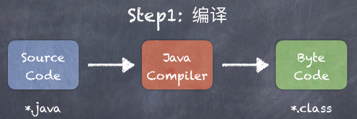
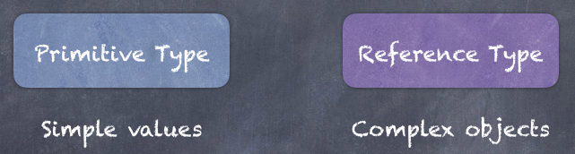

# Java Part1 - 语法基础

## 1. 入门

### 1.1 简介

- Java 是 James Gosling 在1995年创建的，属于 sun 公司，与2010年被 Oracle 公司收购
- 为了创建不同类型的应用程序，Java有若干个不同的版本：Java Standard Edition / Java Enterprise Edition / Java Macro Edition / Java Card
- Java 在全球有约900万用户，30亿以上移动设备使用 Java
- Java 的平均月薪在中国为 15 K左右

### 1.2 搭建开发环境

Java Development Kit / JDK ： [https://www.oracle.com/java/technologies/javase-downloads.html](https://www.oracle.com/java/technologies/javase-downloads.html)

IntelliJ IDEA：[https://www.jetbrains.com/idea/download/](https://www.jetbrains.com/idea/download/)

### 1.3 Java程序基本结构

#### 1.3.1 函数

函数（或方法）是 Java 程序中最小的语法结构，它是一段实现某个目的、执行某个任务的代码块。

函数的基本语法：

```java
ReturnType Name() {
  //...
}
```

每一个 Java 程序都至需要一个函数，`main` 函数是 Java 程序的入口函数，当我们执行一个 Java 程序，会首先调用 `main` 函数。

#### 1.3.2 类

在Java程序中，所有的函数都不会单独出现，它们都属于某一个 `class` ，所以 `class` 是相关函数的容器，大部分时候，我们用 `class` 来管理代码。

```java
public class Hello {
  
  void main() {
    //...
  }
  
}
```

在某些语言，例如 Python 中，函数可以定义在类的外面，因此我们称之为函数（ function ），但在 Java 中，函数只能定义在类中，对于在类的内部定义的函数，我们有时候又称之为类的方法（ method ）。

#### 1.3.3 修饰符

在 Java 程序中，所有的类与方法都需要一个访问修饰符，它是一个特别的关键字，表示被修饰的类或者方法，可以怎样被外部的类或方法访问。这样的访问修饰符有 `public` 、 `private` 等。

```java
public class Hello {
  
  public void main() {
    //...
  }
  
}
```

> 常用命名规范1：帕斯卡命名法

每一个单词的首写字母都是大写，例如 `PascalNamingConvention`

> 常用命名规范2：驼峰命名法

每一个单词的首写字母都是大写，除开第一个单词，例如 `camelNamingConvention`

### 1.4 快速上手

首先创建第一个 Java 项目，项目是我们管理 Java 程序的基本单位，有时候叫工程。

在项目中，使用 `package` 来对多个类进行管理，作用有点类似于操作系统中的文件夹。

> 项目的包名称一般是公司域名的反写，例如 com.baidu

创建 `package` 是用来管理命名空间的一种基本方式，主要用来避免命名冲突。

```java
package com.thinkaboutai;

public class Main {

    public static void main(String[] args) {
        // write your code here
        System.out.println("Hello Java");
    }
    
}
```

其中， `static` 是静态修饰符，`main` 方法必须被它修饰。

### 1.5 Java程序运行机制

#### 1.5.1 编译



Java Compiler 即是我们在安装 JDK 的时候，自带的编译工具，我们可以使用 javac 来进行调用：

```bash
javac Main.java
```

#### 1.5.2 运行

编译产生的 Java 字节码，是和操作系统无关的，我们可以在任意操作系统运行，前提是这个系统安装了 Java 运行环境（ JRE ，`Java Runtime Environment`），JRE 中有一个组件叫 Java 虚拟机（ JVM ，`Java Virtual Machine` ），会将 Java 字节码转换为当前操作系统的原生代码，而这个原生代码是可以被当前操作系统理解并直接执行的代码。


> JVM 正是 Java程序无需安装、跨平台的原因，这是 Java 程序最大的特点之一。

可以通过如下指令来执行字节码：

```shell
java com.thinkaboutai.Main
```

## 2. 数据类型

### 2.1 变量与常量

我们可以使用变量来在内存中临时保存数据。

```java
// 数据类型 变量名;
// 数据类型 变量名 = 值;

// 一行声明多个变量（不建议）
// 数据类型 变量名1,变量名2...;
public static void main(String[] args) {
  int age = 40;
  int anotherAge = age;
  System.out.println(age);
  System.out.println(anotherAge);
}
```

> 变量的命名规则需遵循驼峰命名法

常量，即不能修改的变量，需使用 `final` 进行修饰

```java
final String SLOGAN = "Think about AI";
```

### 2.2. 数据类型



#### 2.2.1 值类型数据

| Type    | Bytes | Range         |
| ------- | ----- | ------------- |
| byte    | 1     | [ -128, 127 ] |
| short   | 2     | [ -32k, 32k ] |
| int     | 4     | [ -2b, 2b ]   |
| long    | 8     |               |
| float   | 4     |               |
| double  | 8     |               |
| char    | 2     | a, b, c...... |
| boolean | 1     | true / false  |

 ```java
    public static void main(String[] args) {
        byte age = 40;
        int score = 95;
        long views = 3_000_000_000L;
        float price = 10.45F;
        char c = 'A';
        boolean flag = true;
    }
 ```


#### 2.2.2 引用类型数据

在 Java 中，除开值类型以外的数据类型，都是引用类型数据，用来存储一些较为复杂的数据，例如对象。

```java
    public static void main(String[] args) {
        Date now = new Date();
        System.out.println(now);
        System.out.println(now.getTime());
    }
```

> 区别

1. 值类型在传递的时候，拷贝的是值：

```java
    public static void main(String[] args) {
        int x = 1;
        int y = x;
        x = 2;
        System.out.println(y);
    }
```


每一个变量的值都是独立存储的，因此，修改一个变量的时候，不会影响其它的变量。

2. 引用类型在传递的时候，拷贝的是对象引用的地址：

```java
    public static void main(String[] args) {
        Point p1 = new Point(0, 1);
        Point p2 = p1;
        p1.x = 1;
        System.out.println(p2);
    }
```


当两个变量的值存储的是同一个对象的引用的时候，通过一个变量修改这个对象的值，会影响到引用这个对象的其它变量。

### 2.3 String

字符串就是字符的序列，我们除开可以使用 `new` 来进行实例化以外，还可以使用字符串字面量（ `Literal` ）来进行创建。

```java
String msg = "Hello";
msg = msg + "Java";

// 常用的方法
// startsWith endsWith
// length
// indexOf
// replace
// toLowerCase toUpperCase
// trim
// 
```

> 注意：由于字符串是不可变（ immutable ）对象，因此其方法不会修改原有字符串，都是通过返回值（如有）的方式返回修改以后的字符串

转义字符，用来表示或者转换一些特殊的字符串：

```java
// 使用"\"来转换一些特殊字符
String s = "Hello \"Java";

//其它转义字符
s = "Hello \nJava";
s = "Hello \tJava";
```

### 2.4 Array

我们可以使用数组来保存一系列的列表项

```java
int[] arr = new int[3];
arr[0] = 1;
arr[2] = 2;
System.out.println(Arrays.toString(arr));
```

可以通过下标来访问数组的每一个元素，也可以对其进行赋值。`Arrays` 是 `JDK` 提供的一个用于操作数组的工具类，里面包含了很多常用的数组方法。


还可以使用字面量来对数组直接进行初始化：

```java
int[] arr = {1, 3, 2};
Arrays.sort(arr);
```

### 2.5 表达式

### 2.6 类型转换

#### 2.6.1 隐式转换

Implicit casting，当我们有一个值，需要转换成存储空间更大的类型，转换会自动完成。

```java
short a = 1;
int b = a + 2;
```

隐式转换不会发生数据丢失，是无损转换。

#### 2.6.2 显示转换

Explicit casting，当可以转换的数据类型之间，发生转换成存储空间更小的类型，即为显式转换，显式转换会发生数据丢失。

```java
double x = 1.5;
int y = (int)x + 2;
```

> 显式和隐式转换都只能用于可互相转换的类型之间，例如数字类型之间的互相转换，但字符串不可以转换为数字。

#### 2.6.3 包装类

所有的数字类型都有相应的包装类，提供了方法把字符串转换成对应的数字类型

```java
String s = "1.5";
int num = Integer.parseInt(s) + 2;
```

### 2.7 Math

```java
// round
// ceil floor
// max min
// random
```

### 2.8 数字格式化

```java
// 货币金额
NumberFormat format = NumberFormat.getCurrencyInstance();
String res = format.format(12345.678);

// 百分比
format = NumberFormat.getPercentInstance();
format.setMinimumFractionDigits(2);
res = format.format(.12345);
```

### 2.9 Scanner

```java
Scanner scanner = new Scanner(System.in);
System.out.print("Name:");
String s = scanner.nextLine().trim();
System.out.println("Your name is " + s);
```

### 2.10 Project 贷款计算器

需求：输入贷款金额、贷款年利率、贷款时长（年），输出月还款金额。
$$
M = P[i(1+i)^n]/[(1+i)^n -1]
$$
M：月还款金额

P：总贷款金额

i：月利率

n：总还款月份


参考：

```java
final byte MONTHS_IN_YEAR = 12;
final byte PERCENT = 100;
Scanner scanner = new Scanner(System.in);

System.out.print("Principal:");
int principal = scanner.nextInt();

System.out.print("Rate:");
float rate = scanner.nextFloat();
float monthlyRate = rate / PERCENT / MONTHS_IN_YEAR;

System.out.print("Period(Years):");
byte years = scanner.nextByte();
int numOfPayments = years * MONTHS_IN_YEAR;

double temp = Math.pow(1 + monthlyRate, numOfPayments);
double mortgage = principal * monthlyRate * temp / (temp - 1);

String formatted = NumberFormat.getCurrencyInstance().format(mortgage);
System.out.println("Mortgage:" + formatted);
```

## 3. 流程控制

### 3.1 比较运算符

顾名思义，是用来比较两个值的，表达式将得到一个布尔值。

```java
// == !=
// < <=
// > >=
```

### 3.2 逻辑操作符

逻辑操作符可以用来组合多个布尔值或布尔表达式

```java
// && 逻辑与 表示两者同时满足
// || 逻辑或 表示两者满足其一即可
// ! 取反
int age = 35;
boolean isMiddle = age >= 20 && age <=50;
```


### 3.3 条件判断

条件判断可以构建基于某些因素来作出决策的程序。

#### 3.3.1 if-else

```java
// 温度高于 30 度，热天
// 温度介于 20 ～ 30 之间，好天气
// 否则 冷天
```

> 简化版条件判断

```java
boolean flag = false;
if(condition)
  flag = true;

boolean flag = (condition);
```

#### 3.3.2 三元表达式

```java
// 语法格式

(条件表达式) ? value1 : value2
```

三元表达式在大部分时候，可以替代 `if-else` 的语法结构

#### 3.3.3 switch

```java
switch(变量) {
  case 值1:
    // code 
    break;
  case 值2:
    // code 
    break;
  //...
  default:
    //code
}
```

#### 3.3.4 练习

```java
// 输入一个数字
// 输出：
// 如可以被 5 整除，输出 fizz
// 如可以被 3 整除，输出 buzz
// 如可以同时被 3 和 5 整除，输出fizzBuzz
// 其余情况，输出原始数字本身
```

### 3.4 循环

当需要重复执行某些任务的时候，可以使用循环语法结构。

#### 3.4.1 for

```java
for (int i = 0; i < 5; i++) {
  //code ...
}
```

`for`循环最大的特点在于语法结构中自带一个循环变量用来控制循环的次数。

#### 3.4.2 while

当不知道确切的循环次数时，可以使用`while`循环。

```java
while (循环条件) {
  //code ...
}
```

> 练习：当用户输入quit的时候，程序退出，而当用户输入其它字符串的时候，在控制台重复输出用户输入的内容。

#### 3.4.3 do-while

`do-while`非常类似`while`，但至少执行一次。

```java
do {
  //code ...
} while (循环条件)
```

#### 3.4.4 break & continue

`break`用来跳出当前循环结构，`continue`用来忽略当前循环单元剩余的逻辑，而继续下一次循环单元。

#### 3.4.5 for-each

与`for`比较而言，`for-each`无法获取到循环变量，但是书写更简洁。

> 练习：Project 贷款计算器

需求：输入贷款金额、贷款年利率、贷款时长（年），输出月还款金额。当用户的输入不满足下述条件时，给出相应的提示，并要求用户重新输入：

- 贷款金额：1,000 ～ 1,000,000
- 贷款年利率：1 ～ 5
- 贷款时长：1 ～ 30

$$
M = P[i(1+i)^n]/[(1+i)^n -1]
$$

- P：贷款金额
- i：月利率
- n：总还款月份

```java
final byte MONTHS_IN_YEAR = 12;
final byte PERCENT = 100;
Scanner scanner = new Scanner(System.in);

int principal = 0;
float monthlyRate = 0;
int numOfPayments = 0;

while (true) {
	System.out.print("Principal:");
	principal = scanner.nextInt();
  if (principal >= 1000 && principal <= 1_000_000)
    break;
  System.out.println("贷款金额必须在1000到10万之间。");
}

while (true) {
  System.out.print("Rate:");
  float rate = scanner.nextFloat();
  if (rate >= 1 && rate <= 5) {
  	monthlyRate = rate / PERCENT / MONTHS_IN_YEAR;
    break;
  }
  System.out.println("贷款年利率必须在1到5之间。");
}

while (true) {
  System.out.print("Period(Years):");
  byte years = scanner.nextByte();
  if (years >= 1 && years <= 30) {
  	numOfPayments = years * MONTHS_IN_YEAR;
    break;
  }
  System.out.println("贷款时长必须在1到30之间。");
}

double temp = Math.pow(1 + monthlyRate, numOfPayments);
double mortgage = principal * monthlyRate * temp / (temp - 1);

String formatted = NumberFormat.getCurrencyInstance().format(mortgage);
System.out.println("Mortgage:" + formatted);
```

## 4. 代码重构

当我们的项目代码量越来越大的时候，如果按照之前的方式记流水账的话，整个项目就会像一个无序、凌乱的房间。

为了解决这个问题，我们会将所有代码分割成不同的“块”，这些小的不同的代码模块将会变得更清洁和更容易阅读，并且，在将来，我们可以更容易的重用其中的某些代码模块。这即是编程中经常用到的模块化编程思想。使用这种思想编写的代码更容易维护，也更容易扩展。

在重构代码之前，首先我们要学会如何定义方法。

### 4.1 方法

一个健康的方法，代码应该在5 ～10行之间，最多也不应超过20行。

```java
// 方法修饰符 返回类型 方法名(参数列表){
		//方法逻辑
//}
```

示例：

```java
public class Main {

    public static void main(String[] args) {
        greeting("Jack");
    }
  
    public static void greeting(String name) {
        System.out.println("Hello " + name);
    }

}
```

有返回值的方法：

```java
public class Main {

    public static void main(String[] args) {
        String msg = greeting("Michael", "Jordan");
        System.out.println(msg);
    }

    public static String greeting(String firstName, String lastName) {
        return "Hello " + firstName + " " + lastName;
    }

}
```

### 4.2 Refactor

Refactor：重构，在编程中指的是改变代码的结构，而不改变代码的行为或结果。

在重构的时候，我们着重思考如下两个问题：

- 哪些代码表达的概念是一致的，且高度关联的（这些代码总是或者必须在一起才能完成某项工作）。
- 代码中的“重复模式”

针对问题1，我们可以抽取月还款金额逻辑为单独的一个方法：

```java
public static double calculateMortgage(int principal, float rate, byte years) {
  float monthlyRate = rate / PERCENT / MONTHS_IN_YEAR;
  float numOfPayments = years * MONTHS_IN_YEAR;
  double temp = Math.pow(1 + monthlyRate, numOfPayments);
  return principal * monthlyRate * temp / (temp - 1);
}
```

针对问题2，我们可以抽取获取输入数字的方法：

```java
public static double readNumber(String prompt, double min, double max) {
  Scanner scanner = new Scanner(System.in);
  double value;
  while (true) {
    System.out.print(prompt);
    value = scanner.nextDouble();
    if (value >= min && value <= max)
      break;
    System.out.println("输入的数字必须在" + min + "到" + max + "之间。");
  }
  return value;
}
```

重构后的主方法：

```java
final static byte MONTHS_IN_YEAR = 12;
final static byte PERCENT = 100;

public static void main(String[] args) {
  int principal = (int) readNumber("Principal:", 1000, 1_000_000);
  float rate = (float) readNumber("Rate:", 1, 5);
  byte years = (byte) readNumber("Period(Years):", 1, 30);

  double mortgage = calculateMortgage(principal, rate, years);

  String formatted = NumberFormat.getCurrencyInstance().format(mortgage);
  System.out.println("Mortgage:" + formatted);
}
```

> 扩展练习：在上述计算月还款金额的基础上，输出每月应还款金额后，再追加输出每月剩余的还款金额

$$
B = L[(1+c)^n-(1+c)^p]/[(1+c)^n -1]
$$

- L - 总贷款金额
- c - 月利率
- n - 总还款月份
- p - 已还款月份

示例：

```java
public static double calculateBalance(int principal, float rate, byte years, int numberOfPaymentsMade) {
  float monthlyRate = rate / PERCENT / MONTHS_IN_YEAR;
  float numberOfPayments = years * MONTHS_IN_YEAR;

  double temp1 = Math.pow(1 + monthlyRate, numberOfPayments);
  double temp2 = Math.pow(1 + monthlyRate, numberOfPaymentsMade);
  return principal * (temp1 - temp2) / (temp1 - 1);
}
```

main

```java
public static void main(String[] args) {
  int principal = (int) readNumber("Principal:", 1000, 1_000_000);
  float rate = (float) readNumber("Rate:", 1, 5);
  byte years = (byte) readNumber("Period(Years):", 1, 30);

  System.out.println();
  System.out.println("MORTGAGE");
  System.out.println("--------");
  double mortgage = calculateMortgage(principal, rate, years);
  String formatted = NumberFormat.getCurrencyInstance().format(mortgage);
  System.out.println("Mortgage:" + formatted);

  System.out.println();
  System.out.println("BALANCE");
  System.out.println("-------");
  for (int month = 1; month <= years * 12; month++) {
    double balance = calculateBalance(principal, rate, years, month);
    System.out.println(NumberFormat.getCurrencyInstance().format(balance));
  }
}
```

上述main方法可以继续优化吗？

## 5. 调试与部署

### 5.1 错误类型

- 编译时错误：即语法错误。

  ```java
  // 定义变量忘记声明类型
  // 每行末尾没有添加分号断句
  // 调用方法没有小括号
  // 使用字符串没有用双引号，或使用单引号定义字符串常量
  // 拼写错误
  // 在定义变量的时候使用了关键字或保留字
  // 条件判断时使用“=”来判断是否相等
  ```

- 运行时错误：运行时才发生的错误

  ```java
  // google & baidu
  // debugger
  // >> step over
  // >> step into
  // >> step out
  // >> resume
  // >> Frames
  
  
  public class Main {
  
      public static void main(String[] args) {
          System.out.println("Start"); // break point
          printNumbers(4);
          System.out.println("Finish");
      }
  
      private static void printNumbers(int num) {
          for (int i = 0; i < num; i += 2)
              System.out.println(i);
      }
  
  }
  ```

### 5.2 部署

1. 创建`artifacts`：File -> Project Structure - > Artifacts

2. `Build Artifacts`

3. 运行

   ```shell
   java -jar Xxx.jar
   ```

   

