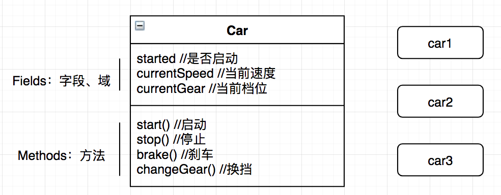
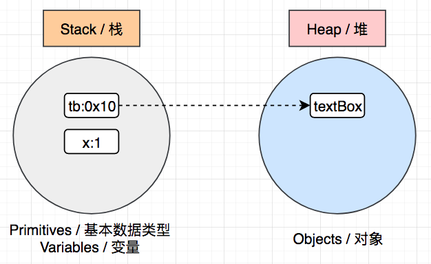
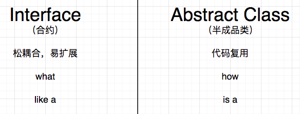

# Java Part2 - OOP

## 1. 简介

在计算机科学中，有许多编程范式（编程风格、编程模型）：函数式编程、面向对象编程、事件驱动编程、面向切面编程等等。其中以`函数式编程`和`面向对象编程`最为流行。

在面向对象编程中，所有的一切都是基于对象的概念，这些对象单元包含了如下一些要素：

- Data（State）：数据、状态
- Methods（Behavior）：用来操作数据的方法，即行为

> 在函数式编程中，数据和方法是互相独立的

OOP的好处：

- 降低程序复杂度（把一个大程序拆分成不同的小对象）
- 易于维护（在面向过程编程中，程序最后会演变成一大堆方法的各种组织形式）
- 利于代码重用
- 更快速的开发过程

## 2. Class

### 2.1 类与对象

- class：blueprint（蓝图），是用来创建对象的模版、图纸
- object：是类的某个实例（instance）



> 描述以下class：TV、文本输入框

创建类

```java
public class TextBox {

    public String text;

    public void setText(String text){
        this.text = text;
    }

    public void clear(){
        text = "";
    }

}
```

创建对象

```java
public class Main {

    public static void main(String[] args) {
//        TextBox tb1 = new TextBox();
      // 类型推断
        var tb1 = new TextBox();
        tb1.setText("abcd");
        System.out.println(tb1.text);

        var tb2 = new TextBox();
        tb2.setText("xyz");
        System.out.println(tb2.text);
    }

}
```

### 2.2 内存分配

```java
// 基本数据类型
var x = 1;
var tb = new TextBox();
```

`Java`通过内存来存储和管理数据，并将其划分为两个区域：



- 基本数据类型：存储在栈这个区域

- 引用数据类型：首先计算赋值表达式的右值，也即是对象，将其保存在堆这个区域，并且得到一个内存地址（引用，例如0x10），然后将这个内存地址通过一个变量，也即赋值表达式的左值（例如tb），保存在栈这个区域。tb这个变量通过内存地址引用了保存在内存堆中的一个对象，这就是我们为什么称之为引用类型数据的原因。

```java
var tb1 = new TextBox();
tb1.setText("Hello");
// tb1和tb2都指向内存中的同一个对象
var tb2 = tb1;
System.out.println(tb2.text); // Hello
```

> `Java`不同于 `C/C++`，它不需要通过编码释放内存，当我们执行完一个代码块，其中保存在栈区域的变量都会被移除掉。同时，后台还会有一个进程（`Garbage Collection`，简称`GC`，即垃圾回收器），随时监控堆区域，如果堆区域的对象没有被引用，那么它们也会在某个时间点被自动释放掉。

### 2.3 面向过程编程

计算员工工资：

```java
public class Main {

    public static void main(String[] args) {
        int baseSalary = 10_000;
        int extraHours = 10;
        int hourlyRate = 20;
        int wage = calculateWage(baseSalary, extraHours, hourlyRate);
        System.out.println(wage);
    }

    private static int calculateWage(int baseSalary, int extraHours, int hourlyRate) {
        return baseSalary + extraHours * hourlyRate;
    }

}
```

上述代码有哪些问题？

> 方法链的复杂度问题

### 2.4 封装（OOP 原则1）

封装，即把数据和操作数据的方法，打包到一个单元或者对象中。

```java
public class Employee {

    public int baseSalary;
    public int hourlyRate;

    public int calculateWage(int extraHours) {
        return baseSalary + extraHours * hourlyRate;
    }

}
```

减肥后的`Main`

```java
public class Main {

    public static void main(String[] args) {
        var emp1 = new Employee();
        emp1.baseSalary = 10_000;
        emp1.hourlyRate = 20;
        int wage = emp1.calculateWage(10);
        System.out.println(wage);
    }

}
```

### 2.5 Getters & Setters

通过以上手段封装的类，仍然存在以下几个问题需要解决：

- 无法限制用户的`read/write`
- 对用户输入的数据，需要在类的外部单独编写逻辑

为了解决上述问题，我们可以给类的属性配备`Getters & Setters`

```java
public class Employee {

    private int baseSalary;
    private int hourlyRate;

    public int getBaseSalary() {
        return baseSalary;
    }

    public void setBaseSalary(int baseSalary) {
        this.baseSalary = baseSalary;
    }

    public int getHourlyRate() {
        return hourlyRate;
    }

    public void setHourlyRate(int hourlyRate) {
        this.hourlyRate = hourlyRate;
    }

    public int calculateWage(int extraHours) {
        return baseSalary + extraHours * hourlyRate;
    }

}
```

相应的操作方式为：

```java
public static void main(String[] args) {
  var emp1 = new Employee();
  emp1.setBaseSalary(10_000);
  emp1.setHourlyRate(20);
  int wage = emp1.calculateWage(10);
  System.out.println(wage);
}
```


在需要校验的地方添加对应逻辑：

```java
public void setBaseSalary(int baseSalary) {
  if (baseSalary < 0) {
    throw new IllegalArgumentException("不能为负数");
  }
  this.baseSalary = baseSalary;
}
```

### 2.6 抽象（OOP原则2）

抽象，即通过隐藏不必要的细节，来降低复杂度（降低外部调用的复杂度）。

例如：TV的遥控器上有很多按钮来对设备进行相关的操作（换台、调节音量等），我们只需要通过相应的按钮来进行操作，而无需关心具体的实现细节。

因此，抽象就是把一些实现的细节隐藏在类中，而是通过一些接口和方法来对它进行操作即可。

```java
public int calculateWage(int extraHours) {
  return baseSalary + extraHours * hourlyRate;
}
```

对于计算员工的薪酬，在使用`Employee`时，我们无需知道具体的计算公式，只需传递相应的参数和初始化相关状态来调用对应的方法来获取结果即可。

### 2.7 耦合度

在面向对象编程中，耦合度，通俗来说即是不同的类之间的关联度。

例如：你非常依赖手机，日常生活中经常用手机来进行电话、刷抖音、购物，以及其它社交活动，当把手机从你身边拿走的时候，你将会变得非常不适应。在这种场景下，就可以说你和手机之间的耦合度非常高。

如果我们在`A`类中使用了`B`类，那么我们就可以说这两个类之间是有关联的，`A`依赖于`B`。

在面向对象编程中，类和类之间总是有关联的，如果修改一个类，那么相应的使用它的其它类也需要相应的做出调整，为了降低修改带来的影响，在`OOP`中，我们的目标之一就是要尽量在类与类之间解藕，也即是降低类之间的关联度。

`Employee`和`Main`在哪些地方体现了耦合度呢？

在`OOP`编程中，使用多个类协作来完成一个任务，类与类之间总会多少存在一定的耦合度，零耦合度的类是几乎不存在的。一个类对外公布的接口或者方法越多，耦合点也就可能越多，因此我们应该尽可能对外少公布这些内容，而把实现的细节隐藏在类当中。

```java 
public class Browser {

    public void navigate(String address){
        String ip = findIpAddress(address);
        String html = sendHttpRequest(ip);
        System.out.println(html);
    }

    private String sendHttpRequest(String ip) {
        return "<html>...</html>";
    }

    private String findIpAddress(String address) {
        return "127.0.0.1";
    }

}
```

Main

```java
public static void main(String[] args) {
  var browser = new Browser();
  browser.navigate("www.baidu.com");
}
```

从上述案例中，我们可以总结出以下几个特点：

- 只有`navigate`方法声明为公共的（`public`），其它方法都是私有的（`private`），因此外部只能访问这个公共的方法，其它具体的执行细节外部无需知道，也不应访问。
- 当私有的方法中，执行细节发生改变时，例如参数发生变化，在入口类的调用不会受到任何影响。
- `Browser`这个封装好的类，对外的耦合点仅有`navigate`这个声明为公共的方法。

### 2.8 构造器

在之前的计算员工薪酬的案例中，我们考虑如下一种特殊的情况：

```java
public static void main(String[] args) {
  var emp1 = new Employee();
  //emp1.setBaseSalary(10_000);
  //emp1.setHourlyRate(20);
  int wage = emp1.calculateWage(10);
  System.out.println(wage);
}
```

如果在使用的时候，忘记对两个属性进行相关的初始化，那么程序运行将会出现错误。

> 我们不能寄希望于用户，或者调用该程序的一方，按我们假定的正确流程来使用程序或者调用代码

我们应该尽量让接口变得简单明了，具体如何实现呢？在类的初始化这一方面，可以使用`constructor`（构造器）。

```java
var emp = new Employee();
```

构造器是一个类中的特殊方法，是用来构造和创建一个新对象的。在上述代码中，我们并没有创建`Employee()`这个方法，是`JVM`在运行时为我们自动创建的一个无参构造器（又称为默认构造器）。由于没有参数，所以类中的属性在初始化时将会设置为默认值：

- 数字初始化为`0`
- 布尔类型初始化为`false`
- 引用类型初始化为`null`

我们可以定义有参构造器来对属性进行初始化：

```java
// 方式1
public Employee(int baseSalary, int hourlyRate) {
  this.baseSalary = baseSalary;
  this.hourlyRate = hourlyRate;
}

// 方式2
public Employee(int baseSalary, int hourlyRate) {
  setBaseSalary(baseSalary);
  setHourlyRate(hourlyRate);
}
```


> 基于抽象的原则，2个`Setter`可以声明为`private`，以此来降低耦合度。

构造器具备如下特点：

- 方法名与类名完全一致
- 方法没有显式的返回值
- 一旦定义了有参构造器，`JVM`将不会创建无参构造器（默认构造器）

### 2.9 方法重载

`Method Overloading`，即创建不同实现逻辑、不同参数的同名方法，体现为“方法名一致，而参数不一致”

```java
public int calculateWage(int extraHours) {
  return baseSalary + extraHours * hourlyRate;
}

public int calculateWage() {
  // return baseSalary;
  return calculateWage(0);
}
```

由于构造器本身也是一个特殊的方法，因此也有重载构在器的语法：

```java
public Employee(int baseSalary, int hourlyRate) {
  setBaseSalary(baseSalary);
  setHourlyRate(hourlyRate);
}

public Employee(int baseSalary) {
  // setBaseSalary(baseSalary);
  // setHourlyRate(0);
  this(baseSalary, 0);
}
```

`this`用来指代当前对象，加一对括号即可以调用当前类的构造器方法。

### 2.10 静态成员

在`OOP`中，一个类可以有两种类型的成员：

- 实例成员
- 静态成员

例如在`Employee`这个类中，我们可以通过一个变量来反应所有员工的数量：

```java
public static int numberOfEmployees;

public Employee(int baseSalary, int hourlyRate) {
  setBaseSalary(baseSalary);
  setHourlyRate(hourlyRate);
  numberOfEmployees++;
}
```

Main

```java
public static void main(String[] args) {
  var e1 = new Employee(10_000);
  System.out.println(Employee.numberOfEmployees);
}
```

当这个属性独立与这个类的所有对象时，我们就可以使用静态属性的方式来定义它，静态属性可以被这个类的所有实例共享，可以直接使用`类名.属性名`进行访问。

同样，也可以定义静态方法：

```java
public static void printNumberOfEmployees(){
  System.out.println(numberOfEmployees);
}
// Employee.printNumberOfEmployees();
```

在静态方法中，只能访问静态成员，而不能访问实例成员（因为它们是属于某个对象实例的）。


> Q1：如何理解类和对象

【下定义】类是关于一系列相似对象的概括描述，描述它们共有的状态、行为，通过这种共性的定义，我们可以重构出许许多多类似的对象。

而对象，即是根据上述类的定义，“克隆”产生的相关实例，这些实例往往在某些属性或行为上是类似但有细节不同的，比如都有姓名，但具体的名字不同。

【组成】类大体包含两种要素，我们统称为成员：

- 成员变量：体现为属性、状态、数据
- 成员方法：体现为函数或方法，或者做某件事情的能力

【关系】类与对象之间的关系：当我们依照类A创建了a1实例的时候，我们可以说 a1 is a member of A

> Q2:如何理解封装和抽象

封装（动词），既可以用于封装类型，也可以用于封装方法。

在封装类型的时候，即是把这个类型的2要素（成员变量和方法）包装到一个单元（class 文件）里面

在封装方法的时候，即是把专注做“某件事情”（执行某一个特定算法）的代码段用方法体包含起来

在封装的时候，要用“抽象”这种思维能力，做到关注主要的（所有实例共有的），忽略次要的（特别的，只有某些特殊实例才具备的）。

抽象还体现在，当我们使用一个类型的实例的时候，在调用其方法时，只需要关注有哪些入参，可以得到什么返回，而无需关注内部的具体实现方式或细节


> 综合练习：用OOP的方式实现学员管理系统

1. 进入系统的时候，显示菜单项

   ```shell
   # 1 显示学员列表信息
   # 2 录入学员信息
   # 3	修改学员信息
   # 4 删除学员信息
   # 0 退出系统
   ```

2. 在系统中根据不同菜单的要求，实现学员信息的列表展示、学员详细信息的查看、根据id展示学员信息、录入学员信息、根据id删除某位学员信息

3. 进入一级菜单项之后，要求二级菜单的设计能满足基本功能实现，可自行合理化设计，流程的设计做到基本人性化，基本满足常规要求即可

   ```shell
   # 例如 当用户选择2 录入学员信息 的时候，逐项提示用户输入学员各个属性值，在后台进行保存，当单个学员信息录入完毕后，按照惯例显示学员列表信息（也可通过展示菜单询问用户是否继续录入）
   ```

   

## 3. 重构 - 房贷计算器

在`Java Part1`中的房贷计算，是基于面向过程的方式编写的，具有如下特点：

- 所有的逻辑集中在`Main`中
- 方法调用方法，且互相之间的关联度较低。

在接下来的章节中，我们将使用`OOP`的方式来对其进行重构。

```java
package com.thinkaboutai;

import java.text.NumberFormat;
import java.util.Scanner;

public class Main {

    final static byte MONTHS_IN_YEAR = 12;
    final static byte PERCENT = 100;

    public static void main(String[] args) {
        int principal = (int) readNumber("Principal:", 1000, 1_000_000);
        float rate = (float) readNumber("Rate:", 1, 5);
        byte years = (byte) readNumber("Period(Years):", 1, 30);

        printMortgage(principal, rate, years);

        printPaymentSchedule(principal, rate, years);
    }

    private static void printMortgage(int principal, float rate, byte years) {
        double mortgage = calculateMortgage(principal, rate, years);
        String formatted = NumberFormat.getCurrencyInstance().format(mortgage);
        System.out.println();
        System.out.println("MORTGAGE");
        System.out.println("--------");
        System.out.println("Mortgage:" + formatted);
    }

    private static void printPaymentSchedule(int principal, float rate, byte years) {
        System.out.println();
        System.out.println("Payment Schedule");
        System.out.println("-------");
        for (int month = 1; month <= years * MONTHS_IN_YEAR; month++) {
            double balance = calculateBalance(principal, rate, years, month);
            System.out.println(NumberFormat.getCurrencyInstance().format(balance));
        }
    }

    public static double readNumber(String prompt, double min, double max) {
        Scanner scanner = new Scanner(System.in);
        double value;
        while (true) {
            System.out.print(prompt);
            value = scanner.nextFloat();
            if (value >= min && value <= max)
                break;
            System.out.println("输入的数字必须在" + min + "到" + max + "之间。");
        }
        return value;
    }

    public static double calculateMortgage(int principal, float rate, byte years) {
        float monthlyRate = rate / PERCENT / MONTHS_IN_YEAR;
        float numOfPayments = years * MONTHS_IN_YEAR;
        double temp = Math.pow(1 + monthlyRate, numOfPayments);
        return principal * monthlyRate * temp / (temp - 1);
    }

    public static double calculateBalance(int principal, float rate, byte years, int numberOfPaymentsMade) {
        float monthlyRate = rate / PERCENT / MONTHS_IN_YEAR;
        float numberOfPayments = years * MONTHS_IN_YEAR;

        double temp1 = Math.pow(1 + monthlyRate, numberOfPayments);
        double temp2 = Math.pow(1 + monthlyRate, numberOfPaymentsMade);
        return principal * (temp1 - temp2) / (temp1 - 1);
    }

}

```


### 3.1 封装class

首要解决的问题是，我们应该封装哪些类？要回答这个问题，我们应该考虑到的是，在这个问题中，涉及到的哪些内容或者责任。

例如：在一个餐厅中，有不同的角色组合在一起来提供各种不同的服务，每个人都有相应的岗位和职责，比如厨师、服务员和收银员等。这些人或者服务都可以说是对象。

为此，我们应该封装出一些类描述这些对象，每个类都应该担当`单一和独立的责任`。依据这些特定的责任，我们可以尝试归纳出以下类：

- Console：负责从控制台读取输入
- MortgageReport：负责生成带有格式的报表
- MortgageCalculator：负责计算房贷相关算法

### 3.2 Console

```java
public class Console {

    private static Scanner scanner = new Scanner(System.in);

    public static double readNumber(String prompt) {
        return scanner.nextDouble();
    }

    public static double readNumber(String prompt, double min, double max) {
        double value;
        while (true) {
            System.out.print(prompt);
            value = scanner.nextDouble();
            if (value >= min && value <= max)
                break;
            System.out.println("输入的数字必须在" + min + "到" + max + "之间。");
        }
        return value;
    }

}
```

### 3.3 MortgageReport

```java
public class MortgageReport {
    public static void printMortgage(int principal, float rate, byte years) {
        double mortgage = MortgageCalculator.calculateMortgage(principal, rate, years);
        String formatted = NumberFormat.getCurrencyInstance().format(mortgage);
        System.out.println();
        System.out.println("MORTGAGE");
        System.out.println("--------");
        System.out.println("Mortgage:" + formatted);
    }

    public static void printPaymentSchedule(int principal, float rate, byte years) {
        System.out.println();
        System.out.println("Payment Schedule");
        System.out.println("-------");
        for (int month = 1; month <= years * Main.MONTHS_IN_YEAR; month++) {
            double balance = MortgageCalculator.calculateBalance(principal, rate, years, month);
            System.out.println(NumberFormat.getCurrencyInstance().format(balance));
        }
    }
}
```

### 3.4 MortgageCalculator

```java
public class MortgageCalculator {

    private int principal;
    private float rate;
    private byte years;

    public MortgageCalculator(int principal, float rate, byte years) {
        this.principal = principal;
        this.rate = rate;
        this.years = years;
    }

    public double calculateMortgage() {
        float monthlyRate = rate / Main.PERCENT / Main.MONTHS_IN_YEAR;
        float numOfPayments = years * Main.MONTHS_IN_YEAR;
        double temp = Math.pow(1 + monthlyRate, numOfPayments);
        return principal * monthlyRate * temp / (temp - 1);
    }

    public double calculateBalance(int numberOfPaymentsMade) {
        float monthlyRate = rate / Main.PERCENT / Main.MONTHS_IN_YEAR;
        float numberOfPayments = years * Main.MONTHS_IN_YEAR;

        double temp1 = Math.pow(1 + monthlyRate, numberOfPayments);
        double temp2 = Math.pow(1 + monthlyRate, numberOfPaymentsMade);
        return principal * (temp1 - temp2) / (temp1 - 1);
    }
}
```

### 3.5 去静态化

由于`MortgageCalculator`的方法为实例方法，因此，`MortgageReport`需要作出相应调整：

```java
public class MortgageReport {

    private MortgageCalculator calculator;

    public MortgageReport(MortgageCalculator calculator) {
        this.calculator = calculator;
    }

    public void printPaymentSchedule() {
        System.out.println();
        System.out.println("Payment Schedule");
        System.out.println("-------");
        for (int month = 1; month <= calculator.getYears() * Main.MONTHS_IN_YEAR; month++) {
            double balance = calculator.calculateBalance(month);
            System.out.println(NumberFormat.getCurrencyInstance().format(balance));
        }
    }

    public void printMortgage() {
        double mortgage = calculator.calculateMortgage();
        String formatted = NumberFormat.getCurrencyInstance().format(mortgage);
        System.out.println();
        System.out.println("MORTGAGE");
        System.out.println("--------");
        System.out.println("Mortgage:" + formatted);
    }
}
```

### 3.6 Main

```java
public class Main {

    public static void main(String[] args) {
        int principal = (int) Console.readNumber("Principal:", 1000, 1_000_000);
        float rate = (float) Console.readNumber("Rate:", 1, 5);
        byte years = (byte) Console.readNumber("Period(Years):", 1, 30);

        var calculator = new MortgageCalculator(principal, rate, years);

        var report = new MortgageReport(calculator);
        report.printMortgage();
        report.printPaymentSchedule();
    }

}
```

### 3.7 去除重复逻辑

```java
public class MortgageCalculator {

    final static byte MONTHS_IN_YEAR = 12;
    final static byte PERCENT = 100;

    private int principal;
    private float rate;
    private byte years;

    public MortgageCalculator(int principal, float rate, byte years) {
        this.principal = principal;
        this.rate = rate;
        this.years = years;
    }

    public double calculateMortgage() {
        float monthlyRate = getMonthlyRate();
        float numOfPayments = getNumOfPayments();
        double temp = Math.pow(1 + monthlyRate, numOfPayments);
        return principal * monthlyRate * temp / (temp - 1);
    }

    public double calculateBalance(int numberOfPaymentsMade) {
        float monthlyRate = getMonthlyRate();
        float numberOfPayments = getNumOfPayments();

        double temp1 = Math.pow(1 + monthlyRate, numberOfPayments);
        double temp2 = Math.pow(1 + monthlyRate, numberOfPaymentsMade);
        return principal * (temp1 - temp2) / (temp1 - 1);
    }

    private int getNumOfPayments() {
        return years * MONTHS_IN_YEAR;
    }

    private float getMonthlyRate() {
        return rate / PERCENT / MONTHS_IN_YEAR;
    }

    public byte getYears() {
        return years;
    }

}
```

### 3.8 调整

在`MortgageReport`中，部分逻辑可以调整到`MortgageCalculator`中：

```java
public double[] getRemainingBalance(){
  double[] balances = new double[getNumOfPayments()];
  for (int month = 1; month <= balances.length; month++) 
    balances[month - 1] = calculateBalance(month);

  return balances;
}
```

```java
public void printPaymentSchedule() {
  System.out.println();
  System.out.println("Payment Schedule");
  System.out.println("-------");
  double[] balances = calculator.getRemainingBalance();
  for (double balance : balances) {
    System.out.println(NumberFormat.getCurrencyInstance().format(balance));
  }
}
```

最后，代码中有2处`NumberFormat.getCurrencyInstance()`，我们可以将其变成属性，然后在构造器中进行初始化。

```java
private final NumberFormat currencyInstance;
private MortgageCalculator calculator;

public MortgageReport(MortgageCalculator calculator) {
  this.calculator = calculator;
  currencyInstance = NumberFormat.getCurrencyInstance();
}
```

## 4. 继承（OOP 原则3）

### 4.1 简介

在我们使用`class`来定义对象的时候，我们经常会发现很多对象之间又一些公共、基础的属性或行为，例如：

- 所有的UI控件（输入框、多选、单选、下拉框）都可以禁用，都有宽高
- 哺乳动物，都有身高、体重、血型等

我们在定义这些类的时候，并不想在所有的类中都定义重复的属性或者行为，那么就可以使用继承这种语法来重用代码。

我们可以把这些通用、公共的属性和行为定义在一个类中，这个类成为`父类（parent） / 基类（base） / 超类（super）`，然后在定义`子类（child/sub）`来继承它。

```java
public class UIControl {

    private boolean isEnabled = true;

    public void enable(){
        isEnabled = true;
    }

    public void disable(){
        isEnabled = false;
    }

    public boolean isEnabled() {
        return isEnabled;
    }

}

public class TextBox extends UIControl {

    private String text;

    public void setText(String text) {
        this.text = text;
    }

    public void clear() {
        text = "";
    }

}

public class Main {

    public static void main(String[] args) {
//        var control = new UIControl();
        var control = new TextBox();
        control.disable();
        System.out.println(control.isEnabled());
    }

}
```

### 4.2 Object

Java 中，所有的类都直接或间接的继承自`Object`。因此我们定义的类自然也从这个父类获得了如下方法：

- hashCode：得到一个整数值，它是基于内存地址运算出来的
- equals：用来比较两个对象是否相等。
- toString：对象的字符串表现形式

```java
public class Main {

    public static void main(String[] args) {
        var box1 = new TextBox();
        var box2 = box1;
        System.out.println(box1.hashCode());
        System.out.println(box2.hashCode());
        System.out.println(box1.equals(box2));
    }

}
```

### 4.3 构造器

在继承的语法中，构造器的使用有如下语法特点：

- 在创建子类实例的时候，首先调用父类构造器，然后调用子类构造器
- 当父类构造器有参数时，子类构造器必须显式（`explicitly`）调用父类这个有参构造器

### 4.4 访问修饰符

|           | 同包 | 子类 | 其它 |
| --------- | ---- | ---- | ---- |
| public    | Y    | Y    | Y    |
| private   | N    | N    | N    |
| protected | Y    | Y    | N    |
| default   | Y    | /    | N    |

### 4.5 方法重写

`Method Overriding`，当子类不满从父类继承的方法时，可以通过方法重写来改变其具体实现方式。

> 方法重载：同名不同参，即方法签名不一样，仅仅只是方法名相同
>
> 方法重写：同名同参，即方法签名一样

```java
public class TextBox extends UIControl {

    private String text;

    public void setText(String text) {
        this.text = text;
    }

    public void clear() {
        text = "";
    }

    @Override
    public String toString() {
        return "TextBox{" +
                "text='" + text + '\'' +
                '}';
    }
}
```

`@Override`，又称为注解，它会告诉编译器，来检查这个方法的签名是否符合方法重写的语法要求。

### 4.6 向上转型 & 向下转型

- UpCasting：向上转换成父类类型
- DownCasting：向下转换成子类类型

```java
public class Main {

    public static void main(String[] args) {
        var control = new UIControl(true);
        show(control);
        var box = new TextBox(true, "hello");
        show(box);
    }

    public static void show(UIControl control) {
        // control.setText(); //无法访问
        System.out.println(control);
    }

}
```

由于TextBox继承了父类的所有成员，因此我们可以说：`文本框是UI控件`，两者的关系可以用`is a`来描述：`A textbox is a uicontrol`。

这就是上例中box可以传参成功的原因，在此处，发生了`box`实例向上转型为`UIControl`类型的一个实例。

> 在`show`方法中，输出方法调用的是`TextBox`的`toString`方法，因为在运行时，这个实例仍然是一个`TextBox`的实例。

由于参数是`UIControl`类型，虽然传递的是一个`TextBox`实例，但无法编码访问`TextBox`自身的方法，如果需要访问的话，需要进行向下转型：

```java
    public static void show(UIControl control) {
        var box = (TextBox) control;
        box.setText("Hello world");
        System.out.println(control);
    }
```

但是如果我们向上述方法传递`control`这个实例时，程序运行就会报错，因为并非每一个`UIControl`都是`TextBox`，为了安全起见，可以进行如下检查：

```java
    public static void show(UIControl control) {
        if (control instanceof TextBox) {
            var box = (TextBox) control;
            box.setText("Hello world");
        }
        System.out.println(control);
    }
```

### 4.7 比较对象

```java
public class Point {
    
    private int x;
    private int y;

    public Point(int x, int y) {
        this.x = x;
        this.y = y;
    }
    
}

public class Main {

    public static void main(String[] args) {
        var p1 = new Point(1, 2);
        var p2 = new Point(1, 2);
        System.out.println(p1 == p2);
        System.out.println(p1.equals(p2));
    }

}
```

在上述案例中，由于`==`是根据引用的地址进行比较的，因此得到`false`，而`equals`在默认情况下，也是基于引用的地址进行比较，所以也得到`false`。

为了实现“两者只要坐标值相等，我们就认为两个实例相等”，可以通过以下方式来实现：

```java
    @Override
    public boolean equals(Object o) {
        if (this == o) return true;
        if (!(o instanceof Point)) return false;
        Point point = (Point) o;
        return x == point.x && y == point.y;
    }

    @Override
    public int hashCode() {
        return Objects.hash(x, y);
    }
```

### 4.8 多态（OOP 原则4）

多态，多种形态或形式，即允许一个对象有多种体现形式。

```java
public class Main {

    public static void main(String[] args) {
        UIControl[] controls = {new TextBox(), new CheckBox()};

        for (var control : controls) {
            control.render();
        }
    }

}

public class UIControl {

    private boolean isEnabled = true;

    public void enable() {
        isEnabled = true;
    }

    public void disable() {
        isEnabled = false;
    }

    public boolean isEnabled() {
        return isEnabled;
    }

    public void render() {
    }

}

public class TextBox extends UIControl {

    @Override
    public void render() {
        System.out.println("Render TextBox");
    }
}

public class CheckBox extends UIControl {

    @Override
    public void render() {
        System.out.println("Render CheckBox");
    }
}
```

### 4.9 抽象类与抽象方法

抽象类，是在我们不想或不能实例化这个类的实例的时候封装的。

例如上例中的`UIControl`:

```java
UIControl[] controls = {new UIControl(), new TextBox(), new CheckBox()};
```

在上面这行代码中，我们不希望实例化`UIControl`这个实例，因为UI控件这本身是一个抽象的概念，具体这个空间是什么样子，应该由某一个具体的子类来定义。

> 因此，抽象类存在的意义，是为了定义一些公共的成员（属性、方法）让子类来继承。起到代码复用的效果。

因此我们可以声明这个类为抽象类：

```java
public abstract class UIControl {

    //...

}
```

当一个类被声明为`abstract`时，这个类是不能使用`new`来创建一个实例的。

同时，我们还可以更进一步声明`render`为抽象方法：

```java
public abstract class UIControl {

    //...

    public abstract void render();

}
```

当一个类中存在抽象方法时，会强制要求所有子类来实现这个方法。（如果这个子类没有实现这些抽象方法，那么这个子类必须也是一个抽象类，不能被实例化）

### 4.10 final修饰符

如果`abstract`修饰一个类，是为了让子类来继承，那么相对的，`final`修饰一个类，表示它是一个最终版，不能被继承。

在`JDK`中有一个典型的例子，就是`String`。在Java中，字符串是不可变（immutable）对象，这意味着我们调用字符串的方法（toUpperCase、replace），或者通过拼串修改其值，得到的总是一个新的字符串实例，它的内存地址已经发生了改变。

将`String`修饰为`final`，是为了防止我们在继承的时候，重写它的方法，而打破上述`JDK`设定好的底层规则，导致程序发生意外。

相类似的，当某一个方法被修饰为`final`时，那么这个方法不能被子类重写。

### 4.11 多根继承

有些高级语言，允许一个子类可以有多个直接父类，但是`Java`设计之初衷，始终坚持为单根继承的语法体系，即一个子类，最多只能有一个直接父类。

## 5. 接口

### 5.1 什么是接口

`Interface`，接口是`Java`语法中最强大，也最为让人迷惑误解的一种语法，在加之从`Java 8`这个版本以来，接口的语法有了一些变化和更新，使得不少程序员对于接口经常使用不当。

> 接口在设计之初，是为了能编写出`松耦合`、`易扩展`、`可测试`的应用程序。

```java
//当在A类中，使用B类时，我们可以说，A依赖B，或者A与B有耦合

//当我们修改B类逻辑时，A类相应的也有很大可能要进行修改

//如果还有其它类依赖A的话，那么将会像多米诺骨牌一样，因为B的一处修改，整个依赖的生态链都会发生蝴蝶效应带来的修改

//即使是B类的修改，A类及其相关类无需修改任何逻辑也能正常运行，但是它们都需要被重新编译、重新部署，这都需要消耗系统资源和时间
```

针对以上场景，是否能有一种语法来降低类与类之间的耦合度，让其耦合度更松散一些（松耦合）呢？

就好比，小车的引擎坏了，只需要更换或者修理引擎就行了，而不需要动其它部件。

之前，我们学习过的`抽象`，即隐藏实现细节，只对外暴露必要的成员，使用`private`这样的修饰符，可以让`A`尽可能少的“认识”`B`，这样就能降低两者之间的耦合度。但这还不够，使用`interface`我们可以更进一步的来降低这种耦合度。

```java
public interface Draggable {
  void drag();
}
```

接口就像是一个类，但是里面一般只定义方法，而且这个方法没有任何实现细节。换句话说，接口只定义它应该做什么。


要解藕`AB`的话，我们只需要在之间定义一个`interface`，当`B`的具体逻辑修改时，`A`将不再会受到影响，因为`A`根本就不了解`B`是如何实现的。这就是所谓的`面向接口编程`。

- interface，主要用来定义应该做什么（what），例如数据压缩、加密解密、排序、查找
- class，主要用来定义具体怎么做（how）

### 5.2 高耦合度案例 - 个税计算

```java
public class TaxCalculator {

    private double income;

    public TaxCalculator(double income) {
        this.income = income;
    }

    public double calculatorTax() {
        return income * 0.3;
    }

}

public class TaxReport {

    private TaxCalculator calculator;

    public TaxReport() {
        calculator = new TaxCalculator(10_000);
    }

    public void show() {
        var tax = calculator.calculatorTax();
        System.out.println(tax);
    }
}
```

这个案例由于`TaxReport`使用了`TaxCalculator`，造成了后者依赖前者，因此存在如下几个问题：

- `TaxCalculator`的构造器或者方法的签名如果发生改变，那么将会导致另一方需要修改代码。
- 即使第一种情况没有发生，但是计算个税的逻辑如果发生了细微调整，那么也会导致使用它的类重新编译。

### 5.3 创建于实现接口

```java
public interface TaxCalculator {

    double calculateTax();
    
}
```

接口中的方法默认是`public`和`abstract`的。

重新修改`TaxCalculator`，使其实现这个接口：

```java
public class TaxCalculatorImpl implements TaxCalculator {

    private double income;

    public TaxCalculatorImpl(double income) {
        this.income = income;
    }

    @Override
    public double calculateTax() {
        return income * 0.3;
    }

}
```

在实现接口时，必须实现接口中定义的所有方法，且方法的签名保持一致。

> 关于接口，还需要我们了解的是，我们可以让一个类在继承一个父类的同时，根据程序的需要，实现一个或者更多个接口。

### 5.4 依赖注入

`Dependency Injection`，又简称`DI`，根据这一原则，我们的类不应该实例化它的依赖。

在`TaxReport`的构造器中，我们不应该自己实例化它的依赖，而只应该使用它，`DI`原则认为，实例化和使用是两件独立的事情，我们应该尽量分离两者。

例如：在餐厅中，厨师和服务员互相之间有依赖关系，但是服务员确定好客户的点膳后，需要厨师来制作膳食，他不应该自己去厨房制作，而只是把点膳的信息传递给厨师；反之，厨师做好膳食以后，需要把膳食递交给服务员，而不应该自己跑去大堂传膳。每个人的职责都是单一且专业的。

那么，在上述案例中，我们需要把实例化`TaxCalculator`的逻辑交给另一个类来完成，比如`Main`，然后传递这个实例给`TaxReport`使用。

> 这个传递依赖的具体实现（实例）给使用者的过程，就称之为依赖注入。

依赖注入有以下3种实现方式：

- 构造器注入
- Setter注入
- 方法注入

#### 5.4.1 构造器注入

```java
public class TaxReport {

    private TaxCalculator calculator;

    public TaxReport(TaxCalculator calculator) {
        this.calculator = calculator;
    }

    public void show() {
        var tax = calculator.calculateTax();
        System.out.println(tax);
    }
}

public class Main {

    public static void main(String[] args) {
        var calculator = new TaxCalculatorImpl(10_000);
        var report = new TaxReport(calculator);
        report.show();
    }
    
}
```

#### 5.4.2 Setter注入

```java
public class TaxReport {

    private TaxCalculator calculator;

    public void setCalculator(TaxCalculator calculator) {
        this.calculator = calculator;
    }

    public void show() {
        var tax = calculator.calculateTax();
        System.out.println(tax);
    }
  
}

public class Main {

    public static void main(String[] args) {
        var calculator = new TaxCalculatorImpl(10_000);
        var report = new TaxReport();
        report.setCalculator(calculator);
        report.show();
    }

}
```

#### 5.4.3 方法注入

```java
public class TaxReport {

    public void show(TaxCalculator calculator) {
        var tax = calculator.calculateTax();
        System.out.println(tax);
    }
  
}

public class Main {

    public static void main(String[] args) {
        var calculator = new TaxCalculatorImpl(10_000);
        var report = new TaxReport();
        report.show(calculator);
    }

}
```

### 5.5 接口隔离原则

将包含很多方法的大接口切割为多个包含少量且必要方法的小接口。

```java
public interface UIWidget {

    void drag();
    void resize();

}

public class Dragger {

    public void drag(UIWidget widget){
        widget.drag();
    }

}
```

当我们修改`resize`方法，例如给它增加参数，虽然`Dragger`没有使用这个方法，但也会导致这个类重新编译。

因此，在这种场景下，我们应该将`drag`方法单独封装到另一个接口去，使之与其它没有必要一起使用的方法隔离开来。

如果有一个场景，我们必须要同时使用两个方法，可以让相关接口形成继承关系来达到代码复用：

```java
public interface Draggable {
    void drag();
}

public interface UIWidget extends Draggable {
    void resize();
}
```

> 与类的单根继承不同，一个接口可以继承多个接口。

### 5.6 Project - MyTube

见项目资源文件夹 `Mytube.zip`

请定义相关接口并调整项目代码，降低`VideoProcessor`与其依赖的耦合度。

### 5.7 接口新语法

- 定义常量
- 静态方法
- 私有方法

### 5.8 接口与抽象类



### 5.9 面向接口编程的益处

- 灵活切换实现方式
- 是的程序更容易扩展，同时最小化扩展带来的负面影响
- 更容易进行独立的单元测试
