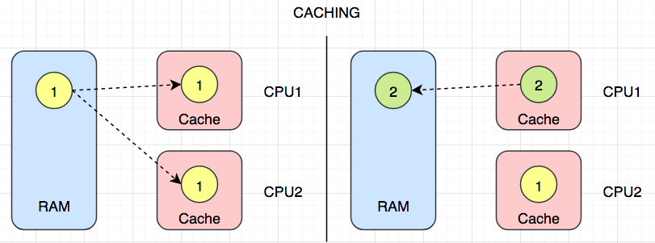

# Java Part3 - 高级程序设计

## 1. 异常

### 1.1 简介

Exception，异常，就是Java程序中的错误。

```java
public class ExceptionDemo {

    public static void show() {
        sayHello(null);
    }

    public static void sayHello(String name){
        System.out.println(name.toUpperCase());
    }

}

public class Main {

    public static void main(String[] args) {
        ExceptionDemo.show();
    }
}
```

> 异常，就是一个包含了错误信息的对象

在上例中，程序运行时抛出的这个异常，是`java.lang.NullPointerException`这个异常类型的一个实例，控制台的信息包含如下几个方面：

- 异常类型，简要说明（如有）
- 异常发生的具体地点：完整类名、方法名、代码行数

整个异常信息在控制台的输出，我们称之为异常的堆栈跟踪，因为它所显示的方法调用顺序（从下往上），对应到发生时间是刚好是相反的。（堆栈是一种数据结构，往这个结构中新增加的元素，从下至上挨个堆叠起来）

异常发生的细节：

1. 程序运行到第8行的时候，发生错误
2. Java运行环境会在此处寻找是否有处理错误的代码块（暂无），如果此处没有处理错误的代码块，程序则会`throw`（抛出）这个错误给调用方。
3. 如果调用方仍然没有处理错误的代码块，则会一致按照调用链向上追溯，直至追踪到程序的起点（`main`方法）
4. 如果最终都没有找到处理错误的代码块，则程序中断在第8行（也就是异常发生的地点）。

> 我们在编程的时候，应尽量避免异常，或是预测有可能发生的异常，并为之编写适当的处理逻辑

### 1.2 异常类型

#### 1.2.1 受检测异常

`Checked - Exception`，是指程序员“应该”要预测到的异常。

例如，我们编写程序读取一个本地文件，那么文件不存在就会发生异常。

`Java`编译器对于这种异常，强制要求程序员编写逻辑来进行处理。因为这种异常在编译期间就会被检测出来，所以称为受检测异常。

```java
public static void main(String[] args) {
  var reader = new FileReader("readme.md");
}
```

#### 1.2.2 不受检测异常（运行时异常）

`Unchecked - Exception`，也称为`Runtime Exception`，这类异常在编译期间不会被检测出来，只有在程序运行期间才会暴露。

空指针异常就属于典型的运行时异常，这类异常一般是由于程序逻辑不严谨造成的，我们应该从错误的源头来避免它发生。

具体如何避免？

- 反复多次测试
- 凭借良好的编程经验

常见的运行时异常：

```java
// NullPointerException 空指针异常
// IllegalArgumentException 非法参数异常
// IndexOutOfBoundsException 索引越界异常
```

#### 1.2.3 错误

`Error`，程序中出现的致命错误。

```java
// StackOverflowError 堆栈溢出错误
// OutOfMemoryError 内存溢出错误
```

对于这种错误，程序员在错误发生后，也很难挽救，只能在程序执行之前调整参数和逻辑，避免它发生。

### 1.3 异常家族

```java
|- Throwable
	|- Exception
  	|- RuntimeException
  |- Error
```

### 1.4 异常处理

```java
public class ExceptionDemo {

    public static void show() {
        try {
            var reader = new FileReader("readme.md");
            System.out.println("文件已经打开");
        } catch (FileNotFoundException e) {
            e.printStackTrace();
        }
        // System.out.println("文件已经打开");
    }
    
}
```

多异常处理：

```java
public static void show() {
  try {
    var reader = new FileReader("readme.md");
    reader.read();
    System.out.println("文件已经打开");
  } catch (FileNotFoundException e) {
    e.printStackTrace();
  } catch (IOException e) {
    e.printStackTrace();
  }
}
```

### 1.5 finally语句块

```java
public static void show() {
  FileReader reader = null;
  try {
    reader = new FileReader("readme.md");
    var value = reader.read();
    System.out.println("文件已经打开");
  } catch (IOException e) {
    e.printStackTrace();
  } finally {
    if (reader != null) {
      try {
        reader.close();
      } catch (IOException e) {
        e.printStackTrace();
      }
    }
  }
}
```

`finally`语句块无论是否发生异常，始终都会执行。

比上述更优雅的写法：

```java
public static void show() {
  // AutoCloseable
  try (var reader = new FileReader("readme.md")) {
    var value = reader.read();
  } catch (IOException e) {
    e.printStackTrace();
  }
}
```

### 1.6 抛出异常

抛出运行时异常：

我们可以自己设计逻辑，通过手工抛出异常来中断程序。

```java
public class Account {

    public void deposit(float value) {
        if (value <= 0)
            throw new IllegalArgumentException();
    }

}
```

手工抛出异常的这种方式，是一种防御型编程。通过设计逻辑，来防止程序发生较为严重的错误。这种场景，中断程序，比让错误造成严重影响更好。

抛出受检测异常：

```java
public class Account {

    public void deposit(float value) throws FileNotFoundException {
        var reader = new FileReader("xxx.md");
    }

}
```

在方法签名上抛出异常，意味着方法自己不处理，而交给调用方来处理。

> 调用方在调用“声明抛出异常”的方法时，将会收到“这个方法有可能产生异常”的警告，需要做进一步的异常处理。

### 1.7 自定义异常

```java
public class NotEnoughMoneyException extends Exception{

    public NotEnoughMoneyException() {
        super("钱不够");
    }

    public NotEnoughMoneyException(String message) {
        super(message);
    }
}

public class Account {

    private float balance;

    public void withdraw(float value) throws NotEnoughMoneyException {
        if(value > balance)
            throw new NotEnoughMoneyException();
    }

}
```

### 1.8 异常链

有时候我们希望把一些关于某类型错误的一系列具体的异常，封装为更普通的异常，以对他们进行统一处理，这时候就会产生异常链。

例如，账户异常包含余额不足异常、用户名密码错误、账户状态异常（账户锁死）等等：

```java
public class AccountException extends Exception{

    public AccountException(Throwable cause) {
        super(cause);
    }
}

public class Account {

    private float balance;

    public void withdraw(float value) throws AccountException {
        if(value > balance) {
            var e = new NotEnoughMoneyException();
            throw new AccountException(e);
        }
    }

}
```

在这个错误发生的时候，我们可以看到控制台输出的异常堆栈信息中，能清晰呈现什么样的原因（较为具体的异常）造成了什么样的错误（较为普通的异常）。这样，从错误的语义上会让输出的日志更为因果分明，方便程序员后期调试和排查错误。

## 2. 泛型

`Generics`，泛型，是 Java 中一个非常重要的概念，很多 Java 组件都是使用泛型进行封装的，因此掌握什么是泛型、为什么需要泛型，以及如何使用泛型是非常重要的。

### 2.1 Why

```java
public class List {

    private int[] items = new int[8];
    private int count;

    public void add(int item){
        items[count] = item;
    }

    public int get(int index) {
        return items[index];
    }

}

public class Main {

    public static void main(String[] args) {
        var list = new List();
        list.add(2);
    }
    
}
```

上述`List`只能用来存储多个整数，但是如果我们需要存储其它不同的类型（比如用户）呢？我需要封装跟多的`UserList`、`ProductList`等等。

因此这种方式的封装，显然是不太容易扩展，而且会大量出现重复的逻辑。

### 2.2 解决方案

方案1：我们可以把存储数据的类型改为`Object`，因为`Object`是所有引用类型的父类型

```java
public class List {

    private Object[] items = new Object[8];
    private int count;

    public void add(Object item){
        items[count] = item;
    }

    public Object get(int index) {
        return items[index];
    }

}

public class Main {

    public static void main(String[] args) {
        var list = new List();
        list.add(2);
        list.add("Hello");
        list.add(new User());
    }

}
```

但是上述方案不太好的原因在于，当我们需要从这个容器中获取元素时，需要进行类型转换：

```java
int num = (int) list.get(0);
```

上述获取值的时候有如下2点缺陷：

- 代码比较啰嗦
- 容易因为进行错误的类型转换而在运行时出错

方案2：使用泛型

```java
public class GenericList<T> {

    private T[] items = (T[]) new Object[8];
    private int count;
    
    public void add(T item){
        items[count++] = item;
    }
    
    public T get(int index){
        return items[index];
    }

}

public class Main {

    public static void main(String[] args) {
        var list = new GenericList<Integer>();
        list.add(2);
        var num = list.get(0);
    }

}
```

使用泛型后，我们能获得编译时的类型安全（在程序编译期即能检测出来类型是否合乎要求）：

- 在添加元素的时候，能确保只能添加指定类型的元素。
- 在获取元素时，也不再需要强制类型转换了。

### 2.3 装箱与拆箱

泛型参数只能使用引用类型，当我们需要操作基本类型时，需要使用基本类型的封装类型作为泛型参数。

- 装箱：在添加元素的时候，基本类型会自动转换成该类型的封装类
- 拆箱：而在获取的时候，封装类型会自动转换成该类型对应的基本类型

### 2.4 类型约束

```java
public class GenericList<T extends Number> {

    private T[] items = (T[]) new Object[8];
    private int count;

    public void add(T item){
        items[count++] = item;
    }

    public T get(int index){
        return items[index];
    }

}

public class GenericList<T extends Comparable> {

    private T[] items = (T[]) new Object[8];
    private int count;

    public void add(T item){
        items[count++] = item;
    }

    public T get(int index){
        return items[index];
    }

}
```

### 2.5 类型擦除

我们首先单独编译项目：`Build -> Build Project`

然后点击查看`GenericList`的字节码：`View -> Show Bytecode`

类型擦除即，当我们泛型参数时，`JVM`会对具体的类型进行擦除，取决于以下几个情况：

- 单一的泛型参数：类型替换成`Object`
- 单一的类型约束：类型替换成约束类型
- 有多个类型约束：替换成最左边的约束类型

泛型参数只是在编译期间用于对类型进行检测。

### 2.6 Comparable

```java
public class User implements Comparable<User>{

    private String name;
    private int age;

    public User(String name, int age) {
        this.name = name;
        this.age = age;
    }

    @Override
    public int compareTo(User o) {
//        if (age < o.age) return -1;
//        if (age == o.age) return 0;
//        return 1;
        return age - o.age;
    }
}

public class Main {

    public static void main(String[] args) {
        var u1 = new User("a",18);
        var u2 = new User("b",20);

        if (u1.compareTo(u2) < 0 )
            System.out.println("u1 < u2");
    }

}
```

### 2.7 泛型方法

我们还可以在单独的方法上使用泛型：

```java
public class Utils {

    public static <T extends Comparable> T max(T first, T second) {
        return first.compareTo(second) > 0 ? first : second;
    }

}

public class Main {

    public static void main(String[] args) {
        var max = Utils.max(1, 3);
        System.out.println(max);

        var u = Utils.max(new User("a", 18), new User("b", 20));
        System.out.println(u);
    }

}
```

### 2.8 多泛型参数

```java
public class KeyValuePair <K,V> {
    
    private K key;
    private V value;

    public KeyValuePair(K key, V value) {
        this.key = key;
        this.value = value;
    }
}
```

### 2.9 泛型通配符

```java
public class Instructor extends User{
    public Instructor(String name, int age) {
        super(name, age);
    }
}

public class Utils {

    public static <T extends Comparable> T max(T first, T second) {
        return first.compareTo(second) > 0 ? first : second;
    }

    public static void printUsers(GenericList<User> list){
        
    }

}

public class Main {

    public static void main(String[] args) {
        var instructors = new GenericList<Instructor>();
        Utils.printUsers(instructors); // 编译错误
    }

}
```

上述之所以会产生编译错误的原因在于：因为在使用泛型参数的时候，会存在类型擦除，封装了`instructor`的`GenericList`不是封装了`User`的`GenericList`的子类型。（程序中只有`GenericList`这样一个类型）

要解决这个问题，可以使用泛型通配符：

```java
public static void printUsers(GenericList<? extends User> list){
}
```


## 3. 集合框架

### 3.1 简介


绿色为接口，蓝色为实现类：

`Iterable`：可使用`for-each`进行迭代

`Collection`：常规的集合`CRUD`操作

### 3.2 Iterable

要使用增强版的`for`循环，即`for-each`，必须实现该接口：

```java
public class GenericList<T> implements Iterable<T> {

    private T[] items = (T[]) new Object[8];
    private int count;

    public void add(T item) {
        items[count++] = item;
    }

    public T get(int index) {
        return items[index];
    }

    @Override
    public Iterator<T> iterator() {
        return new ListIterator<>();
    }

    private class ListIterator<T> implements Iterator<T> {

        private int index;

        @Override
        public boolean hasNext() {
            return index < count;
        }

        @Override
        public T next() {
            return (T) items[index++];
        }
    }
}

public class Main {

    public static void main(String[] args) {
        var list = new GenericList<String>();
        list.add("a");
        list.add("b");

        var iterator = list.iterator();
//        while (iterator.hasNext()){
//            var current = iterator.next();
//            System.out.println(current);
//        }
        for (var item : list) {
            System.out.println(item);
        }
    }

}
```

### 3.3 Collection

`Collection`接口包含了操作一个集合的基本动作，即`CRUD`：

```java
public class CollectionsDemo {

    public static void show() {
        Collection<String> collection = new ArrayList<>();
        collection.add("a");
        collection.add("b");
        collection.add("c");
        Collections.addAll(collection, "x", "y", "z");

        for (var item : collection)
            System.out.println(item);

        var arr = collection.toArray(new String[0]);
        System.out.println(arr.length);
        collection.remove("c");
        System.out.println(collection);
        System.out.println(collection.contains("a"));
        collection.clear();
        System.out.println(collection);
        System.out.println(collection.isEmpty());


        Collection<String> other = new ArrayList<>();
        other.addAll(collection);
        System.out.println(collection == other);
        System.out.println(collection.equals(other));
    }

}
```

### 3.4 List

`List`，有序列表，插入的元素是按照放入的顺序排列的，可以根据索引进行访问。

```java
public class ListDemo {

    public static void show() {
        List<String> list = new ArrayList<>();
        list.add("a");
        list.add("b");
        list.add("c");
        list.add(0, "x");
        System.out.println(list.get(0));
        list.set(0, "!");
        System.out.println(list);
        list.remove(0);
        System.out.println(list);
        System.out.println(list.indexOf("c"));
        System.out.println(list.subList(0, 2));
    }

}
```

### 3.5 排序

方案1：使用`Comparable`

```java
public class SortDemo {
    public static void show(){
        List<Customer> list = new ArrayList<>();
        list.add(new Customer("b"));
        list.add(new Customer("c"));
        list.add(new Customer("a"));
        Collections.sort(list);
        System.out.println(list);
    }
}

public class Customer implements Comparable<Customer> {
    private String name;

    public Customer(String name) {
        this.name = name;
    }

    @Override
    public int compareTo(Customer o) {
        return name.compareTo(o.name);
    }

    @Override
    public String toString() {
        return "Customer{" +
                "name='" + name + '\'' +
                '}';
    }
}
```

上述方案不太灵活，主要由于负责比较的逻辑与`Customer`这个类绑定（耦合）在一起，一旦这个类封装好以后，如果比较规则改变（例如按照年龄进行比较），需要重新定义逻辑并且重新编译。

方案2：使用`Comparator`

```java
public class NameComparator implements Comparator<Customer> {
    @Override
    public int compare(Customer o1, Customer o2) {
        return o1.getName().compareTo(o2.getName());
    }
}

public class SortDemo {
    public static void show(){
        List<Customer> list = new ArrayList<>();
        list.add(new Customer("b"));
        list.add(new Customer("c"));
        list.add(new Customer("a"));
        Collections.sort(list, new NameComparator());
        System.out.println(list);
    }
}
```

该方案的好处在于，负责比较的逻辑与实体类的定义是分离的（解藕），我们可以很方便的添加多个负责比较的`Comparator`实现，而无需修改实体类的定义。

### 3.6 Queue

`Queue`，队列，遵循`FIFO`（First In First Out，先进先出原则），常用来处理多任务。

```java
public class QueueDemo {
    public static void show(){
        Queue<String> queue = new ArrayDeque<>();
        queue.add("a");
        queue.add("b");
        queue.offer("c");
        var front = queue.peek();// element()
        System.out.println(front);
        System.out.println(queue);
        front = queue.poll();// remove()
        System.out.println(front);
        System.out.println(queue);
    }
}
```

### 3.7 Set

`Set`，实现该接口的集合不允许有重复元素，且并不保证有序。

```java
public class SetDemo {
    public static void show(){
        Set<String> set = new HashSet<>();
        set.add("sky");
        set.add("is");
        set.add("blue");
        set.add("blue");
        System.out.println(set);

        Collection<String> collection = new ArrayList<>();
        Collections.addAll(collection,"a","b","b");
        set = new HashSet<>(collection);
        System.out.println(set);

        Set<String> s1 = new HashSet<>(Arrays.asList("a","b","c"));
        Set<String> s2 = new HashSet<>(Arrays.asList("b","c","d"));
//        //Union
//        s1.addAll(s2);
//        System.out.println(s1);
//        //Intersection
//        s1.retainAll(s2);
//        System.out.println(s1);
        //Difference
        s1.removeAll(s2);
        System.out.println(s1);
    }
}
```

### 3.8 Map

```java
public class MapDemo {
    public static void main(String[] args) {
        List<Customer> list = new ArrayList<>();
        //O(n) -> O(10)
        for(var customer : list){
            if(customer.getName().equals("xxx"))
                System.out.println("Find!");
        }
    }
}
```

在上述案例中，我们需要从一个集合中查询一个指定姓名的`Customer`对象，如果这个查询的复杂度记为`O(n)`，即如果集合的大小为10，那么耗费的时间为`O(10)`，可以理解为查询所耗费的时间是直接与集合的大小有关的一个结果。

> 上述分析，考虑的是最差的情况，也即是要查询的目标有可能是集合的最后一个元素。

```java
public class MapDemo {
    public static void main(String[] args) {
        var c1 = new Customer("a");
        var c2 = new Customer("b");

        Map<String, Customer> map = new HashMap<>();
        map.put(c1.getName(),c1);
        map.put(c2.getName(),c2);

        var c = map.get("a"); //getOrDefault()
        System.out.println(c);
        var exists = map.containsKey("a");
        System.out.println(exists);
        map.replace("a", new Customer("x"));
        System.out.println(map);

        for(var key : map.keySet()){
            System.out.println(key + ":" +map.get(key));
        }

        for(var entry : map.entrySet()){
            System.out.println(entry.getKey() + ":" + entry.getValue());
        }

        for(var customer : map.values()){
            System.out.println(customer);
        }
    }
}
```


## 4. Lambda表达式 & 函数接口

### 4.1 函数式接口

`Functional Interface`，即只有一个抽象方法的接口。例如`Comparator`、`Comparable`

```java
public interface Printer {
    void print(String msg);
}

public class ConsolePrinter implements Printer {
    @Override
    public void print(String msg) {
        System.out.println(msg);
    }
}

public class LambdasDemo {
    public static void main(String[] args) {
        greet(new ConsolePrinter());
    }

    public static void greet(Printer printer){
        printer.print("Hello world");
    }
}
```

### 4.2 匿名内部类

```java
public class LambdasDemo {
    public static void main(String[] args) {
        greet(new Printer() {
            @Override
            public void print(String msg) {
                System.out.println(msg);
            }
        });
    }

    public static void greet(Printer printer){
        printer.print("Hello world");
    }
}
```

### 4.3 Lambda表达式

`Java8`引进了一个代替上述的更简洁写法，称为`Lambda表达式`

```java
public class LambdasDemo {
    public static void main(String[] args) {
//        greet(msg -> {
//            System.out.println(msg);
//        });
        greet(msg -> System.out.println(msg));
        Printer printer = msg -> System.out.println(msg);
    }

    public static void greet(Printer printer) {
        printer.print("Hello world");
    }
}
```

### 4.4 方法引用

如果在`Lambda表达式`中，我们只是想使用一个方法，可以直接使用方法引用的语法：

```java
public class LambdasDemo {
    
    public LambdasDemo(String msg){
        System.out.println(msg);
    }

    public static void print(String msg){
        System.out.println(msg);
    }

    public void print1(String msg){
        System.out.println(msg);
    }

    public static void main(String[] args) {
        greet(System.out::println);
        greet(LambdasDemo::print);
        var demo = new LambdasDemo("");
        greet(demo::print1);
        greet(LambdasDemo::new);
    }

    public static void greet(Printer printer) {
        printer.print("Hello world");
    }
}
```

### 4.5 内置函数式接口

官方文档：[https://docs.oracle.com/javase/8/docs/api/java/util/function/package-summary.html](https://docs.oracle.com/javase/8/docs/api/java/util/function/package-summary.html)

#### 4.5.1 Consumer

该接口，只接收1个参数，但是没有返回值。

```java
public class ConsumerDemo {
    public static void main(String[] args) {
        List<Integer> list = List.of(1, 2, 3);
//        for (var item : list)
//            System.out.println(item);
        list.forEach(System.out::println);
    }
}
```

消费链：

```java
public class ConsumerDemo {
    public static void main(String[] args) {
        List<String> list = List.of("a", "b", "c");
        Consumer<String> print = item -> System.out.println(item);
        Consumer<String> printUpperCase = item -> System.out.println(item.toUpperCase());
        list.forEach(print.andThen(printUpperCase).andThen(print));
    }
}
```

#### 4.5.2 Supplier

和`Consumer`接口相对的，是`Supplier`接口，它没有参数，但是提供返回值

```java
public class SupplierDemo {
  //DoubleSupplier
    public static void main(String[] args) {
        Supplier<Double> supplier = Math::random;
        var value = supplier.get();
        System.out.println(value);
    }
}
```

#### 4.5.3 Function

```java
// Function<T,R> T-参数类型，R-返回值类型
public class FunctionDemo {
    public static void main(String[] args) {
        Function<String, Integer> fn = String::length;
        var len = fn.apply("Sky is blue");
        System.out.println(len);
    }
}
```

组合函数：

```java
public class FunctionDemo {
    public static void main(String[] args) {
        Function<String, String> fn1 = str -> str.replace(":", "=");
        Function<String, String> fn2 = str -> "{" + str + "}";
        var value = fn1.andThen(fn2).apply("a:b");
        System.out.println(value);
    }
}
```


#### 4.5.4 Predicate

`Predicate<T>`，断言，用来进行逻辑判断，返回布尔值

```java
public class PredicateDemo {
    public static void main(String[] args) {
        Predicate<String> pre = str -> str.length() > 5;
        var value = pre.test("Sky is blue");
        System.out.println(value);
    }
}
```

组合断言

```java
public class PredicateDemo {
    public static void main(String[] args) {
        Predicate<String> pre1 = str -> str.startsWith("{");
        Predicate<String> pre2 = str -> str.endsWith("}");
        var value = pre1.and(pre2).test("{hello}");
        System.out.println(value);
    }
}
```

#### 4.5.5 BinaryOperator

该函数接口主要用来做针对两个参数且有一个返回值的操作：

```java
public class BinaryOperatorDemo {
    public static void main(String[] args) {
        BinaryOperator<Integer> oper = (a, b) -> a + b;
        var value = oper.apply(3, 5);
        System.out.println(value);
    }
}
```

#### 4.5.6 UnaryOperator

该函数接口主要用来做针对一个参数且有一个返回值的操作：

```java
public class UnaryOperatorDemo {
    public static void main(String[] args) {
        UnaryOperator<Integer> op1 = n -> n+1;
        UnaryOperator<Integer> op2 = n -> n*n;
        var value = op1.andThen(op2).apply(2);
        System.out.println(value);
    }
}
```


## 5. Stream

### 5.1 命令式编程 vs 声明式编程

`Stream`主要是用来使用声明式编程来操作集合的，类似于在Java中写查询语句。

`Stream`尝试解决的问题：

```java
public class Movie {
    private String title;
    private int likes;

    public Movie(String title, int likes) {
        this.title = title;
        this.likes = likes;
    }

    public int getLikes() {
        return likes;
    }
}

public class ProblemDemo {
    public static void main(String[] args) {
        List<Movie> movies = List.of(
                new Movie("a", 10),
                new Movie("b", 15),
                new Movie("c", 20)
        );
        int count = 0;
        for (var movie : movies) {
            if (movie.getLikes() > 10)
                count++;
        }
        System.out.println(count);
    }
}
```

- `Imperative Programming`：命令式编程，用具体的指令告诉程序具体怎么做（`how`），在程序中，我们需要明确描述算法。
- `Declarative Programming`：声明式编程，与命令式编程相对立，它描述目标的性质，让程序明白目标，而非流程。（`what`）

使用`Stream`：

```java
public class ProblemDemo {
    public static void main(String[] args) {
        List<Movie> movies = List.of(
                new Movie("a", 10),
                new Movie("b", 15),
                new Movie("c", 20)
        );
        var count = movies.stream()
                .filter(m -> m.getLikes() > 10)
                .count();
        System.out.println(count);
    }
}
```

`movies.stream()`返回的是一个流对象，流，即是我们从集合中有序的获取对象的一种形式，它本身并不存储数据。

就好比我们用水管从水塔中获取水，水塔是具体的集合，它负责保存数据，而水管则是从水塔中获取水源的一种方式。

### 5.2 创建Stream

```java
public class StreamDemo {
    public static void main(String[] args) {
        var list = new ArrayList<Integer>();
        var stream1 = list.stream();

        int[] arr = {1, 2, 3};
        var stream2 = Arrays.stream(arr);
        stream2.forEach(System.out::println);

        var stream3 = Stream.of(1, 2, 3);
      
        var stream4 = Stream.generate(Math::random);
        stream4.limit(4).forEach(System.out::println);

        var stream5 = Stream.iterate(1, n -> n + 1);
        stream5.limit(5).forEach(System.out::println);
    }
}
```

### 5.3 Stream的基本操作

#### 5.3.1 map

转换`Stream`中的数据

```java
public class MapDemo {
    public static void main(String[] args) {
        List<Movie> movies = List.of(
                new Movie("a", 10),
                new Movie("b", 15),
                new Movie("c", 20)
        );
        movies.stream()
                .map(Movie::getTitle)
                .forEach(System.out::println);
    }
}
```

扁平化映射：

```java
public class MapDemo {
    public static void main(String[] args) {
        var stream = Stream.of(List.of(1, 2, 3), List.of(4, 5, 6));
        stream.flatMap(list -> list.stream())
                .forEach(System.out::println);
    }
}
```

#### 5.3.2 filter

旨在用来过滤合乎条件的数据，顾名思义

```java
public class FilterDemo {
    public static void main(String[] args) {
        List<Movie> movies = List.of(
                new Movie("a", 10),
                new Movie("b", 15),
                new Movie("c", 20)
        );
        movies.stream()
                .filter(movie -> movie.getLikes() > 10)
                .forEach(movie -> System.out.println(movie.getTitle()));
    }
}
```

#### 5.3.3 slice

```java
public class SliceDemo {
    public static void main(String[] args) {
        List<Movie> movies = List.of(
                new Movie("a", 10),
                new Movie("b", 15),
                new Movie("c", 20)
        );
        movies.stream()
//                .limit(2)
                .skip(2)
                .forEach(movie -> System.out.println(movie.getTitle()));
    }
}
```

> limit和skip组合使用，可以用来制作分页数据

```java
int pageNum = 3;
int pageSize = 10;
movies.stream()
  .skip((pageNum - 1) * pageSize)
  .limit(pageSize)
  .forEach(movie -> System.out.println(movie.getTitle()))
```

2个与`filter`非常类似的`API`

```java
public static void main(String[] args) {
  List<Movie> movies = List.of(
    new Movie("a", 10),
    new Movie("b", 15),
    new Movie("c", 20)
  );
  movies.stream()
    //.takeWhile(movie -> movie.getLikes() < 15)
    .dropWhile(movie -> movie.getLikes() < 15)
    .forEach(movie -> System.out.println(movie.getTitle()));
}
```

#### 5.3.4 sort

```java
public static void main(String[] args) {
  List<Movie> movies = List.of(
    new Movie("b", 10),
    new Movie("a", 15),
    new Movie("c", 20)
  );
  movies.stream()
    //                .sorted((a,b)->a.getTitle().compareTo(b.getTitle()))
    .sorted(Comparator.comparing(Movie::getTitle).reversed())
    .forEach(movie -> System.out.println(movie.getTitle()));
}
```

#### 5.3.5 其它

去重复

```java
public static void main(String[] args) {
  List<Movie> movies = List.of(
    new Movie("a", 10),
    new Movie("b", 15),
    new Movie("c", 20)
  );
  movies.stream()
    .map(Movie::getLikes)
    .distinct()
    .forEach(System.out::println);
}
```

调试

```java
public static void main(String[] args) {
  List<Movie> movies = List.of(
    new Movie("a", 10),
    new Movie("b", 15),
    new Movie("c", 20)
  );
  movies.stream()
    .filter(movie -> movie.getLikes() < 20)
    .peek(movie -> System.out.println("filter:" + movie.getTitle()))
    .map(Movie::getTitle)
    .peek(title -> System.out.println("map:" + title))
    .forEach(System.out::println);
}
```

### 5.4 从Stream获取答案

- count：获取流中数据的个数
- anyMatch / allMatch / noneMatch：至少有一个匹配 / 全部匹配 / 没有一个匹配 条件
- findFirst / findAny：找到第一个 / 找到任何一个
- max / min：找到最大者 / 最小者

使用`reduce()`统计：

```java
public static void main(String[] args) {
  List<Movie> movies = List.of(
    new Movie("a", 10),
    new Movie("b", 15),
    new Movie("c", 20)
  );
  var sum = movies.stream()
    .map(Movie::getLikes)
    .reduce((a, b) -> a + b);
  System.out.println(sum.orElse(0));
}
```

使用`collect()`收集数据

```java
public static void main(String[] args) {
  List<Movie> movies = List.of(
    new Movie("a", 10),
    new Movie("b", 15),
    new Movie("c", 20)
  );
  var result = movies.stream()
    .filter(movie -> movie.getLikes() < 20)
    //                .collect(Collectors.toList());
    .collect(Collectors.summarizingInt(Movie::getLikes));
  System.out.println(result);
}

public static void main(String[] args) {
  List<Movie> movies = List.of(
    new Movie("a", 10),
    new Movie("b", 15),
    new Movie("c", 20)
  );
  var result = movies.stream()
    .map(Movie::getTitle)
    .collect(Collectors.joining(","));
  System.out.println(result);
}
```

分组

```java
public enum Genre {
    Action,
    War
}

public class Movie {
    private String title;
    private int likes;
    private Genre genre;

    public Movie(String title, int likes, Genre genre) {
        this.title = title;
        this.likes = likes;
        this.genre = genre;
    }

    public Genre getGenre() {
        return genre;
    }

    public String getTitle() {
        return title;
    }


    public int getLikes() {
        return likes;
    }
}


```

```java
public static void main(String[] args) {
  List<Movie> movies = List.of(
    new Movie("a", 10, Genre.Action),
    new Movie("b", 15, Genre.Action),
    new Movie("c", 20, Genre.War)
  );
  var result = movies.stream()
    .collect(Collectors.groupingBy(Movie::getGenre));
}
```

分区操作

```java
public static void main(String[] args) {
  List<Movie> movies = List.of(
    new Movie("a", 10, Genre.Action),
    new Movie("b", 15, Genre.Action),
    new Movie("c", 20, Genre.War)
  );
  var result = movies.stream()
    .collect(Collectors.partitioningBy(movie -> movie.getLikes() > 15));
  System.out.println(result);
}
```

### 5.5 基本类型的Stream操作

```java
IntStream.rangeClosed(1, 5)
                .forEach(System.out::println);
```

## 6. 多线程

### 6.1 简介

现代计算机绝大部分都有多核处理器，使得程序可以并发的执行多个任务。在`Java`中，使用多线程编程，可以使得程序运行速度更快。

### 6.2 进程与线程

- `Process`：进程就是应用程序的一个实例。进程中包含了程序中所需要的所有数据以及相关其它资源，并且占用一定内存空间。操作系统在同一时间可以运行多个进程。（进程级别的并发）
- `Thread`：线程，从技术上来讲，就是由多个指令或操作形成的序列（线程名称的由来），或者说线程就是执行我们所写代码的“主体”。一个进程至少由一个主线程（`main thread`）组成，同时，我们还可以创建更多的线程执行其它的任务。（线程级别的并发）


```java
// 获取当前活跃线程数量
System.out.println(Thread.activeCount());
// 获取当前处理器数量
System.out.println(Runtime.getRuntime().availableProcessors());
```

### 6.3 线程基本操作

#### 6.3.1 创建与启动线程

```java
public class DownloadFileTask implements Runnable {
    @Override
    public void run() {
        System.out.println("Download:" + Thread.currentThread().getName());
    }
}

public class ThreadDemo {
    public static void main(String[] args) {
        System.out.println(Thread.currentThread().getName());
        for (int i = 0; i < 3; i++) {
            Thread t0 = new Thread(new DownloadFileTask());
            t0.start();
        }
    }
}
```

#### 6.3.2 暂停线程

```java
public class DownloadFileTask implements Runnable {
    @Override
    public void run() {
        System.out.println("Download:" + Thread.currentThread().getName());
        try {
            Thread.sleep(5000);
        } catch (InterruptedException e) {
            e.printStackTrace();
        }
        System.out.println("Download complete:" + Thread.currentThread().getName());
    }
}
```

- `sleep()`：当前线程进入“睡眠”，它将会挂起（暂停）当前线程，同时使得其它线程有机会使用CPU资源（`processor`）
- 睡眠时间只是“约等于” 5 秒，具体取决于当前操作系统。

> 如果创建的线程数量大于CPU的线程数，情况会如何呢？

在我们的操作系统中，有一个专门的`线程调度器`，它负责给每个线程分配`CPU时间片`，并且在每个线程间进行快速切换，使得每个线程有机会使用`processor`来进行运算，这就造就了“并发”的效果。

#### 6.3.3 join

等待加入

```java
public class ThreadDemo {
    public static void main(String[] args) {
        System.out.println(Thread.currentThread().getName());
        Thread t0 = new Thread(new DownloadFileTask());
        t0.start();
        try {
            t0.join();
        } catch (InterruptedException e) {
            e.printStackTrace();
        }
        System.out.println("下载完毕，可以开始扫描病毒");
    }
}
```

`join()`将会使得当前线程（`main thread`）进入等待状态，直到`t0`线程执行完毕，才能继续往下执行剩余逻辑，在此期间，`main thread`什么都不能做。

#### 6.3.4 interrupt

中断线程

```java
public class DownloadFileTask implements Runnable {
    @Override
    public void run() {
        System.out.println("Download:" + Thread.currentThread().getName());
        for (int i = 0; i < Integer.MAX_VALUE; i++) {
            if (Thread.currentThread().isInterrupted()) return;
            System.out.println("Downloading - " + i);
        }
        System.out.println("Download complete:" + Thread.currentThread().getName());
    }
}

public class ThreadDemo {
    public static void main(String[] args) {
        System.out.println(Thread.currentThread().getName());
        Thread t0 = new Thread(new DownloadFileTask());
        t0.start();
        try {
            Thread.sleep(2000);
        } catch (InterruptedException e) {
            e.printStackTrace();
        }
        t0.interrupt();
    }
}
```

- `interrupt()`并不会强制中断线程，它只是发出一个中断请求，由被中断线程来决定是否应该中断。
- 被中断线程需要持续检查是否收到中断请求，编写相应逻辑进行中断。

### 6.4 并发带来的问题


在此前演示的案例中，每个线程都是单独下载自己的文件，这并不会带来任何负面的影响，但是，如果多个线程共同下载同一个文件，便会引发如下问题：

- `Race Condition`：竞争状况。多个线程比赛和竞争，同时想修改同一份数据。
- `Visibility Problem`：可见性一个线程修改了共享数据，但是其修改对其它线程并不可见，导致多个线程针对同一份数据，看到的数据视图是不一样的。

所以，多个线程访问同一个数据，但其中有一个线程想要修改数据，那么以上问题就会出现；如果所有线程只是读取数据，那么这些问题就不存在。

在多个线程访问同一个数据并且想要进行修改时，为了预防以上问题发生，我们就需要编写线程安全的代码（`Thread safe - Code`）来解决并发问题。

> 在`JDK`中，有些类或方法解决了以上并发带来的问题，我们就称之为`线程安全的类`或`线程安全的方法`

### 6.5 竞争状况

```java
public class DownloadStatus {
    private int totalBytes;

    public void incrementTotalBytes(){
        totalBytes++;
    }

    public int getTotalBytes() {
        return totalBytes;
    }
}

public class DownloadFileTask implements Runnable {
    private DownloadStatus status;

    public DownloadFileTask(DownloadStatus status) {
        this.status = status;
    }

    @Override
    public void run() {
        System.out.println("Download:" + Thread.currentThread().getName());
        for (int i = 0; i < 10_000; i++) {
            if (Thread.currentThread().isInterrupted()) return;
            status.incrementTotalBytes();
        }
        System.out.println("Download complete:" + Thread.currentThread().getName());
    }
}

public class ThreadDemo {
    public static void main(String[] args) {
        var status = new DownloadStatus();
        List<Thread> threads = new ArrayList<>();
        for (int i = 0; i < 10; i++) {
            var thread = new Thread(new DownloadFileTask(status));
          	threads.add(thread);
            thread.start();
        }

        for (var thread : threads) {
            try {
                thread.join();
            } catch (InterruptedException e) {
                e.printStackTrace();
            }
        }
        System.out.println(status.getTotalBytes());
    }
}
```

运行该程序以后，我们会观察到最终结果并非是 10 个线程下载的总和，主要原因在于：

```java
public void incrementTotalBytes(){
  totalBytes++;
}
```

在这个方法中，修改状态的代码虽然只有一行，但实际上包含了 3 步操作：

1. 首先从主存储器（`main memory`）把这个状态的值拷贝到`CPU`中
2. `CPU`对这个值进行`add`操作
3. `CPU`将这个更新后的值写回到主存储器（`main memory`）

整个方法的逻辑由于包含了 3 步操作，因此我们称之为`非原子操作`（`non - atomic operation`，不能再进一步细分的操作），假定发生如下场景，那么就会导致对要修改的数据，其中某一个线程的修改操作无效（被另一个线程的修改操作覆盖）：


解决方案：

- 将被修改的数据根据访问线程的数量，切割为对应的份数分配给对应的线程，在所有线程操作完毕后再进行合并。

- 待访问的数据使用不可改变（`immutable`）的对象，例如字符串就是不可变对象（当我们把字符串修改为大写时，实际上将会创建一个新的字符串对象）

- 将线程同步化（`synchronization`）：使用锁（`Lock`）防止多个线程在同一时间访问同一个数据

  

  我们可以给某一部分代码加上`lock`，让这份代码在同一时间只能被一个线程执行，在执行期间，其它线程只能等待前一个线程执行完毕，才能继续访问这块代码。这最终就形成了所有线程对同一个数据的多个操作只能依次有序进行。（线程同步非常容易导致死锁，`dead lock`）

- 使用原子对象（`atomic object`）：原子对象所有的方法或操作都是不可再细分的，这本身就意味着，不可能有两个以上的线程同时修改一份数据。

- 分区技术：允许多个线程访问同一个数据的不同区域或片段

### 6.6 切割与合并数据

```java
public class DownloadFileTask implements Runnable {
    private DownloadStatus status;

    public DownloadFileTask() {
        this.status = new DownloadStatus();
    }

    @Override
    public void run() {
        System.out.println("Download:" + Thread.currentThread().getName());
        for (int i = 0; i < 10_000; i++) {
            if (Thread.currentThread().isInterrupted()) return;
            status.incrementTotalBytes();
        }
        System.out.println("Download complete:" + Thread.currentThread().getName());
    }

    public DownloadStatus getStatus() {
        return status;
    }
}

public class ThreadDemo {
    public static void main(String[] args) {
        var status = new DownloadStatus();
        List<Thread> threads = new ArrayList<>();
        List<DownloadFileTask> tasks = new ArrayList<>();
        for (int i = 0; i < 10; i++) {
            var task = new DownloadFileTask();
            tasks.add(task);
            var thread = new Thread(task);
          	threads.add(thread);
            thread.start();
        }

        for (var thread : threads)
            try {
                thread.join();
            } catch (InterruptedException e) {
                e.printStackTrace();
            }
        var totalBytes = tasks.stream()
                .map(task -> task.getStatus().getTotalBytes())
                .reduce(Integer::sum);
        System.out.println(totalBytes);
    }
}
```

### 6.7 Lock

```java
public class DownloadStatus {
    private int totalBytes;
    private Lock lock = new ReentrantLock();

    public void incrementTotalBytes(){
        lock.lock();
        try {
            totalBytes++;
        } finally {
            lock.unlock();
        }
    }

    public int getTotalBytes() {
        return totalBytes;
    }
}
```

我们还可以使用`synchronized`关键字：

```java
public class DownloadStatus {
    private int totalBytes;

    public synchronized void incrementTotalBytes() {
        totalBytes++;
    }

    public int getTotalBytes() {
        return totalBytes;
    }
}
```

```java
public class DownloadStatus {
    private int totalBytes;
    private final Object totalBytesLock = new Object();

    public void incrementTotalBytes() {
        synchronized (totalBytesLock) {
            totalBytes++;
        }
    }

    public int getTotalBytes() {
        return totalBytes;
    }
}
```

### 6.8 volatile关键字

```java
public class DownloadStatus {
    private int totalBytes;
    private boolean isDone;

    public synchronized void incrementTotalBytes() {
            totalBytes++;
    }

    public int getTotalBytes() {
        return totalBytes;
    }

    public boolean isDone() {
        return isDone;
    }

    public void setDone(boolean done) {
        isDone = done;
    }
}

public class DownloadFileTask implements Runnable {
    private DownloadStatus status;

    public DownloadFileTask(DownloadStatus status) {
        this.status = status;
    }

    @Override
    public void run() {
        System.out.println("Download:" + Thread.currentThread().getName());
        for (int i = 0; i < 1_000_000; i++) {
            if (Thread.currentThread().isInterrupted()) return;
            status.incrementTotalBytes();
        }
        status.setDone(true);
        System.out.println("Download complete:" + Thread.currentThread().getName());
    }
}

public class ThreadDemo {
    public static void main(String[] args) {
        var status = new DownloadStatus();
        var t1 = new Thread(new DownloadFileTask(status));
        t1.start();

        var t2 = new Thread(() -> {
            while (!status.isDone()) {
            }
            System.out.println(status.getTotalBytes());
        });
        t2.start();

    }
}
```

在这个案例中，我们会发现程序一直运行不能停止，且`t2`线程无法输出最终结果，主要原因在于：

- 在计算机的`CPU`运行过程中，存在一套缓存机制：为了优化程序执行速度，会首先把主存储器（`main memory`）中的数据拷贝到自己的缓存（`cache`）中，然后再继续运算。由于直接从自己的`cache`中读取数据的速度更快，因此减少了不断传值带来的时间损耗。
-  `t1`线程和`t2`线程首先都把这个值拷贝到自己的缓存中，然后`t1`线程对这个值做出了修改，由于缓存中的数据只有自己可以访问，因此`t2`线程并看不到这个修改，甚至当`t1`线程将这个修改写回到主存储器，这种修改对于`t2`仍然是不可见的。

这种场景，就称为多线程并发的可见性问题：




解决方法：

```java
public class DownloadStatus {
    private int totalBytes;
    private volatile boolean isDone;

    public synchronized void incrementTotalBytes() {
            totalBytes++;
    }

    public int getTotalBytes() {
        return totalBytes;
    }

    public boolean isDone() {
        return isDone;
    }

    public void setDone(boolean done) {
        isDone = done;
    }
}
```

当`isDone`被`volatile`修饰时，意味着告诉`JVM`这个变量是不稳定的，不要在计算的时候依赖存储在缓存中的值，而总是从主存储器中读取它，同时，当一个线程修改`isDone`时，会立刻更新存储在主存储器中的值。

### 6.9 线程间通信

上述案例中，`t2`线程通过一个`while`循环不断检测状态值的变化，这个操作有可能会循环很多次，从而浪费CPU的运算时间，我们可以进一步调整为：

```java
public class ThreadDemo {
    public static void main(String[] args) {
        var status = new DownloadStatus();
        var t1 = new Thread(new DownloadFileTask(status));
        t1.start();

        var t2 = new Thread(() -> {
            while (!status.isDone()) {
                synchronized (status) {
                    try {
                        status.wait();
                    } catch (InterruptedException e) {
                        e.printStackTrace();
                    }
                }
            }
            System.out.println(status.getTotalBytes());
        });
        t2.start();
    }
}

public class DownloadFileTask implements Runnable {
    private DownloadStatus status;

    public DownloadFileTask(DownloadStatus status) {
        this.status = status;
    }

    @Override
    public void run() {
        System.out.println("Download:" + Thread.currentThread().getName());
        for (int i = 0; i < 10_000; i++) {
            if (Thread.currentThread().isInterrupted()) return;
            status.incrementTotalBytes();
        }
        status.setDone(true);
        synchronized (status) {
            status.notifyAll();
        }
        System.out.println("Download complete:" + Thread.currentThread().getName());
    }
}
```

- `wait()`：将会导致该线程一直处于等待状态，直到其它线程唤醒它。
- `notifyAll()`：唤醒等待在该对象上的其它线程
- `JVM`要求调用`wait()`和`notifyAll()`的时候，对代码进行同步化。

### 6.10 原子对象

为了更有效的进行线程间通信，同时解决多线程并发带来的问题，最有效的方式是使用原子对象：

```java
public class DownloadStatus {
    private AtomicInteger totalBytes = new AtomicInteger();

    public void incrementTotalBytes() {
        totalBytes.getAndIncrement();
    }

    public int getTotalBytes() {
        return totalBytes.get();
    }
}

public class DownloadFileTask implements Runnable {
    private DownloadStatus status;

    public DownloadFileTask(DownloadStatus status) {
        this.status = status;
    }

    @Override
    public void run() {
        System.out.println("Download:" + Thread.currentThread().getName());
        for (int i = 0; i < 10_000; i++) {
            if (Thread.currentThread().isInterrupted()) return;
            status.incrementTotalBytes();
        }
        System.out.println("Download complete:" + Thread.currentThread().getName());
    }
}

public class ThreadDemo {
    public static void main(String[] args) {
        var status = new DownloadStatus();
        List<Thread> threads = new ArrayList<>();
        for (int i = 0; i < 10; i++) {
            var thread = new Thread(new DownloadFileTask(status));
            threads.add(thread);
            thread.start();
        }

        for (var thread : threads) {
            try {
                thread.join();
            } catch (InterruptedException e) {
                e.printStackTrace();
            }
        }
        System.out.println(status.getTotalBytes());
    }
}
```

### 6.11 同步集合

```java
public class ThreadDemo {
    public static void main(String[] args) {
        Collection<Integer> collection = Collections.synchronizedList(new ArrayList<>());
        var t1 = new Thread(()-> collection.addAll(Arrays.asList(1, 2, 3)));
        var t2 = new Thread(()-> collection.addAll(Arrays.asList(4, 5, 6)));
        t1.start();
        t2.start();
    }
}
```

### 6.12 并发集合

同步集合，会使用`synchronized`机制对代码执行锁，但因此也带来了一些负面影响，即其它线程需要等待前面的线程执行完毕才能继续访问。

而`JDK`中，提供了并发集合来提供更高效的访问方式，即允许多个线程采用分区的方式访问同一个数据的不同区域或片段：

```java
Map<String, Integer> map = new ConcurrentHashMap<>();
```

## 7. 高并发编程（The Executive Framework）

### 7.1 线程池

高并发编程要解决的核心问题：由于创建单独的线程是需要消耗一定的系统资源的，因此线程的数量在一定时间是有限的。

使用一个单独的线程执行任务：

- 需要向系统申请一定的空间资源
- 同时，这个过程（创建和销毁）也需要耗费一定时间

从`JDK 5`开始，提供了线程池（`Thread Pool`）来解决这个问题。线程池，就是存放多个线程的一个容器，这里面的线程可以反复使用。线程池的工作模式具有以下特点：

- 当一个线程执行完任务后，会重新放回到线程池（而不是销毁），这样它可以继续在执行后续的任务中得到重用。
- 线程池中的线程是相对固定和有限的，因此不会因为依据太多的任务创建太多的线程而导致`Out Of Memory，OOM`。
- 同时，线程池还会管理如何将任务分配给执行的线程来执行：当所有线程都处于繁忙时，那么任务将会被放在一个队列（`Queue`）中等待，只要有一个线程空闲了，就会从队列中取出一个任务分配给这个空闲的线程来执行。

有了线程池，我们就不需要直接来创建线程，而只需要向线程池提交任务，有线程池来进行管理任务的具体分配。

### 7.2 Executors

```java
public class Main {
    public static void main(String[] args) {
        var service = Executors.newFixedThreadPool(2);
        try {
            for (int i = 0; i < 5; i++) {
                service.submit(() -> System.out.println(Thread.currentThread().getName()));
            }
        } finally {
            service.shutdown();
        }
    }
}
```

### 7.3 Callable & Future

我们还可以使用`Callable`接口来提交有返回值的任务，得到`Feature`作为结果

```java
public class LongTask {
    public static void simulate(int ms){
        try {
            Thread.sleep(ms);
        } catch (InterruptedException e) {
            e.printStackTrace();
        }
    }
}

public class Main {
    public static void main(String[] args) {
        var service = Executors.newFixedThreadPool(2);
        try {
            var future = service.submit(() -> {
                LongTask.simulate(3_000);
                return 1;
            });
            System.out.println("...");
            var result = future.get();
            System.out.println(result);
        } catch (ExecutionException | InterruptedException e) {
            e.printStackTrace();
        } finally {
            service.shutdown();
        }
    }
}
```

在提交任务之后，程序会立即返回`Future`对象作为返回值，但是任务的返回结果并没有得到，一直等到任务执行完毕，我们才能获取到任务执行的结果。（`submit`方法并不会阻塞程序，但是`get`方法会阻塞直至任务执行完毕得到返回值）。

### 7.4 异步编程

在上述案例中，由于最终获取到任务执行结果是需要消耗时间的，因此在此期间，`get`方法会一直处于阻塞状态。在主线程上，阻塞状态是非常不理想的，因为，它会降低整个程序的响应速度，比如主线程还有其它的事情要做：接收用户的点击事件，同步更新页面上其它数据，等等。这种场景，程序就处于同步状态（`synchronous`）。为了提高整个应用程序的响应速度和用户体验，我们需要继续对上述代码进行异步化处理（`asynchronous`）。

#### 7.4.1 CompletableFuture

```java
public class Main {
    public static void main(String[] args) {
//        Runnable task = () -> System.out.println("a");
//        var future = CompletableFuture.runAsync(task);

        Supplier<Integer> supplier = () -> 1;
        var future = CompletableFuture.supplyAsync(supplier);
        try {
            var result = future.get();
            System.out.println(result);
        } catch (InterruptedException | ExecutionException e) {
            e.printStackTrace();
        }
    }
}
```

#### 7.4.2 Asynchronous API

常规异步案例：

```java
public class MailService {
    public void send() {
        System.out.println("发送邮件ing...");
        LongTask.simulate(3_000);
        System.out.println("发送完毕...");
    }

    public CompletableFuture<Void> sendAsync() {
        return CompletableFuture.runAsync(this::send);
    }
}

public class Main {
    public static void main(String[] args) {
        var service = new MailService();
        service.sendAsync();
        System.out.println("...");
        LongTask.simulate(5_000);
    }
}
```

#### 7.4.3 异步链

```java
public class Main {
    public static void main(String[] args) {
        var future = CompletableFuture.supplyAsync(() -> {
            System.out.println("异步逻辑");
            return 1;
        });
        future.thenRunAsync(() -> {
            System.out.println(Thread.currentThread().getName());
            System.out.println("后续逻辑.");
        });
    }
}
```

异步任务有返回值，在后续任务中获取异步任务处理结果：

```java
public class Main {
    public static void main(String[] args) {
        var future = CompletableFuture.supplyAsync(() -> {
            System.out.println("异步逻辑");
            return 1;
        });
        future.thenAcceptAsync(result -> {
            System.out.println(Thread.currentThread().getName());
            System.out.println("后续逻辑.");
            System.out.println(result);
        });
    }
}
```

#### 7.4.4 异常处理

```java
public class Main {
    public static void main(String[] args) {
        var future = CompletableFuture.supplyAsync(() -> {
            System.out.println("异步逻辑");
            throw new IllegalStateException();
        });
    }
}
```

在上述案例中，如果异步任务中如果发生异常的话，那么在主线程中是获取不到的（因为异常是在另一个新的线程中发生的），如果要获取的异常信息并进行相应处理的话，需要如下编码：

```java
public class Main {
    public static void main(String[] args) {
        var future = CompletableFuture.supplyAsync(() -> {
            System.out.println("异步逻辑");
            throw new IllegalStateException();
        });

        try {
//            var result = future.get();
            var result = future.exceptionally(ex -> "默认值").get();
            System.out.println(result);
        } catch (InterruptedException | ExecutionException e) {
            e.printStackTrace();
        }
    }
}
```

如果直接在`future`上调用`get()`，我们将会得到异常；如果在此之前，调用`exceptionally()`将会得到一个新的`CompletableFuture`对象，我们可以在其中返回一个当异常发生时的默认值作为处理手段。

#### 7.4.5 转换返回结果

对上一次的异步任务的返回结果进行数据类型的转换：

```java
public class Main {
    public static void main(String[] args) {
        var future = CompletableFuture.supplyAsync(() -> 26);
        future.thenApply(c -> Float.toString(c * 1.8f + 32))
                .thenAccept(System.out::println);

    }
}
```

#### 7.4.6 Compose组合

```java
public class Main {
    public static CompletableFuture<String> findEmailByIdAsync(int id) {
        return CompletableFuture.supplyAsync(() -> {
            System.out.println("根据id：" + id + "查询DB");
            return "a@b.com";
        });
    }

    public static CompletableFuture<String> findListByEmailAsync(String email) {
        return CompletableFuture.supplyAsync(() -> {
            System.out.println("根据email：" + email + "查询列表");
            return "播放列表";
        });
    }

    public static void main(String[] args) {
        findEmailByIdAsync(1)
                .thenCompose(Main::findListByEmailAsync)
                .thenAccept(System.out::println);
        LongTask.simulate(1000);
    }
}
```

#### 7.4.7 Combine结果组合

```java
public class Main {
    public static void main(String[] args) {
        var task1 = CompletableFuture.supplyAsync(() -> {
            System.out.println("获取结算金额（美元）");
            return 20;
        });
        var task2 = CompletableFuture.supplyAsync(() -> {
            System.out.println("获取结算汇率");
            return 0.9;
        });
        task1.thenCombine(task2, (price, rate) -> price * rate)
                .thenAcceptAsync(System.out::println);
    }
}
```

#### 7.4.8 多任务等待

等待所有任务：

```java
public class Main {
    public static void main(String[] args) {
        var task1 = CompletableFuture.supplyAsync(() -> 1);
        var task2 = CompletableFuture.supplyAsync(() -> 2);
        var task3 = CompletableFuture.supplyAsync(() -> 3);
        var all = CompletableFuture.allOf(task1, task2, task3);
        all.thenRun(() -> {
            System.out.println("后续逻辑");
            try {
                var res1 = task1.get();
                System.out.println(res1);
            } catch (InterruptedException | ExecutionException e) {
                e.printStackTrace();
            }
        });
    }
}
```

等待首个完成的任务（竞争问题）：

```java
public class Main {
    public static void main(String[] args) {
        var task1 = CompletableFuture.supplyAsync(() -> {
            LongTask.simulate(1000);
            return 1;
        });
        var task2 = CompletableFuture.supplyAsync(() -> 2);
        CompletableFuture.anyOf(task1, task2)
                .thenAccept(System.out::println);
    }
}
```

#### 7.4.9 超时任务

```java
public class Main {
    public static void main(String[] args) {
        var future = CompletableFuture.supplyAsync(() -> {
            LongTask.simulate(3000);
            return 1;
        });
        try {
            var result = future.completeOnTimeout(0, 1, TimeUnit.SECONDS)
                    .get();
            System.out.println(result);
        } catch (InterruptedException | ExecutionException e) {
            e.printStackTrace();
        }
    }
}
```

### 7.5 Project 询价

向各个航空公司售票代理询价，一旦有询价结果，便输出显示

```java
public class Quote {
    private String name;
    private int price;

    public Quote(String name, int price) {
        this.name = name;
        this.price = price;
    }

    @Override
    public String toString() {
        return "Quote{" +
                "name='" + name + '\'' +
                ", price=" + price +
                '}';
    }
}

public class FlightService {
    private final Random random = new Random();

    public Stream<CompletableFuture<Quote>> query() {
        var list = List.of("a", "b", "c");
        return list.stream()
                .map(this::query);
    }

    public CompletableFuture<Quote> query(String name) {
        return CompletableFuture.supplyAsync(() -> {
            System.out.println("询价：" + name);
            var delay = random.nextInt(2_000) + 1_000;
            LongTask.simulate(delay);
            var price = random.nextInt(10) + 100;
            return new Quote(name, price);
        });
    }
}

public class Main {
    public static void main(String[] args) {
        var start = LocalTime.now();
        var service = new FlightService();
        var arr = service
                .query()
                .map(future -> future.thenAccept(System.out::println))
                .toArray(CompletableFuture[]::new);

        var all = CompletableFuture.allOf(arr);
        all.thenRun(() -> {
            var end = LocalTime.now();
            var duration = Duration.between(start, end);
            System.out.println("总耗时：" + duration.toMillis());
        });
        LongTask.simulate(3_000);
    }
}
```

