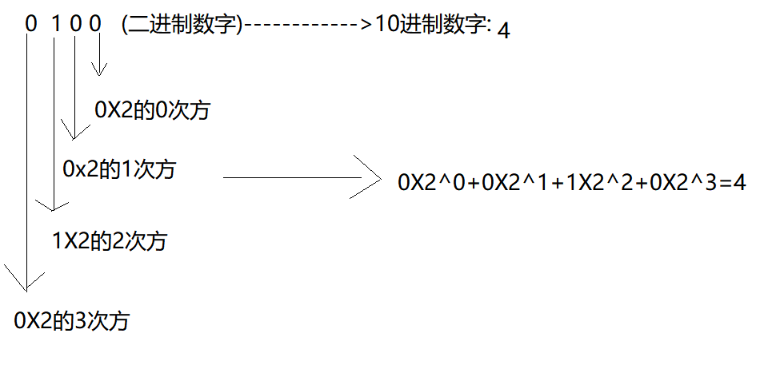

# 今日内容:

1. 计算机概述
2. 计算机系统
   * 操作系统
   * 应用系统
3. 计算机语言
   * 机器语言
   * 汇编语言
   * 高级语言
4. 人机交互方式
   * 命令行操作计算机
   * 图形化界面操作计算机
5. 常用的DOS命令
6. 常用的键盘盘符
7. 计算机的运算
8. 计算机的原理

# 一. 计算机概述

## 1.1 概述

计算机（computer）俗称电脑，是现代一种用于高速计算的电子计算机器，可以进行数值计算，又可以进行逻辑计算，还具有存储记忆功能。是能够按照程序运行，自动、高速处理海量数据的现代化智能电子设备。

总结: 计算机其实就是按照**特定顺序**执行的一种计算器(特定顺序指的计算机上安装的系统指定的)

由硬件系统和软件系统所组成，没有安装任何软件的计算机称为裸机。可分为[超级计算机](https://baike.baidu.com/item/超级计算机/5373711)、工业控制计算机、[网络计算机](https://baike.baidu.com/item/网络计算机/101471)、[个人计算机](https://baike.baidu.com/item/个人计算机/3731770)、[嵌入式计算机](https://baike.baidu.com/item/嵌入式计算机/693492)五类，较先进的计算机有[生物计算机](https://baike.baidu.com/item/生物计算机/363245)、[光子计算机](https://baike.baidu.com/item/光子计算机/1880523)、[量子计算机](https://baike.baidu.com/item/量子计算机/363335)等。

计算机硬件构成= 显示器+显卡+有线网卡+无线网卡+硬盘+内存条+cpu等等

计算机硬件的驱动程序= 显卡驱动程序+ 网卡驱动程序等等

计算机发明者约翰·冯·诺依曼。计算机是20世纪最先进的科学技术发明之一，对人类的生产活动和社会活动产生了极其重要的影响，并以强大的生命力飞速发展。它的应用领域从最初的军事科研应用扩展到社会的各个领域，已形成了规模巨大的计算机产业，带动了全球范围的技术进步，由此引发了深刻的社会变革，计算机已遍及一般学校、企事业单位，进入寻常百姓家，成为信息社会中必不可少的工具。

## 1.2 计算机的发展过程

* 计算机的鼻祖:  英国科学家,数学家图灵, 在二战期间,为了破译德国的密码.

  ​                             如果买编程类的书籍时,认准图灵设计等等丛书

* 完善计算机: 约翰·冯·诺依曼

* 作用

  计算机的作用:  计算机进行高速运算.

  计算机分类:

  微型机, 小型机, 大型, 矩型, 超级计算机

# 二. 计算机系统

## 2.1 系统概述

​	系统在这里指的开发者编写的应用程序.

## 2.2 系统分类

1. 操作系统:   为计算机硬件提供服务的.

   如果买了一台计算机没有安装系统,就是一台裸机, 当然是不能运行.

   计算机需要安装操作系统, 这是计算机才可以启动和运行.

   常用的操作系统:

   windows系列操作系统:  win95,win96, win7, winxp,win8, vista, win10, win11,windows server2005等

   Mac操作系统: 安装在苹果电脑.

   Unix操作系统: 最早的操作系统, 当时美国军方开发的,后来用于民用

   Linux操作系统: 开源的免费的操作系统,一般用于服务器端.

   塞班系统:  诺基亚手机的操作系统

   Android操作系统: 安卓手机操作系统(是谷歌公司的产品)

   IOS操作系统: 苹果手机操作系统

   鸿蒙系统: 华为手机的操作系统.

2. 应用系统(application system):  为用户提供服务的.

   一台安装了操作系统的计算机(启动和运行), 这时安装应用系统, 那么应用系统就可以为用户提供服务.

   应用系统:

   迅雷软件, 爱奇艺软件, 360安全卫士软件, 百度网盘软件, 教务管理系统, oa系统, 电商购物系统等等

   我们程序员一般开发的应用系统:  通过高级编程语言开发应用系统,为用户提供服务

# 三.计算机语言

## 3.1 语言(language)概述

人与人之间沟通交流的一种媒介.

比如: 中国话, 朝鲜话, 日本话, 英语

比如: 中国人与中国人交流

中国人------------>中国话------------->中国人:  沟通效率高

比如: 中国人 与 朝鲜人

中国人-------->说中国话  翻译者:   朝鲜话-------->朝鲜人: 沟通效率低

## 3.2 计算机语言

通俗的来讲:   计算机语言的指的用户  和 计算机 "交流沟通"一个工具.

专业术语:  指的用户 通过计算机语言发送指令, 这时计算机接收到指令以后,按照特定的顺序实现用户的意图.

## 3.3 计算机语言的分类

* 机器语言:  计算机默认的编程语言(机器语言可以被计算机直接识别)

  概述: 

  机器语⾔是采用二进制(0和1)来进行编程。它是计算机的设计者通过计算机的硬件结构赋予计算机的操作功能。机器语⾔具有灵活、直接执⾏和速度快等特点。现在,除了计算机⽣产⼚家的专业⼈员外,绝⼤多数程序员已经不再去学习机器语⾔了。

  机器优点: 机器语言编写的程序,可以被计算机直接执行, 灵活,效率高.

  ​                开发者编写程序-------->机器语言---------------->计算机.

  机器缺点:  采用0和1进行编写程序, 很难理解,很难阅读, 很难维护.

* 汇编语言:  采用近义的英文单词,符号等来面向机器编程(汇编不能被计算机直接识别)

  为了克服机器语⾔难读、难编、难记和易出错的缺点,⼈们就⽤与代码指令实际含义相近的英⽂缩写词、字母和数字等符号来取代指令代码(如⽤add表⽰运算符号“+”的机器代码),于是就产⽣了汇编语⾔。所以说,汇编语⾔是⼀种⽤助记符表⽰的仍然⾯向机器的计算机语⾔。汇编语⾔亦称符号语⾔。汇编语⾔由于是采⽤了助记符号来编写程序,⽐⽤机器语⾔的⼆进制代码编程要⽅便些,在⼀定程度上简化了编程过程。汇编语⾔像机器指令⼀样,是硬件操作的控制信息,因⽽仍然是⾯向机器的语⾔,使⽤起来还是⽐较繁琐费时,通⽤性也差。汇编语⾔是低级语⾔。但是,汇编语⾔⽤来编制系统软件和过程控制软件,其⽬标程序占⽤内存空间少,运⾏速度快,有着⾼级语⾔不可替代的⽤途。

  汇编语言构成: 采用近义的英文单词等来编写程序, 比如:  1加1=2, 采用汇编语言编写  1 add  1

  汇编语言优点:  通过汇编语言编写的程序在运行时,占用的内存空间少,运行速度较快

  汇编语言缺点:  和机器语言的缺点几乎一样,依然存在难于阅读,难于理解等等

  总结

  机器语言和汇编语言的共同点: 面向机器编写程序(其实面向计算机的硬件编程,比如: 编写的驱动程序)

* 高级语言: 采用符合用户习惯的语言来进行编程(面向对象或者面向过程的), 高级语言不能直接被计算机识别

  不论是机器语⾔还是汇编语⾔都是⾯向硬件的具体操作的，语⾔对机器的过分依赖，要求使⽤者必须对硬件结构及其⼯作原理都⼗分熟悉，这对⾮计算机专业⼈员是难以做到的,对于计算机的推⼴应⽤是不利的。

  计算机事业的发展,促使⼈们去寻求⼀些与⼈类⾃然语⾔相接近且能为计算机所接受的语意确定、规则明确、⾃然直观和通⽤易学的计算机语⾔。这种与⾃然语⾔相近并为计算机所接受和执⾏的计算机语⾔称⾼级语⾔。

  总结:

  高级语言构成:  采用的用户的自然语言,特点:  语意明确, 逻辑清晰.比如: name="张三"

  高级语言优点:  符合用户的语言习惯, 阅读和理解起来都比较容易.

  高级语言缺点:  高级语言编写的程序运行占用的内存空间大, 运行效率低.

  开发者通过高级语言编写程序----------------> 高级语言  编译   机器语言(编译过程消耗时间) -------------------->计算机

  常用的高级语言:

  C,C++,C#, .Net: 面向过程的高级语言,通常用于游戏开发.

  java: 面向对象的高级语言, 通常用于企业级项目开发.

  还有很多很多Php, Go, Python, Ruby等

## 3.4 软件开发

* 软件开发概述

  指的程序员,使用高级语言将特定的数据和指令按照特定的顺序组合起来,就构成了程序.

  比如: 

     开发订单系统包含的数据:  用户的购买编号, 订单编号,订单总额等数据

​          开发订单系统特定顺序: 

​			顺序1:用户购买商品生成订单  ----->顺序2: 用户为该订单付款---->顺序3: 通知商家为该订单发货 等等

​            顺序1---->顺序2--->顺序3------: 程序必须按照指定先后顺序去执行.

* 开发工具

  以java开发为例

  1. 初学者用基本的文本编辑工具:  培养大家的编程习惯.
     * txt :   系统自带的
     * EditPlus: 韩国人开发的文本编辑工具,下载地址(https://www.editplus.com/)
     * NodePad:  文本编辑工具, 下载地址 (https://notepad-plus-plus.org/) 
  2. IDE(集成开发工具)
     * eclipse工具:  开源免费的
     * myeclipse工具: 基于eclipse开发的,  不是开源免费
     * idea工具:  不是开源免费的(后面上课用的,后面再讲).

# 四. 人机交互

## 4.1 人机交互

用户 操作计算机的过程, 称之为人机交互.

## 4.2 用户操作计算机的方式

* 方式一:  命令行的方式操作计算机

  ​               命令行: 指的用户通过在窗口输入命令,来操作计算机.

  ​		      比如: 打开 D盘下的soft目录,查询soft目录下有那些文件和目录(文件夹)    

* 方式二:  图形化界面的方式操作计算机

  ​              图形化界面: 指的计算机的图标,或者快捷方式,或者链接等等

  ​             比如:  打开 D盘下的soft目录,查询soft目录下有那些文件和目录(文件夹)    

  ​		    优点:  计算机新手, 能够更加容易的操作计算机

## 4.3 交互方式的使用场景

1. windows操作系统:   使用图形化界面操作
2. linux操作系统: 使用命令行操作

​    

# 五. 键盘盘符

想入门编程,首先你需要了解的就是键盘,以下内容你了解吗?不了解的话,就从这里开始吧!
键盘盘符功能键: 	

​				键盘盘符win:

​			   

​				组合键:

​				

​				重点:

​					win+r:  打开运行窗口

​                    alt+tab: 切面界面视图的

​					′F5(Fn+F5):  刷新

​					F12(FN+F12): 打开浏览器的调试窗口

# 六. 常用的dos命令

* 步骤一:   组合键win+r,打开的运行窗口, 在运行窗口输入cmd,敲enter

  ​				

  

* 步骤二: 在黑色的dos命令窗口里面: 输入常用的dos命令行

  

常用的dos命令

1. netstat     -ano     :  查询应用软件对应的端口

   

2. services.msc   : 打开服务窗口 ,查询应用软件是否在运行

3. ipconfig   : 查询当前计算机的ip地址

4. ping  网址:    查询计算机网络状态是否良好

5. ping  ip地址  -t:   查询网络状态是否良好

# 七. 计算机的运行规则

## 7.1 二进制

* 概述

  二进制（binary），发现者[莱布尼茨](https://baike.baidu.com/item/莱布尼茨/417549)，是在[数学](https://baike.baidu.com/item/数学/107037)和[数字电路](https://baike.baidu.com/item/数字电路/1705)中以2为基数的记数系统，是以2为基数代表系统的二进位制。这一系统中，通常用两个不同的符号0（代表零）和1（代表一）来表示 [1] 。数字[电子电路](https://baike.baidu.com/item/电子电路/2566586)中，[逻辑门](https://baike.baidu.com/item/逻辑门/5141155)的实现直接应用了二进制，现代的[计算机](https://baike.baidu.com/item/计算机/140338)和依赖计算机的设备里都使用二进制。每个数字称为一个[比特](https://baike.baidu.com/item/比特/3431582)（Bit，Binary digit的缩写), 各位看官,看好了是一个1Bit, 而不是1Byte(其实1Byte=8Bit)

* 二进制构成

  0和1构成了二进制, 在计算逢2进1

* 二进制的使用场景

  1. 在逻辑判断时,会用到二进制, 用来表示真(true)或者假(false)
  2. 计算机的运行依赖的二进制

* 在中国的易经文化里面,其实就有二进制的痕迹.

  

## 7.2 计算机为什么采用二进制

* 人类世界在进行运算为什么采用十进制?

  因为人类只有10个手指头.

  十进制的构成: 0, 1,2,3,4,5,6,7,8,9, 逢10进1

* 为什么计算机在运算采用二进制?

  计算机的硬件都是电子元件构成, 电子元件的状态只有两种状态, 要么开的状态(正极), 要么是关的状态(负极), 采用0和1来表示电子元件的状态.

  计算机在大部分情况都是进行逻辑运算,逻辑运算的结果只有两种: 真的(true)和假的(fasle), 可以使用二进制来表示逻辑判断的结果

  结论: 计算机的状态, 以及逻辑运算的结果也好, 只有两种情况,所以可以采用二进制来表示.

## 7.3 常用的进制,分别用途

* 二进制

  0和1构成,逢2进1, 用途: 表示计算机的状态,以及逻辑运算的结果

* 八进制

  0,1,2,3,4,5,6,7构成,逢8进1,  用途: 会用8进制表示编码格式(后面讲)

* 十进制

   0, 1,2,3,4,5,6,7,8,9, 逢10进1, 用途:进行数学运算

* 十六进制

   0, 1,2,3,4,5,6,7,8,9,A,B,C,D,E,F, 10个数字,6个字母构成,  用途: 表示颜色.

## 7.4  二进制和十进制的转换

* 二进制转成10进制

  转换规则:

  二进制从最右侧开始,每一个二进制数字乘以2的次方,次方从0开始 ,依次加1,  最后将相乘的结果加起来,就转成10进制数字.

  比如:  0100  是由二进制构成的一个二进制数字. 其中第1个0用来表示符号位, 0表示一个正数

  0100(二进制数字)------------>10进制数字,如下图

  

* 十进制整数转成二进制

  转换规则: 

  10进制整数除以2,得到余数,然后用商继续除以2,直到商小于2,不在进行除法运算, 把之前得到的余数,从最低位开始组合, 得到二进制.

  比如: 4(10进制数字)------>二进制数字: 

  

# 八. 内容总结

* 计算机概述(了解)

* 计算机系统(了解)

  1. 操作系统: 为计算机硬件提供服务的
  2. 应用系统:  为用户提供服务的

* 计算机语言(了解)

  1. 用途:   用户通过计算机语言将数据和指令组合起来(程序), 发送给计算机, 计算机按照特定的顺序去执行程序.

  2. 分类

     * 机器语言:  使用0和1编程, 缺点: 难于阅读,难于理解,难于编写 , 优点: 计算机可以直接识别, 执行效率高

     * 汇编语言: 使用近义的单词和符号编程. 缺点和机器语言差不多

        小结: 机器语言和汇编语言,都是面向机器编程(面向硬件编程,称之为嵌入式编程)

     * 高级语言: 使用用户的自然语言进行编程,比如使用英文进行编程,使用中文进行编程.

       高级语言编写的程序在运行时, 需要将高级语言编译成计算机识别的语言才能执行.

* 人机交互: 指的用户操作计算机的方式(了解)
* 常用的键盘盘符
  1. win+r: 打开运行窗口
  2. alt+tab: 用于切换视图界面
  3. F5(FN+F5):刷新
  4. F12(FN+F12):  浏览器的调试窗口
  5. tab:  用于调整代码个格式
* 常用的dos命令
  1.  netstat     -ano     :  查询应用软件对应的端口, 可以解决端口被占用的问题.
  2. services.msc   : 打开服务窗口 ,查询应用软件是否在运行
  3. ipconfig   : 查询当前计算机的ip地址
  4. ping  网址:    查询计算机网络状态是否良好
  5. ping  ip地址  -t:   查询网络状态是否良好

* 二进制(掌握)
  1. 计算机的最小单位: 是位 , 0或者1 表示1位(1个Bit)
  2. 计算机的存储的最小单位: 是字节,  使用byte来表示, 1个字节=8个Bit
  3. 计算机为什么采用二进制
  4. 常用的进制(了解)
  5. 进制转换(了解)

