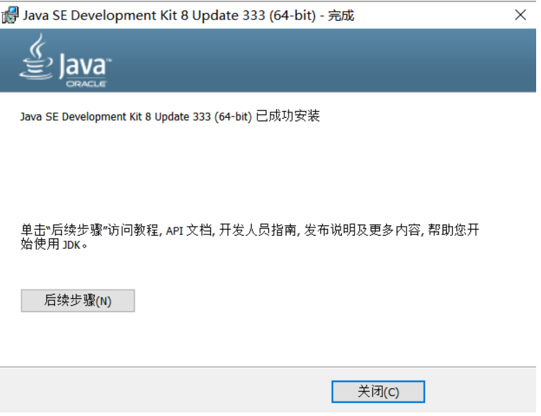

# 今日内容:

1. java

   java概述,java发展过程,java的特点, java的技术平台

2. java的跨平台

   跨平台, 跨平台的原理,JVM虚拟机

3. JDK

   JDK概述, 下载和安装JDK(卸载旧版本).

4. java入门程序

5. java编程规范

# 一. JAVA介绍

## 1.1 什么java

java是一门强类型的高级编程语言, java语言是Microsystems sun(简称sun公司,在2009年被oracle公司)在1995年推出的编程语言.

java语言它应用在物联网, 云计算,大数据,银行业, 电商购物,OA,ERP, CMS,BBS等等

java语言自从1995年出现以来, 到今天为止,已经过去27个念头,版本更新迭代(java18), 它是一门老牌的编程语言,依然稳居世界编程语言的前三甲, 现在围绕java语言,已经形成了一个生态圈, java不仅仅是一门语言,一门技术, 而是一个标准,一个平台.

java语言编写的程序可以在windows操作系统,mac os操作系统, linux操作系统等等都可以运行.

java语言之父是詹姆斯.高斯林,原来在IBM公司任职,联合几位小伙伴开发了java语言.

小结:

1. java语言是强类型的编程语言

   强类型指的编写程序时,必须首先声明类型. 比如: 定义整数,声明整数类型

2. java语言可以在windows操作系统,mac os操作系统, linux操作系统等等

3. java语言应用场景非常广泛,可以说企业级项目开发基本上都离不开java

## 1.2 java语言的特点

* 简单性: 

  1. java语言的语法风格符合自然逻辑, 学习起来简单.
  2. java语言自带内存管理机制(GC垃圾回收),会自动回收java中不用的数据,释放内存空间(很少出现内存溢出问题)

* 面向对象性:

  回顾之前讲过的编程语言

  1. 面向机器(计算机或者硬件设备)编程:  根据硬件的特点进行编程(嵌入式编程),比如: 网卡驱动程序

  2. 面向过程(指的C,C++):  指的开发程序时,分析的程序的实现过程,而不是关注程序是"谁"实现的.

     比如: 公司人员(早期)要出差: 1. 预定机票   2. 预定酒店  

     优点:  执行效率高(直接分析的程序的实现过程)

     缺点: 代码不能复用(重复使用)

     小结: 直接通过过程,完成程序的功能.,比如:  通过预定机票, 预定酒店完成出差功能.

  3. 面向对象(指的java语言): 指的开发程序时, 分析不是程序的实现过程,而是重点关注该程序是"谁"完成的

     比如: 公司人员(稳定)要出差:  由公司的**行政人员**负责出差的相关事宜.

     优点: 代码可以复用

     缺点: 执行效率相对面向过程而言比较低.

     小结: 指的通过对象实现功能. 比如:  出差功能需要行政人员(面向对象)完成的

* 编译性和解释性

  * 编译性:

    指的高级语言编写的程序在运行前,先编译成计算机识别的代码,这个过程称之为编译

    高级语言编写程序----------->-高级语言 编译   二进制---------------------->计算机运行

    运行特点:

    把程序一次性全部编译成二进制, 在计算机运行.

  * 解释性

    指的客户端脚本语言(比如: html, css, javascript),可以直接在客户端运行,不需要编译

    运行特点:

    通过客户端运行解释性语言的程序时 , 解释一行, 运行一行.

* 跨平台性:

  java语言编写的程序可以运行在任意平台(指的操作系统)

* 开源性:

  java语言是免费使用的.

## 1.3 java的三大技术平台

* javaSE

  JavaSE（Java Platform Standard Edition）：Java 标准平台，
  所有的Java项目都需要JavaSE的支持，包括JavaEE 和JavaME亦是如此；如JavaWeb、Android、Java桌面软件，JavaFX 等；

  小结: 

  javaSE是基础,规定了开发的基本语言,基本规范, 后面的javaEE, javaME都需要遵循javaSE规定的标准.

  javaSE应用与桌面开发,比如: GUI等技术,类似与360完全卫士,百度网盘等桌面程序.

* javaEE

  JavaEE（Java Platform Enterprise Edition）：Java企业平台，用于开发和部署可移植、健壮、可拓展和安全稳定的服务器端Java应用程序，如企业的应用系统ERP、CRM、CMS、 OA，电信系统、银行系统等；Java EE是基于Java SE封装了Web服务、组件模型、管理和通信API，实现企业级的大型应用，如阿里巴巴的大部分应用都是基于Java开发的，不仅如此，阿里巴巴也基于Java封装了众多的Java中间件；

  小结:

  1. javaEE技术架构应用与企业级项目开发(简单,快捷)

  2. javaEE技术架构对javaSE进行了封装, 封装的目的: 简化代码量

     比如: javaSE开发企业级项目, 基本上每一步都需要书写. 类似与早期 手洗衣服,每一步都需要人参与.

     比如: javaEE开发企业级项目,可以简化代码量, 类似与现在的洗衣机衣服,只需人把衣服放到洗衣机, 然后取出来.

* javaME

  JavaME（Java Platform Micro Edition）: Java微型平台，也叫K-JAVA，
  用于开发移动设备、嵌入式设备（比如手机、PDA、电视机顶盒和打印机等，Java原本就是为了电视机顶盒而设计的），不过现在市场份额并不是很高了；

  比如: 早期塞班系统的诺基亚手机 采用javaME开发的游戏.

  现在移动开发技术,比如: Android, IOS,**H5**等技术,这些技术比较火. 所以javaME技术平台很少用了

## 1.4 java的发展过程(java版本更新迭代过程)

JDK的历史(Java Development Kit)
1.0 - 1.1 - 1.2 - 1.3 - 1.4 - 1.5
5.0 - 6.0 - 7.0 - 8.0……
Sun公司于1995年推出
1991年sun公司James Gosling等人开始开发Oak语言
1994年，将Oak语言更名为Java
1996年获得第一笔投资1亿元
1998年提出jdk1.2【GUI】
之后推出jdk1.3 jdk1.4【反射】
2005年重新更名为jdk5.0，进行了大幅的版本改进(java里面加入了注解,泛型等新特性)
2006年sun公司宣布将Java作为免费软件对外发布
2007年3月起，全世界所有的开发人员均可对Java源代码进行修改
2007年推出jdk6.0
2009年4月Oracle以74亿美元收购了sun公司
2011年7月由Oracle正式发布jdk7
2014年3月正式发布了java8(java里面加入了lambda表达式, 函数式编程, stream流等等新特性)
2017年9月正式发布了java9【短期支持】
2018年3月正式发布了java10【短期支持】
2018年9月正式发布了java11

.......

2022年6月版本更新到java18

**1.8(java8)是企业主流使用的版本【LTS版本-longTimeService版本】**,所以推荐大家使用java8版本,教学以java8版本.

# 二. java的跨平台

## 1.1 平台(PlatForm)

平台: 指的操作系统.

通俗的来讲: 平台指的**安装了不同操作系统的计算机.**

注意:

操作系统不同, 安装不同操作操作的系统计算机就有差异.

比如:

安装了window操作系统的计算机:   安装软件的类型一般是exe文件.

安装了linux操作系统的计算机: 安装软件的类型一般是tar.gz文件

## 1.2 跨平台(面试)

跨平台:  指的java语言编写的程序可以在任意平台运行.

跨平台, 可移植性等等,其实都是一个意思.

疑问: 

不同的平台,是有差异的, 那么java语言编写的程序怎么实现在不同平台运行呢?

问题:

java语言是怎么解决平台差异性问题?

java解决的方案: jvm虚拟机(翻译),如下图

实际生活的场景:

## 1.3 java虚拟机

* 疑问:

  java虚拟机规避了操作系统的差异性.

* 什么是虚拟机?

  *虚拟机*（Virtual Machine）指通过软件模拟的具有完整硬件系统功能的、运行在一个完全隔离环境中的完整计算机系统。在实体计算机中能够完成的工作在*虚拟机*中都能够实现。在计算机中安装*虚拟机*时，来模拟真实计算机的运行环境.

  1. 虚拟机: 一款应用软件(系统软件)

  2. 虚拟机: 模拟真实计算机的功能,用途创建一个完全的隔离环境,目的: 规避不同操作系统计算机的差异性.

     简单理解: 

     通过编程语言编写的程序-------------------------->运行在 虚拟机上---------->在计算机运行上.

* java虚拟机

  java虚拟机, 简称为JVM(Java  Virtual Machine), 

  作用: 模拟真实计算机环境,java语言的编写的程序直接运行在JVM虚拟机,最终实现java语言的跨平台特性.

  如下流程:

  java语言编写的程序(高级语言)----->编译:  class文件----->程序直接在JVM虚拟机运行---->JVM虚拟机在计算机上运行.

  比如: 

  安装了windows操作系统的计算机, 那么与之对应的windows系统JVM

  安装了linux操作系统的计算机,那么与之对应的Linux系统JVM

  

# 三. JDK

## 1.1 什么是JDK

*JDK*是 Java 语言的软件开发工具包，主要用于移动设备、嵌入式设备上的java应用程序。

*JDK*是整个java开发的核心，它包含了JAVA的运行环境（JVM+JRE(Java系统类库)）和JAVA工具。

细节:

1. JDK: Java  Development Kit  , java开发环境, 指的开发java程序,必须安装和配置java开发环境.

   比如: 中石油公司在南海挖石油, 首先必须安装和配置挖石油的平台(石油井架).

2. JDK包含了JVM+JRE,同时还包含了JAVA工具, 如下图

   

## 1.2 卸载旧的版本(或者最新版本)

* 为什么要卸载旧版本或者最新版本

  因为旧版本里面有很多bug(问题),所以卸载.

  因为新版本用的不多,有很多未知的bug没有发现,所以卸载, 

  类似与游戏厂商发布一个新款游戏,发布前有内测或者公测,目的收集存在bug.

* 怎么卸载.

  方式一:  通过计算机的控制面板----->程序和功能----->JDK卸载就可以.

  方式二: 通过360安全卫士或者QQ安全管家也可以卸载

## 1.3 下载和安装JDK

* 前提: jdk8版本是一个稳定的版本,企业级用的大部分都是JDK8版本.

### 1.3.1 下载JDK

方式一:  去oracle官网下载, https://www.oracle.com

* 步骤一:

* 步骤二:  选中JDK,网页往下拉,找到Java8

  

* 步骤三: 需要输入oracle的账号和密码,才可以下载(没有账号,需要注册)

  选中版本,下载,出现如下界面,勾选同意

  

  选中黑色北京的 的点击下载, 输入oracle的账号和密码,才可以下载(没有账号,需要注册).

方式二: 去java官网下载, https://www.java.com

* 步骤一:进入官网,如下图

  

* 步骤二:  选中绿色背景 ,可以直接下载.

* 注意:

  不管方式一下载也好,还是方式二下载也好, 下载的版本号一模一样.

### 1.3.2 安装JDK

1. 绿色版本的安装包, 特点: 解压即可用

2. 安装版本的安装包, 特点: 一步一步(next)

   * 步骤一:   资料目录/jdk-8u333-windows-x64.exe, 双击安装包

     

   * 步骤二: 点击下一步, 弹出如下窗口

     

     注意:  如果修改安装的目录, 选中更改,选择安装的指定目录. 如果不更改安装路径, 默认就是C盘

   * 步骤三: 点击下一步, 弹出如下窗口

     

   * 步骤四: 等到进度条结束, 表示安装成功了

     接下来, 安装JRE,可以更改安装的指定目录, 也可以使用默认按照目录.

     

* 步骤五: 继续点击下一步,出现如下窗口, 点击关闭即可. 表示JDK和JRE都安装成功了

  

### 1.3.3  配置JDK的环境变量

* 步骤一: 新建JAVA_HOME名称, 名称对应的值 JDK安装路径的bin目录的上一层.

  右键电脑属性---->高级系统设置---->弹出窗口---> (高级---环境变量)----> 弹出窗口: 选中系统变量.

  

  

* 步骤二: 在path, 添加JAVA_HOME变量名称.

  path---->编辑----->弹出窗口--------->新建:             %JAVA_HOME%\bin

* 疑问一:  为什么新建JAVA_HOME环境变量名称?

  原因在java开发中, 会用到很多软件, 那么这些软件是java语言编写的, 这些软件运行需要JDK.

  这些软件在计算机里面是根据JAVA_HOME变量名称去查找计算机安装的JDk安装路径.

  这些软件(java语言编写的)的运行流程如下:

  比如: 

  tomcat软件--------->计算机系统变量path---->JAVA_HOME---------->C:\Program Files\Java\jdk1.8.0_333

  maven软件--------->计算机系统变量path---->JAVA_HOME---------->C:\Program Files\Java\jdk1.8.0_333

* 疑问二: 为什么要配置JDK环境变量?

  因为运行java程序,或者运行java语言编写的软件时, 通过配置JDK环境变量快速的找到JDK安装路径.

  实际生活场景:

  搞了奶牛养殖场, 很多很多奶牛, 给奶牛的耳朵上打上一个带编号的小铁牌, 目的: 为了快速定位和找到奶牛.

## 1.4 安装成功以后,JDK的目录结构(了解)

目录结构如下:

* bin目录(binary): 存放的java的工具, 

  比如: javac.exe作用对java源码进行编译得到class文件

  比如: java.exe 作用 用来运行编译好的class文件.

* include目录: 存放的java访问的本地文件.

* jre目录: java的运行环境,里面包含jvm虚拟机.

* lib目录(library): 存放的jar包(包含class文件),JDK运行依赖与lib目录.

* src.zip:   java资源文件的压缩包,里面主要是java文件

* javafx-src.zip:  javaFX资源文件的压缩包

## 1.5 JDK , JRE和JVM区别和联系

* JDK: Java Development Kit , java开发环境, 如果开发java程序,必须安装和配置JDK. jdk包含的jre+工具类库

* JRE:  Java Runtime Enviroment, java运行环境. jre包含的核心类库+JVM虚拟机

* JVM: JVM(Java  Virtual Machine),  java虚拟机, 源码编译后的class文件是在jvm虚拟机运行.

* 区别和联系

  

## 1.6 总结

* 掌握JDK安装和配置

* JVM虚拟机作用:   实现java的跨平台, 可以运行源码编译后的class文件.

* java程序运行原理:

  

# 四. 编写入门程序

## 1.1 编写入门程序步骤

* 步骤一:  新建一个txt文件

* 步骤二: 给txt文件起个名称叫Demo1, 后缀名必须是java

* 步骤三: 打开Demo1.java文件

  ~~~~java
  public class  Demo1{
  
  	public  static void main(String[]  args){
  
  		System.out.println("hello world");
  	}
  
  }
  ~~~~

* 步骤四:  源码Demo1.java 通过javac.exe编译命令,将源码编译成Demo1.class.

* 步骤五: 运行程序,通过java.exe命令, 运行Demo1.class.

* 编译和运行,如下图

  

* 注意

  1. 文件的名称必须和文件内容class后面的名称一致.

  2. 编译时, 使用的编译工具:  javac 不要带exe.

     比如: javac   Demo1.java

  3. 运行时,使用的运行工具(命令): java不要带exe, 并且运行的文件不要带class

     比如:  java  Demo1

## 1.2 入门程序解析

~~~~java
// public 修饰符,公共的, 修饰class, 表示Demo1源码可以在任意地方被访问.
// class 关键词, 用来表示类, 通过class关键词来定义类名: 类名就是Demo1
// Demo1 标识符,开发者自定义的类的名称
public class  Demo1{
	//public  修饰符,公共的, 修饰main方法, 表示main方法可以在任意地方被访问.
    //static  修饰符,静态的,修饰main方法,用static修饰的方法,称之为静态方法, 那么静态方法可以直接通过类名调用
    //void    修饰符,空的, 修饰main方法,表示执行main方法后没有返回值
    //main:   方法的名称,表示这个方法是主方法, 特点: main方法就是Demo1类的入口
    //() : 表示main方法的参数, 小括号里面的String[] 表示是一个String数组, args表示数组的名称
	public  static void main(String[]  args){
		//在控制台打印:  hello world
        //System:  系统类
        // out:  表示System系统类的输出对象
        // println(): 表示的out对象的打印方法
        //("hello world"): 表示打印内容是hello world
        //通过System类获取到输出对象out, 然后通过out对象调用println方法,打印内容: hello world.
		System.out.println("hello world");
	}

}
~~~~

注意:

1. 类名后面有个大括号{   }, 大括号里面就是类的主体内容
2. 类名后面的大括号里面定义了main方法, main后面有个{  }, 大括号里面就是方法的方法体内容

## 1.3 入门程序常见的问题

使用 javac 编译器编译源代码文件时，可能会出现下面几个常见问题。

 (1) Error:cannot read:HelloJava.java javac。
 工具程序找不到指定的 java 文件，需要检查文件是否存储在当前目录中，或文件名是否错误。

 (2) HelloJava.java:4:class HelloJava is public,should be declared in a file named MyApplication.java。
 源文件中类的名称和源文件名称不符，需要确定源文件名称和类名称是否相同。

 (3) HelloJava.java:6:cannot find symbol。
 源程序文件中某些代码部分输入错了，最常产生的原因可能是没有注意到字母的大小写。

 (4) Javac 不是内部或外部命令、可执行程序或批量文件。
 path 设置有误或没有在 path 系统变量中加入 JDK 的 bin 目录。

 如果没有出现上述所列问题，即成功编译了该 Java 文件。在解释执行 .dass 文件时，可能会出现下面几个常见问题。

 (5) Exception in thread “main” java.lang.NoClassDe£FoundError。
 Java 工具程序找不到所指定的 .class 类，需要确定指定的类是否存储在当前目录中，名称是否正确。

 (6) Exception in thread “main” java.lang.NoSuchMethodError:main。
 没有指定 Java 程序的入口。Java 工具程序指定的类必须有一个程序入口，也就是必须包括 main(String args[]) 这个方法。

 原因: main方法名称写错了或者方法的参数写错了

1.4 入门程序, java程序运行流程.

*.java(源码)------>编译(javac.exe):   *.class文件----------------->运行(java.exe)---->在JVM虚拟机运行.

# 五. 编程规范

## 5.1 代码格式的规范

下面的代码格式不规范.

~~~~java
public class  Demo1{

public  static void main(String[]  args){

System.out.println("hello world");
}

}
~~~~

调整代码格式规范:   tab键盘, 调整格式.

~~~~java
public class  Demo1{

	public  static void main(String[]  args){

		System.out.println("hello world");
	}

}
~~~~

## 5.2 注释规范

实际生活场景:

比如 买瓶药, 里面带 说明书.  说明书就是对药的解释说明. 

java注释:  注释对java代码的解释说明,不参与程序的运行.

java注释的分类:

1. 单行注释:

   ~~~~java
   // 单行注释:  注释内容
   ~~~~

   

2. 多行注释

   ~~~~java
   /*注释内容,可以写多行*/
   ~~~~

   

3. 文档注释

   ~~~~java
   /**
    文档注释,可以写多行
   */
   ~~~~

   文档注释和多行注释的区别:

   文档注释在生成帮助文档时,会保留, 而多行注释保留.

## 5.3 语法格式规范

* java语言严格区分大小写.
* java代码每行结束以后, 用分号表示.
* java的关键字必须都是小写(这是sun官方规定的)

# 六. 内容总结

1. java语言介绍(理解)

2. java跨平台(掌握),实现跨平台的依赖

3. JDK: java开发环境(掌握)

4. JDK, JRE, JVM区别(理解)

   JVM虚拟机的作用: 运行class文件的,不能编译java源码

5. 源码: 后缀为java的文件,称之为源码

6. 字节码: 后缀为class的文件,称之为字节码文件.

7. 入门程序(掌握)

   * public :  修饰符, 公共的, 可以用来修饰类和方法
   * class:  关键字(词), 可以用来定义 类的
   * Demo1: 类名,可以随意定义,但是不能以数字开头
   * .....

8. java程序运行过程(掌握):

    编写一个源码: *.java------>编译:  * .class------------>运行在jvm虚拟机.

