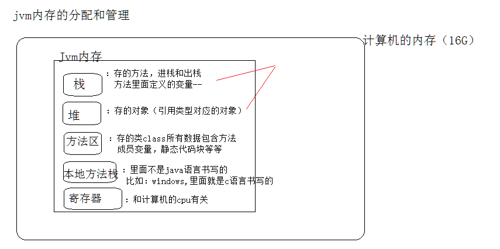

今日内容:

1. 数组概述: 什么是数组, 为什么使用数组, 数组的特点
2. 数组定义: 数组定义的几种方式
3. 数组的索引,取值和赋值操作
4. 数组的遍历: 普通的遍历, 增强的遍历
5. 数组在内存中存储:  **堆内存**存储
6. 扩展: 数组的扩容, 新添加元素, 删除元素(为了后期学习List集合,能够更好理解)
7. 案例: 把上面讲的所有知识点整合进来


# 一. 数组概述

## 1.1  数组介绍

* 怎么保存多个学生的成绩?

  可以定义多个double类型的变量,来保存多个学生成绩.

  double a=94.9;

  double b=89.9

  double c=70.5;

  后面成绩省略

  缺点:  很麻烦.

* 由于老师批改失误,学生成绩搞错了,现在给每个学生的成绩+5分?

  对原有保存学生成绩的变量,进行一一加5分操作.

  double a=94.9;

  a+=5;

  double b=89.9

  b+=5;

  double c=70.5;

  c+5;

  后面成绩省略

  缺点: 不能统一修改

* 解决上面的问题: 用数组解决.

* 数组介绍

  数组就是在内存中开辟了一段连续的空间, 用来保存同一种数据类型的"容器".

* 数组特点:

  1. 数组可以保存多个数据
  2. 数组保存的数据是同一种数据类型
  3. 数组的长度是固定的

* t特点如图:

  一条烟: 一段连续的空间,保存的几盒烟是有限制的.

  一盒笔: 一段连续的空间,保存彩笔的个数是有限制的.

  


## 1.2 为什么使用数组

* 场景一:

  如果需要保存多个数据, 这时使用数组来保存.

* 场景二:

  如果对多个数据进行统一的操作, 这时可以使用数组.

# 二. 数组的创建(定义)

## 1.1 动态创建数组

* 语法格式:

  **类型 [ ]   数组名称  =  new  类型 [ 数组的长度]**  或者  类型    数组名称 [ ] =  new  类型 [ 数组的长度] 

  数组的长度: 其实指的数组保存数据的个数

* 动态创建数组特点:

1. 创建数组时,这时在内存中开辟一段连续的空间, 这个空间指的保存数据的最大个数

2. 数组里面没有赋值, 数组里面有默认值.

   比如: int类型的数组,如果没有赋值, 默认值都是0

   比如: double类型的数组,如果没有赋值, 默认值都是0.0

   比如: String类型的数组,如果没有赋值, 默认值都是null

   注意: 如果数组是引用类型的引用类型的数组,如果没有赋值,里面的默认值都是null, 比如String

* 代码实现

  ~~~~java
  public class Demo1 {
      public static void main(String[] args) {
          //1.动态创建数组
          int[] arr1 = new int[6];
          int arr2[] = new int[8];
          String[] arr3 = new String[9];
          //2.从数组中获取值: 通过索引获取, 索引从0开始的
          int arr1FirstData  = arr1[0];
          int arr1LastData   = arr1[5];
          System.out.println("int类型的数组,默认值是:"+arr1FirstData);
          System.out.println("int类型的数组,默认值是:"+arr1LastData);
          //3.从String数组中获取数据
          String name = arr3[0];
          System.out.println("String数组的默认值:"+name);
          //System.out.println(null);报错
      }
  }
  ~~~~

## 1.2 静态创建数组

* 语法格式

  **数据类型[]  数组名称 = {数据1, 数据2,----数据N}** 和 数据类型  数组名称[] = {数据1, 数据2,----数据N}

* 静态创建数组特点

  1. 数组里面有初始值
  2. 数组的长度也是固定的

* 代码演示

  ~~~~java
  public class Demo1 {
      public static void main(String[] args) {
          //1.静态创建
          double[] arr = {90.1,23.5,70.5,90.8,9.9};
          //2.获取长度
          int length = arr.length;
          System.out.println("数组的长度:"+length);
          //3.数组的遍历,索引从0开始,表示第一个数据, 最大索引= 长度-1
          for (int index = 0; index <=length-1 ; index++) {
              //4.取出数组的数据,+5
              double updateScore = arr[index]+5;
              //5.修改原有索引位置的数据
              arr[index] = updateScore;
          }
          //4.测试
          for (int index = 0; index <length ; index++) {
              System.out.println(arr[index]);
          }
  
      }
  }
  
  ~~~~

  ## 1.3 静态创建数组注意细节

  * 如下错误的写法

    本质原因: 类型[] 数组名称 = {}, 没有在内存中开辟一段连续空间(意味数组没有长度,也就意味着没有索引)

    ~~~~java
    public class Demo2 {
        public static void main(String[] args) {
            //1. 静态创建数组, 没有赋值, 意味arr数组没有长度(没有索引)
            int[] arr = {};
            //2.测试
            arr[0]=11;
            //int a = arr[0];
            //System.out.println(a);
        }
    }
    
    ~~~~

    

# 三. 数组的使用

## 1.1 索引介绍

* 数组 的长度

  int  数组的长度=  数组.length;

* 索引

  1. 什么索引,索引对数组的作用

     索引是数组中数据的唯一标识.

  2. 索引的特点

     从0开始的,最大索引值= 数组的长度-1

     如图所示:

     

     如图所示:

     由于计算机习惯从0开始,索引也默认使用计算机的特点

     

     比如; 列操报数,从1开始.

     

## 1.2 数组的取值和赋值操作

* 取值

  1. 什么是取值?

     从数组中获取数据, 通过索引获取数据.

     语法:

     **类型  变量名称 =  数组[ 索引 ];**

* 赋值

  2. 什么是赋值

     给数组对应索引的位置赋一个新的数据.

     语法:

     **数组[索引]=新的数据;**

* 索引,取值和赋值

  代码演示

  1. 动态创建数组演示

     ~~~~java
     public class Demo3 {
         public static void main(String[] args) {
             //1.动态创建一个数组
             int[] arr = new int[6];
             //2.数组没有赋值, 默认值是 6个 0.
             //3.取值,索引最大值= length-1
             int first = arr[0];//0
             int two = arr[1];//0
             int three = arr[2];//0
             int four = arr[3];//0
             int five = arr[4];//0
             int six = arr[5];//0
             System.out.println(first+","+two+","+three+","+four+","+five+","+six);
             //4.赋值(设置值)
             arr[0]=11;// arr[0]=0----->arr[11]=11
             System.out.println("赋值后:"+arr[0]);
         }
     }
     ~~~~

     

  2. 静态创建数组演示

     ~~~~java
     public class Demo4 {
         public static void main(String[] args) {
             //1.静态创建数组
             int[] arr = {11,22,33};
             //2.取值
             int first = arr[0];//11
             int two = arr[1];//22
             int three = arr[2];//33
             System.out.println("赋值前: "+first+","+two+","+three);
             //3.赋值,给指定索引位置的数据设置一个新的数据
             arr[0]=110000;
             arr[1]=220000;
             arr[2]=330000;
             //4.打印数组
             System.out.println("赋值后: "+arr[0]+","+arr[1]+","+arr[2]);
     
         }
     }
     ~~~~

     

## 1.3 数组的遍历

* 方式一:  普通for循环遍历, 使用的索引进行遍历的(最大索引值= 长度-1)

  基本语法:

  ~~~~java
  for(int index=0; index<数组的长度; index++){
      
      //遍历数组, 取值, 赋值
  }
  
  for(int index=0; index<=数组的长度-1; index++){
      
      //遍历数组, 取值, 赋值
  }
  ~~~~

* 方式二:  增强for遍历(从JDK1.5版本以后才有的),使用的迭代器实现的(后面在讲集合时,会讲迭代器)

  基本语法:

  ~~~~~java
  for(数组的数据类型 变量名称 :  数组){
      
       //遍历数组, 取值, 赋值
  }
  //变量名称: 用来表示数组中的每一个元素
  ~~~~~

  

* 代码实现

  案例一: 用数组保存班级的人员姓名, 打印每一个人员的姓名

  ~~~~java
  public class Demo1 {
      // //案例二:用数组保存班级的人员姓名,打印每一组的人员姓名(组号+人员姓名)
      public static void main(String[] args) {
          test2();
  
      }
      //增强for遍历
      private static void test2() {
          //1.动态创建一个数组,设置人名
          String[] names = new String[6];
          //2.赋值
          names[0]="小米";
          names[1]="小果";
          names[2]="小辉";
          names[3]="小亮";
          names[4]="小磊";
          names[5]="小苟";
          //3.遍历数组
          for(String name : names){
              System.out.println(name);
          }
      }
      //普通for遍历
      private static void test1() {
          //案例一: 用数组保存班级的人员姓名, 打印每一个人员的姓名
          //1.用数组保存姓名
          String[] names = {"小明", "小黑", "狗蛋", "小军", "小蓝", "小白", "大神"};
          //2.打印人员姓名
          for (int index = 0; index <= names.length - 1; index++) {
              //3.取出人名
              String name = names[index];
              //4.打印
              System.out.println(name);
          }
      }
  }
  ~~~~

  

  案例二:用数组保存班级的人员姓名,打印每一组的人员姓名(组号+人员姓名)(讲完二维数组以后再说)


## **1.4 注意细节**

* 数组下标(索引)越界异常,

  如图:

  

* 常见的索引越界异常演示

  ~~~~java
  public class Demo3 {
      public static void main(String[] args) {
          //1.创建一个静态数组
          float[]   datas1 = {11.1f,11.2F,12.1F};
          double[]  datas2 = {11.1D,11.2d,12.1};
          //2.演示索引越界
          //float a = datas1[4];// datas1数组最大索引值2,没有4这个索引
          //3.遍历; i最大索引= 长度-1
          for (int i = 0; i <=datas1.length ; i++) {
             // System.out.println(datas1[i]);
          }
          //4.创建一个数组
          boolean[] flags = {};//没有索引的
          //boolean flag = flags[0];//不能使用0
      }
  }
  
  ~~~~

  

* 数组时,数组的数据类型是一致的

  

  

## 1.5 案例

* 案例一:

  求出int类型数组中的最大数据

  ~~~~java
  /**
   * 案例一:
          求出int类型数组中的最大数据
     思路:
          1. 从数组取出一个数据, 然后和其它数据进行比较,如果其它数据比取出的数据大, 赋值给取出的数据
   */
  public class Demo1 {
      public static void main(String[] args) {
          //1.定义数组
          int[] arr={1,19,-1,6,12,13,9};
          //2.遍历数组
          //3.取出一个数据:
          int number = arr[0];
          //4.遍历
          for (int i = 0; i <arr.length ; i++) {
              //5.取出 数据和 数组中的其它数据进行比较
              if(number<arr[i]){
                  //说明其它数据比number大.
                  number = arr[i];
              }
          }
          //5.测试
          System.out.println(number);
      }
  }
  
  ~~~~

  

* 案例二:

  求出int类型数组中的最小值(省略)

* 案例三:

  互换数组中的数据(数组中的数据互换位置)

  要求:使用两种方式实现

  方式一:

  ~~~~~java
  /**
   * 互换数组中的数据(数组中的数据互换位置)
   * int[] arr = {1,3,6,7,9}-----> 互换位置: arr={9,7,6,3,1}
   * 实现方式一:
   * 思路:
   *     创建一个新的数组,倒着遍历原有的数组, 将原有数组中的数据添加到新的数组中.
   */
  public class Demo2 {
      public static void main(String[] args) {
          //1.原有的数组
          int[] arr = {1,3,6,7,9};
          //2.创建一个新的数组: 长度和原有数组的长度一样
          int[] newArr = new int[arr.length];
          //为新的数组定义一个索引,从0开始
          int index = 0;
          //3.倒着遍历原有的数组
          for (int i = arr.length-1; i >=0 ; i--) {
              //4.取出原有数组中的数据
              int a = arr[i];
              //5.将取出的数据添加到新的数组中
              newArr[index] = a;
              //6.每次索引+1, 新的数组index: 0, 1,2,3,4
              index++;
          }
          //4.将新的数组赋值给原有的数组
          arr = newArr;
          //5.测试
          for (int i : arr) {
              System.out.println(i);
          }
      }
  }
  ~~~~~

  * 方式二

    ~~~~java
    /**
     * 互换数组中的数据(数组中的数据互换位置)
     * int[] arr = {1,3,6,7,9}-----> 互换位置: arr={9,7,6,3,1}
     * 实现方式二:
     * 思路:
     *    将索引为0的数据 =  索引为长度-1的数据.
     *    将索引为1的数据 =  索引为长度-1-1的数据.
     *    将索引为2的数据 =  索引为长度-1-1-1的数据.
     */
    public class Demo3 {
        public static void main(String[] args) {
            //1.原有的数组
            int[] arr = {1,3,6,7,9,15};
           //2.遍历数组,遍历一半即可
            for (int i = 0; i < (arr.length/2); i++) {
                //3.定义一个临时变量(红色的杯子)
                int temp = arr[i];
                //4.将arr[i]与之对应的arr[len-1-i]对调
                arr[i]= arr[arr.length-1-i];
                //5.将临时变量的值赋值给arr[len-1-i]
                arr[arr.length-1-i]=temp;
            }
            //3.测试
            for (int i : arr) {
                System.out.print(i+",");
            }
        }
    }
    
    ~~~~

    

* 案例四:

  抽奖系统(随机获取人名)

  实现思路:

  1. 准备一个数组,来保存人名
  2. 获取随机索引: Random

    ~~~~java
  /**
   * 抽奖系统(随机获取人名)
   实现思路:
   1. 准备一个数组,来保存人名
   2. 获取随机索引: Random
   */
  public class Demo4 {
      public static void main(String[] args) {
          //1.定义一个静态数组,保存姓名
          String[] names = {"a","b","c","d","e","f"};
          //2.随机索引
          Random rd = new Random();
          int index = rd.nextInt(names.length);//[0,names.length)
          //3.通过随机索引,从数组取人名
          String randName = names[index];
          //4.打印
          System.out.println(randName);
      }
  }
  
    ~~~~

* 案例五:

  求int类型数组中数据的总和(省略)

* 案例六: (使用二维数组改造案例)

   用数组保存班级的人员姓名,打印每一组的人员姓名(组号+人员姓名)(讲完二维数组以后再说)

  思路:

  1. 通过String[] 保存班级 人员姓名

  2. 通过int[]保存班级的组编号

  3. 遍历组时,获取对应人名数组里面的人员姓名

  4. 代码如下

     ~~~~java
     public static void main(String[] args) {
             //案例二:用数组保存班级的人员姓名,打印每一组的人员姓名(组号+人员姓名)
             //要求:每三个人名是一组
             //1.用数组保存姓名
             String[] names = {"小明", "小黑", "狗蛋", "小蓝", "小白", "大神"};
             //2.定义组号
             int[] counts={1,2};
             //3.遍历组号和人名
             int cnt=1;
             for (int i = 0; i < counts.length ; i++) {
                 System.out.print("组号"+counts[i]+":");
                 //4.遍历人名
                 //5.第一组的人名
                 if(cnt==1){
                     for (int j = 0; j <3 ; j++) {
                         System.out.print(names[j]+",");
                     }
                     System.out.println();
                 }else if(cnt==2){
                     for (int j = 3; j <6 ; j++) {
                         System.out.print(names[j]+",");
                     }
                     System.out.println();
                 }
                  cnt++;
             }
     
         }
     
     //二维数组实现(明天详细讲)
     public class Demo_names {
         public static void main(String[] args) {
             //1.定义二维数组
             //2. 0索引(组号)---->{0,1,2}(对应组员的索引编号), 1索引(组号)---->{3,4,5}
             int[][] arr = {{0,1,2},{3,4,5}};
             //3.表示人名
             String[] names = {"小明", "小黑", "狗蛋", "小蓝", "小白", "大神"};
             //4.遍历二维数组
             for (int i = 0; i <arr.length ; i++) {
                 System.out.print("组号"+(i+1)+"号:");
                 //获取 组号为1 的 人员----->{0,1,2}
                 int[] namesIndex = arr[i];
                 for (int j= 0; j < namesIndex.length ; j++) {
                     System.out.print(names[namesIndex[j]]+" , ");
                 }
                 System.out.println();
             }
         }
     }
     
     ~~~~

     

# 四. 数组在内存中存储:  **堆内存**存储

## 1.1 java执行原理

~~~~java
*.java(源码)(高级语言编写的程序)------>编译: *.class(字节文件)---->JVM虚拟机运行(虚拟机运行在计算机的内存上)
~~~~

## 1.2 JVM内存分配情况(简单了解)




* 栈内存空间: 

  执行的方法,栈里面存的执行的方法,包含方法的参数,方法内部的局部变量等等

  特点:  先进后出.

  

* 堆内存空间

  堆里面保存的引用类型的对象.

  堆里对象的特点:

  当对象不被引用(指的对象不再使用了), 对象最终被java的GC回收.


## 1.3 数组在堆里面存储情况

* 一个数组在堆里如何存储

  1. 静态数组在堆里面的存储情况

     

  2. 动态数组在堆里的存储情况如何

     

* 多个数组在堆里如何存储.(省略)

  和一个数组的存储情况一样

* 一个数组赋值给另一个数组,如何在堆里存储的.


# 五. 数组的扩容, 添加, 删除(理解),

## 1.1 数组特点

数组的长度是固定.

## 1.2 数组的扩容

扩容: 改变数组的长度

分析: 数组的长度是固定, 该如何扩容.

思路是这样的:

1. 新建一个数组,指定扩容后的长度
2. 将原有数组的数据设置到新的数组里面
3. 将新建的数组再赋值给原有数组,完成原有数组的扩容

* 代码实现

  ~~~~java
  public class DemoExtend {
      public static void main(String[] args) {
          //1.原始的数组:6---->扩容: 12
          int[] arr={11,22,33,44,55,66};
          //2.新建一个数组,指定扩容后的长度 12
          int[] newArr = new int[arr.length+6];
          //3.遍历原始的数组,获取里面的数据,添加到新的数组里面
          for (int index = 0; index < arr.length ; index++) {
  //            //3.1 取出arr中的数据
  //            int ele = arr[index];
  //            //3.2 将取出的数据设置到新的数组中
  //            newArr[index]=ele;
              newArr[index]= arr[index];
          }
          //4. 将新的数组赋值给原始的数组.
          arr = newArr;
          System.out.println("扩容的长度:"+arr.length);
          //5.测试
          System.out.print("扩容后的数据:");
          for (int ele : arr) {
              System.out.print(ele+",");
          }
      }
  
      private static void test(int[] newArr) {
          int index =0;
          for (int ele : newArr) {
              newArr[index] = ele;
              index++;
          }
      }
  }
  ~~~~

  

## 1.3 数组中添加一个新的数据

**需求1:** 

```java
//在数组索引为0的位置,添加一个数据 99,原有数据不丢失
//int[] arr= {11,22,33};
public class Demo18 {
    public static void main(String[] args) {
        int[] oldArr={11,22,33};
        //插入的索引值
        int index=0;
        //创建新数组
        int[] newArr=new int[oldArr.length+1];
        newArr[0]=99;
        //将数据插入
        newArr[index]=99;
        //将原数组数据插入新数组
        for (int i = 0; i < oldArr.length; i++) {
            newArr[i+1]=oldArr[i];
        }
        //将新数组的地址给原来
        oldArr=newArr;
        //Arrays工具类: 后面再讲()
        System.out.println(Arrays.toString(newArr));//类似与遍历数组

    }
}

```

**需求2:**

```
//添加一个数据99在33的后面,原有数据不丢失(省略)
int[] arr= {11,22,33};
```

**思路:**

1. 对原有数组进行扩容
2. 改变原有数组的数据位置

## 1.4 数组中删除一个数据

~~~~java
//需求1: 删除索引为0处的数据, 其它数据向前移位
public class x1 {
    public static void main(String[] args) {
           //1.原有数组
           int[] arr={11,22,33};
           //2.数组的长度
           int len=arr.length;
           //3.原有数组的数据添加到新的数组
           for (int i = 0; i < len-1; i++) {
            arr[i]=arr[i+1];//移位操作
           }
           //4.最后一个元素,设置为0
            arr[len-1]=0;
           //5.测试
          for (int i : arr) {
            System.out.println(i);
         }
    }
}
//需求2: 删除索引为0处的数据, 其它数据向前移位,数组长度-1
//int[] arr= {11,22,33};
public class x1 {
    public static void main(String[] args) {
           //1.原有数组
           int[] arr={11,22,33};
           //2.数组的长度
           int len=arr.length;
           //3.创建新的数组
           int[] newArr= new int[len-1];
           //4.原有数组的数据添加到新的数组
           for (int i = 0; i < len-1; i++) {
            newArr[i]=arr[i+1];//移位操作
           }
           //5.赋值
          arr=newArr;
           //6.测试
          for (int i : arr) {
            System.out.println(i);
         }
    }
}
//需求3: 删除索引为最大值处的数据.数组长度-1(代码省略)
int[] arr= {11,22,33};
~~~~

~~~~java
//谭思想完整版代码
public class insert {
    static int[] nums=new int[5];
    static int size=0;//有效元素个数，也代表下一个无效元素的插入位置（下标）
    public static void main(String[] args) {

        insert(0,11);
        insert(1,22);
        insert(2,55);
        insert(3,44);
        insert(4,66);
        insert(5,77);
        print();
        remove(5);
        print();
    }
    //插入一个新元素
    public static void insert(int position,int value) {

        if (position > size || position<0) {
            System.out.println("你输入的位置有误！,请重新输入；");
            return;
        }
        if(nums.length==size){
            expand();
        }
        //原数据向右移动
            for (int i = size; i > position; i--) {
                nums[i] = nums[i - 1];
            }
            //新值存入目标位置
            nums[position] = value;
            size++;
        }
        //移除
        public static void remove(int position){
            if (position > size || position<0) {
                System.out.println("你输入的位置有误！,请重新输入；");
                return;
            }
            if(position==(size-1)){//移除最后一个元素
                int[] newArray=new int[nums.length];
                for(int i=0;i<size;i++){
                    if(i==(size-1)){
                        continue;
                    }else {
                        newArray[i] = nums[i];
                    }
                }
                nums=newArray;
                size--;
            }else {
                //移除的不是最后一个元素
                for (int i = position + 1; i < size; i++) {
                    nums[i - 1] = nums[i];
                    if(i==(size-1)){
                        //最后一个元素也得移除
                        int[] newArray = new int[nums.length];
                        for (int j = 0; j < size; j++) {
                            if (j == (size - 1)) {
                                continue;
                            } else {
                                newArray[j] = nums[j];
                            }
                        }
                        nums = newArray;
                        size--;
                    }
                }
            }
        }

        //替换
        public static void replace(int position,int value){
                nums[position]=value;
        }

        //数组扩容
        public static void expand(){
        //获得新数组(带原值）
           //nums= java.util.Arrays.copyOf(nums, nums.length*2);
            int[] newArray = new int[nums.length*2];
            for(int i=0;i< nums.length;i++){
                newArray[i]=nums[i];
             }

                nums = newArray;
        }
        //打印
    public static void print(){
        for(int n=0;n<size;n++){
            System.out.print(nums[n]+"\t");
        }
        System.out.println();
    }
}

~~~~

~~~~java
//完成案例
public class Demo_ADD {
    public static void main(String[] args) {
        int[] oldArr = {1,3,5,7,9};
        int[] delete = getDelete(oldArr, 3);// 1,3,7,9
        System.out.println(Arrays.toString(delete));

    }
     //2.去除数组中的重复元素
    public static  int[]  removeDuplicate22(int[] arr) {
        //1.遍历原有的数组
        for (int i = 0; i <arr.length ; i++) {
            //2.嵌套循环遍历原有的数组
            for (int j = i+1; j <arr.length ; j++) {
                //3.判断数组中的 数据是否重复
                if (arr[i] == arr[j]) {
                    //4.删除重复的数据
                    //5. 得到新的数组赋值给原有的数组
                    arr = getDelete(arr, j);
                    //6.下标--
                    j--;
                }
            }
        }

        return  arr;
    }
    //2.去除数组中的重复元素
    public static  int[]  removeDuplicate11(int[] arr) {
        //1.遍历原有的数组
        for (int i = 0; i <arr.length ; i++) {
                //2.嵌套循环遍历原有的数组
                for (int j = i+1; j <arr.length ; j++) {
                    //3.判断数组中的 数据是否重复
                    if (arr[i] == arr[j]) {
                        //4.删除重复的数据
                        //5. 得到新的数组赋值给原有的数组
                        arr = getDelete2(arr, i);
                        //6.下标--
                        i--;
                        break;
                    }
                }
        }

        return  arr;
    }
    //需求2: 删除指定索引位置的数据
    /**
     * @param oldArr: 原有的数组
     * @param index: 指定的索引
     * @return: 返回新的数组
     * int[] oldArr = {1,3,5,7,9}
     * index=2之前的数据: 不移位
     * oldArr={1,3,----}----->newArr={1,3,---}
     * index=2之后的数据
     * oldArr = {1,3,5(删除),7,9}-->newArr={1,3,7,9}
     *  老的数组索引          3,4---->            2,3
     * 规律:
     * oldArr的(新的数组索引+1)处的数据 = newArr的(新的数组索引)
     */
    public static  int[] getDelete(int[] oldArr,int index){
        //1.创建一个新的数组,减少长度
        int[] newArr = new int[oldArr.length-1];
        //2.遍历新的数组,将原有数组的数据添加到新的数组里面
        for (int i = 0; i < newArr.length; i++) {
            if(index>i){
                //index索引之前的数据, 不移位
                newArr[i] = oldArr[i];
            }else{
                //index索引之后的数据,移位
                newArr[i]= oldArr[i+1];
            }
        }
        //3.返回新的数组即可
        return newArr;
    }
    //需求1: 给指定的索引位置,添加一个新的数据
    /**
     * @param oldArr: 旧的数组
     * @param index: 指定位置的索引
     * @param newData: 指定新的数据
     * @return: 返回一个新的数组
     * int[] oldArr = {1,3,5,7,9}
     * index=2的位置: data=100
     * index=2之前的数据: 不移位
     * oldArr={1,3,----}----->newArr={1,3,---}
     * index=2之后的数据
     * oldArr = {1,3,5,7,9}-->newArr={1,3,100,5,7,9}
     *  老的数组索引   2,3,4---->               3,4,5
     * 规律:
     * oldArr的索引数据 = newArr的索引+1
     */
    public  static  int[] getAdd(int[] oldArr,int index,int newData){
        //1.创建一个新的数组,进行扩容
        int[] newArr = new int[oldArr.length+1];
        //2.遍历旧的数组,遍历数据添加到扩容后的数组里面
        for (int i = 0; i < oldArr.length; i++) {
            if(index>i){
                //index索引之前的数据, 不移位
                newArr[i] = oldArr[i];
            }else{
                //index索引之后的数据,移位
                newArr[i+1]= oldArr[i];
            }
        }
        //3.将新的数据设置到指定的索引位置
        newArr[index] = newData;
        //4.返回新的数组即可
        return newArr;
    }
}

~~~~


# 六. 今日内容总结

* 数组的两种创建方式(掌握)
* 数组的使用: 索引, 取值和赋值(掌握)

* 数组的遍历(掌握)
* 数组在内存中的存储情况(理解)
* 数组的扩容(理解)
* 数组的添加和删除操作(理解)
* 二维数组和排序算法(明天讲)


