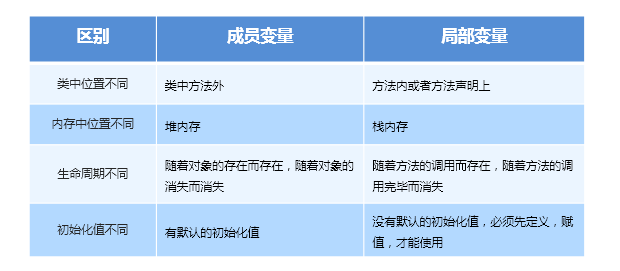

今日内容:

1. 什么是对象
2. 什么是类
3. 什么是构造方法
4. 什么是方法重载(不讲)
5. 成员变量和局部变量的区别(讲一下)
6. 文档注释(不讲)

# 一. 什么是对象

## 1.1 对象介绍

​		在开发中, 万物皆对象.

* 对象特征
  1. 对象都有自身的特征,专业术语称之为属性
  2. 对象都只有自身的动作, 专业术语称之为行为

## 1.2 面向对象和面向过程的区别.

举例:  花花去泰国旅游.

* 面向过程的思想分析花花去泰国旅游.

  分析去泰国旅游的具体的步骤.

  * 步骤一:  签证
  * 步骤二:  买机票
  * 步骤三: 预定酒店
  * 步骤四: 规划旅游线路
  * 步骤五: 高高兴兴去玩.

  优点:  花费的时间少的,花费的钱少.

* 面向对象的思想分析花花去泰国旅游.

  分析花花去泰国旅游具体由"谁"负责.

  * 1. 找花花当地的**旅行团队对象**负责.
  * 2. 找花花去泰国的旅游**泰国向导对象**负责.

  优点: 花花能节省很多事情

  缺点: 花钱多,耗费时间多.

* 面向过程:

  面向过程就是开发时,分析的是问题的解决步骤,然后调用方法一步一步去解决.不同的问题,不同的解决方案

  优点:  执行时间短,效率高, 比如: 游戏开发采用C语言(面向过程的开发语言)

  缺点: 代码不能复用.

* 面向对象

  面向对象就是开发时, 分析问题的具体实现对象是"谁", 而不考虑具体的实现过程.

  优点: 代码可以复用

  缺点: 执行时间长,效率低.

# 二. 什么是类

## 1.1 类的介绍

类可以简单理解为程序中的"模板", 在模板里面包含了现实对象的属性和行为.

专业术语: 类其实就是将现实中对象的属性和行为抽取出来,封装的一个整体.

## 1.2 类的定义

* 步骤一: public  class   类名

* 步骤二: 在类的内部描述现实对象的属性: 通过成员变量来表示类里面的属性

* 步骤三: 在类的内部描述现实对象的行为: 通过方法来表示类里面的行为.

* 代码如下:

  ~~~~~java
  public class Dog {
      //颜色
      String color;
      //品种
      String dogType;
      //性别
      int  sex;// 1 表示公, 0 表示母
      //年龄
      int age;
      //行为
      public static void  dogSound(){
          System.out.println("狗吠");
      }
      //行为
      public void dogPlay(){
          System.out.println("狗和主人一起玩");
      }
      //行为
      public void proHouse(){
          System.out.println("看家护院");
      }
  }
  
  ~~~~~

  

## 1.3 定义类之案例

* 案例一:描述一辆车对象的信息

  ~~~~java
  /**
   * 定义一个轿车类: 小汽车的属性和行为
   */
  public class Car {
      //1.定义成员变量:
      String color;//颜色
      String brand;//品牌
      String produceAddress;//产地
      String config;//配置
      double price;//价格
      //2.定义方法:
      public void goForward(){
          System.out.println("向前跑--");
      }
      public void fallBack(){
          System.out.println("向后退");
      }
  }
  ~~~~

  

* 案例二: 描述人对象的信息

  ~~~~java
  
  public class Person {
      //1.属性, 使用成员变量来表示
      int age;//年龄
      String address;//住址
      double high;//身高
      //2.行为
      public void eat(){//方法来表示对象的行为
          System.out.println("吃饭");
      }
      public void sleep(){
          System.out.println("睡觉");
      }
      public void hobby(){
          System.out.println("爱好编程");
      }
      
  }
  
  ~~~~

* 案例三: 描述现实对象房子的信息

  ~~~~java
  /**
   * 描述房子的属性和行为
   */
  public class House {
      //1.定义成员变量:房子的属性
      int card;//房子的编号
      String location;//房子的位置
      //2.定义方法: 房子的行为
      public void live(){
          System.out.println("房子用来住的");
      }
  }
  
  ~~~~

  

* 案例四: 描述现实鱼对象的信息

  ~~~~java
  
  /**
   * 定义一个类,描述鱼儿的属性和行为
   */
  public class Fish {
      //1.定义成员变量: 描述鱼儿的属性
      String color;//颜色
      double weight;//重量
      String  type;//鱼儿的种类,比如: 金鱼, 草鱼,鲢鱼,鲈鱼
      //2.定义方法: 描述鱼儿的行为
      public  void swim(){
          System.out.println("鱼儿游");
      }
      
  
  ~~~~

  

* 案例五: 描述现实手机对象的信息

  ~~~~java
  /**
   * 定义一个手机类: 描述手机的属性和行为
   */
  public class Phone {
      //1.定义成员变量: 手机的属性
      String brand;//品牌, 比如: 华为手机,荣耀手机, OPPO,ViVO
      double price;//价格
      String color;//颜色
      String config;//手机的配置
      //2.定义方法: 手机的行为
      public void music(){
          System.out.println("播放音乐");
      }
      public  void call(){
          System.out.println("打电话");
      }
  }
  ~~~~

  

## 1.4 类的使用

* 类和对象的关系

  类: 简单理解为程序的模板. 

  ​      比如: 奥迪的工程师,设计奥迪A6, 设计一个A6模板(类)

  ​      比如: 根据奥迪A6的模板去生产不同颜色的,或者不同配置的A6车(类的具体实现,其实就是类的实例或者类的对象).

  ​      比如:  设计奥迪A6设计一个模板(类)---------------->生产出不同的A6

  类和对象的关系:

  ​    对象就是类的实例化.

  ​    类可以实例化多个对象.

  

* 类的使用

  通过去实例化类(创建对象), 然后可以通过对象去操作类里面的成员变量和方法.

  使用步骤:

  * 步骤一: 创建对象(一个类可以new多次,可以创建多个对象)

    ~~~~java
    类型  对象 =  new  类型();//创建一个对象
    ~~~~

  * 步骤二: 对象操作成员变量和方法了

    ~~~~java
    对象.成员变量 =  数据;// 赋值操作
    类型  变量名称 = 对象.成员变量;// 获取值
    对象.方法名称(实际参数);//对象调用带参数的方法
    对象.方法名称();//对象调用没有参数的方法
    ~~~~

    

* 问题: 如何操作成员变量?

  1. 给成员变量赋值(设置值)
  2. 获取成员变量的值(得到值)

* 问题: 如何类中的 方法呢?

* 代码如下

  ~~~~java
  /**
   * 定义了一个小汽车类
   */
  public class Car {
      //成员变量
      String color;//颜色属性
      double price;//价格属性
      String brand;//品牌属性
      //方法
      public void  goForward(double money){
          System.out.println(brand+"品牌的汽车"+"加了"+money+"员的汽油,跑了很远很远");
      }
      public  void fallback(){
          System.out.println("倒车");
      }
  
      public static void main(String[] args) {
          //1.设置一个 雷克萨斯570
          //1.创建对象
          Car  lkss = new Car();
          //2.操作成员变量
          lkss.brand="雷克萨斯570";
          lkss.color="白色";
          System.out.println("我买了一款"+lkss.color+","+lkss.brand+"的车");
          //3.调用方法
          lkss.goForward(100.99);
  
      }
  
      private static void test1() {
          //1.步骤一: 创建一个汽车对象,比如: 奥迪A6
          Car a6  = new Car();
          //2.操作成员变量
          a6.brand="奥迪A6";//给成员变量赋值
          String brandName = a6.brand;//获取成员变量的值
          //System.out.println("汽车品牌:"+brandName);
          //3.调用方法
          a6.fallback();//调用对象的倒车方法
          a6.goForward(999.99);//调用对象的开车方法
      }
  }
  
  ~~~~

## 1.5 细节

* 成员变量: 实例化成员变量(没有被static修饰) 和 类成员变量(被static修饰)

  1.  实例化成员变量(没有被static修饰) : 必须通过对象来调用
  2.  类成员变量(被static修饰): 可以通过类名直接调用, 也可以通过对象来调用

* 方法:  实例化方法(没有static修饰)和类方法(被static修饰了)

  1.  实例化方法(没有static修饰), 调用时: 必须通过对象来调用

  2. 类方法(被static修饰了),调用时: 可以直接通过类名.方法(参数...)调用, 也可以通过对象调用

  3. 代码如下:

     ~~~~java
     public class Dog {
         //1.被static修饰的方法:类方法
         public static  void  sound(){
             System.out.println("狗吠");
         }
         //2.没有被static修饰的方法:  实例化方法
         public void  eat(){
             System.out.println("狗吃骨头");
         }
     }
     
     public class Demo {
         public static void main(String[] args) {
             //1. 类方法,静态方法
             Dog.sound();
             //2. 非静态方法, 实例化方法
             Dog dog = new Dog();//创建对象
             dog.eat();//对象调用方法
             dog.sound();//对象调用静态方法
         }
     }
     ~~~~

     

# 三.  成员变量和局部变量的区别

## 1.1 从定义位置来说:

成员变量在类的内部,方法的外部

局部变量在方法的内部

## 1.2 从默认值来说

成员变量都有默认值.

如果成员变量是整数类型:  默认值是0

如果成员变量是浮点数类型:  默认值是0.0

如果成员变量是布尔类型:  默认值是false

如果成员变量是字符类型:  默认值是空字符

如果成员变量是String ,默认值是null

如果成员变量是引用类型,如果没有赋值,默认值都是null

局部变量没有默认值,所以在使用局部变量时,必须先赋值

## 1.3 从命名上来说

成员变量不允许重名

局部变量不允许重名,如果在不同的方法内部,可以定义重名的局部变量.

成员变量和局部变量可以重名,在使用时,就近原则.

**详细参考,如图:**

# 四. 构造方法

## 1.1 回顾下如何创建对象

语法格式:

~~~~java
类型  对象   = new  类型();

类型(),其实就是我们的构造方法
~~~~

## 1.2 构造方法

* 细节: 如果没有提供构造方法, 类中有一个默认的没有参数的构造方法.不写,类里面也默认有.

* 作用一如图:

  

* 方法重载

   方法名称必须相同,方法的参数个数,参数类型,参数类型的顺序可以不同.与返回值无关.

* 构造方法重载

  * 没有参数的构造方法: 用来创建对象的

    ~~~~java
     public Car(){
            System.out.println("通过无参的构造方法创建对象");
     }
    ~~~~

  * 带有参数的构造方法: 1. 用来创建对象   2. 可以给成员变量赋值

    ~~~~java
     // //1.成员变量
         String brand;
        //3.定义了一个带参数的构造方法
        public Car(String a){
            //成员变量, //参数
            brand  =  a;
            System.out.println("带参数的方法执行了:"+brand);
        }
        public static void main(String[] args) {
            //1.通过带参数的构造方法,创建一个对象
            Car car2 = new Car("捷达品牌的车");
        }
    ~~~~

    

  * 如图

    

## **1.3 构造方法存在的细节**

* 如果没有提供构造方法,类里面有一个默认的无参数的构造方法

* 如果类里面提供了有参数的构造方法, 那么无参数的构造方法就没有了

  如图:

  

## 1.4 构造方法案例

* 需求1：定义一个汽车类：Car
  属性：color、brand、price
  方法：前进 run()、显示信息 show() 

* 需求2：在汽车类中添加多个构造方法

* 需求3：添加测试类，在主方法创建对象，并调用方法执行

* 需求4：创建汽车数组，保存多个汽车、遍历汽车数组

  ~~~~~java
  public class Car {
      //1.成员变量
      String brand;
      String color;
      double price;
      //2.显示的提供一个无参数的构造
      public Car(){
          System.out.println("无参数的构造");
      }
      //3.提供一个有参数的构造
      public Car(String b, String c, double p){
          //有参数的构造方法内部,给成员变量赋值
          brand = b;//赋值
          color = c;//赋值
          price = p;//赋值
      }
      public  static void  run(){//可以通过类名.run()
          System.out.println("飞起来");
      }
      public void  show(){//可以通过对象.run()
          System.out.println("展示");
      }
  }
  
  public class DemoCar {
      public static void main(String[] args) {
          //1.有参数的构造和无参数的构造
          //Car car1 = new Car();
          //2.调用方法
          //car1.show();
          //Car.run();
          //3.创建一个汽车数组
          int[] arr = new int[2];//如果没有赋值,数组的数据是0
          arr[0]=10;
          arr[1]=20;
          for (int ele : arr) {
              System.out.print(ele+",");
          }
          System.out.println("-----------");
          Car[] cars = new Car[2];//Car是引用类型,如果没有赋值,默认值是null
          //4.通过有参数的构造方法,创建2个汽车对象
          Car car1 = new Car("宝马","深蓝",299999.99);
          Car car2= new Car("亚洲龙","灰色",199999.99);
          //5.给汽车数组赋值
          cars[0] = car1;
          cars[1] = car2;
          //6.遍历汽车数组
          for(Car ele : cars ){
              String b = ele.brand;
              String c = ele.color;
              double p = ele.price;
              System.out.println("汽车信息:"+b+","+c+","+p);
  
          }
      }
  }
  
  ~~~~~

# 五 . this

## 1.1 问题分析:

怎么区分相同名称的成员变量和局部变量

通过this来区分成员变量和局部变量. this.成员变量名称

## 1.2 this是谁?

this就表示当前对象, 通俗的来讲, this在那个类里面使用, this就表示当前类对象.

* this作用:

  * 作用一:  this操作成员变量

  * 作用二: this调用方法

  * 作用三: this调用构造方法(了解即可)

  * 代码演示

    ~~~~java
    public class Dog {
        String color;
        String sex;
        int age;
        public Dog(){
    
        }
        public Dog(String color,String sex){
            this.color = color;
            this.sex=sex;
        }
        public Dog(String color,String sex,int age){
            this(color,sex);//this调用带有两个参数的构造方法,对成员变量color,sex赋值
            this.color = color;
            this.sex= sex;
            this.age=age;
        }
        public void say(){
            System.out.println("小狗在歌唱");
        }
        public  void test(){
            this.say();// this表示当前Dog对象
        }
    
        public static void main(String[] args) {
            //1.通过无参数的构造方法创建一个对象
            Dog dog = new Dog();
            dog.test();
            //2.通过带三个参数的有参构造方法创建对象
            Dog dog1 = new Dog("白色", "公", 20);
            System.out.println(dog1.color);
            System.out.println(dog1.sex);
            System.out.println(dog1.age);
        }
    }
    
    ~~~~

    

* 代码演示

  ~~~~java
  public class Car {
      String color;
      public Car(){
  
      }
      public Car(String color){
  
      }
      public  void show(){
          String color="红色的";
          System.out.println("局部变量的:"+color);
          System.out.println("成员变量的:"+this.color);
      }
  
      public static void main(String[] args) {
          //1.创建对象
          Car car = new Car();
          car.color="白色的";//对象.成员变量 = 赋值
          //2.调用方法
          car.show();
      }
  }
  
  ~~~~

  

# 六. 内容总结

* 什么是对象(掌握)
* 什么是类,如何定义类(掌握)
* 成员变量和局部变量(掌握)
* 方法的重载(掌握)
* 构造方法(掌握)
* this(理解)

