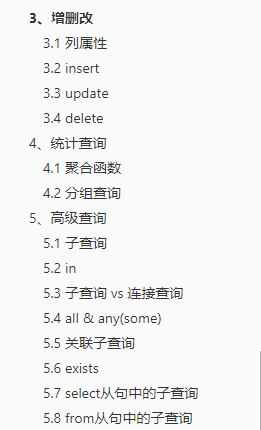
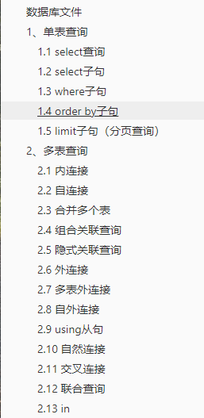
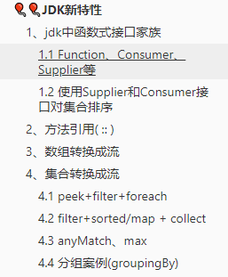
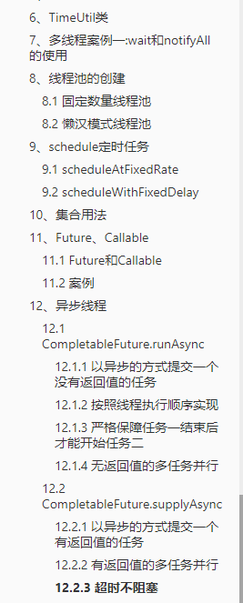
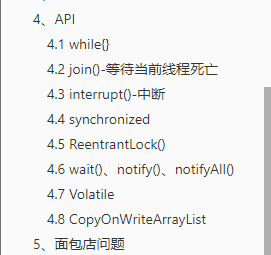

# zouzhaozzzz-myBlog

> 宝剑锋从磨砺出，梅花香自苦寒来

## 新网址，开通了cdn加速，加速访问

如果觉得本网站图片文字目录等加速过慢，可以点击下面新网址，记得收藏哦，每天更新

[点击这里：新博客网址](https://blogs-1gcbbkn727f78361-1301666279.ap-shanghai.app.tcloudbase.com/#/):该网址依赖于腾讯云web应用托管，采用国内cdn加速，访问速度嗖嗖快

## 重要的一点:如果每次进来都要手动刷新才能看到更新内容的话，清除所用浏览器的cookie即可解决

————————————————————————————————

# release/v2.6.1\_20220802

更新`MySQL单表查询和多表查询`8月2号上课笔记

大概内容如下(今日内容为实操，勤加练习即可，没有很好的文字补充)：

放在了`2.经验总结与笔记`

————————————————————————————————

# release/v2.6.0\_20220801

更新`MySQL单表查询和多表查询`8月1号上课笔记

大概内容如下(今日内容为实操，勤加练习即可，没有很好的文字补充)：

放在了`2.经验总结与笔记`

————————————————————————————————

# release/v2.5.1\_20220729

根据第一阶段总结补充经验总结，放在了`2.经验总结与笔记`

————————————————————————————————

# release/v2.5.0\_20220728

更新**JDK新特性**7月28号上课笔记

大概内容如下：

放在了`2.经验总结与笔记`

————————————————————————————————

# release/v2.4.2\_20220727

更新**多线程**7月27号上课笔记

大概内容如下：

放在了`2.经验总结与笔记`

————————————————————————————————

# release/v2.4.1\_20220726

更新**多线程**7月26号上课笔记

大概内容如下：

放在了`2.经验总结与笔记`

————————————————————————————————

# release/v2.4.0\_20220725

更新release/v2.4.0\_多线程_20220725分支的7月25号上课笔记

内容包括多线程,放在了`2.经验总结与笔记`

————————————————————————————————

# release/v2.3.4\_20220725

更新release/v2.3.0\_网络编程_20220725分支的7月25号上课笔记

内容包括IO序列化、网络编程,放在了`2.经验总结与笔记`

————————————————————————————————

# release/v2.3.3\_20220723

新增第三周考试作业答题，放在了`3.作业答题`

根据作业中的题目完善`2.经验总结与笔记`中经验总结

————————————————————————————————

# release/v2.3.2\_20220723

新增chapter13IO框架作业答题，放在了`3.作业答题`

根据作业中的题目完善`2.经验总结与笔记`中IO笔记

————————————————————————————————

# release/v2.3.1\_20220722

新增chapter11异常作业答题，放在了`3.作业答题`

根据作业中的题目完善异常笔记中异常的分类(父类与子类 、检查和未检查异常和处理方式以及方法覆盖)

————————————————————————————————

# release/v2.3.0\_20220722

更新release/v2.3.0_高级\_IO_20220722分支的7月22号下午上课笔记,放在了`2.经验总结与笔记`

————————————————————————————————

# release/v2.2.0\_20220722

更新release/v2.2.0_高级\_异常\_20220722分支的7月22号上午上课笔记,放在了`2.经验总结与笔记`

————————————————————————————————

# release/v2.1.1\_20220722

更新Arrays类和Collections类常用方法，放在了`1.个人方法收藏`,以后想用方法忘记怎么用时可查找

————————————————————————————————

# release/v2.1.0\_20220721

更新release/v2.1.0_高级\_集合框架\_20220720分支的7月21号上课笔记与个人排序代码,放在了`2.经验总结与笔记`

删除live2d看板娘

————————————————————————————————

# release/v2.0.0\_20220720

新增chapter10集合作业答题，放在了`3.作业答题`

更新分级目录

更新集合类笔记

————————————————————————————————

### [1.方法收藏](/Project/java方法/java方法.md)

一些方法放里面了哦，方便查找

### [2.经验总结与笔记](/Project/经验总结.md)

上课与作业的归纳总结

### [3.作业答题](/Project/作业答题.md)

课后作业答题，不是正确答案，供参考

### [4.Docsify使用指南](/Project/Docsify使用指南.md)

如何打造自己的博客

### [5.老师笔记](/Project/笔记/chapter-1章/chapter-1章.md)

老师发的笔记文件

## 评论区如果有两个，F5刷新一下即可
